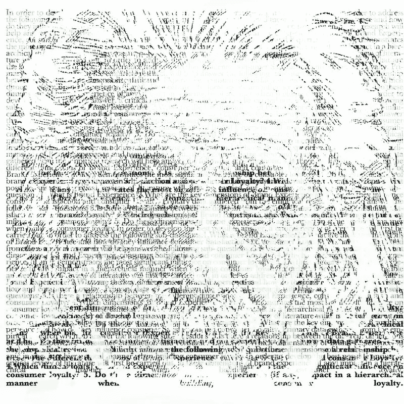

# 我不知道！

> 原文：<https://medium.datadriveninvestor.com/i-dont-know-42cf62468e33?source=collection_archive---------8----------------------->

在过去的一周里，你说了多少次“我不知道”？这个问题对我们未来的职业生活至关重要，尽管我们的文化似乎并不全心全意地支持它。

摆出你的扑克脸

你有没有注意到人们在交谈中假装他们知道一个新的术语或概念？在我们的工作、家庭、朋友聚会中，很多时候我们觉得必须假装我们知道谈话的主题，避免被评判或微妙、反常地排除在谈话之外。通常，你会看到人们在交谈中一脸茫然，迅速摘下智能手机，瞥见网上漂浮的救生概念，让你“活着”回到岸边。有些人已经发展出奇妙的技巧，通过问一些无关紧要的问题来绕过那些紧身裙的情况，直到他们积累了足够的信息来进行一场辩论。这些确实是非常不舒服的情况。当你是这方面的专家，却被新的时尚术语或趋势弄得措手不及时，情况会变得更糟。让我们面对现实吧，考虑到如今变化的速度，如果你在阅读上放松一周，这似乎是不可避免的。我见过的领导岗位上很少有人立场明确——“我不知道。你能告诉我什么是成熟和顶尖的领导技能，以及创造值得信赖的工作环境。大多数人试图保持他们的权威，尽可能快地把话题扔到路边，这样他们就有机会在再次参与之前熟悉它。然而，这种行为会带来不必要的后果。

成长心态

卡罗尔·德韦克在她的畅销书《心态》中向我们展示了培养成长心态的重要性。把学习作为我们人生的座右铭，作为取得成功的唯一途径。对新的概念保持开放，寻找旧概念的新角度，放下我们认为唯一的方法。要有探索精神，允许我们及时提出问题，并被鼓励去开拓新的领域。然而，这并不是我们通常看到的，尽管这本书的第一版是在 2006 年发行的。最近，我的一个好朋友在扔掉了他以前的 Windows one 之后，又买了一部 iPhone。他向我描述了在他试图学习新的操作系统和他的设备的新方式期间，成为朋友们嘲笑的目标是多么困难。他发泄道“没有人真正教我方法，我每次都要问什么。我一直觉得自己是个局外人”。对我来说，这是对我们的文化不支持增长思维方式的一个极好的类比。我在这样一个家庭长大，在那里承认不知道某件事就像走木板到满是鲨鱼的海里——最多是固定的思维模式。所以我必须学会如何不断培养一颗好奇的心，尤其是在我的孩子心中留下印记。向我的孩子清楚地表明我不知道一个主题，为我们提供了一个思考如何最好地搜索信息或研究的最佳渠道的机会。开启对话的可能性，讨论哪些消息来源可信，哪些不可信。最后，让我们能够比较我们的理解，探索不同的看法和结论。我们作为一个家庭赢了。为什么不在我们的工作环境中？

要谦虚，要自豪

在之前的文章中，我们已经对这项工作的未来做了很多探索([collectivebrains.org](http://www.collectivebrains.org/))。如果说未来理想技能有一个明显的方面，那就是对成长心态的需求。塞特亚·纳德拉要求每一位微软员工拥抱这一旅程。在一个所有信息都在我们的指尖和语音命令范围内的世界里，在一个机器超越我们的分析能力的世界里，只有开放的探索性思维才能产生成果。我们创造性地思考和在以前看不到的地方建立联系的能力将会推翻所有其他的分析技能。所以，在我看来，要谦虚，下次说“我不知道”——这是你学习新东西的机会。此外，要为意识到自己的学习机会而自豪，尤其是如果你是一名领导者。这将使你的团队为未来做好准备。请注意，如果我们的执行领导人采取这种心态，美国的情况会有多好。如果至少他能请专家在新的领域里教育他。可以避免许多尴尬，并取得进展。简单。

阿尔伯特爱因斯坦

阿尔伯特·爱因斯坦曾经说过:“重要的是不要停止提问。好奇心有它存在的理由。“让我们从承认自己不知道自己不知道的事情开始，这样很好！

*最初发表于*[T5【www.collectivebrains.org】](https://www.collectivebrains.org/editorial/i-dont-know)*。*