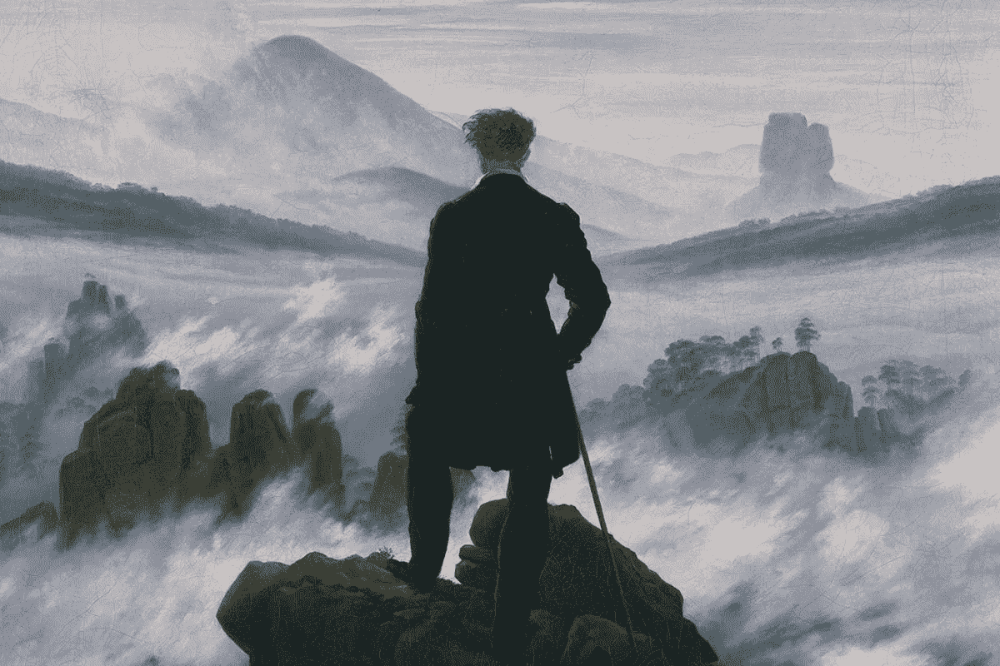
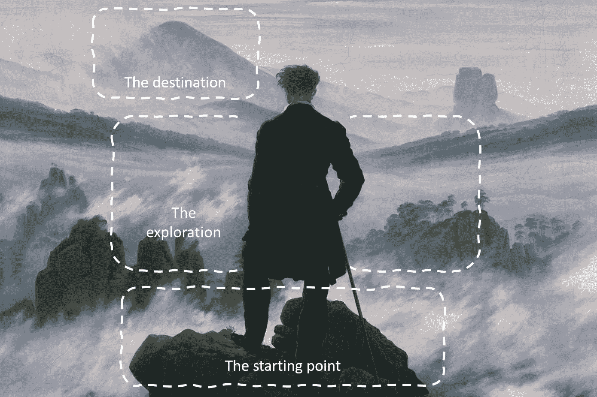

# 我花了 15 年时间试图理解好奇心——以下是我学到的东西

> 原文：<https://medium.datadriveninvestor.com/i-spent-15-years-trying-to-understand-curiosity-here-is-what-i-learned-f2035fdc1c5a?source=collection_archive---------12----------------------->

好奇心一直是我欣赏的性格特征。甚至在我还是个孩子的时候，我就注意到，聪明、风趣、有趣的人似乎是我们周围的人的性格特征——在他们的公司里，冒险似乎总是在每个角落等着我们。

但是很多年来，我很难理解好奇心是如何运作的。这有点像看到有人在画画，我知道这个人很有创造力。

> 从一个人的行为和提问方式，我可以看出他是真的好奇。但是我怎样才能变得更好奇呢？

我花了几年时间试图确定下来。我花了 5 年时间学习哲学、心理学、管理学和组织理论，试图理解它。我选择它作为我的学士和硕士论文的题目。我在乔布斯那里工作，这让我对职业充满好奇。但直到最近，我才觉得自己在这个话题上有了立足点。

 [## 哲学、象形文字和技术|数据驱动的投资者

### 在发现罗塞塔石碑之前，象形文字已经被视为信息，即使它们的语义…

www.datadriveninvestor.com](https://www.datadriveninvestor.com/2018/10/16/philosophy-hieroglyphics-and-technology/) 

到目前为止，我所学到的是…

花几秒钟时间看看我放在下面的这幅画，名为卡斯帕·大卫·弗里德里希的《雾海之上的流浪者》。你看到了什么？

首先，我看到的是一个即将开始探索未知的流浪者。此外，我看到一个由三个有趣的视觉元素组成的组合。在最前方，一个流浪者坐在悬崖上凝视着地平线。在远处的地平线上，有一座被雾和云覆盖的山，这似乎是流浪者的目的地。在流浪者和目的地之间，有一片迷雾，等待着人们去探索。探险准备开始了。

对我来说，这幅画描绘了好奇心。我来解释一下原因。

看看我用的“探索”这个词。现在，看看“问题”这个词。你看到了吗？

> Quest 是单词 question 的第一部分。这不可能是巧合。

变得好奇意味着继续探索，正如《雾海之上的流浪者》向我们展示的那样；任何探索都有一个起点，一个终点，以及两者之间的旅程。

让我们把这种反映添加到这幅画中:

当我把这张“图片”拼凑起来的时候，我意识到了一些事情。

> 为了让自己变得更加好奇，我需要继续每天的探索，并提醒自己任何探索都是由起点、终点和探索组成的。

在实践中，这意味着我学会了不断寻找新的东西来学习和探索——新的目的地。此外，我保持对我的出发点的意识，这在大多数情况下意味着认识到我的假设是什么，并试图使用我的假设作为学习的动力。我通过把我的任何假设变成一个测试假设来做到这一点。我的假设只有在我停止测试时才会成为问题。

> 对任何感兴趣的话题保持好奇意味着不要让起点变成终点。

最后，我承认“暂时迷失”的感觉是探索本质的一部分。我还告诉自己，迷失的经历通常就在我学习新东西之前。像流浪者一样，在到达下一个山顶之前，我将不得不穿过迷雾。

> 当我注意到这一点时，我体验到变得更好奇、更冒险、更善于提问，这有一个额外的效果；我开始学得更多，更快。

所以，这是我对你的祝愿，如果你也想保持好奇的话。

认识到每一天都是潜在的探索和冒险。问问你自己，今天我可以探索什么样的冒险？今天可以经历哪些奇遇？把自己看成一个探索者，像流浪者一样，一头扎进未知的迷雾。爬山。暂时消失。欣赏令人惊叹的地平线。

想象一下，如果你今天去探险，你会经历什么？