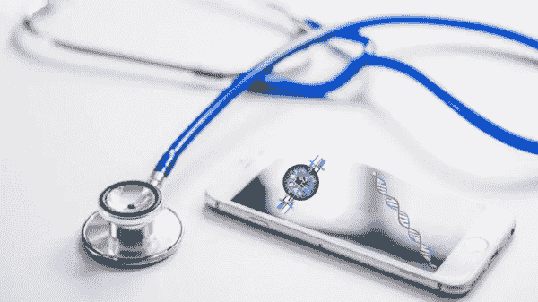

# ICO 和特殊类别数据指南

> 原文：<https://medium.datadriveninvestor.com/ico-and-guidelines-on-special-category-data-688249daccad?source=collection_archive---------11----------------------->

第 679/2016 号《GDPR》第 9 条提到“某些特殊类别个人数据的处理”。特殊类别数据是需要更多保护的个人数据，因为它们很敏感。

此外，《GDPR》第 6 条第 4 款要求持有人考虑到“c)个人数据的性质，特别是如果根据第 9 条处理特殊类别的个人数据”。

该条规定:“禁止处理透露种族或民族血统、政治观点、宗教或哲学信仰或工会成员身份的个人数据，以及处理遗传数据、旨在唯一识别自然人的生物统计数据、关于个人健康或性生活或性取向的数据”，除非下一段列出了一些例外情况。特别是在同一条的第 2 款(h)和(I)项中，提到了出于预防医学目的或出于公共卫生领域的公共利益的原因而需要的个人的、甚至是敏感的数据。

英国数据保护监管机构信息专员(ICO)最近通过分析三个宏观类别*遗传数据*、*生物特征数据*和*健康数据*，更新了指南，准确地说是关于特殊类别数据。

关于第一个问题，ICO 指出，如果基因分析包括个人独有的基因标记，即使姓名或其他识别信息已被删除，它们也应被视为个人数据和特殊类别数据，与特定生物样本的基因测试结果相同，因为它们可以追溯到特定身份。否则，如果您有部分基因序列或用于测试目的，或无法追溯到特定身份，它们将被视为非个人数据。

 [## 大笔资金和尖端技术:人工智能/人工智能投资将如何革新医疗保健…

### 在过去几年人工智能(AI)和机器学习(ML)的显著发展中…

www.datadriveninvestor.com](https://www.datadriveninvestor.com/2018/03/22/big-money-and-cutting-edge-technology-how-investment-in-ai-ml-will-revolutionize-the-healthcare-industry/) 

在第二个问题上，ICO 有机会澄清一些相当重要的区别:个人的数字照片不会自动成为生物特征数据，但只有当该图像的数据用于创建单一的数字个人资料，用于通信和自动识别时，才成为生物特征数据。这样的数据几乎都是特殊类别的数据。

关于第三方，健康数据，它们揭示了许多关于个人生活的信息，不仅是当前的，还有过去和未来的，这就是为什么它们肯定是个人数据，肯定是特殊类别的数据，因为它们揭示了许多关于个人数据本身和其他细节的信息。因此，如果通过这些数据，人们获得了具有高度确定性的数据，它们就是特殊类别的数据，否则，如果它们仅用于统计目的，因此可以追溯到纯粹的假设，那么就只剩下个人数据了(例如，人们常常可以从一个名字或图像推断出属于一个种族群体，但没有绝对的确认)。的确，如果用户，即使是为了纯粹的统计目的，根据种族、宗教、政治或性取向，毫无疑问，正在处理特殊类别的数据，超出了打算实现的具体目的。

在这种情况下，需要特别的同意，这可能还不够！根据《GDPR》第 89 条，如果您无法获得有效的明确同意，您应该停止使用此类数据，除非出于新闻、学术、艺术或文学的公共利益。

明示同意必须:

-以明确的声明(口头或书面)确认，而不是通过任何其他平权行动

-指定特殊类别中数据的性质

-与任何其他形式的同意分开。

《GDPR 公约》第 9 条第 2 款(e)项规定，作为第 1 款的一项例外:"处理涉及数据主体公开的个人数据"，以表明用户故意分享的行为。

该条第(j)点明确提到了与“根据第 89(1)条，根据欧盟或国家法律，出于公共利益、科学或历史研究或统计目的的存储目的，与所追求的目的相称”相关的例外情况，具体说明了不能使用匿名数据的原因，对使用假名技术的真实评估，以及保障和保证用户隐私及其安全的具体步骤的证据。

总之，ICO 声明特殊类别的*数据包括披露或涉及上述数据类型的个人数据。因此，如果您已经推断或猜测出属于上述类别之一的某人的详细信息，这些数据可以被认为是特殊类别数据。这取决于这个推论有多确定，以及你是否在故意得出这个推论。*

**T3【AEPD】和 T5【健康数据指南】**

西班牙数据保护机构 AEPD 也希望对健康数据保护进行更深入的分析，并发布了指导方针来阐明一些要点，总结如下:

-在保健领域，隐瞒临床病史数据的权利非常有限，因为这些数据旨在确保对病人的适当护理；并且可能是司法、流行病学、公共卫生、研究或教学目的以及公共利益或遵守法律义务所必需的。

-只有医疗保健专业人员才能决定是否可以删除健康数据。

-必须严格遵守医院出入控制。

-医生无权了解与他或她没有职业关系的病人的机密信息。

-可以要求纠正医疗信息，但应由医疗保健专业人员决定是否纠正。

在网络巨头出于商业目的获取健康数据的时候，数据保护当局更加强烈地感到有必要在他们的防御中划清界限。

版权所有

***拉斐尔·阿格莫，律师***