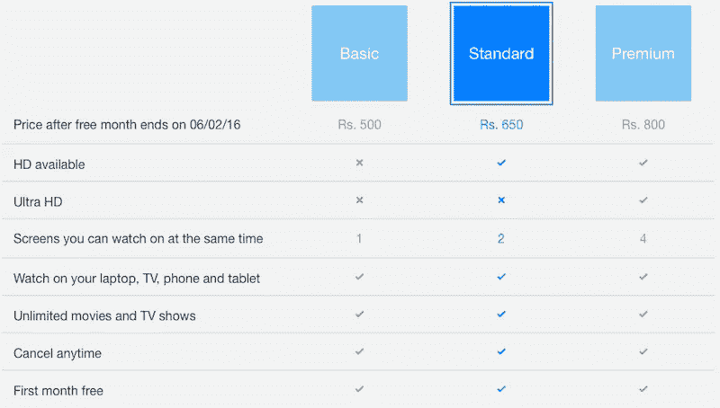

# 营销中的对比原则——影响顾客行为的秘诀

> 原文：<https://medium.datadriveninvestor.com/influencing-buyer-behaviour-a-tip-to-grow-your-business-contrast-principle-ad3da170b802?source=collection_archive---------2----------------------->

Manickam 先生(化名)经营一家火灾报警器制造公司，专门为公司提供火灾探测和通知系统。他的产品是市场上最便宜的。他相信他的低成本战略会帮助他的公司成为一个主导品牌。

不幸的是，即使在这个行业干了十年，他的公司仍然是这个领域的边缘玩家。他意识到低成本策略并不适用于所有市场。

 [## 一个企业在肚子上移动:如何照顾直觉|数据驱动的投资者

### 事实证明，直觉不仅仅是一种感觉。科学很清楚:你的直觉比你知道的更多…

www.datadriveninvestor.com](https://www.datadriveninvestor.com/2018/11/09/a-business-moves-on-its-stomach-how-to-make-allowances-for-gut-feelings/) 

由于 Manickam 提供最便宜的商品，他只吸引那些在市场上寻找最便宜商品的小公司。那些公司数量很少。他觉得要发展业务，他必须瞄准更大的群体——一级和二级公司。他必须想办法吸引他们的注意力。不幸的是，这些公司将低成本与低质量产品联系在一起。所以，Manickam 发现很难向他们推销他的火灾报警系统。甚至一些三级公司也只对购买知名品牌的产品感兴趣。

Manickam 攫取更大市场份额的梦想似乎不太可能实现。他面临着巨大的增长挑战。

## 搜索

与此同时，他的一个朋友推荐了一本书*，丹·艾瑞里的《可预见的非理性》。Manickam 买了这本书并开始阅读。*

丹·艾瑞里在第一章开始写了一则订阅《经济学人》杂志的广告——*在浏览互联网时，丹看到了下面这则广告——*

a)《经济学人》,仅互联网订阅——59 美元

b)《经济学人》,印刷版订阅费——125 美元

c)《经济学人》,印刷版和互联网订阅套餐——125 美元。

丹·艾瑞里震惊了。为什么有人会花 125 美元买一份印刷版的订阅，而印刷版和互联网版的订阅价格是一样的。互联网订阅完全免费！。

然后，他意识到，他从未考虑过第一个选择——纯互联网订阅。为什么？他们在操纵我们的思想吗？

诱饵的力量- 丹·艾瑞里决定看看其他人是否也会有和他相似的感觉。他把这些选项给了麻省理工学院斯隆管理学院的 100 名学生，令他沮丧的是，84%的学生选择了第三个选项。学生们似乎受到了*“仅打印”*选项的影响，尽管没有人选择它。丹·艾瑞里把这种选择称为“诱饵”——它的作用是影响消费者的决策。

为了检验“诱饵”的威力，丹考虑了如果去掉“只打印”选项会发生什么。因此，他选择了一组不同的学生，只给他们看了两个选项(*没有纯印刷订阅-没有“诱饵”*)。令他惊讶的是，组合订阅从 84%下降到 32%。急速下降。

因此，很明显，仅仅是“诱饵”以“只打印”的形式出现就影响了学生。

丹·艾瑞里写道，*“诱饵之所以有效，是因为人类无法绝对选择。我们必须将一件事与另一件事进行比较。不与 4 缸发动机*进行比较，我们就无法理解 6 缸发动机的价值。他补充说，我们可以利用这一点来影响消费者的决定。

他举了一个例子——见下图——想象橙色圈是你的产品。两个橙色圆圈的直径相同，但由于灰色圆圈的大小不同，它们显得或大或小。同样，你可以通过定义和控制比较产品(灰色圆圈)来改变你的产品或服务在消费者心目中的印象或影响。你需要提供这些选项，而不是让顾客选择比较产品。

丹·艾瑞里提到了几个其他的例子

他看到一名售货员将三台电视机放在一起展示，价格如下-

*   36 英寸松下售价 690 美元
*   42 英寸东芝 850 美元
*   50 英寸飞利浦售价 1480 美元

人们会选择哪一个？品牌不同，但是尺寸和价格之间有密切的关系。大多数消费者更喜欢 42 英寸的东芝*——中间选择。*

马尼卡姆观察到，在丹·艾瑞里的例子中，销售者引导消费者选择中间选择——他们最初想出售的选择。

人们想要做出自己的决定并拥有它们。他们讨厌没有选择的时候。所以，商家为顾客提供选择。

设计选项的诀窍- 丹·艾瑞里写道，“如果你想销售产品 A，第一步是创造一个选项 B，然后引入另一个选项 A——(减去)，这样人们会觉得产品 A 比产品 A 好-”。

想象一下，一个房地产经纪人向你展示了三栋房子——一栋当代风格的房子和两栋殖民风格的房子。所有的花费都是一样的，都是同样令人向往的。殖民地的一个屋顶损坏了(A-)，业主愿意给你打折。你喜欢哪一个？你会选择屋顶好的殖民地(A)。没有比较，我们无法做出决定。当代的房子(B)没什么好比的。

读到这里，Manickam 意识到他一直在以一个价格销售一个产品系列(烟雾探测器、火警面板和相关系统)。他从不提供任何选择。客户们正在将他的产品与其他竞争对手的产品进行比较。

马尼卡姆沉思道，“为什么我不能像那些例子一样，让我的客户把我的产品和我的产品本身进行比较？为什么我不能提供对比产品- *灰色圆圈*？”。

当他继续做日常工作时，这个想法一直在他的脑海中翻腾。

晚上，为了放松，他想到去看电影。他记得他的一个朋友建议他去网飞试试。他打开了 Netflix.com。他看到了他们的订阅计划。他惊喜交加。

From NDTV Gadgets

马尼卡姆认为“标准”选项比基本选项更好。高清已经成为新的“常态”。他开始深入研究，发现“标准”选项是网飞用户中最受欢迎的——中间选项。*标准选项是产品 A，基本选项是诱饵产品 A，高级选项是产品 b。他可以看到丹·阿里尔原理的应用。*

Manickam 开始进一步研究，以了解“诱饵”选项是如何在其他产品中使用的。

他的 Maruthi 汽车是 VXI 型号的。这家汽车公司提供了三种型号——LXI(最低)、VXI(中等)和 ZXI(较高端)。VXI 和 ZXI 型号的价格差距很大。自然，很多消费者忽略了 ZXI 车型，而将 LXI 和 VXI 车型进行比较。马尼卡姆记得大多数顾客购买的是中间选择——VXI 版本。LXI-选项 A-，VXI-选项 A，和 ZXI-选项 b。LXI 是诱饵。

Manickam 发现，汽车公司正通过将它作为中间选择，让客户购买他们想要出售的选项。

他做了进一步的研究，研究了许多成功产品和服务的历史。结果是一样的。他决定继续他的想法。

第二天，Manickam 来到他的办公室，打电话给他的营销和设计团队。他告诉他们，除了目前的产品系列之外，还要开发两种选择。他取消了现有产品系列的某些功能，降低了价格，创造了一种期权。然后，他创造了一个高端产品系列，增加了一些客户利益，并修改了火灾报警系统所有产品的“前面板”。

*对于高端系列，马尼卡姆想起了丹·艾瑞里书中的一个例子——餐馆顾问格雷格·拉普(Gregg Rapp)，他的工作是为菜单定价，过去他会在菜单上保留高价主菜，他认为这增加了餐馆的收入，即使没人买。他进一步补充道，“即使人们一般不会买菜单上最贵的菜，他们也会点第二贵的菜”。*

Manickam 在他的产品目录中保留了高档产品系列，这样他就可以大量销售中档产品系列。消费者认为销售昂贵产品的公司是有质量意识的公司，Manickam 希望他的高价产品可以将相关的质量观点扩展到他的中价产品。

Manickam 要求他的营销团队向客户展示所有三个选项。

六个月内，转化率增加了三倍。Manickam 的公司开始进军一级和二级公司。他的公司正在增加市场份额。