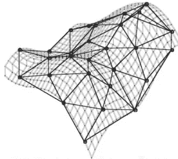

# 基于数据科学的投资建模

> 原文：<https://medium.datadriveninvestor.com/investment-modeling-grounded-in-data-science-8e51891a249a?source=collection_archive---------18----------------------->

Elder Research 已经为政府、商业和投资客户解决了众多领域中许多具有挑战性且之前未解决的技术问题，包括欺诈防范、内部威胁发现、图像识别、文本挖掘以及石油和天然气发现。但我们的团队从对冲基金的突破开始(如几本书[1，2]中简要描述的)，并一直积极参与这项工作，继续发明必要的基础科学来解决可能是最困难的问题:准确预测市场的巨大“整体模型”。

从高度波动和嘈杂的市场信号中提取持久和可操作的模式极具挑战性。理论上，把握市场时机是不可能的——而在实践中，这是一个很好的第一近似值。然而，在过去二十年中，我们在三个有贡献的领域取得了微小但重要的进步，在此简要介绍，这些进步结合起来导致了突破性的实时市场时机策略，具有高夏普比率和低市场风险。

 [## 机器学习的外汇交易挑战|数据驱动的投资者

### 机器学习是人工智能的一个分支，之前占据了很多头条。人们是…

www.datadriveninvestor.com](https://www.datadriveninvestor.com/2019/02/18/the-challenge-of-forex-trading-for-machine-learning/) 

# 1.运气、技巧还是折磨？如何辨别

由于现代分析技术的力量，通常有可能在市场中发现明显(但不真实)的预测相关性，这是由于过度拟合——模型的复杂性淹没了数据，或者更危险的是，由于过度搜索——检查了如此多的可能关系，以至于偶然发现其中一个有效。在许多应用领域与这个严重的问题搏斗了多年，我提炼了一个强大的重采样方法，我称之为****，**目标重排来测量一个实验发现可能偶然发生的概率。它远比 *t* 测试和其他公式化的统计方法更准确，这些方法没有考虑到现代归纳建模算法执行的大量搜索。有了这个工具，人们可以更准确地衡量一个提议的投资策略(或任何其他模型)的“优势”(或缺乏优势)。**

**几年前，为了更准确地衡量市场时机或风格转换策略的质量，我定义了一个我称之为 **DAPY** 的标准，意为“每年提前的天数”。它以日平均回报为单位，衡量某个择时策略相对于类似市场基准的预期超额回报。夏普比率可以被认为是衡量策略回报的质量；而 DAPY 测量其时序边沿。他们加在一起比夏普一个人有用得多。最重要的是，老年人研究表明 DAPY 在预测未来表现方面比 Sharpe 更好。**

# **2.全局优化(与模拟相结合，有时还有复杂性调整)**

**即使是最现代的数据科学工具，在预测或分类时，由于其优化的便利性，也经常试图最小化平方误差。但这一指标并不十分适合获得市场决策，因为用户的价值标准更多地与回报、支出、波动性、敞口等有关。，比具有严格的预测准确性。(例如，如果一个人的方向是正确的，那么在大小上出错并不坏，更不用说它的平方了。)我们需要的是能够反映我们真实兴趣的优化指标，以及能够在嘈杂、多模态、多维空间中找到最佳值的算法。**

**在我职业生涯的早期，即使在航空航天和其他一些困难的领域取得了巨大的成功，我还是不断地失败。我开始相信需要一个高质量的搜索算法来设计定制的得分函数(模型度量)。我回到了研究生院，并将此作为我博士研究的重点。我创建了一个全局优化算法**摸索**(探针昂贵时的全局研发优化)，该算法使用尽可能少的探针(实验)找到策略参数的全局最优值(在界限内)。按照这个标准，它多年来(可能仍然是)是世界冠军优化算法。(请注意，在图中，它如何将非线性二维表面表示为一组互连的三角形平面。)**

****

**在 Elder Research 的投资模型中，在从成千上万的候选输入中以定量而非定性的方式识别出一小组(即几十个)有用的输入后，全局优化通常在第二阶段起作用。筛选在第一阶段通过正则化的模型拟合来完成，例如套索回归，以过滤掉无用的变量，同时允许意想不到的组合出现。**

# **3.集合模型**

**集成方法被称为“过去十年中数据挖掘和机器学习领域最具影响力的发展”他们将多个模型组合成一个模型，这个模型通常比其最好的组成部分更准确。集成为行业挑战提供了关键的推动力——从投资时机到 [**药物发现**](https://www.elderresearch.com/discovering-efficacy-of-new-drug) ，以及 [**欺诈检测**](https://www.elderresearch.com/detecting-healthcare-fraud) 到推荐系统——在这些领域，预测的准确性比模型的可解释性更重要。2010 年，我有幸与 Giovanni Seni 博士合著了关于合奏的书**，大约 15 年前，我是这个想法的早期发现者和推动者之一。我们使用的投资系统，以及我们在其他领域的许多模型，采用了一套单独训练的模型来提高准确性和稳健性。****

****即使有了这些突破性的技术，我们尝试的大多数投资模式都行不通。一般的问题是如此的困难，以至于我们试图找到可重复的模式，但在实现的某个阶段失败了——幸运的是在客户的钱被涉及之前！然而，我们已经取得了几个巨大的成功，包括一个用数亿美元运作了十多年的系统，每个投资者都从中获利。目标洗牌法不仅在一开始就让主要投资者相信它是有意义的(一个真正的低效率口袋)，而且在它的优势消失和该关闭它的时候提供了早期警告。这三项技术突破合在一起，让不可能偶尔成为可能。****

****[1]参见艾瑞克·希格尔博士的畅销书《预测分析:预测谁会点击、购买、撒谎或死亡的力量》的第一章****

****[2]摘自《数据挖掘之旅》一书；15 位著名研究人员的经历简要叙述了开始的情况:“与投资理论的所有预测相反，股票市场项目结果非常成功。我们在市场的某个角落无意中发现了持续的定价低效率。压倒性的噪音中出现了一个轻微的模式，当无所畏惧地跟随时，导致了大约十年的正回报，比市场好，只有其标准差的三分之二——按风险调整后的回报衡量，这是一个全垒打。我微薄的利润份额提供了足够的收入，让我在 1995 年启动了老年研究项目，当时我的稻米奖学金结束了，我永远地回到了夏洛茨维尔。Elder Research 是首批数据挖掘咨询公司之一……”****

******了解如何使用针对** [**金融服务**](https://www.elderresearch.com/industries/financial-services-analytics) **的专家分析来提高合规性、自动化业务流程并增强客户体验。******

*****最初发表于*[*https://www.elderresearch.com*](https://www.elderresearch.com/blog/analytics-in-investment-modeling)*。*****