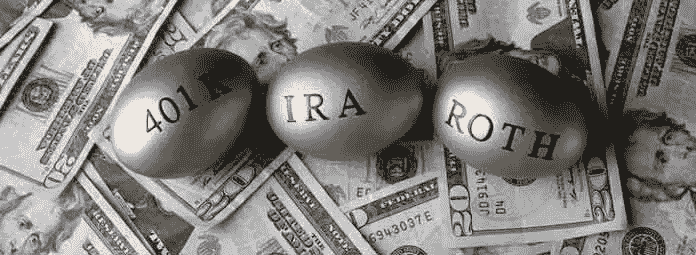

# IRA vs. 401k:哪个更好？

> 原文：<https://medium.datadriveninvestor.com/ira-vs-401k-which-is-better-dd1f34076430?source=collection_archive---------28----------------------->

更新于 2019 年 1 月 28 日

IRA 和 401k 计划是最好的退休投资，原因有很多，包括税收优惠和长期复利。了解每种类型的计划，解读哪种更适合你的财务规划和退休需求。

过去，退休曾经是一件更简单的事情，因为雇主提供内置的退休计划，表现良好的退休工人会自动收到养老金支票。今天，大多数工人被要求为他们自己的退休计划做贡献，并且在制定各种投资计划的策略上处于主导地位，而不仅仅是 T2 的社会保障。

了解为什么[个人退休帐户](https://seniorfinanceadvisor.com/investments/traditional-roth-IRA-accounts)和 [401k 计划](https://seniorfinanceadvisor.com/investments/401k)都是不错的退休投资选择，这取决于您独特的退休和投资需求。

# IRA 和 401K 类型介绍

了解 IRA 和 401k 计划如何帮助您满足退休规划需求非常重要。[投资时间范围](https://seniorfinanceadvisor.com/resources/life-expectancy-time-horizon)、税级和[投资组合管理](https://seniorfinanceadvisor.com/investments/portfolio-management)都有助于制定最适合你的计划。

个人退休帐户是为退休储蓄而设计的，允许你购买投资，如共同基金和股票。个人退休帐户提供减税优惠，可以节省退休人员数千美元。

另一方面，401ks 是雇主赞助的退休计划，旨在接管公司养老金计划。员工可以通过 401k 计划自由地做以下事情:

*   决定缴费率
*   做出投资选择
*   计划战略性 401k 计划提款
*   策划他们的薪水中有多少会进入 401k，并有国税局的缴费限额

这两种退休投资都有一些优点和缺点:

# 个人退休账户的优势

根据个人退休帐户的类型，以下是主要的好处:

# 税收优惠

罗斯个人退休帐户的最大好处是退休时的免税提款收入。投资者将税后美元存入他们的罗斯个人退休帐户，因为这笔钱已经交了税，你可以随时提取而不用交税。

如果你在 59 岁后从一个至少有 5 年历史的账户中取出你的收入，这些收入是免税的。如果你开始时处于较低的纳税收入等级，而在以后的几年里处于较高的所得税等级，这可以大大节省你的开支。罗斯个人退休帐户的投资者很早就纳税，所以他们不必为收入纳税。

# 投资的灵活性

罗斯个人退休帐户也提供了更多的投资灵活性。尽管两个账户都可以投资共同基金，但 401k 仅限于雇主选择的基金。罗斯个人退休帐户有更广泛的选择，例如可以将其投资指定为自我导向的罗斯个人退休帐户，其中包括黄金和房地产等投资机会。

罗斯个人退休帐户还允许您在没有罚款的情况下提取有效的例外，如购房和教育费用。因为你已经为此付了税，所以你可以在任何年龄提取你缴纳的金额。

# 个人退休帐户的缺点

许多人在他们的个人退休帐户退休计划中犯了常见的错误，这可能会很昂贵。例如，在传统的个人退休帐户中，你需要提款，如果你不这样做，你将受到惩罚。你放在 IRA 的钱不能永远放在那里。一旦你到了 70 岁，你就必须开始从你的账户里拿分红。您每年提取的金额取决于您的个人退休帐户余额以及您当时的预期寿命。如果您未能达到要求的最低分配额，您将被处以 50%的罚款，罚款金额与您未能提取的金额相当。

此外，对于传统的个人退休帐户，这笔钱最初是免税的。这样做的不利之处是，当退休时提取资金的时候，你的分配将按照你的普通收入税率征税。

如果你还没有退休计划，只要你还没到 70 岁半，你就可以[从你的税收中扣除你的全部个人退休帐户缴款。然而，你的贡献将受到年度限制，目前 50 岁以下的人是 5500 美元，50 岁以上的人是 6500 美元。](https://turbotax.intuit.com/tax-tips/investments-and-taxes/what-is-irs-form-5498-ira-contributions-information/L1we1IO3U)

# 401k 的优势

401k 投资计划是为未来储蓄的最佳方式之一。

# 免费的钱

401k 的主要优势是来自员工和雇主缴款的“免费”资金。如果你开始得早，并且如果你的雇主匹配一份缴款(通常高达 6%)，你将从复利中获得最大收益。

# 方便且税收优惠

在 401k 中存钱很容易，因为钱会自动从你的薪水中扣除。还有税收优惠，因为在计算应税收入之前，缴款会从你的薪水中扣除。为你的退休有自动工资扣除使它更方便管理你的退休计划。

# 免费义务教育

许多公司提供免费课程和工具，让员工成为聪明的 401k 计划者。你可以从公司提供的各种投资中做出选择，决定哪种途径或策略最能让你在未来获得最大收益。

# 401K 的缺点

401k 很大程度上是由你的雇主控制的。每个雇员和雇主决定将多少工资投入 401k 计划。所有员工的供款由一个单一的计划信托持有，但每个人的账户余额都受到单独监控。对于 401k 计划，员工可以选择向员工账户缴纳相应的费用。

401k 中的投资机会金额仅限于雇主给出的建议和选择。在投资方面，它不允许员工有太多的灵活性。

# 规划成功的未来

IRAs 和 401k 计划是两个最常用的退休计划，提供税收减免和福利，但每个都有自己的规则，必须根据你的个人选择和情况仔细考虑。平衡不同的投资将有助于你建立一个更加稳固的[储备。](https://seniorfinanceadvisor.com/news/creative-ways-to-make-your-nest-egg-grow)

例如，除了 401k 和 IRA 投资选项，有一个平衡投资组合的退休计划也很好。无论是股票、[债券、](https://seniorfinanceadvisor.com/investments/bonds)、退休后兼职，还是[个人贷款](https://openloans.com/blog/financial-assistance-for-senior-care)来帮助老年人理财，专家[理财顾问](https://seniorfinanceadvisor.com/resources/how-to-find-a-financial-advisor)可以帮你决定什么对你独特的财务状况最有意义，从而为你成功的财务未来做好准备。

*最初发表于*[*【www.seniorfinanceadvisor.com】*](https://seniorfinanceadvisor.com/news/ira-vs-401k-which-is-better)*。*