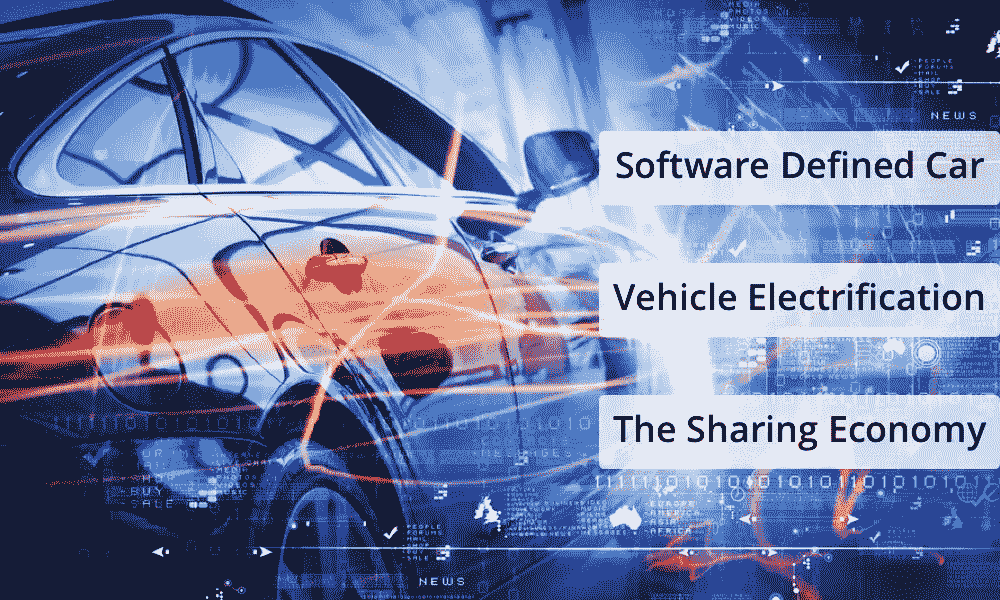

# 汽车行业的转型不仅仅是数字化吗？

> 原文：<https://medium.datadriveninvestor.com/is-transformation-of-the-auto-industry-more-than-just-digitalization-64d7ef900da3?source=collection_archive---------2----------------------->

汽车行业经历的不仅仅是一次变革，而是三次变革，这三次变革融合成了一场大革命。每个行业都要经历一次重大变革，有的历时 5 年，有的历时 10 年，有的甚至超过 100 年。今天，道路上有超过 10 亿辆汽车，让人们对长时间的交通堵塞、空气污染水平达到峰值和油价上涨感到沮丧。当人们开始抱怨一百年前被汽车取代的[马车时，汽车工业也经历了类似的过程。那么，什么会取代我们现在的汽车呢？联网汽车？当然可以。自动驾驶汽车？当然了。但答案远比这复杂。让我们来看看正在推动汽车行业革命的三大变革:(1)软件定义的汽车，(2)车辆的电气化，以及(3)共享经济。](https://movimentogroup.com/blog/looking-back-to-understand-the-impact-of-the-driverless-car-revolution/)

## 软件定义的汽车时代

在这个数字时代，汽车也在向数字化发展，这意味着它们包含了数百万行软件代码，接管了硬件组件的智能。我们大多数人都在智能手机上听音乐。我们还可以通过蓝牙或 USB 连接智能手机，在车里听音乐。现在我们也有 Android Auto 和 Apple CarPlay，它们都提供了一个有限版本的手机系统，可以在汽车的信息娱乐系统上运行。它们允许司机和乘客通过语音命令和汽车的手动控制来控制音乐、导航和交流。这些新应用正在重新定义汽车的信息娱乐系统，使它们更容易使用。在不久的将来，汽车不仅会连接到云，还会相互连接，连接到道路基础设施和其他智能设备。随着[物联网](https://movimentogroup.com/blog/the-future-as-a-potpourri-of-cars-smartphones-and-iot/)、大数据和[人工智能](https://movimentogroup.com/blog/artificial-intelligence-autonomous-vehicles/)的快速发展，汽车已经成为智能机器，能够持续快速地生成、分析和传播数据。

摩根士丹利估计，在未来，软件和应用层合起来将占自动驾驶汽车价值的 60%。汽车中传感器数量的不断增加以及每小时产生的大量车载数据正在推动自动驾驶平台和云中数据市场的发展。从驾驶辅助功能到能够访问云中您最喜爱的应用程序，再到让您的汽车[保持最新的安全性和功能](https://movimentogroup.com/products/)，汽车将不仅仅是一台将您从 A 点带到 b 点的机器。未来将带来新的机遇，不仅可以降低[运营成本](http://news.ihsmarkit.com/press-release/automotive/over-air-software-updates-create-boon-automotive-market-ihs-says)，还可以建立新的售后收入流。消费者将优先考虑车内体验，而不是车内的硬件组件。我们现在生活在一个软件定义的世界；软件定义的汽车只是其中的一部分，挑战在于让它变得实用、安全。

## 向电动汽车的过渡

过去几年被认为是有记录以来最热的几年。气温上升是由于全球变暖，主要是由空气污染引起的。据报道，中国和一些中东国家的空气污染程度是世界上最高的，引发了严重的健康问题。由各国政府自己发起的全球可持续努力的趋势正在使世界从化石燃料转向可再生能源。像[挪威、德国、印度、法国、英国、中国和荷兰](http://dailyaccord.com/7-countries-are-banning-fossil-fuel-based-cars/)这样的国家已经宣布化石燃料汽车将在 2030 年被禁止。2017 年，在全球道路上行驶的 38.5 万辆电动公交车中，中国占了约 99%，占该国整个车队的 17%。据[彭博新能源财经](https://www.bloomberg.com/news/articles/2018-04-23/electric-buses-are-hurting-the-oil-industry)报道，每 5 周，中国城市就增加 9500 辆零排放交通工具——相当于伦敦全部的工作车队。彭博还报道说，世界各地的主要城市正在慢慢效仿中国:巴黎、伦敦、墨西哥城和洛杉矶是承诺到 2025 年只购买零排放公交车的 13 个城市之一。

几乎每一家主要汽车制造商都在计划生产电动汽车，以符合政府法规。虽然[中国已经是电动和自动驾驶汽车的最大市场](http://www.scmp.com/business/china-business/article/2124042/china-spearhead-us1-trillion-autonomous-driving-revolution)，但全球各地的公司都开始意识到开发电动汽车自动驾驶技术的趋势。汽油价格的上涨、严格的政府法规以及电动和混合动力汽车的大幅发展，为全电动的未来铺平了道路。这些汽车将变得更便宜、更高效，将促进主要高速公路上充电站的发展，并引领自动驾驶技术。但是，如果只靠煤发电，整体空气污染还是一样的。相反，我们应该开始寻找可再生能源，如太阳能和风能，以减少全球变暖。

## 共享经济的兴起

社交媒体以多种方式将人们联系在一起。无论你是在寻找产品评论还是餐厅推荐，你需要做的只是打开一个应用程序或在线浏览。有[1.5 亿 Airbnb 用户](https://expandedramblings.com/index.php/airbnb-statistics/)互相联系共享住宿。汽车共享公司 Zipcar 报告称，通过其 100 万名客户，该公司已从道路上收回了 [40 万辆汽车。像优步和 Lyft 这样的打车服务已经取得了爆炸性的增长，因为它们有能力促进拼车，这反过来又降低了便捷交通的成本。互联网通过简化人们相互联系的方式，推动了共享经济的发展。今天，你只需要在智能手机上安装一系列应用程序，就可以完成大部分日常活动，无论是上班旅行、下一次度假、订购食品还是安排杂货店送货。](https://www.autoblog.com/2016/09/09/zipcar-1-million-members/)

汽车共享将成为面临日益严重的空气污染和交通拥堵的城市人口的[生命线。企业从一个地方到另一个地方的快速便捷的需求将激发创造潜力。在大城市，拼车将吸引那些不想承受汽车所有权或停车问题负担的人。在郊区，汽车共享将影响那些没有适当公共交通系统的社区。传统出租车正在被人工驾驶的叫车汽车所取代，在未来，这些汽车将被自动驾驶的机器人出租车所取代。打车公司计划通过向客户推出移动即服务(MaaS ),将车主转变为汽车用户。](http://1itenterprise.com/cxo/sharing-economy-for-cars-may-see-greatest-uptake-in-developing-countries/)

未来科幻电影中的超级跑车在长长的蜿蜒的高柱子路上行驶，其他汽车在周围飞来飞去，这些似乎不再那么未来了。随着全球对汽车行业的关注和技术的快速进步，革命还没有到来，它已经到来。我们需要考虑如何调整我们的业务战略，保持领先地位。随着互联网的兴起，报业一落千丈，迫使几家报纸申请破产，直到它最终设法走向数字化，与几家已经站稳脚跟的在线博客和杂志竞争。如果我们不接受到来的颠覆性变革，我们也会面临被淘汰的风险。

**免责声明:本文表达的观点和意见仅代表我个人，不代表任何其他人或公司。所有内容都受版权保护。*