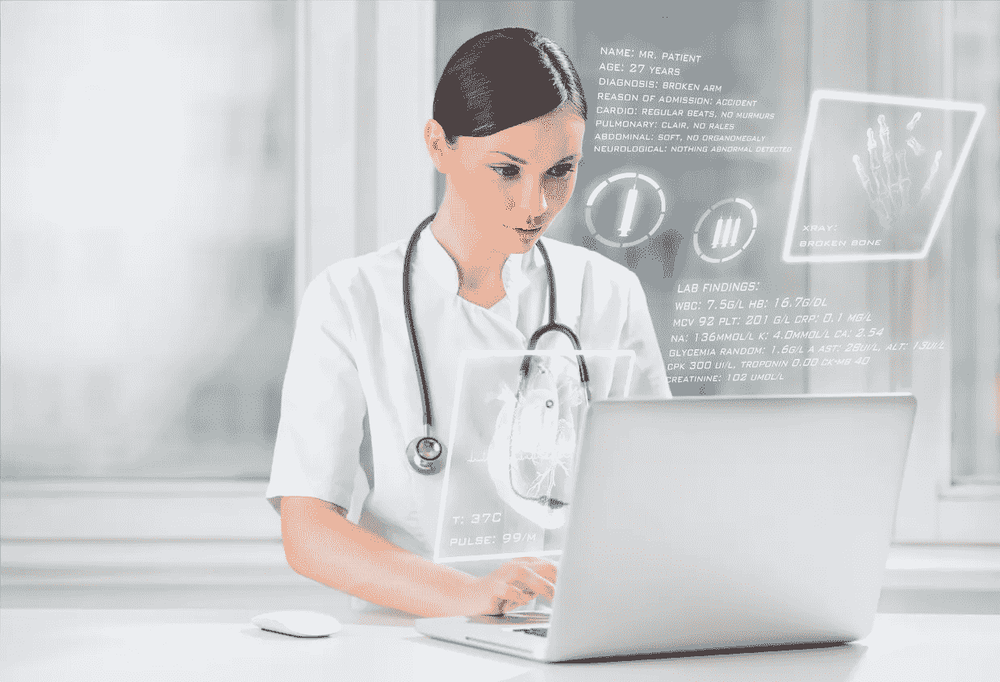

# 当前美学成像技术的问题

> 原文：<https://medium.datadriveninvestor.com/issues-with-current-aesthetic-imaging-technologies-35a9ac148793?source=collection_archive---------2----------------------->

现在人们活得更长了，我们对自己的长相满意吗？我们外表看起来和我们内心感觉的一样健康吗？

技术已经成为实施精准医疗和改善医疗服务的重要工具，并且也延伸到美容和整容手术。今天，我们可以在医学的各个方面取得进步，我们只需要选择正确的技术组合，为患者获得正确的结果。

我们的健康和我们的虚荣心经常是密切相关的。每个人都想活得更久，保持健康，但人们也希望得到别人的关注和赞扬。这意味着人们想看起来和他们感觉的一样好，无论在什么年龄。

***我们的心理健康受到他人看待我们和对我们做出反应的方式的影响。***

在一些发达国家，整容手术被视为真正的医疗问题，由保险公司报销。这是有道理的，因为不喜欢自己的长相会导致抑郁、社交恐惧症以及影响我们整体健康的自我形象问题。

然而，有些人整容走得太远，做了不必要的手术，因为他们永远不会满意自己的样子。以下是一些患者可能对整容手术形成不健康迷恋的迹象:

o 想要改变自己的外貌以使自己看起来像名人的患者

o 一个试图按照不切实际的外表模式生活的病人

o 一个病人认为他或她“生来”就有某种特定的长相，但如果不做手术就无法实现

o 一个相信自己不是的病人

大多数人对整容手术有现实的期望，至少是尽可能接近现实。

对于那些似乎对整容手术有着不健康痴迷的病人，我们该怎么办？作为专业人士，我们尊重他们的意愿吗？我们是应该试着花时间和他们谈谈，让他们变得更理性，还是干脆说不，让其他人来做这件事？

甚至有电视节目讲述那些整容过度的人。整形外科医生需要留意有这种问题的人，并停止治疗他们。

但是许多人对整容手术有一个完全合理的期望:他们想看起来和他们感觉的一样健康。他们不讨厌自己的样子，他们只是想看起来更好一点。整形外科医生应该帮助这样的病人，因为如果他们自我感觉良好，他们会更健康。

*教育患者并向其提供反馈是我们的责任。我们的希波克拉底誓言是不伤害任何人，这包括做美容手术的医生。*

90%的美容手术包括理解病人的问题和顾虑，教育他们，让他们保持在现实的期望范围内。

然而，这是一个问题。美学可能是一个艰难而复杂的领域，尤其是因为那些高调的名人，他们的整容手术结果不佳。一些明星出来后看起来不自然，即使是在一位经验丰富的外科医生治疗后。

*这是由于人为失误吗？或者说美学既是一门科学，也是一门艺术？*

并发症可能会发生，但可以通过建立现实的期望、教育患者并听取他们的反馈来最小化。这些增加了获得良好美学效果的机会。

整容外科医生通过口碑获得了很多生意，而不是病人只是从街上走来。当人们听说一个真正好的整形外科医生时，他们有时会走很远的路，甚至跨越州界去咨询。

B 由于患者的高不满意度，美容医学是医疗保健中最容易引起诉讼的领域之一。程序的结果是不可预测的，许多病人经济状况良好，身体健康，这意味着更多的人有能力提起诉讼。

新技术正试图提高患者的满意度，并使结果更可预测，但迄今为止，这些都没有成功。许多新技术失败的一个主要原因是因为缺乏对患者的实时、实时分析，需要收集元数据来为患者提供对美容手术结果的现实预期。

我们拥有构建更好系统所需的工具，为什么我们不使用它们呢？

提高患者满意度，改善结果，降低并发症和责任:当我们能够远程连接整容外科医生和患者时，这些都是我们可以完成的事情，在连接方面有着巨大的潜在市场。但是实现这一点的技术需要是复杂的和交互式的。

病人必须看到和听到外科医生向他们解释的内容，甚至看到模拟手术过程的过程和结果。这需要一个先进的技术系统来完成。

今天市场上有一些解决方案，但它们体积庞大、价格昂贵，有时还不准确，这给患者带来了错误的期望。更好的技术可以降低成本，改善医生和患者的体验。

目前仅有的此类工具价格极其昂贵。他们主要依靠计算机动画，所以他们不使用来自病人的真实数据，这是必不可少的。我们需要的是一个使用真实数据和真实交互而不是数字模拟来连接整容医生和患者的系统。

远程访问医疗保健是增加收入、提供优质护理、尊重患者隐私、提高患者满意度，同时帮助医生咨询尽可能多的患者的方法。几乎在医学的每个分支都是如此，包括美容医学。

全世界的人们都需要更好的医疗护理，包括美容护理。在服务不足的地区，患有腭裂或其他疾病的儿童无法方便地获得医疗保健专业人员的帮助。远程访问是一种扩展医生服务范围的方式，无论医生是咨询癌症护理、心理学还是美容手术。

未来技术的使用方式将与医疗保健所有领域的使用方式相同。它将被用来无国界地把医生和病人联系在一起。该系统将依赖实时数据，并将是互动和安全的。它将为美容医学带来安全、实时的远程咨询，就像它正被引入医学的其他领域一样。

*想象一下美容医学会发生怎样的变化，如果:*

o 患者在决定是否接受手术之前，可以看到手术的模拟过程

o 患者可以在做出最终决定之前看到结果

o 患者可以做出更客观的决定

o 美容外科医生可以在每次手术中获得更好的效果。

目前市场上没有任何技术能完成这一切。但在不久的将来，一种技术将能够做到这一点，而且这正是美容医学所需要的。

美容医学中的许多并发症是由于期望和现实之间的脱节，以及未能精确定位和定制外科手术的数量和质量。

一项技术将帮助我们提供更好的结果，同时减少并发症，并使患者更快乐，这将是一项重要的成就。

参考资料:

https://www.ncbi.nlm.nih.gov/pmc/articles/PMC2815941/

[https://www . Google . com/amp/www . plastic surgery . org/news/blog/using-digital-imaging-to-help-plan-face-cosmetic-surgery % 3 famp = 1](https://www.google.com/amp/www.plasticsurgery.org/news/blog/using-digital-imaging-to-help-plan-facial-cosmetic-surgery%3famp=1)