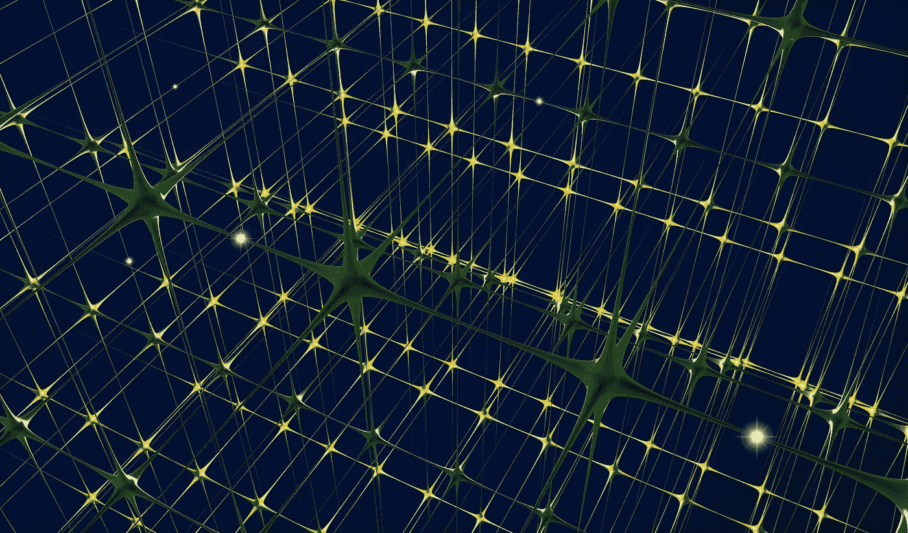

# 学习胶囊

> 原文：<https://medium.datadriveninvestor.com/learning-capsules-124d1de9307d?source=collection_archive---------2----------------------->

我希望这是 Geoff Hinton 的[胶囊网络](http://papers.nips.cc/paper/6975-dynamic-routing-between-capsules.pdf)上的一个有价值的创新。与其使用辛顿所依赖的严格的“方向”向量，我建议使用“上下文”向量，这是*学到的*。此外，当上下文在网络的更高层不一致时，我提供了一种解决不一致的方法。这些发展的关键是对可能解释的*整体分布*的使用，以及对何时使用不寻常解释的记忆。

**解释和上下文**

假设我给神经网络一个*橙色球体*的图像。网络可能会将这团颜色解读为*南瓜*，或者*篮球*，或者*咀嚼玩具*，或者……有很多合理的解读。而大多数神经网络*抛弃了这种分布*，只返回**权重最大的响应(“南瓜！”)我的方法*保留了解释的分布*——它记得‘南瓜’、‘篮球’、‘咀嚼玩具’等等。这是必要的，因为在我们的新网络中，更高层的不和谐将追溯到**使用*二级*解释重试**前馈步骤。如果给定图片的上下文,“南瓜”没有意义，那么网络会查看“篮球”是否有意义。解释模块接受输入，并将其转换为所有适当解释的列表。当上面的解释没有意义时，选择下一个解释。**

除了选择更合理的解释的能力之外，建议的网络还可以自由选择它如何*表示被解释图像的上下文*。类似于 Hinton 的“方向”向量，这个上下文向量声明“原型”解释如何被*修改*，以产生观察到的输入。Hinton 的“方向”向量声明了*数字在页面上的位置，以及应用于该数字的任何*旋转*，允许网络根据其解释(选择的数字)和方向忠实地重新生成输入。我们的上下文向量可以自由地表示不仅仅是“位置和方向”——它们是与生成解释分布的模块一起学习的。*

总的来说，这些解释和它们的上下文必须足以重新生成观察到的输入。上下文向量可以描述大样本中背景的纹理和颜色，以及对象的位置和方向。例如，电视网会看到“死草上的南瓜”或“狗毛上的咀嚼玩具”。然而，还有更复杂的事情——选择两个上下文向量是否*相似*到足以组合的过程，以及*将它们组合*成更高层概念的过程。

Hinton 的“方向”向量是静态的，它们可以使用硬编码的相似性进行相互比较。因为我们的语境向量将使用习得的表征，在特定的环境中，这些表征的某些维度可能比其他维度更重要。我们的*上下文比较器*必须是另一个神经网络模块，它接收一组上下文，并输出这些上下文是否足够一致以将其分组到更高的概念中。像辛顿的“方向”向量一样，上下文向量之间缺乏一致性意味着所选择的解释是糟糕的。相反，这就是第二种解释被采用的时候。

如果上下文向量一致，那么在各种模块中发现的解释被组合成一个更高层的概念。蓬乱的棕色和带酒窝的橙色结合在一起形成了“死草坪”和“南瓜”。“南瓜”和“死草坪”一起构成了“万圣节”的概念，允许一个经过场景描述训练的神经网络决定描述:“一群不给糖就捣蛋的人在房子之间走。”万圣节和“不给糖就捣蛋”的更高概念是从低层解释“南瓜”衍生而来的解释*。这些更高层次的概念*只有在“南瓜”解释与图像其他区域的上下文相匹配时才会出现*。比较这些上下文的方法不像辛顿的“方向”向量那样简单明了——它们必须被学习。*

当解释的分布、上下文向量和上下文比较器都被训练后，网络应该能够重新生成原始输入，使用它对每个对象和作为整体的场景所选择的解释的记忆。

**通过选择反向传播**

为了训练这个建议的网络，我们必须将其输出与正确的答案进行比较，并通过产生输出的模块链反向传播。这意味着，如果使用辅助解释，当它被设置为该辅助解释时，我们通过网络反向传播。用于重新生成输入的存储器与通过反向传播正确分配梯度所需的存储器相同。那些记忆保留了选择的解释；我们通过选择进行反向传播。

这种选择不应该被跨可能选择的分配所取代。该分布中最初的解释被放弃了，因为它们在更高层产生了冲突的上下文，后来的解释可能相关也可能不相关。只有实际选择的解释才应该进行反向传播。然而，这种反向传播改变了上下文生成模块，这可能改变许多不相关的上下文和解释。我并不认为这样的网络容易训练。相反，它可能学习得非常慢，因为解释分布、上下文生成器或上下文比较器中的任何错误都可能在输出中产生可观察到的错误。

训练可能更加困难，因为选择最小化不和谐语境的解释会导致不连续的损失景观。解释分布的微小变化可能会引入新的解释，导致更高层的新解释的级联。类似地，改变上下文生成器或上下文比较器可能会产生分歧，从而导致选择不同的解释。然而，我认为这种使用习得的上下文和习得的比较的结构优于 Hinton 的结构——它是在他的胶囊中发现的过程的概括，可以接受更广泛的输入，并以不同的方式对它们进行操作。不仅仅是为了想象数字的位移和旋转！