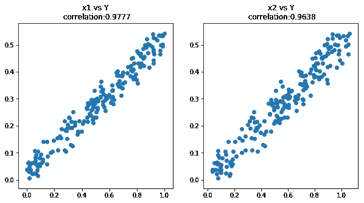

# 面向机器学习的 Python 编程介绍

> 原文：<https://medium.datadriveninvestor.com/machine-learning-python-programming-introduction-for-business-people-10588e13ce9d?source=collection_archive---------5----------------------->

这个讲座是一个关于机器学习的 Python 编程的可选介绍，它是继[机器学习前言](https://medium.com/@leetandata/machine-learning-preface-ba69bca4701d)之后的又一篇文章，在这篇文章中，我们更仔细地研究了代码。这是在[机器学习 1](https://medium.com/@leetandata/machine-learning-engineering-1-custom-loss-function-for-house-sales-estimation-95eec6b12457) 的编码部分之前的编码介绍。

如果你想跟随代码，代码贴在这里:[ML Python 编程介绍代码](https://github.com/leedtan/LeeTanData/tree/master/MachineLearningPrefaceCode)。

要在你的电脑上安装 python，请阅读我的在 windows 上安装 anaconda 的教程，并安装必要的库: [Python 安装](https://medium.com/@leetandata/basic-python-setup-for-ml-for-windows-users-aaadb2be534c)

# 代码分析

Python 是一种很棒的编程语言，几乎可以做用户可以想象的任何事情。但是我们需要使代码更简单的许多功能来自我们需要导入使用的其他包。

## 导入包

对于这个项目，我们需要四个关键包。我们进口

*   数学处理的数字。
*   熊猫适合类似 Excel/SQL 的组织
*   现成 ML 的 sklearn
*   用于绘制图形的 matplotlib。

当我们说 import package_name 时，我们使该库中的函数可用于脚本的其余部分。

当我们在最后说“as X”时，我们是在说“像 NumPy 一样导入这个库，但是为了让代码更漂亮，我们把它叫做 np”

当我们说“来自 Sklearn.linear_model”时，我们是在说，“在 Sklearn 这个大软件包内，在线性模型部分中查找”。

当我们说“从 X 导入 Y”时，我们是说在 X 内部查找，但是只让 Y 从库中可用。

我们现在可以像 np.mean()这样使用 NumPy 来计算向量的平均值。当我们这样做时，我们使用 NumPy 库中的 mean 函数。

## 定义变量

现在我们已经导入了包，我们开始生成数据。

当我们说 NUM_SAMPLES = 200 时，我们正在创建一个名为 NUM_SAMPLES 的对象，并将其值设置为 200。

我们首先使用 NumPy rand 函数定义 x1-x5。我们使用 numpy.random.rand(N)创建每个变量，它创建从 0 到 1 的 N 个随机数。我们对 N 使用 NUM_SAMPLES，为每个变量创建相同数量的值。

注意 NUM_SAMPLES 是全大写的，这是 Python 用户表示全局常量的代码整洁偏好。这和 x1-x5 不一样，都是计算变量。

数学应该看起来很像你所期望的，例如
x2 = x1 + rand(N)/10
的意思是“创建 N 个随机数，将它们除以 10，然后将它们加到 x1。您现在有 100 个类似于 x1 的新随机数。称之为 x2”

上面最复杂的一行是
df = pd。DataFrame({'x1':x1，' x2':x2，' x3':x3，' x4':x4，' x5':x5，' y':y})

从左到右阅读，我们用熊猫来创建一个数据框架。DataFrame 是核心的 pandas 对象，其工作方式类似于 Excel 表格。DataFrame 后面的()用于调用函数，内部是创建 DataFrame 的输入。在里面，我们看到{}，里面有几对“' name':variable”，用逗号分隔。在这里，我们将名称映射到变量来创建我们的数据框架(就像创建一个包含列名和数据的 excel 表)。

最后一行 df.head()获取我们称为 df 的数据帧，并调用 head 函数，因此。头”。结尾的()只是说“调用这个，没有具体细节”。

Head 检查数据帧的顶部值。我们的数据框架的最高值如下:

上面看起来应该类似于 SQL 或 Excel 表。这是一个 2D 表，行代表日期或数据点，列代表要素和目标变量 y。我们的数据集由 200 天的这些输入要素和相应的日销售额组成。

## 形象化

接下来，我们使用 matplotlib 的 pyplot 可视化库可视化我们的数据集。

我们首先调用 figure 函数来创建一个要绘制的图形。我们还在函数中指定 figsize=(10，5)来制作一个大的矩形图像。

现在我们想并排绘制两个散点图，所以我们搜索如何使用 matplotlib 在一个图形中绘制两个图像。我们被告知要用 plt.subplot 来绘制每个情节。

我们调用 plt.subplot()并传入 1，2，1。第一个数字表示我们有多少行图像，第二个数字表示我们有多少列图像，第三个数字表示我们选择的是哪个图。
所以 1，2，1 代表 1 行，画在两幅图的左边。1，2，2 代表画出正确的图像。

当我们绘制图像时，我们使用 scatter()并传入 x 和 y。Scatter 接受两个值列表，对于每一对，它在 x，y 位置放置一个点。
例如，散点图([1，3，2]，[3，0，0])会在[1，3]，[3，0]和[2，0]处绘制三个数据点。如果 x = [1，3，2]，y=[3，0，0]，那么如果我们调用
scatter(x，y)，我们会看到相同的东西。

最后，我们编写了 plt.show()来请求 matplotlib 显示我们当前的图形。

## 准备输入数据

让我们为回归准备输入和输出数据:

从上面看，我们可以通过使用 DataFrame[columns to select]来获取 DataFrame 的列。

如果我们只想要' y '作为我们的目标变量，我们使用 df['y']。如果我们想要所有的 x 作为输入变量，我们使用列名列表。列的列表是用['x1 '，' x2 '，' x3 '，' x4 '，' x5']创建的，然后我们使用这个列表索引到 df 中。因此，df[['x1 '，' x2 '，' x3 '，' x4 '，' x5']]

## 回归代码

要使用 sklearn 运行回归，我们需要创建一个回归模型。要使用 Ridge(一种线性回归)创建回归模型，我们调用 Ridge()。在本例中，我们传入一个小数字 1e-3 或. 001，它将默认参数设置为 1e-3。请忽略这个。

然后我们拿着这个模型打电话。拟合(X，Y)告诉模型从输入和输出数据中学习。

哇，那很容易。执行回归的一行代码。

之后，我们运行一行来询问它学到了什么。我们通过要求回归模型给出它的。我们在 sklearn Ridge 网站上看到的 coef_，就是参数住的地方。然后我们打电话。round(2)将值四舍五入到两位小数。

我们学了一点 Python 代码！用于数学的 Numpy、用于数据组织的 Pandas、用于机器学习的 sklearn 和用于可视化的 matplotlib 是执行机器学习的一些最重要的库。

如果你想让我扩展这篇文章来教授使用 Tensorflow 进行自定义回归的代码，请告诉我。

在实际设置中使用:[https://medium . com/@ leetandata/machine-learning-engineering-1-custom-loss-function-for-house-sales-estimation-95 eec6b 12457](https://medium.com/@leetandata/machine-learning-engineering-1-custom-loss-function-for-house-sales-estimation-95eec6b12457)