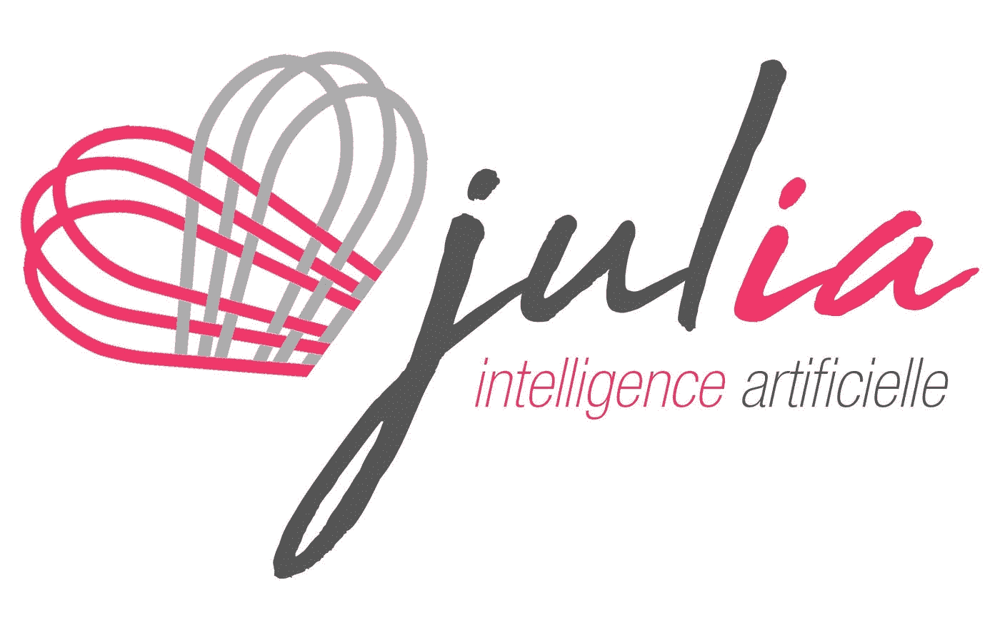

# 口味问题:教人工智能成为终极美食家

> 原文：<https://medium.datadriveninvestor.com/matters-of-taste-teaching-ai-to-be-the-ultimate-foodie-aeb0081e47ad?source=collection_archive---------2----------------------->

在过去的几年里，人工智能(AI)的使用呈爆炸式增长。当我在 2018 年春末写这篇文章时，人工智能已经以某种方式融入了现代生活的几乎每个方面——应用程序(及其潜力)在本季度越来越大。

那么，我们到底会从人工智能的使用中获得什么？

**企业**通常依靠人工智能来做以下事情:

*   **从复杂的数据集中获取深刻的理解**，识别数据中出现的趋势或意义；允许在没有机器学习帮助的情况下，以困难或不可能的方式来改进或优化流程。
*   **在商业活动中，用人工智能算法的等效协助来取代一些人工交互**。通常，这样做的目标是通过消除非技能职位来降低长期运营成本，或者通过人工智能驱动的流程改进来提高人类劳动的效率和生产率。
*   **通过使用人工智能驱动的产品、服务和内容推荐，提高销售和营销工作的效率**。

**最终用户**有相似的目标:

*   **减少枯燥乏味的日常工作中的体力劳动**。
*   **根据他们已经喜欢的东西，向他们展示更多他们喜欢的东西**，这样他们就可以更容易地找到符合他们喜好的东西(例如电影、书籍、游戏、餐馆、消费品)。
*   让他们的生活更轻松，更有效地利用时间。

总的来说，我们求助于人工智能，让我们在某些有用的方面变得更好。这可能意味着让我们**更聪明**(处理大型数据集，从不同的数据中得出结论)**增强我们的工作/长期记忆**(卸载死记硬背，让我们专注于记忆中项目的应用)，提供其他未知的信息，让我们调整我们的焦点，在我们的主要技能(工作、爱好)等方面变得更有效。

当然，还有更多的东西，但我认为这是一个不错的谈话的高起点。

从我自己在电子商务领域工作的角度来看，我已经看到基于人工智能的推荐模型数量大幅增加:用于消费品、线索挖掘和营销内容。在这里，我将主要关注对消费品的推荐，特别是食品(因为我认为这一领域的潜力特别令人兴奋，也因为食物和味道是出了名的主观，这使得“破解密码”更加诱人)。

首先，让我们为我们正在讨论的技术打下一点基础(向数据科学家道歉，我把他们的工作*大大*简单化了)。在引擎盖下，人工智能建议通常基于以下进展:

1.  **确定一个实体的相关可量化属性**

*   这些可以是实体固有的(如产品的 MSRP ),也可以反映与实体的外部互动(如过去 24 小时内售出的数量)
*   属性可以存在于生成推荐的系统中，或者存在于与其集成的系统中(例如，数字商务平台、订单管理系统)；或者，它们可以从外部来源提供给系统，以加强已经存在或最少存在的数据模型。

**2。确定一个或多个可以直接或间接代表人类偏好或选择偏差的属性**(或者，更抽象地说，简单地说，一个积极的排列——就像在食谱中看到的互补成分配对)

*   例如，对较高建议零售价产品的偏好通常与收入和奢侈品领域的参与度直接相关，因此在许多产品类别(如服装、鞋类)中，价格较高的产品更有可能是奢侈品。

**3。确定具有相似属性集的其他实体(或者其属性可以以某种有用的方式与原始实体相关联)，并将它们呈现给客户进行考虑。**

*   这通常以直接识别的推荐(“精选，只为你”)或数字广告中的产品选择的形式出现。推荐模型中包含的属性数量根据推荐场景的复杂程度而有所不同。

**4。评估客户与推荐实体的交互，并使用此交互数据进一步完善模型。**

*   积极的互动(如点击、加入购物篮、购买)会加强或“收紧”关系，而消极或缺乏互动(如浏览或结账放弃、缺乏点击)表明应评估备选方案，以更好地确定更准确的推荐。

随着人工智能推荐模型的成熟，它们在复杂性、特异性和复杂性方面都有所增加。我认为这里有三个不同的群体，在现代人工智能中很容易发现:

1.  **全球:**推荐在所有人的所有积极互动总和中表现最佳的实体(例如，购买最多、观看最多、收入最高)。

*   *在关于产品和个人的聚合数据级别进行匹配。*

**2。群组:**推荐最受拥有一个或多个关键特征(例如地理位置、设备类型、人口统计群体)的人欢迎的实体

*   仍然对聚合数据进行匹配，但是池变得更小、更精确。

**3。个人:**根据个人过去的行为或选择性提供的信息，推荐符合个人偏好的实体。

*   *基于一对一的相关性进行匹配。*

我们也越来越多地看到第四阶段的增长:

**4。参与式**:建立在个人的基础上，在这个阶段，个人(在不同程度上)意识到人工智能的存在(在某种程度上，甚至可能是它的机制)。他们能够与人工智能互动，并直接影响自己的预测模型。

这并不是说这是一个严格的线性进化，也不是说所有的人工智能都趋向于越来越复杂的目标定位(尽管在这个方向上肯定有一个强大的推动力)。现代人工智能算法经常融合这些方法，创建一个无缝的推荐模型，能够在建立数据集时突出重点。通常，随着受众变得更加明确，全局推荐被细化为群组推荐，随着目标用户成为焦点，该模型逐渐转向个人推荐。

此外，请注意，上面的概述主要针对直接提供给最终用户的建议。人工智能推荐的结果可以(并且经常)与其他人工智能算法共享，以允许更深入的机器学习，然后最终将结果提供给用户消费或采取行动。这种机器-教学-机器的交互可能会深入许多层，随着关系数据模型范围的扩大，潜在的发现会呈指数增长。

最终，我认为人工智能推荐最令人兴奋的事情是它们是主题不可知的。不管你是卖洗衣皂，还是消费电子产品，还是腌肉，人工智能都可以对你的世界和你采用的策略产生更深刻的理解。

**那么，AI 能从食物中学到什么呢？**

首先，我认为我们需要定义“食物”——因为我认为它不仅仅是我们消费的食物或购买的产品(尽管这些肯定是其中的一大部分)。“食物”是我们做的一件事。这是我们成为人类的一部分。它是人类经历中的一个区分点。它提供了文化背景，并谈到了社会分层。所以，如果我们能教会人工智能“获取”食物，我认为我们将朝着让人工智能对我们这个社会更有用的方向迈出一大步(或许在这个过程中让人工智能更“人”)。

出于这种探索的目的，我将把“食物”定义为一组包括(但当然不限于)以下内容的集合:

*   **基本配料:**一般指单一配料或最低限度加工(相对而言)的食品。水果、蔬菜、谷物、香草、香料、肉类、奶制品、鸡蛋等。还有合成或分离的成分，如色素、香料提取物、稳定剂、防腐剂、乳化剂等。它们本身可能很容易为消费者所获得，或者它们可能只是通常用作人造食品的成分。
*   **复合配料:**这些是由两种或两种以上基本配料组成的食品。它们本身可以被当作“食谱”或消费品，但也经常作为更复杂食谱中的配料(无论是自制食品还是制成品)。例子包括草药和香料混合物以及调味和包装的蔬菜/淀粉/肉类。
*   **消费食品:**这些是由基本和复合配料组合而成，包括调味品、酱料、预制食品和配菜、面包和其他烘焙食品等。
*   **菜谱:**区别于复合配料和消费食品(从最严格的意义上来说也是“菜谱”)，这些是指导性的内容，指导消费者使用精选的基本配料、复合配料和消费食品制作成品菜肴。或者，它们是所述内容的最终结果。
*   **餐厅产品:**这些都是菜谱，但是根据它们在商业餐厅菜单上的出现来区分(因此，这个组和更大的菜谱组之间有很多重叠)。
*   **地区美食和趋势:**更广泛的分组，整体传达食品的起源和背景。这些可以通过地理区域、人口群组、时间地点等来识别。

那么，我们能从食物中收集到什么类型的信息呢？大量的。下面是我们可以分配给上述每个属性的一些高级属性(当然，还有更多，包括派生属性和基于属性簇的推理):

**基础配料属性:**

*   成分分类(类别)
*   营养数据
*   品尝笔记
*   过敏原状况
*   原产地
*   每磅平均价格
*   配料生产商的数量

**针对基本成分的行为:**

*   成分的搜索量
*   每个时间段购买的单位
*   复合配料、消费品、食谱、餐厅产品的包含率

**复合配料属性:**

*   成分分类(类别)
*   营养数据
*   品尝记录(既来自配料，也来自准备过程)
*   过敏原状况
*   成分表中包含的基本成分和复合成分
*   原产地
*   每磅平均价格
*   配料制造商的数量

**针对复合配料的行为:**

*   配料的总搜索量
*   每个时间段购买的单位
*   消费品、食谱、餐厅产品的包含率

**消费食品的属性:**

*   产品分类(类别)
*   营养数据
*   品尝记录(既来自配料，也来自准备过程)
*   过敏原状况
*   成分表中包含的基本成分和复合成分
*   原产地
*   每磅平均价格
*   食品或类似产品制造商的数量

**针对消费食品的行为:**

*   产品的搜索量
*   每个时间段购买的单位
*   其他消费品、食谱、餐厅产品的包含率

**食谱属性:**

*   菜肴类型(地区、文化、分类)
*   场合(膳食类型、事件)
*   相对复杂性(成分数量、准备时间、所需设备)
*   成分表中包含的基本成分、复合成分、消费食品
*   品尝记录(既来自配料，也来自准备过程)
*   每份平均价格
*   出版物数量(网站、书籍等。)提供食谱或类似的

**餐厅产品的属性:**

*   菜肴类型(地区、文化、分类)
*   场合(膳食类型、事件)
*   相对复杂性(成分数量、准备时间、所需设备)
*   成分表中包含的基本成分、复合成分、消费食品
*   品尝记录(既来自配料，也来自准备过程)
*   每份平均价格
*   提供该菜肴或类似菜肴的餐馆的地理分布

上述分组之间有相当多的重叠。例如，奶油玉米是一种复合成分，消费品，还是食谱？是买罐装的还是按照说明在炉子上煮的有关系吗？很明显，一些食物可以符合多种分类——而且很明显，每一层都有递归元素(例如，有多少复合成分是由其他复合成分组成的？有多少食谱在其他更复杂的食谱中作为配料？).

那么，人工智能能利用这些信息做什么呢？

老实说，这和*有什么关系？考虑以下潜在应用(其中一些已经在行业中得到不同程度的应用):*

**通过收集历史搜索量/趋势数据(来自谷歌等搜索引擎和特定于实施人工智能的公司的现场搜索数据)，确定配料、产品和食谱的季节性**。在商业方面，这可以用作推荐引擎的加权因子。更抽象地说，它可以用于菜单规划，或者帮助餐馆制定采购/库存决策。

**根据搜索中的同现率、在其他产品的成分列表中的同现率以及在食谱中的同现率，预测食物/成分配对的新兴、衰落和稳定趋势**。这可以用于产品推荐(“您可能也会感兴趣”)，或者更详细地作为产品和配方开发团队的构思工具(甚至考虑到基于当前趋势数据的滑动“风险”因素和对趋势最终形状的更大预测)。

**通过收集配料清单中常见配料的数据，建立一组基准配方“基础”**；将这些成分组合成“群”,并使用它们来预测基本的烹饪概念/配置(面糊、浆液、油醋汁等)。)

**通过识别在收集的数据中不常见或看不到的配对，为新产品或配方提供机会**。品尝笔记可以增加额外的价值，允许用户根据计算的口味平衡、潜在的挑战性组合等来过滤推荐。

**根据食物的相对异国情调/地域，推荐食物**。当递归应用于组合食品和配方成分时，这可能被用来识别超本地美食、多样化融合产品等。

**识别顾客行为中的成分排斥趋势**，这可能表明食物过敏、不耐受或其他饮食限制。类似的涌现模式可能代表对“干净”标签食品的偏好，对人工色素或调味品的偏好等。当然，这对于产品推荐是有价值的，但是在一个有足够历史记录的客户购买行为的环境中(比如，关于一个忠诚的连锁咖啡店客户)，这些数据可以用来为员工提供他们应该/不应该推荐哪些产品的先发制人的洞察力。

**使用营养数据预测消费者对盐、糖、脂肪等的相对水平(或对其存在的敏感性)的偏好**。建议更适合顾客营养偏好的替代成分或产品交换(私下或公开)。

**建议配方/产品的潜在成分交换和替代配方**,方法是确定要替换的候选成分，提取具有正确风味特征的成分以匹配它们要替换的成分，并根据预期结果过滤其他标准。例如，将香蒜酱配方中的罗勒换成另一种更具本地特色的成分，这种成分具有更高的新颖性分数和相似的价格。或者，确定关键成分互换，通过纳入目前价格趋势较高的高价位成分，将普通产品转变为具有奢侈品吸引力的产品。

**根据从其他类似产品或配方中获得的汇总/平均数据，确定产品或配方配方中的潜在差距**。简单地说，这可能包括确定市场上大多数酸辣酱含有 X 种水果，而你的含有 X-1 种；有没有机会通过加入额外的水果使食谱更有效？在复杂的一端，来自食谱所有组成部分的营养数据可以被汇编，并用于确定你的特定配方比大多数竞争对手的糖和盐含量低。如果这不是有意的差异，是否可以通过引入额外的糖和盐的来源来改善产品？

**通过确定当前配料的低价等价物，在产品或配方中提供提高效率和节约成本的建议**；确定可以代替多种基本成分的复合成分，以降低劳动力和/或材料成本。例如，用可接受质量的混合香料代替多种香料。

**画出顾客搜索食谱和产品的时间/星期/季节**与他们最终行动或购买的食谱和产品，以及这些食谱或产品最相关的用餐时间/事件/季节之间的趋势。将这些趋势反馈给推荐引擎，也许将它们与客户的地理位置结合起来，并在他们回来时使用结果为他们提供更强有力的推荐。例如:如果顾客在周二浏览经常用于准备精致晚餐食谱的产品(通常在他们所在地的周六或周日供应)，当他们在随后的周二回来时，向他们推荐周日晚餐的想法。

**确定客户之间常见的升级过程**这些客户已经成功地提高了购买频率、平均订单价值、对优质产品的喜爱程度等。使用这些作为长期推荐策略的框架，旨在提高客户培养和保留率，定制产品选择以适应特定客户的偏好。

可能性仅受数据模型的深度(和一致性)、可提取数据的可靠来源的数量，以及基于人类与模型产生的建议的实时交互进行细化和强化的机会的限制。当然，通过你准确定义模型是什么的能力*应该做什么*。出于这个原因，成功的工具可能会在能够部署之前为算法的高度初始机器学习、发现和训练提供机会。

**谁会从这种模式中获取价值？**

**产品开发团队:**

*   确定强劲的季节性趋势、新兴配料和搭配、对流行配料兴趣的预期增长、产品推出的最佳时间。
*   通过成分互换、转向价格更低的不同供应商等方式，提出提高产品盈利能力或效率的机会。
*   强调通过引入成分来改善配方或使配方标准化的机会，以消除与普通类似产品的差异。

**网上商家:**

*   绘制代表通向理想客户旅程里程碑的常见路径的趋势；根据客户在客户旅程中的当前位置，将这些路径编织到提供给客户的所有建议的结构中。
*   识别合作购买、替代购买和产品是放弃的强有力的预测因素；使用推荐、搜索造型和分类来相应地推动客户接近或远离这些产品。
*   确定消费者对各种价格点、风味特征、营养统计和食品的其他属性的喜爱程度；针对这些产品定制他们的现场体验，定期介绍“不符合模型”的产品，以评估预测算法的成败。

**菜单策划/厨师:**

*   识别具有高感知价值的新兴和已建立的配方配方；确定成分互换的机会，以建立一个原始的产品，保持“经典”产品的吸引力，作为当前的趋势。
*   通过使用人工智能识别具有高成功预测值的多样化食谱选择，简化菜单构建、食材采购和厨房效率，尽可能多地共享食材，以最大限度地减少浪费和提高盈利能力。
*   突出无利可图或利润微薄的菜品，并提供配料互换建议，以增加利润；突出高利润的菜肴，如果适度降价以保持与其他餐厅的竞争力，有机会产生额外的收入。

**餐饮服务人员:**

*   识别(基于过去的购买行为)可能有食物过敏、特殊饮食或其他独特考虑的顾客；使用这些数据来预测性地推荐满足客户特定需求的产品。
*   根据以往的购买情况，深入了解客户对营养价值的偏好(如脂肪、盐、糖)；利用这种洞察力为客户量身定制推荐的菜单项。
*   使用配方配料交换数据，根据顾客要求推荐菜肴的调整，建议不可用或不适合顾客的菜单项的替代方案。

**目前有数据吗？**

在不同程度上，上述许多内容今天都可以访问。一些相对容易获得(例如，搜索趋势数据、源自制造商自己内部系统的产品数据)；有些是存在的，但是收集起来“很麻烦”(例如，需要从多个来源收集配方数据，这些数据具有不一致或可能不存在的模式/元数据来帮助分类)；其他数据可在商业行业特定数据库中获得(如 Genesis R&D 数据库)；其他数据无法获得或基本上不完整，需要人工输入，以便建立一个全面的数据集。

所以，我们还没到那一步。但它正在成形，我认为我们将在未来几年看到更多的上述情况(如果不是更早的话)。

**关闭思路**

我想以一个有创意的方式来结束这篇文章——甚至可能是一个异想天开的方式——因为当我思考这个问题时，我的大脑就喜欢去那里。

当第一个真正伟大的“吃货”AI 出现的时候，会是什么样子？

它会不会是一个不知名的、毫无特色的基于云的数据集成，让其他软件在处理涉及食品的用例时更加精明？

或者会是更精致、更有意义、甚至更有魅力的东西？

我认为会是后者。如今，我们喜欢我们的技术说我们的语言(而且不仅仅是口头上的)。如果人工智能要有魅力，我认为它需要一个名字。

我投票给“茱莉亚”——因为，当然了，*茱莉亚·切尔德*。还有，作为另一层，因为名字的最后两个字母:IA。茱莉亚·切尔德酷爱法国菜。我认为美食家的空间在很大程度上要归功于法国的烹饪传统。在法语中，形容词和名词的顺序颠倒了，“人工智能”变成了“智能人工”..

你猜怎么着让我们给她一个标志:

现在我们只需要让她。谁知道呢——也许就在我们说话的时候，有人正在研究它。

但无论我们走向何方，人工智能和食品的合并都将是巨大的——我迫不及待地想知道接下来会发生什么。

