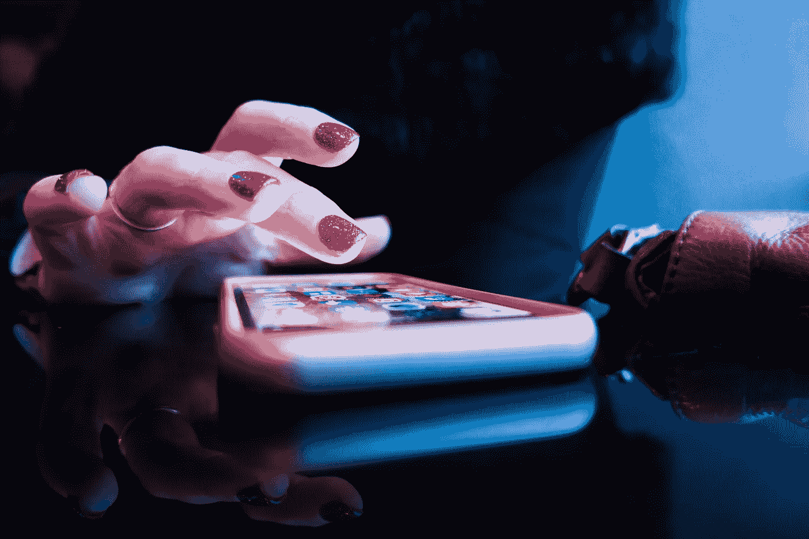

# 精神疾病和人工智能的承诺:全世界数百万人遭受痛苦，寻求救济可能在于人工智能而不是酒精

> 原文：<https://medium.datadriveninvestor.com/mental-illness-and-the-promise-of-ai-millions-worldwide-suffer-and-the-search-for-relief-may-lie-1cb5e16c68cc?source=collection_archive---------11----------------------->

Photo by [Sydney Sims](https://unsplash.com/@fairytailphotography?utm_source=unsplash&utm_medium=referral&utm_content=creditCopyText) on [Unsplash](https://unsplash.com/s/photos/mental-illness?utm_source=unsplash&utm_medium=referral&utm_content=creditCopyText)

根据 2017 年完成的一项美国国家精神卫生研究所的调查，精神疾病及其症状的恐惧，包括麻痹恐惧、偏执想法、完全的生活毁灭或破坏，是一种将占据近五分之一美国成年人的痛苦。这些数字意义重大；美国 4660 万。但是，在那次调查之后的几年里，还会有多少人加入这一行列呢？疾病(是的，有很多)的表现形式可以从轻微到中度到严重。

有些人不会有可诊断的全面疾病，但他们会遭受痛苦。许多人会试图通过内省来寻求解脱，但这可能是徒劳的，他们可能会求助于[使用酒精](https://pubs.niaaa.nih.gov/publications/arcr344/414-431.htm)或街头毒品或处方药等物质。

 [## 人工智能预测能力的神话|数据驱动的投资者

### AI(人工智能)最有前途的优势之一似乎是它预测未来的能力…

www.datadriveninvestor.com](https://www.datadriveninvestor.com/2019/03/01/the-myth-of-ais-predictive-power/) 

酒精是一种解脱

正如最近在[进行的一项关于焦虑](https://pubs.niaaa.nih.gov/publications/arcr344/414-431.htm)、*的研究中所述，研究者和临床医生对共病的焦虑障碍和酒精使用障碍(AUDs)非常感兴趣。在过去几十年中，流行病学和临床研究的累积证据强调了这种共病的频率和临床影响。对特定焦虑症和 AUDs 之间独特联系的调查表明，这种联系是多方面的和复杂的，强调了仔细诊断检查的重要性。就临床相关性而言，对焦虑和 AUDs 共病患者的治疗可能很复杂，使用的方法和干预的时机都是治疗计划和实施中的相关因素……”*

*研究人员得出结论，“进一步推进这一领域的研究和临床实践*，需要更多的进展和经验证据的扩展。”表面上，他们没有考虑到计算机技术和人工智能的进步，但这就是进步的方向，而且时机可能是正确的。时机是至关重要的，但并不总是可能的，这些障碍，尤其是常见的焦虑，挥之不去。

什么时候应该寻求帮助，应该找谁？不知道何时何地找到它，以及拒绝寻求帮助，可能在生命早期就开始了，就像我们在处于困境的大学生身上看到的那样。

Photo by [Hanif Mahmad](https://unsplash.com/@anif?utm_source=unsplash&utm_medium=referral&utm_content=creditCopyText) on [Unsplash](https://unsplash.com/s/photos/college-students?utm_source=unsplash&utm_medium=referral&utm_content=creditCopyText)

大学生面临风险

遭受轻度至重度精神疾病的折磨，无论是暂时的还是长期的，都可能阻碍事业的发展，并在需求的压力下走向何方；他们会觉得自己很失败。冲击他们自尊的感觉可能会持续一生，或者他们会以一种新的方式战斗，最终，寻求帮助来复活充实生活的承诺。

大学生和医科学生一样，容易受到焦虑和压力的影响，其程度令人担忧。[一项研究](https://www.cbsnews.com/news/1-in-5-college-students-so-stressed-they-consider-suicide/)发现，“*在这些学生中，1/4 的人说他们被诊断出或治疗过心理健康问题。此外，所有被调查的学生中有 20%想过自杀，9%试图自杀，近 20%伤害了自己。*

*“这些问题在跨性别学生中尤为突出，大约三分之二的学生说他们伤害过自己，超过三分之一的学生说他们曾试图自杀。”*

另一项研究发现了类似的令人沮丧的结果。这所大学估计有 6%的一年级学生目前有自杀意念。抑郁症状、低社会支持、情感调节障碍和父子冲突都与自杀意念独立相关。根据标准标准，只有 40%有自杀意念的人被归类为抑郁症患者。缺乏分类可能导致了不寻求帮助。

人工智能及其对救灾的贡献

寻求对每个人的帮助，无论是大学生、工人还是有疾病的人都在继续。一个新的“助手”可能就在眼前，而且是科技领域的，而不是办公室里常见的治疗师。

当谈到人工智能和他们的职业时，精神病学领域的那些人并不总是表现出热情的态度。"*尽管存在激烈而持续的辩论，但执业医师对人工智能对医疗职业的影响的看法受到的关注有限。这一点在精神卫生保健中尤为重要，因为精神卫生保健依赖于医生和高度脆弱的患者之间的长期移情关系，并且有大量的精神卫生应用可供下载*。

这项调查于 2019 年春夏完成，是对精神科医生的全球横断面研究。尽管它指出，到 2030 年，健康负担预计将耗费全球经济约 16 万亿美元，但美国的一项估计显示，77%的县没有得到精神病医生的充分服务。世界卫生组织估计，在低收入国家，它比高收入国家低 100 倍。

精神科医生对人工智能和精神疾病的总体评价是什么？完成调查的人表示:

1.*在治疗过程中缺乏同理心*

*2。因工作变动而对艾产生反感*

*3。人工智能将无法全面评估病人的精神状态*

*4。人工智能无法拥有人类对精神疾病的理解*

*5。与这些疾病相关的耻辱*

*6。机器将没有意识或不能模拟意识*

关于这项技术在精神健康和精神病学方面的潜力，其他受访者表示，它*可以在任何环境下工作，不会疲劳，也不会变得喜怒无常*。

一些人估计它犯的医疗错误更少，纳入了更标准化的协议，这将为精神病医生带来更好的生活质量，并减少因种族或性别而产生的偏见。

人工智能固有的偏见

大型数据集[中关于种族和性别的](https://www.brookings.edu/blog/techtank/2019/01/03/artificial-intelligence-and-bias-four-key-challenges/)[偏见](http://diversity.ai/)已经被许多人解决为“固化”,在最终的程序中可能看不到。他们指出，必须特别注意[数据集是如何收集的](https://medium.com/better-programming/bias-racist-robots-and-ai-the-problems-in-the-coding-that-coders-fail-to-see-305f6f324793)，并仔细检查在包括种族和性别在内的多个领域的任何潜在偏见。

事实证明，女性患抑郁症和焦虑症的几率似乎比男性高。[精神病学](https://en.wikipedia.org/wiki/Gender_bias_in_medical_diagnosis)和其他医疗领域一样，也不能免除这种偏见。这些偏见可能会扭曲数据，如果使用这些数据，人工智能使用的结果数据集是有缺陷的。

尽管存在偏见的危险，人工智能仍在稳步推进解决精神疾病以及如何改善精神疾病的新方法。精神病学家确实有一个新的工具，T1，它确实在他们的治疗计划中占有一席之地。

正如[研究人员](https://academic.oup.com/schizophreniabulletin/advance-article-abstract/doi/10.1093/schbul/sbz105/5611057)所描述的，一个尚未命名的人工智能工具已经显示出可行的属性。[工具](https://www.news-medical.net/news/20191113/Using-AI-to-improve-psychiatric-care.aspx)*表明人工智能(AI)可以帮助医生快速、准确地诊断患者的精神健康状况。为手机设计的新应用程序已经开发出来，使用从他们的讲话中提取的线索来改善病人的监测，并基于机器学习工具*。

评估需要 5 到 10 分钟的电话交谈，潜在的患者被要求讲一个小故事，听然后重复一个故事，并执行几项运动技能任务。

然后对他们的语音进行评估，并与之前的样本进行比较，以得出心理健康方面的健康指标。在路易斯安那州农村和挪威北部的两个地方，对 225 名被诊断患有精神疾病的患者或健康志愿者进行了测试。然后比较有利结果的准确性。

需要进一步测试以确保其[有效性](https://en.wikipedia.org/wiki/Validity_(statistics))。但是现在有一个可用的应用程序，它的开发者对它的使用非常有信心。

Photo by [Rob Hampson](https://unsplash.com/@robman?utm_source=unsplash&utm_medium=referral&utm_content=creditCopyText) on [Unsplash](https://unsplash.com/s/photos/apps?utm_source=unsplash&utm_medium=referral&utm_content=creditCopyText)

目前正在使用的工具

一些心理健康机构或消费者正在使用的工具是 [Woebot](https://www.woebot.io/) ，这是一款基于应用程序的情绪追踪器和聊天机器人，是人工智能和认知行为治疗(CBT)的结合。然而，对于这个应用程序的实用性和准确性，仍然有一些悲观的看法。一些精神病学家指出，在任何算法常规用于临床心理健康设置之前，可能需要 5 到 10 年的时间。他们指出的问题是数据被利用和我们已经概述的偏见。

然而，人工智能不仅限于应用程序。休斯顿[德克萨斯大学健康科学中心](https://www.utsystem.edu/institutions/university-texas-health-science-center-at-houston)的研究正在使用机器学习算法评估[功能磁共振](https://en.wikipedia.org/wiki/Functional_magnetic_resonance_imaging)成像，用于检测和治疗精神分裂症患者。该算法检查和测量大脑区域，然后以 78%的准确率识别精神分裂症患者。

根据德克萨斯研究人员的说法，他们可以以 82%的准确率预测一个人对特定抗精神病药物治疗的反应。目前，精神分裂症的药物治疗需要使用[多种](https://en.wikipedia.org/wiki/Polypharmacy)(多药疗法)药物或单剂量药物以及[清除期](https://medical-dictionary.thefreedictionary.com/washout+period)进行反复试验。

因此，治疗依赖于一个反复试验的过程，这对于患者来说是非常艰难的，并且需要数周时间而没有成功的缓解或症状的改变。人工智能程序可以通过有效的治疗药物进行一次性诊断。

迄今为止，人工智能的成功给所有从事任何形式精神保健的人以及病人带来了希望。人工智能可以提供快速、看似准确的信息，从而导致诊断成功，并以更高的准确性确定治疗方法。如果人工智能的承诺成为现实，现在医疗保健中存在的人类弱点将成为过去。

人工智能被视为具有巨大潜力的技术工具，它将促进医学发展，造福全人类。