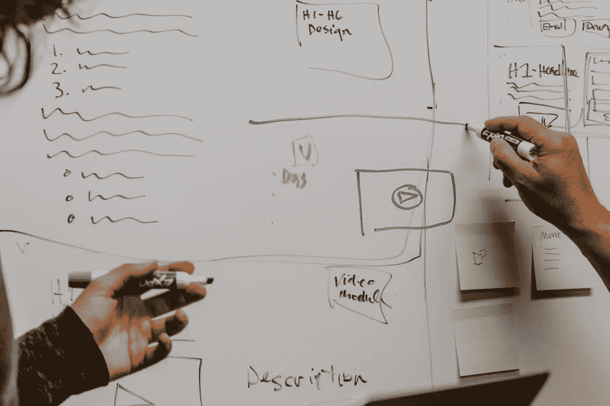
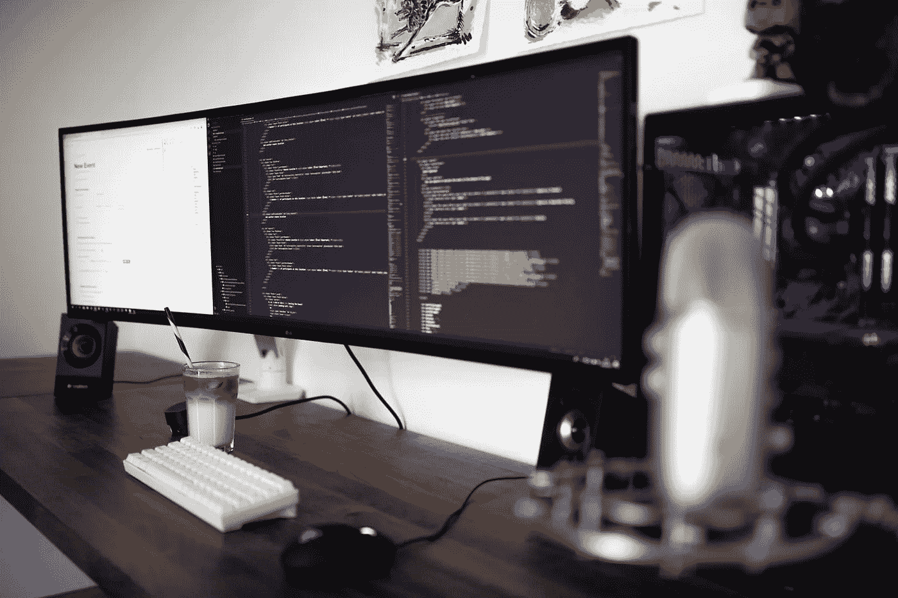

# 新加坡专业开发者讲解移动应用开发流程

> 原文：<https://medium.datadriveninvestor.com/mobile-app-development-process-explained-by-professional-developers-in-singapore-4da47d0d6c0b?source=collection_archive---------13----------------------->

游戏、电子商务应用、健康饮食和培训应用、网络和协作应用……Google Play 和苹果应用商店每天都有数千种不同的新应用。尽管应用程序的类型和特性不同，但它们都是使用大致相同的场景开发的。

来自新加坡的专业[移动应用开发者](https://swagsoft.com.sg/mobile-app-development/)在这个过程中区分了以下 6 个步骤:构思、线框图、模型和原型制作、编程、发布和发布后维护。专家对每个步骤的独特性的见解可以让你更好地理解应用程序创建生命周期的每个阶段会发生什么。

# 思维能力

每个手机应用都是从一个想法开始的。然而，首先在未来应用程序所有者脑海中闪现的想法，基于直觉和关于用户为什么会真正需要和喜欢应用程序的假设，应该经过仔细测试，并得到可靠的市场研究的支持。这就是为什么最初的想法可能与最终的应用想法非常不同，最终的应用想法为正式的应用战略奠定了基础。

 [## 2019 年移动应用开发之路|数据驱动的投资者

### 任何在移动应用程序开发行业工作的人，无论他们是专注于在伦敦开发 iOS 应用程序还是…

www.datadriveninvestor.com](https://www.datadriveninvestor.com/2019/01/15/the-path-of-mobile-app-development-in-2019/) 

虽然你应该带着一个深思熟虑的想法来到一家开发公司，并准备在第一次会议上提供所需应用程序的细节，但你可能不会花太多时间在自己的应用程序构思上。事实是，有经验的移动应用程序开发公司肯定会提供有价值的反馈和咨询，帮助你确定目标并步入正轨。

# 线框化

移动应用的线框是你想要开发的应用的清晰视觉概念。虽然许多客户将“视觉概念”理解为应用程序的设计，但线框是不同的。它不显示应用品牌、字体或图像。相反，它提供了对空间分布、屏幕之间的关系、可用功能、页面元素和预期用户动作的洞察。因此，线框类似于建筑蓝图，由移动应用程序开发人员创建，以说明应用程序的功能和流程结构。

线框图阶段不应该被跳过或低估，因为它让客户清楚地了解应用程序的外观和工作方式，并允许在更昂贵的工作开始之前对项目要求进行更改。

# 实体模型和原型制作

在线框图获得批准后，一家移动应用程序开发公司开始着手应用程序的设计和用户界面。如果你的预算很紧，公司可以创建模型来演示建议的 UI 设计。否则，你可以期待一个原型，将工作和行为几乎像一个实际的移动应用程序，并将给出最终产品的真实感觉。

建议使用应用原型来收集目标受众的反馈。不要因为苛刻的[设计反馈](https://www.toptal.com/designers/prototyping/taking-design-feedback-strategically)和对应用程序设计和线框做进一步修改的需要而气馁。毕竟，它有更多的优点。首先，在实际支付需要修改的代码之前，你可以在应用程序开发的早期阶段进行修改。第二，你不必在一个终端产品发布失败后管理品牌声誉。

# 编程；编排

在编程阶段，您需要选择开发团队是同时开发 iOS 和 Android 应用程序，还是先为其中一个平台开发应用程序。备选方案可能是使用[跨平台编程框架](https://dev.to/smartym/reviewing-the-top-4-cross-platform-development-frameworks-380g)或在网络技术的帮助下开发一个应用程序，并使用 Cordova、Ionic 或 Phone Gap 等本地包装器进一步安装。在这个阶段应该做出的另一个重要决定是决定在哪里以及如何托管应用程序的 API 和数据库。这将对移动应用程序的性能、可伸缩性和可靠性产生巨大的影响。

根据开发方法的不同，测试可能会在一般的应用程序开发过程之后进行，或者与开发过程同时进行。因此，在几次成功的迭代之后，产品就可以发布了。

# 发动

启动阶段的前提是将服务器 API 部署到生产环境中，并将应用提交到应用商店。后一个过程可能比看起来更困难和漫长。首先，开发团队确保所有的东西都为发布进行了适当的配置，填写了专用的表格，并提交了截图和描述。然后，商店审查应用程序是否符合规定，在某些情况下，要求对应用程序进行某些更改。

[移动应用开发流程的启动步骤](https://swagsoft.com.sg/app-development-process/)通常也与新应用的积极营销相关联。虽然这不是移动应用程序开发公司的直接责任，但一些公司确实利用了他们在移动应用程序方面的丰富经验，并就应用程序的营销咨询了他们的客户。

# 发布后

在大多数情况下，应用程序开发不会在应用程序发布时结束，开发团队将继续致力于进一步的迭代和改进。除此之外，开发公司应该参与产品的维护，关注应用程序崩溃，特别是修复任何错误和兼容性问题。

对于应用所有者来说，这也是关注深入的应用分析和收集积极的应用商店评级和评论的时间。这些数据可用于规划产品的新迭代和营销目的。

# 结论

没有人告诉你，移动应用开发的过程会像从 app store 下载应用那么简单。这需要做大量的工作，并需要做出战略决策。尽管如此，如果你充分利用应用程序创建过程中的每一步，你的移动应用程序一定会成功。