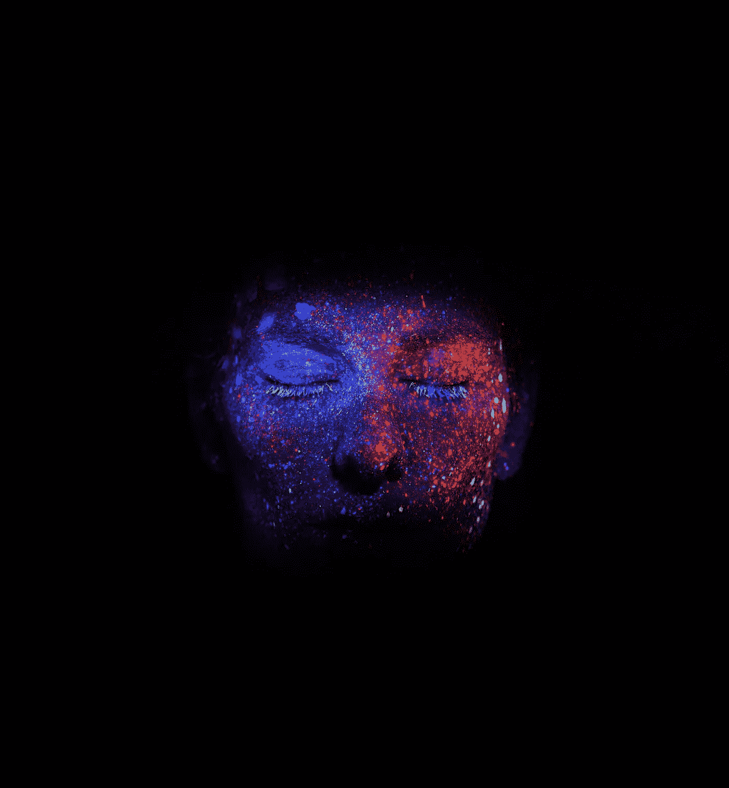

# 你心目中的莫扎特

> 原文：<https://medium.datadriveninvestor.com/mozart-in-your-mind-ais-ability-to-score-the-music-your-brain-is-creating-344a79ecb2a0?source=collection_archive---------1----------------------->

## 人工智能能够为你大脑正在创作的音乐谱曲，然后将其转化为乐谱。

Photo by [h heyerlein](https://unsplash.com/@heyerlein?utm_source=unsplash&utm_medium=referral&utm_content=creditCopyText) on [Unsplash](https://unsplash.com/search/photos/human?utm_source=unsplash&utm_medium=referral&utm_content=creditCopyText)

奥夫冈·阿马德乌斯·莫札特[在他的头脑中创作一切](https://robertgreenbergmusic.com/music-history-monday-how-did-mozart-do-it/)，或者说故事是这样的。这位音乐天才写的传记和信件肯定了他的能力，或者揭穿了他的能力。随便你挑，但我们知道的是，他说他在脑子里“听到”了所有单个乐器的部分。

当他每天散步时，他一点一点地写下整首歌曲。他没有坐在钢琴、大键琴、古钢琴、风琴、小提琴或中提琴前。是的，他都玩过。斯坦福大学表明,[散步确实能提高创造力。](https://news.stanford.edu/2014/04/24/walking-vs-sitting-042414/)

音乐可能有镇静或抚慰野蛮的心灵(或野兽)的魅力，我们知道它有促进大脑发育的能力。音乐也有助于所有领域的学习。

研究文献将任何音乐指导或能力归因于防止大脑老化，因此所有这些练习都是每个人大脑银行中的记忆。想在 90 多岁时保持头脑清醒吗？演奏一种乐器。

而且，如果你从未上过课，但希望在 AI 的帮助下创作音乐，你可以下载 [Amadeus 代码](https://amadeuscode.com/top)。好奇 AI Amadeus 能生产什么？[听一听](https://www.youtube.com/watch?v=HwhCS4-WaHE&list=PL9GCBLbVBOsMr7YVQwYNsR7lnSZwOLaFR&index=1)。如果你和人工智能在你的杰作上合作，版权可能会有点问题。

如果你出售作品或在俱乐部表演，编码者或制作公司会得到一部分版税吗？嗯，贝尔实验室从来没有给他们的员工开发者支付晶体管的费用，是吗？这都是[工作成果](https://simplicable.com/new/work-product)。托马斯·爱迪生也从未与他的 20 多名科学家分享专利，这些科学家开发了现在归于他的所有作品。

根据美国版权法 1965 年的版本中的“[计算机技术引起的问题](https://search.copyright.gov/search?query=Problems+Arising+From+Computer+Technology&utf8=%E2%9C%93&affiliate=copyright)”，该局表示“可以肯定的是，由计算机近似制作或‘书写’的作品数量以及版权局在这方面的问题将会增加。”

人工智能制作的音乐正变得难以置信地复杂，因为美国的版权法存在缺陷和漏洞。差距之一是人工智能还没有被编纂。第二个引起强烈兴趣的领域是作者身份，这里有一篇在 [The Verge](https://www.theverge.com/2019/4/17/18299563/ai-algorithm-music-law-copyright-human) 的文章中概述的创造性漏洞:

"… *最近，Endel(一款使用人工智能生成反应式、个性化“声景”的应用)背后的开发人员* [与华纳音乐](https://www.theverge.com/2019/3/27/18283084/warner-music-algorithm-signed-ambient-music-endel) *签署了一项发行协议。作为合同的一部分，为了注册版权，华纳需要知道如何对每首曲目进行授权。该公司最初被“歌曲作者”的名单难住了，因为它使用人工智能来生成所有的音频。最终，创始人 Oleg Stavitsky 告诉 The Verge，团队决定将 Endel 的所有六名员工列为所有 600 首歌曲的词曲作者。“我有作曲学分，”斯塔维茨基说，“尽管我不知道如何写一首歌。”*

合同签订后又出现了另一个问题。版权局希望任何人都能证明作者身份。不会作曲的人可能会有一点问题。

## AI 来救援了？

那么由人工智能编程和你的大脑以某种方式*煽动*或*促使*的音乐呢？AI 能帮你写歌吗？如果你已经在写歌了，有必要有一个 AI 植入物来做一个词曲作者或者更有创造力的人吗？

你根本不需要植入大脑就能作曲。奥地利的一个小组使用了一种[脑机接口](http://www.moregrasp.eu/technologies/Brain-Computer-Interfaces) (BCI)，使他们能够记录脑电波，并将其输入一台经过人工智能训练的计算机，该计算机拥有独特而强大的开源音乐创作软件( [MuseScore](https://musescore.com/sheetmusic) 1.3)。旋律被转换成最后的音乐。

这个小组的研究人员最初的目的不是制作音乐，但它似乎已经产生了一个原创的音乐研究。他们正在寻找方法来帮助脊髓损伤的残疾人学会用他们的思维控制环境控制器、网络浏览器或绘画。

正如其网站上所述， [The More Grasp 项目](http://www.moregrasp.eu/)的任务是:“… *开发一种非侵入性、* *多适应、多模态用户界面，包括一个脑机接口(BCI)，用于半自动运动的直观控制和感官 Grasp 神经假体，支持脊髓高度损伤的个人的日常活动*”

一旦人工智能程序和计算机记录了个人的脑电图(EEG)脑电波模式，它就会产生音乐。最初的研究有 17 名参与者，他们都接受过某种乐器的演奏训练，还有一名专业作曲家。

结果表明，在不同水平的临摹作曲中接受过音乐训练的个人有很高程度的音乐写作准确性。这位职业作曲家在他们采取的所有措施上几乎都得了满分。

这些参与者后来的评估表明，他们对该应用程序非常满意。最终结果？“思考”音乐作品以乐谱的形式出现，并且可以演奏。

More Grasp 项目并不是唯一一个试图通过思想控制计算机的项目。另一项成果是[脑听器](http://www.deuelingthumbs.com/brain-music-instrument/)，它被证明是一种可以由大脑独自演奏的乐器。

由瑞典医学中心和华盛顿大学的一名神经学家创建，用于运动障碍患者的康复，类似于其他项目。可能接受该设备帮助的残疾人还患有脊髓损伤、截肢或肌萎缩性侧索硬化症，也称为娄格赫里希氏病(ALS)。

神经科医生托马斯·迪尔医生也是一名音乐家，他的病人在中风或其他运动障碍之前演奏音乐。这些病人再也不能运用这种技能或唱歌了。他的设备还收集脑电波，并将其转换成音符。将该单元与合成器耦合，使个人能够使用各种各样的音乐声音。这个设备正在申请专利。它是如何工作的？

该装置的两种控制方式都使用大脑信号输入。一组大脑信号来自视觉皮层；这个人闭上眼睛。第二组让受试者思考运动。人们认为思考运动可能是最有帮助的。

也许我们所有人本质上都是音乐家，或者如果我们有工具来实现这种技能发展，我们会更有音乐性。想象有一天你可能会创作出莫扎特式的协奏曲。或者，像保罗·麦卡特尼那样，写一部芭蕾舞剧或歌剧。

https://drpatfarrell.medium.com/membership