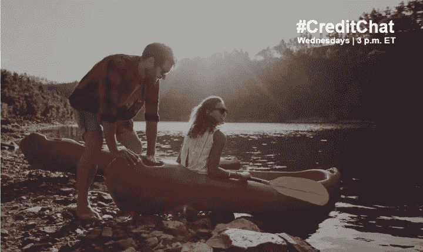

# 现在是开始投资的最佳时机

> 原文：<https://medium.datadriveninvestor.com/no-time-like-the-present-to-start-investing-9a779f728bc8?source=collection_archive---------3----------------------->

谈到投资，未来就是现在。一旦投入使用，你的钱就会增值——但你必须开始。

全球信息服务公司 [Experian](http://www.experian.com/blogs/news/) 表示:“打造你的金融未来有许多选择，投资无疑是其中之一。”。"知道如何投资可能是有益于你未来的一个关键途径."

[演讲家、教育家、](https://twitter.com/HipHopStockDoc/)[黑市交易](https://twitter.com/BMEX_/)创始人 Eric Patrick 博士、[金融信贷](http://financiallituation.bigcartel.com/)创始人 [Anthony Copeman](https://twitter.com/AnthonyCopeman/) 讲述了投资的理由和收益。

投资——系统地进行——为你的财务未来增加储蓄。越早开始，退休保障的长期回报就越大。

“你通常想用你的钱做两件事:不失去你已经拥有的，在你已经拥有的基础上赚更多，”帕特里克说。“实现这两个目标的最佳方式之一就是投资。

“没有投资，你的钱增值的机会就会大大减少，”他说。“此外，通货膨胀会侵蚀你已经拥有的钱，随着时间的推移，你实际上会赔钱。”

# **为什么启动**

对于那些想知道为什么应该投资的人，帕特里克在博客中讲述了他为什么要开始投资。

“投资应该包括在你的整体财务策略中，”科曼说。“这直接关系到你的财务成功。当你投资时，你是在通过让你的钱为你服务来保障你的未来。”

帕特里克和科普兰讨论了投资的良好起点，认为现在是最佳时机。你等待的时间越长，你和你的钱需要付出的努力就越多，才能产生好的回报。

“一个好的起点是在你的应急基金中至少有 1000 美元之后，”帕特里克说。“许多人会说，等到你有了至少三至六个月的收入，并且没有债务的时候，但对许多人来说，这是一颗难以下咽的药丸。

“我相信你可以同时储蓄、偿还债务和投资，但至少有 1000 美元作为应急基金是一个好的起点，”他说。“还有一点要说的是，在你的银行账户里有一个逗号，可以激励你开始对你的钱采取更多行动。”

帕特里克还为那些想存下第一个 1000 美元的人提供了一些建议。

“考虑投资时，一个很好的起点是通过雇主赞助的退休账户——无论是 401K、403b、储蓄账户还是 457，”Copeland 说。"如果你还没有开始，请联系你的人力资源部获取信息."

# **去免税**

他还强调了免税退休基金的储蓄。

科普兰说:“我建议向罗斯个人退休帐户捐款，尤其是对那些希望未来收入更高的千禧一代而言。”“最高是 5500 美元。如果年龄超过 50 岁，是 6500 美元。你现在付税；你的钱免税增长；未来提款将是免税的。”

接下来是其他投资。

“在你开始为自己的退休账户缴款后，我建议你投资个股，”Copeland 说。“然而，你应该在投资股票之前还清你的高息消费债务。”

没有一个正确的投资策略。因为没有人能保证未来，所以你的策略是你认为最符合你的需求和预算的。

“首先，决定你的目标是什么，以及适用于每个目标的时间范围，”帕特里克说。“一旦你知道自己想要实现什么，以及还有多长时间才能实现，你就可以开始寻找投资机会了。找一个最符合你目标的。

“注意，根据你设定的目标和时间范围，你可以参与不同的投资策略，”他说。

# **考虑一下这个**

Copeland 列举了其他因素。

“投资者应该考虑他们的年龄、风险承受能力和现金流目标，”他说。“你应该问自己:我能承受得起股市崩盘吗？我是冒险还是厌恶风险？我退休后的现金流目标是什么？”

投资的时候，总是有风险的。由于市场波动，投资有风险。由于通货膨胀，不投资是有风险的。你的风险与你长期投资的舒适度有关。

“风险本质上是实现预期结果的可能性，”帕特里克说。“通常，回报越高，随之而来的风险就越大。

“一个很好的主意是完成一份风险简介问卷，”他说。“然后你会明白自己的立场，并根据自己愿意承受的风险做出决定。”

他补充说, [Vanguard](https://investor.vanguard.com/corporate-portal/) 有一份免费的[风险分析问卷](https://personal.vanguard.com/us/FundsInvQuestionnaire)。

“风险与你的回报直接相关——或者说缺乏回报，”Copeland 说。“在你承担任何风险之前，你必须教育自己。当你投资于股票市场时，会有很大的波动性——大起大落。不要害怕研究和提问。”

# **小也可以**

最低投资额是你能够承担的投资额。你通常可以开始投资，每月至少 100 美元，有时更少。

“我相信任何数额都是值得的，因为从历史上看，增长是在你这边的，”帕特里克说。

“起价 1000 美元是最佳选择，但许多平台，如 [Stash](https://www.stashinvest.com/) 和[stock](https://gifts.stockpile.com/)会让你起价低至 5 美元和 20 美元，”他说。“它们甚至允许你在买不起整股股票的情况下，购买部分或零头股票。”

他说，Freeman Capital“是另一个好地方”，让投资者从 1000 美元开始，同时将投资组合从典型的股票、共同基金和交易所交易基金多样化。

“投资金额取决于投资者和他们的目标，”科普兰说。“你应该考虑将收入的一定比例与你的财务目标挂钩。你可以将收入的 15%、25%或 50%用于投资。然而，目标应该始终是尽可能地增加贡献。”

# **不同的策略**

总体投资不同于你的退休策略。严格来说，不要投资超过你能承受的损失。对于退休，寻求投资——比如指数基金——这将在市场下跌时保护你的原则。

帕特里克说:“主要的区别在于，你的投资策略主要侧重于保住你现有的钱，并赚更多的钱。”“你的退休策略将包括这些目标，外加储蓄、偿还债务、购买人寿保险以及为你的继承人设立遗嘱和信托等。”

科普兰说，人们需要牢记自己的目标。

“你的投资策略应该不同于基于目的的退休策略，”他说。“你不应该简单地为退休投资。你应该投资为自己、后代和社区创造遗产。为它投资，像它一样投资。”

# **何时复习**

至少每年检查一次你的投资——如果不是更频繁的话。这将有助于你考虑诸如结婚、离婚、出生、死亡、教育等生活事件。投资检查还包括对受益人的审查。这些可能会改变。

“至少，你应该每三到六个月检查一次投资，”帕特里克说。“像做生意一样对待投资。大多数企业都有季度报告，所以你的投资策略应该没有什么不同。

"比这更频繁地检查没有坏处，但是除非你在某种程度上交易，否则没有必要每天和每周检查，"他说。

科普兰也赞成经常审查。

“你应该考虑每月检查一次你的投资，特别是因为你应该每月更新你的财务净值，”他说。"检查你的投资和改变你的长期投资策略是两回事."

人们活在当下时会犯投资错误——在市场下跌时抽回资金，在低点时不敢投资。无论如何，坚持每月定期捐款。

“一些常见的错误包括没有分散资金以降低风险，没有向金融专业人士寻求教育或专业知识，当然，根本没有投资，”帕特里克说。“如果你想赢，你就必须参与进来。

“人们也容易混淆投资和交易，但我在我的一篇文章中陈述了三个关键区别，这将澄清事实，”他说。

# **做研究**

在投资之前，你也应该知道你要投资什么。

“研究你投资的平台和你投资的基金或个股，”Copeland 说。“远离高收费。[沃伦巴菲特](https://twitter.com/WarrenBuffett/)说得好:规则№1:永远不要亏钱。规则 2:永远不要忘记规则 1。

学习投资的好资源包括面对面的财务顾问。一起，你可以和他们一起回顾你的财务状况。他们可以提供比没有人情味的机器人更好的洞察力，这些机器人也不会鼓励你坚持你的财务计划。

帕特里克说，有抱负的投资者可以在他的网站和社交媒体渠道上找到一些文章、视频等。他还建议 [Investopedia](https://twitter.com/Investopedia/) 以及股票和期权交易员 [Tela Holcomb](https://twitter.com/telaholcomb/) 。帕特里克支持 11 本书和播客成为更好的投资者。

除了前面提到的资源，科普兰还推荐了《金钱上的女孩》。

# **如果不是现在…**

既然已经想过投资，那就去做吧。拖延是另一个代价高昂的投资风险。

“我建议确保你的应急基金至少有 1000 美元，”帕特里克说。“制定一个计划，持续增加投资策略中的资金，即使只是你的 401(k)或类似的由你的工作赞助的计划。

“先投资指数基金或交易所交易基金，直到你对购买个股感到满意，”他说。

科普兰说，现在是开始投资的时候了。

“开始投资永远不会太早或太晚，”他说。“从小做起，自我教育，做一个财富的建设者。”

**关于作者**

吉姆·卡扎曼是拉戈金融服务公司的经理，曾在空军和联邦政府的公共事务部门工作。你可以在[推特](https://twitter.com/JKatzaman)、[脸书](https://www.facebook.com/jim.katzaman)和 [LinkedIn](https://www.linkedin.com/in/jim-katzaman-33641b21/) 上和他联系。