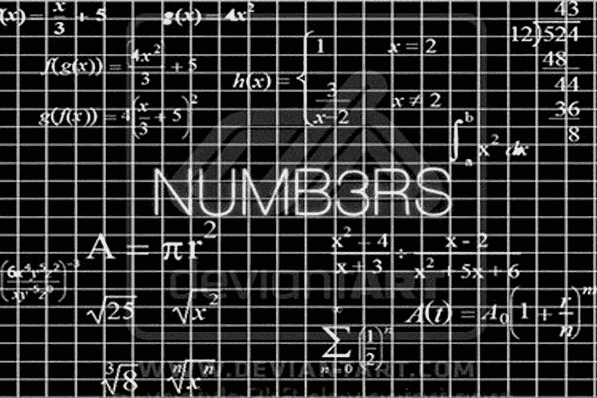

# 数字 3RS:提高数据科学的 10 个教训

> 原文：<https://medium.datadriveninvestor.com/numb3rs-10-lessons-for-a-better-data-science-e3a3a516c304?source=collection_archive---------10----------------------->

本文的目标是在业务环境中确定数据科学的重要特征，也称为商业智能(BI)。这两个术语将互换使用。

你可能对 2005 年至 2010 年在美国播出的电视节目 NUMB3RS 很熟悉。对于那些不是的人来说，这里有一个基本的想法:一个来自虚构的 CalSci 的年轻天才数学家帮助他的哥哥，一个 FBI 探员，解决犯罪。这个节目非常有趣，即使对于没有数学倾向的观众来说也是如此，并且涵盖了广泛的算法和数学理论。它还采用了我最喜欢的两项技术:Mathematica(有经验的观察者会认出一些调色板)和苹果 MacBook Pros。Wolfram Research“与 CBS 合作推广数学意识”，如本网站上[所述。在那里，你还会发现不同剧集中一些有趣的数学细节。](http://numb3rs.wolfram.com/)

查理对数据、数学和计算机的使用让人想起了数据科学。如果该节目最近播出，查理可能会成为一名数据科学家。虽然技术是展览的一个重要方面，但它并不是最重要的。人们可以感觉到它的存在，但几乎看不到它:任何好的技术都应该是强大和无缝的。这就引出了我们从数字 3RS 中学到的第一课。

**第一课:数据科学不仅仅是技术**

正如节目中所说，没有技术，你甚至不能解决一些最简单的问题。这是一个不可思议的工具，但它不是故事的中心。大多数公司在他们的 IT 部门内部雇佣数据科学家，这导致雇佣的大多是具有一些建模技能的开发人员。据 Gartner 称，大约 80%的商业智能实施失败。通过将我们的重点重新放在手头的问题以及如何建模上，我们可能会更容易找到数据科学家，并使这些项目更加成功。

**第二课:数据科学是关于解决问题的**

在第一集中，查理主动提出帮助抓住一个连环杀手，利用地理侧写来确定杀手家最可能的位置。他的兄弟从未想过数学能对他的工作有任何帮助。同样，企业通常无法想象使用数据科学可以解决哪些问题。这只能通过与建模者的合作来实现，建模者帮助企业识别和澄清要解决的问题。

**第 3 课:数据科学必须使用专业知识**

一旦一个问题被清楚地定义，它必须在一个相关的数学框架内被建模。Charlie 总是向他的兄弟和他的团队提出正确的问题，经常强调，有时质疑他们专业知识背后的一些假设。有时，他们的互动足以帮助 FBI 将案件推向另一个方向，而无需诉诸模型。通常，这有助于他确定将使用的算法和需要的数据。这些知识对于指导搜索是必要的。在大数据集上盲目应用数据挖掘在大多数情况下注定会失败，但你可能仍然很幸运:即使是一只瞎松鼠偶尔也会发现一个坚果。

**第 4 课:数据科学必须用简单的术语来解释**

重点放在查理如何解释他将使用的模型，每次都求助于与日常生活情况的类比。他确保他的联邦调查局同事理解他将要使用的方法背后的思想。对他的结果的交流也给予了同样的关注。这里的信息是，你需要调整你的沟通，以适应你的观众。也许显而易见，但永远值得铭记。

**第 5 课:数据科学不仅仅是实验室实验**

查理的物理学家朋友拉里经常催促他离开办公室去实地收集数据。如果你没有直接接触到一个现象，你怎么能对它建模呢？拉里喜欢提出的另一个论点是，充分考虑人的因素通常很困难，甚至是不可能的。这不仅会影响建模过程，还会影响结果的解释。

**第六课:数据科学不仅仅是 R & D**

一旦有了结果，查理的工作还没有结束。他帮助确定最佳行动方案，监督实施，并可能根据联邦调查局行动的结果修正他的模型或获得新的数据。同样，数据科学家需要参与到他们的研究建议的行动的实施和监控中。在某种程度上，他们需要对自己负责。

**第 7 课:数据科学是关于应用科学方法的**

科学方法依赖于两大支柱:理论和数据。你可以从一个理论开始，然后在数据上验证它，或者可以挖掘你的数据，提出一个理论来解释你观察到的模式。无论如何，你两者都需要。你可以对你的数据单独使用数据挖掘，而不试图解释你的结果，这种想法是非常危险的。这也是你不应该成为盲松鼠的另一个原因。这是 NUMB3RS 中的一个常量:理论和数据是必需的，并且需要彼此一致。

**第 8 课:数据科学关乎团队合作**

团队合作在两个层面上是这场表演中不可或缺的一部分。第一层是查理和联邦调查局之间。团队动力是产生好结果的关键。第二层是查理、拉里和前岛亚美(查理以前的学生，后来成为教授和女朋友)。定期从他们那里获得不同的观点有助于查理改变他解决特定问题的方法。我们在商业智能中发现了完全相同的动态，在数据科学家和业务之间，以及在数据科学团队内部。团队，而不是明星数据科学家，正在产生更好的结果。建立团队也将有助于缓解数据科学中的资源短缺。

**第 9 课:数据科学关乎信任**

在前几集，查理必须说服联邦调查局，他可以增加价值。他必须建立信任。随着节目的进展，他经常获得的近乎神奇的结果让联邦调查局特工相信了他的方法的稳健性和益处。这种信任是大多数人际关系所必需的，是任何商业智能项目的基石。在着手更复杂、风险更大的项目之前，从更小、更简单的问题开始是构建它的好方法。

**第 10 课:数据科学有助于培养基于分析的文化**

通过与查理密切合作，联邦调查局特工对他使用的概念越来越熟悉。他们经常带着新问题来找他，提到他在以前的案例中所做的事情，并问他是否可以应用相同的方法来帮助解决这个新问题。建立基于分析的文化也是商业智能的一个非常重要的方面。一旦建立了信任，对你的方法有了清晰的解释，你的内部客户就会要求更多。

NUMB3RS 很好地说明了数据科学应该是什么样子。看这个节目可能会给你一些额外的想法，但无论如何，你应该会很开心。如果你对它背后的数学感兴趣，你也可以看看[这个网站](http://www.math.cornell.edu/~numb3rs)。

*夏羽是 Prometheus Ax 的创始人&首席执行官，该公司帮助首席执行官优化数据科学项目的成功率和投资回报率。*

*本文原载* [*此处*](http://www.prometheus-ax.io/index.php/2014/04/03/numb3rs-10-lessons-for-a-better-bi/) *。*