# 假人的 NumPy

> 原文：<https://medium.datadriveninvestor.com/numpy-for-dummies-3dbd5f946731?source=collection_archive---------8----------------------->

在 Python 中，我们有“列表”。

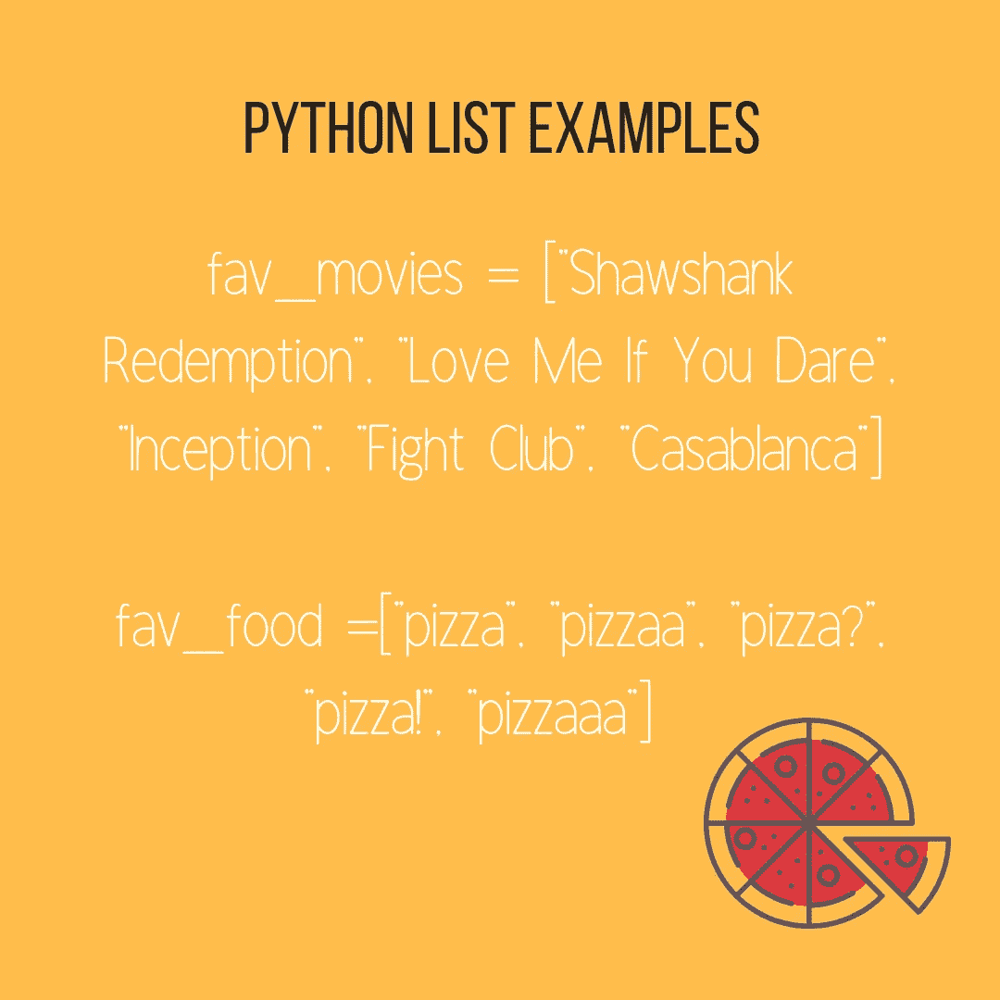

in case you need a reminder

NumPy 数组就像“列表”——但更好，因为它(1)更快，(2)更方便，(3)占用更少的内存。它是 Python 中科学计算的核心库 ( [Edureka](https://www.youtube.com/watch?v=8JfDAm9y_7s) )。

> NumPy 的主要对象是同构多维数组。它是一个元素表(通常是数字)，所有的元素都是相同的类型，由一组正整数(【SciPy.org】)索引。

在本文中，我们将介绍 10 种常见的操作，但首先要介绍 NumPy:

1.  **。array()**

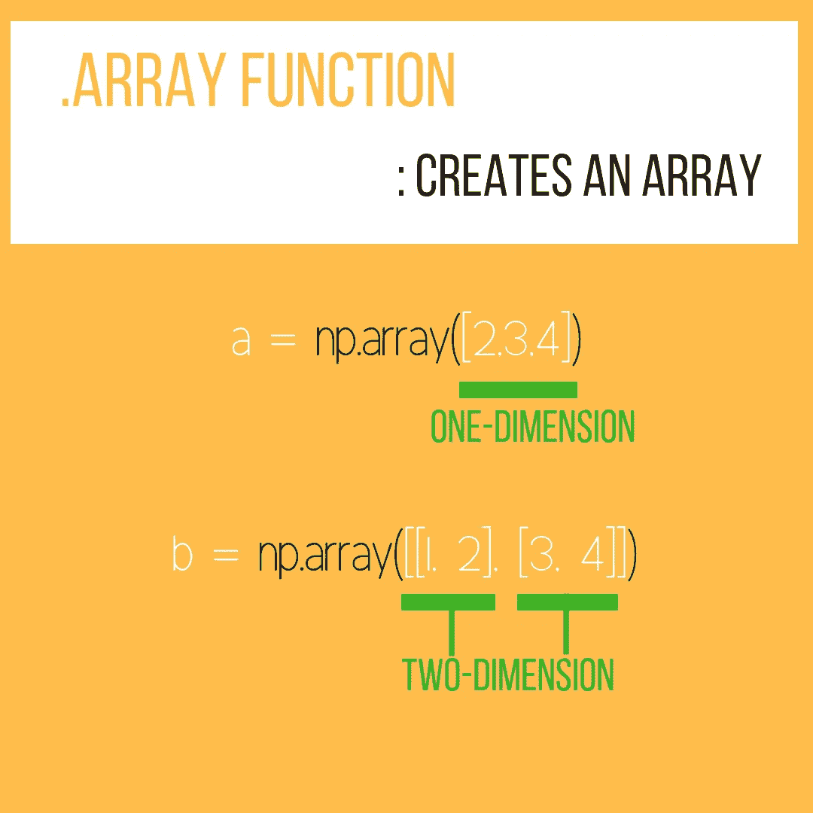

创建数组有不同的方法，但这是最简单的方法。您可以创建一个或多个维度数组。

**2。。arange()**

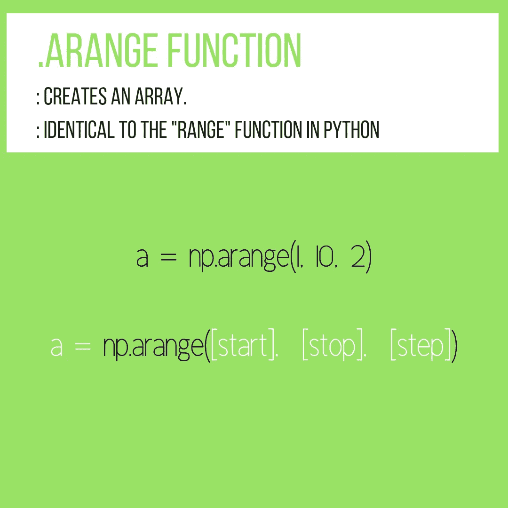

**3。。linspace()**

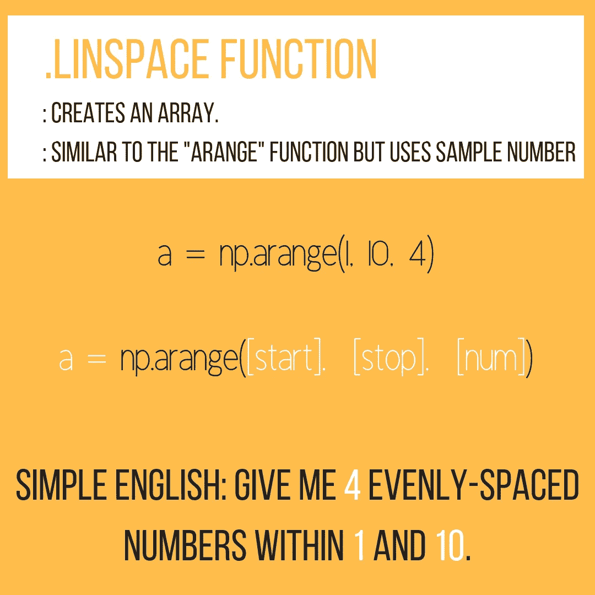

**4。。reshape()**

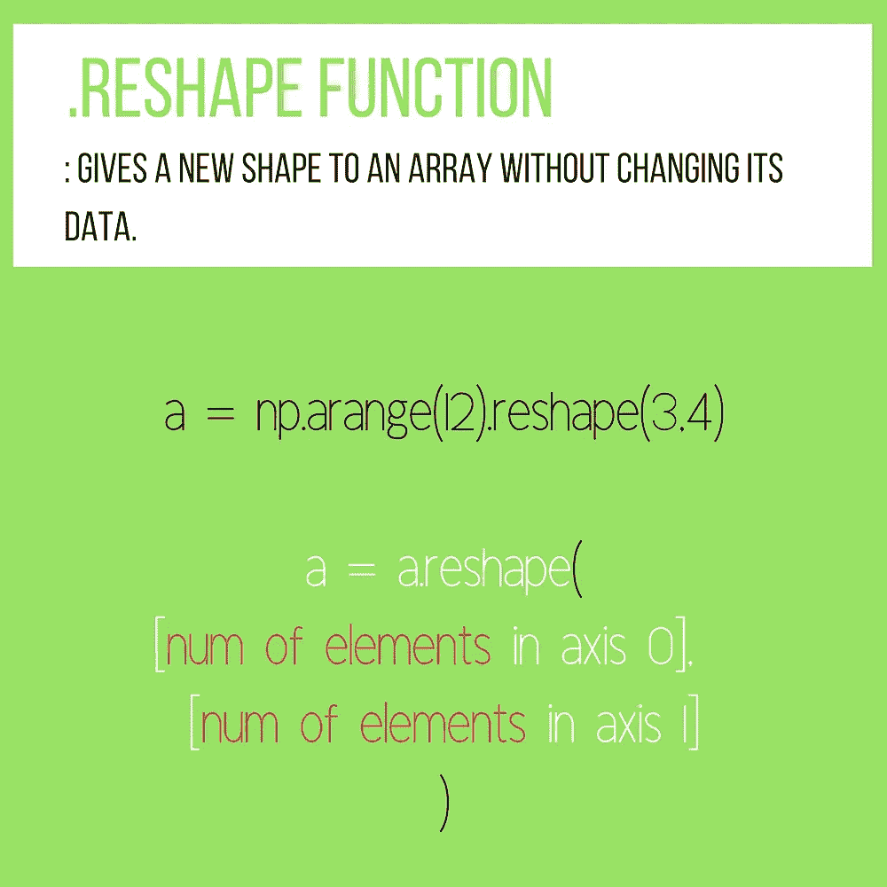

你可以看到，在这个例子中，0 轴上有**三个**元素(从 0，4，8 开始)，1 轴上有**四个**元素(从 0，1，2，3 开始)。

**5。。总和(轴=1)**

在前面的例子中，“hey”在轴 0 中有 3 个元素，在轴 1 中有 4 个元素。看看每个轴的和是怎么算出来的。

对于轴 0，第一个元素是 12，因为 0 + 4 + 8 = 12。

对于轴 1，第一个元素是 6，因为 0 + 1 + 2 + 3 = 6。

重复剩下的部分。

6。。var()

7。。std()

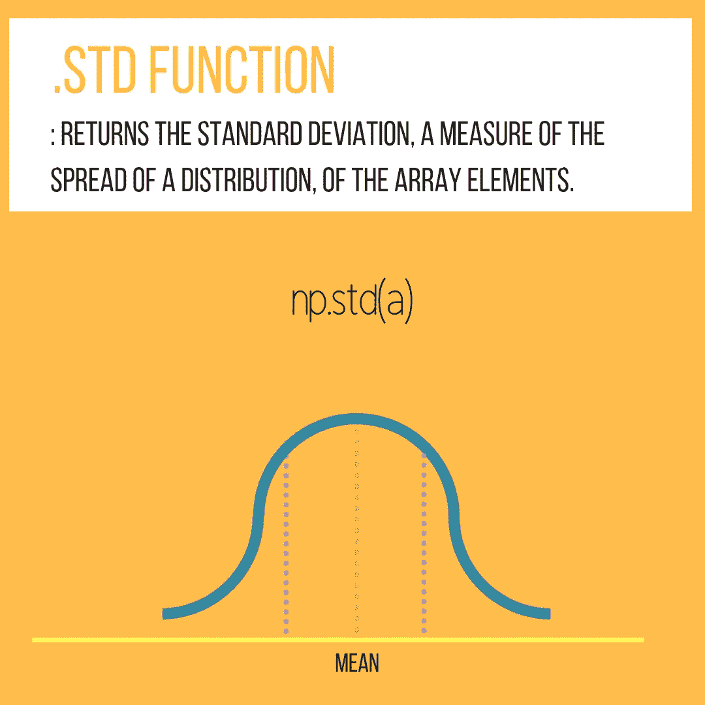

8。. random.shuffle()

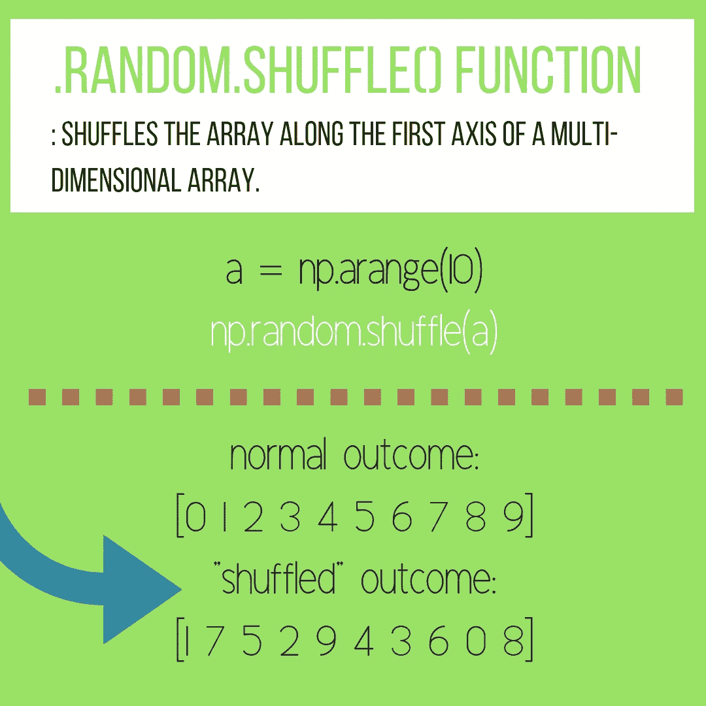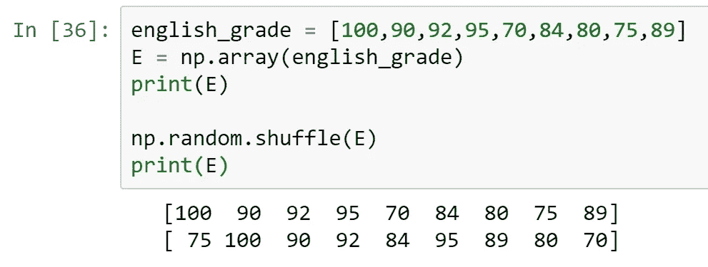

比较第一个数组和被打乱后的 E。

9。slice()

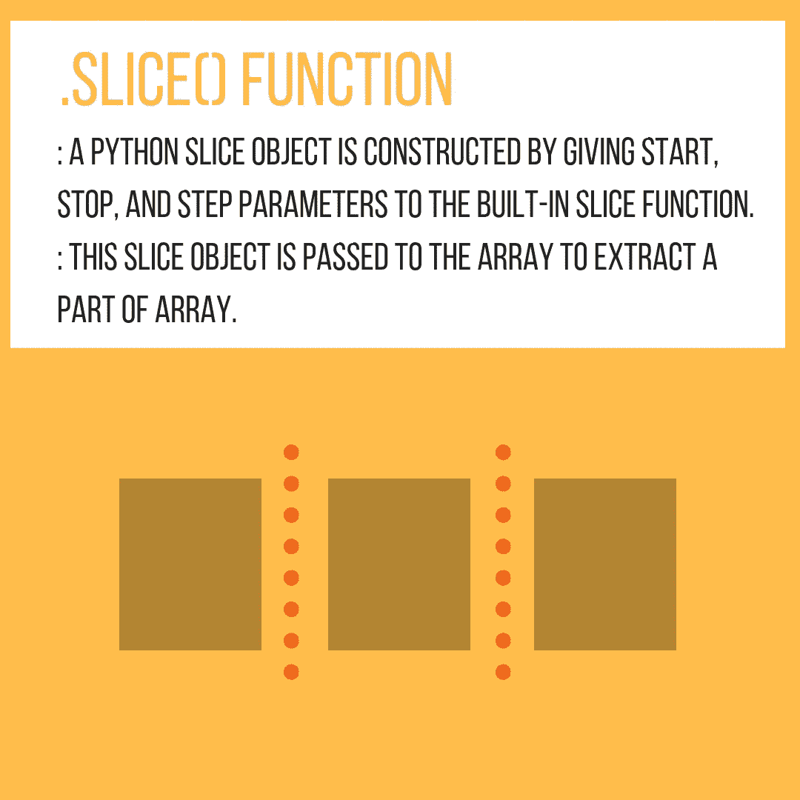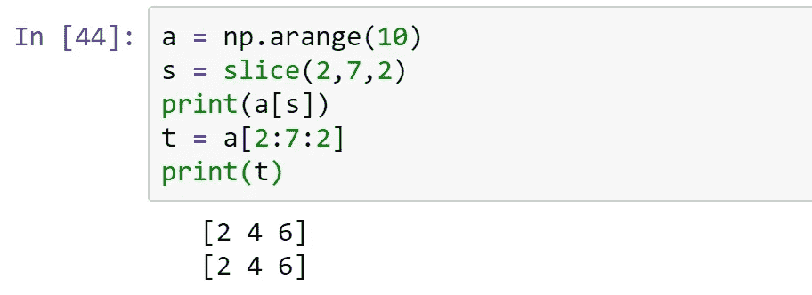

您可以使用 slice 函数或直接应用 slice 语法。

10。。拉威尔()

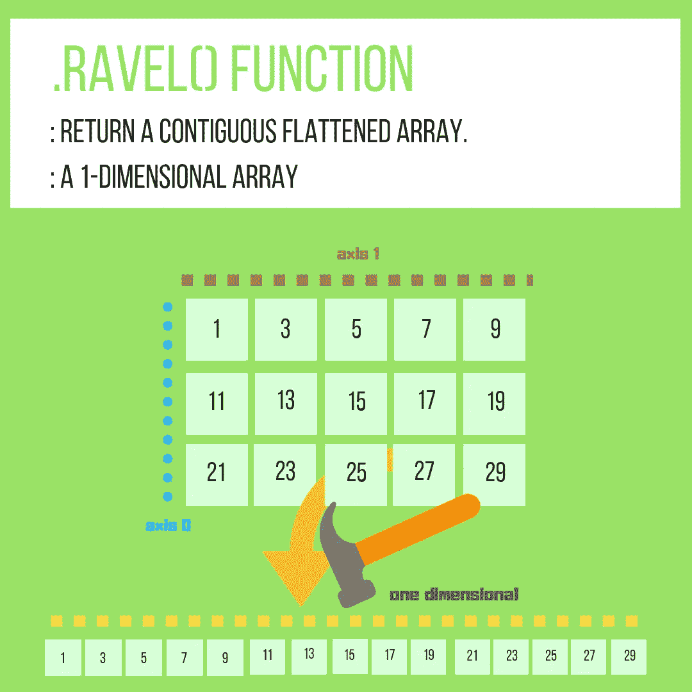

在上面的示例中，您可以看到阵列完全变平。

还有更多函数和 NumPy 教程，但希望这些帮助你入门！

**资源:**

[视频] [Python NumPy 教程| Edureka](https://www.youtube.com/watch?v=8JfDAm9y_7s)

【视频】 [Python: NumPy |数值型 Python 数组教程](https://www.youtube.com/watch?v=8Mpc9ukltVA)

【文章】[索引(SciPy.org)](https://docs.scipy.org/doc/numpy-1.13.0/reference/arrays.indexing.html)