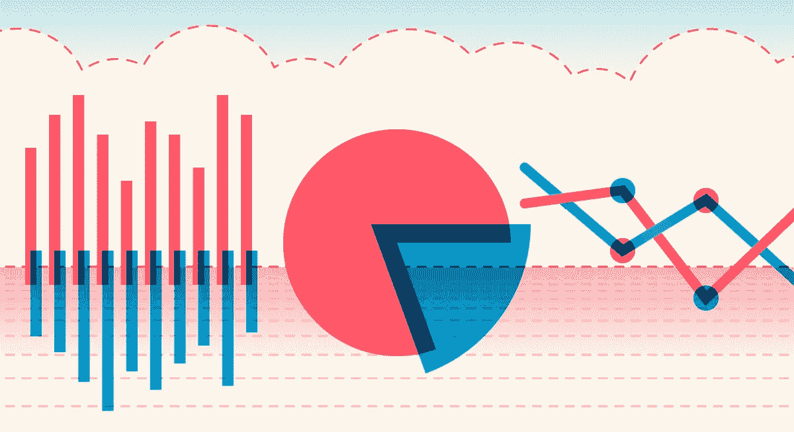

# 论数据可视化

> 原文：<https://medium.datadriveninvestor.com/on-data-visualization-bcc39f9dd113?source=collection_archive---------19----------------------->

Source: [https://lab.getapp.com/data-visualization-tips/](https://lab.getapp.com/data-visualization-tips/)

最基本的核心是，数据科学工作流程如下:

1.  定义问题。
2.  收集数据。
3.  探索数据。
4.  对数据建模。
5.  评估模型。
6.  回答问题。

对于一个更复杂的模型，这里有一个更详细的流程图，进一步将流程分解为更小的部分，包括像功能工程和交叉验证这样的步骤。

Source: [https://docs.microsoft.com/en-us/azure/machine-learning/team-data-science-process/overview](https://docs.microsoft.com/en-us/azure/machine-learning/team-data-science-process/overview)

虽然这些模型为数据科学家提供了宝贵的指导，但我发现没有一个模型真正强调数据可视化的重要性。

# “那又怎样，谁在乎呢？”

你的利益相关者。

你可以拥有世界上最好的模型，但是如果你不能向你的观众传达你的发现和模型是多么的惊人，那么所有的工作都没有意义。

 [## 数据科学和软件工程哪个更有前途？数据驱动的投资者

### 大约一个月前，当我坐在咖啡馆里为一个客户开发网站时，我发现了这个女人…

www.datadriveninvestor.com](https://www.datadriveninvestor.com/2019/01/23/which-is-more-promising-data-science-or-software-engineering/) 

好吧，这是一种夸张——这项工作当然仍然是非常宝贵的，但这是为了强调数据可视化是多么重要，以及如何更加重视可视化作为数据科学过程的最后一步。

# 探索性的，解释性的

我没有数据科学或编码方面的经验，所以在遵循数据科学工作流程时，我主要侧重于理解概念。我花了最少的时间让我的视觉效果更漂亮，因为我被其他部分分散了注意力。在意识到这一点并阅读了更多相关内容后，我了解到数据可视化可以分为两种不同的类型。

## 探索性分析

也称为 EDA(探索性数据分析)。这是在我们清理数据后第一次寻找洞察时完成的。在这里，我们探索数据，并寻找有望为数据科学问题提供见解的关系-从字面上看，您正在探索。正因为如此，可视化不需要完美。它们只是给你看的，只要视觉对你有帮助，它们可以是你喜欢的凹凸不平的。你只是在寻找模式。

## 解释性分析

这是数据科学过程中讲述故事的部分！在这里，你的观众是你的利益相关者，你向他人展示你的成果。因为大多数观众都不是技术人员，所以让你的视觉效果具有美感是至关重要的。它们需要简洁，突出你的发现的洞察力。很多时候这些视觉效果可以在 EDA 过程中找到(牛逼)。但是，作为一名演示者，我们需要记住我们试图回答的是什么问题，并使用您在这一步中创建的视觉效果来回答问题，而不是分享所有这些信息。

# 数据可视化工具

有许多数据可视化工具可供使用！要了解更多信息，请查看这篇文章，其中讨论了“[2019 年](https://towardsdatascience.com/9-data-visualization-tools-that-you-cannot-miss-in-2019-3ff23222a927)你不能错过的 9 种数据可视化工具。”在目前可用的工具中，我个人最喜欢的是 Tableau。快速介绍，看看杰夫·黑尔的精彩介绍:“[六分钟](https://towardsdatascience.com/tableau-basics-in-six-minutes-35b50ec9ae9b)画面基础。”