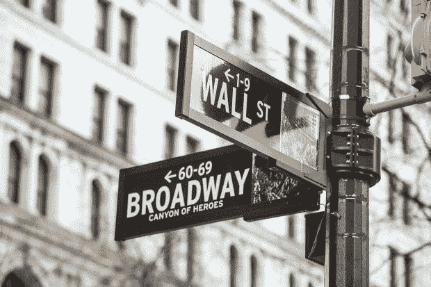

# 被动投资的危险

> 原文：<https://medium.datadriveninvestor.com/on-the-perils-of-passive-investments-ba8118f6c19c?source=collection_archive---------3----------------------->

大规模杀伤性武器。

“但是大规模杀伤性武器和被动投资有什么关系？”你可能会问。这正是今年早些时候一些基金经理对最常见的被动投资工具——交易所交易基金(ETF)的描述。

据管理着 8 亿美元基金 FPA Capital 的 [Arik Ahitov 和 Dennis Bryan](https://www.bloomberg.com/news/articles/2017-04-27/etfs-are-weapons-of-mass-destruction-fpa-capital-managers-say) 所说，*“ETF 是大规模杀伤性武器”*扭曲了股价。越来越多的证据表明他们有道理。被动投资的增长越来越被认为——也越来越被嘲笑——是过度的，尤其是被主动型基金经理认为这导致了金融市场资产定价和有效配置资本能力的崩溃。但是为什么会这样呢？

**主动投资与被动投资**

那些支持积极管理的人，如 Ahitov 先生和 Bryan 先生，赞同对每种证券的基本原理进行评估，以确定其未来可能的表现。例如，投资 100 美元在一个增长型共同基金中，会诱使主动型基金经理投资那些她认为会带来最佳回报的公司。这是通过在进行投资决策之前审查每只股票背后的各种基本参数来进行的，如公司的价格/收益和价格/账面价值比率；以及评估未来利率预期应如何整合到收益增长的整体计算中，并研究公司管理层的业绩历史。

相反，被动投资的支持者很大程度上忽略了这些基本信息。相反，基金的投资组合通常由证券组成，这些证券提供了指数的比例代表。因此，基金的表现将反映更广泛基准的表现。例如，在追踪标准普尔 500 的 ETF 中投资 100 美元意味着根据指数的加权构成来分配资金——如果苹果构成 2.5%，那么将有 2.50 美元投资于苹果。

毫无疑问，被动投资，尤其是通过 ETF 和指数化共同基金进行的被动投资，近年来出现了爆炸式增长；此外，这种飙升同时也是以投资者对主动管理型基金的兴趣减弱为代价的。

例如，在 2014 年和 Q1 2017 年之间，[投资公司研究所](https://www.ici.org/)记录了美国活跃交易共同基金中 7.73 亿美元的资产净撤出，而在同一时期，投资者增加了对指数基金和 ETF 的参与，增加了 5.96 亿美元。根据一些估计，2017 年被动产品吸引的金额最终可能是两年前的两倍，突显出它们的增长有多惊人。

这种与指数挂钩的产品越来越受欢迎，主要是因为它们简单、低成本和方便，这表明它们吸引了更多不太老练的投资者。在指数基金兴起之前，精通基本面分析的经验丰富的交易员和基金经理可以更容易地通过与这类投资者进行个人股票交易来创造利润——这是他们曾经拥有的竞争优势的很大一部分——不知情的群体现在可以简单地选择将他们的钱投入 ETF。尽管这样做，他们正在市场上制造扭曲，公司股票价格越来越不能代表他们自己的基本表现。

**市场的*僵尸化***

投资股票指数而非个股的一个主要问题是，它不会给这些股票带来明显的“价格发现”。被动型基金忽略与个股相关的信息。鉴于他们必须按照他们跟踪的指数比例购买股票，他们很少考虑基本面，并采取从众心理，以牺牲个人选股为代价。因此，当市场经历更大比例的被动投资时，个股的走势会更符合其基准。用 Ahitov 和 Bryan 先生的话来说，*“涌入被动产品的大量资金正使股票价格步调一致，并创造出越来越脱离基础基本面的市场”*。因此，这些股票逐渐放弃了其独特的、特质性的价格波动，这些价格波动反映了它们的真实估值，而是变得与它们的指数成份股以及指数本身更加相关。

股票的这种“僵尸化”意味着，随着时间的推移，反映在股价上的公司业绩信号越来越少。反过来，这让交易员和主动型基金经理的日子更加难过，他们依赖这些信号来识别信息优势，并利用错误定价的证券来获利。

流动性下降是更被动投资的另一个值得注意的副产品，尽管这不是有意为之的。主动型基金经理比被动型基金经理更密切地跟踪单个公司的动向，这意味着他们更有可能更频繁地买卖每只股票，这是由基本面的变化决定的。因此，主动管理的下降——以及被动投资的上升——将伴随着每只股票相关交易量的下降。随着被动策略下执行的总体交易减少，市场流动性将日益受损，这反过来将扩大单个证券的买卖价差。此外，由于被动投资在很大程度上模仿了基准的构成，较小的公司将因流动性下降而遭受最大的损失，因为被动投资中的更多资金将被分配给市值更高的较大公司。

更糟糕的是，那些根本没有被纳入基准的公司所遭受的命运，将因此被被动人群自动忽略。这类股票可能会很快失去分析师的青睐(尽管对于足够有能力的价值投资者来说，它们最终可能会被证明是富有成效的“扭亏为盈”股票)。然而，随着与指数挂钩的基金越来越多，从对基本面的准确评估中得出的市场效率将会下降。随着市场变得过度依赖基准指数构成的变化，那些被纳入指数的公司最终将被超买，而过度抛售将等待那些离开指数的股票。严重的资本配置不当将变得司空见惯，这将导致一些股票形成资产泡沫，另一些股票资金匮乏。

**证据表明了什么？**

被动策略实际上降低了现实世界中的市场效率吗？现在有相当多的证据表明是这样的。例如，来自斯坦福大学、埃默里大学和以色列跨学科中心 Herzliya 的[联合研究](https://papers.ssrn.com/sol3/papers.cfm?abstract_id=2625975)发现，更大的 ETF 参与伴随着对个股的巨大影响。在接下来的一年中，ETF 持有量增加 1%会导致股票与其行业组以及大盘之间的相关性增加 9%，这意味着股票回报的“同步性”程度更高。

与此同时，股票价格和未来收益之间的关系大幅下降了 14%，这反映出价格和估值之间的脱节越来越严重。ETF 所有权增加 1%也会导致买卖价差扩大 1.6%，表明市场流动性大幅下降，交易成本上升。

根据作者的说法，总体结果支持这样的观点:*“增加 ETF 所有权会导致更高的交易成本和更低的信息获取收益。这种组合导致基础公司的证券价格信息不足。*

弗吉尼亚理工大学 2014 年的一篇著名论文[“指数化和股票价格效率”](http://econpapers.repec.org/article/blafinmgt/v_3a44_3ay_3a2015_3ai_3a4_3ap_3a875-904.htm)，也发现了类似的结果。基于 591 只大型和高流动性美国股票的样本，作者发现，股票指数化程度越高，价格效率越低，*“正如更强的收益公布后漂移和股价与随机游走的更大偏差所表明的那样”。*

最近，Horizon Kinetics 的研究发现，在过去的 20 年里，标准普尔 500 与其最大的成分之间出现了大幅增长。例如，1975 年至 2015 年间，埃克森美孚股价与该指数的相关性从 0.35 飙升至 0.73。这家美国对冲基金表示，这种增长反映出投资于指数追踪工具的资金增加，这反过来导致其成份股步调一致——这阻止了投资者寻求通过买入好公司和卖出坏公司来获利。

主动型经理是否负有部分责任？

过去几年的结果肯定会支持这种观点。事实上，如果主动型基金经理近期的整体表现不那么糟糕，被动型投资的涨幅似乎不会如此之大。我们以 2016 年的美国为例；根据 [S & P 指数与主动型(SPIVA)基金记分卡](https://us.spindices.com/documents/spiva/spiva-us-year-end-2016.pdf)，超过 60%的主动管理股票基金的表现优于其各自的市场基准。当我们考察规模较小的公司——中型和小型基金——时，它们的表现甚至更差，分别有 89.3%和 85.5%的时间表现不佳。当我们延长分析的周期时，情况变得更糟；在 2002 年至 2016 年期间，标准普尔 500 指数已经击败了 92%的大型基金、95.4%的中型基金和 93.2%的小型基金。在此期间，总共有 82.2%的主动型基金的表现优于各自的基准。

这些数字应该为积极的基金经理提供清醒的认识——并在很大程度上解释了为什么投资者现在更频繁地选择指数挂钩基金。当然，这种从主动世界向被动世界的扩散在金融危机之后明显加快，这在整个金融市场引入一种更加厌恶风险的文化方面发挥了关键作用。随着各国央行也试图通过量化宽松计划向金融体系注入数万亿美元来提高流动性，同时实施历史低位甚至负利率，由此对资产估值产生的扭曲效应最近并没有真正帮助基金经理的事业。

但让我们明确一点，仍然有一个完全令人信服的理由来支持积极的基金经理。只要股价继续重要，那么积极投资也会继续重要。它们仍然会影响公司的资本成本，进而影响其竞争力；它们为合并、收购和二次融资提供了重要的经济信号；虽然他们与公司基本面的关系可能正在恶化，但随着时间的推移，他们仍然会对这些基本面的变化做出反应。与此同时，随着被动投资的影响力越来越大，积极管理者继续寻找新的指标和方法来评估公司业绩似乎是一个值得推荐的行动方针。

然而，仍有特定时期，积极型基金经理的表现持续优于市场。例如，从 2000 年到 2008 年，近三分之二的活跃大型基金以年均 1.4%的的[成绩击败了 S&P。这表明，虽然在牛市期间，积极型经理可能无法跑赢基准，但在市场横盘整理或经历调整时，他们往往表现更好，正如 2000 年至 2008 年期间大体经历的那样。当市场崩盘真的在未来发生时，随着资金从被动型基金流向主动型策略，这种情况可能会更加明显。似乎只有到那时，我们才能看到主动型基金经理的真正价值——或许还有被动投资的真正愚蠢。](https://si.wsj.net/public/resources/images/IF-AB889_IFACTI_16U_20150212161805.jpg)

固定收益作为一种资产类别，也倾向于青睐主动型经理，尤其是流动性更差、透明度更低的产品，如垃圾债券。由于缺乏交易固定收益证券的中央交易所，而且许多此类证券的交易频率相对较低，因此没有中央定价机制，这使得从定价异常中获利变得非常容易。此外，ETF 无法调整其投资组合的构成，以反映它们对未来利率上升的担忧。因此，被动债券基金中的某些债券将受到不利影响，特别是美国国债和抵押贷款支持证券，而一个称职的主动经理将能够避开债券价格开始下跌时可能出现的损害。

— — — — — — — —

最终，似乎没有什么迹象可以阻止被动投资进一步进入整体投资组合。ETF 等工具显然是金融市场的一项重要发展，为投资者带来了便利和实惠——这两者在我们的后 2008 年世界中似乎都至关重要。但它们的增长对金融市场的定价效率产生了意想不到的后果。

因此，我们现在面临一个难题——被动投资之所以有效，是因为它依赖于根据知情市场参与者之前做出的决定做出决策。但它的增长正在排挤那些首先决定市场价格的知情参与者。也许明智的做法是听从我们常驻的末日预言家 Ahitov 和 Bryan 的话，最后一次，“当世界认为没有必要进行基本面研究，投资者可以盲目购买指数基金和 ETF 而不考虑估值时，我们说现在是该害怕的时候了。”

*原载于 2017 年 10 月 11 日*[*【www.datadriveninvestor.com*](http://www.datadriveninvestor.com/2017/10/11/on-the-perils-of-passive-investments/)*。*