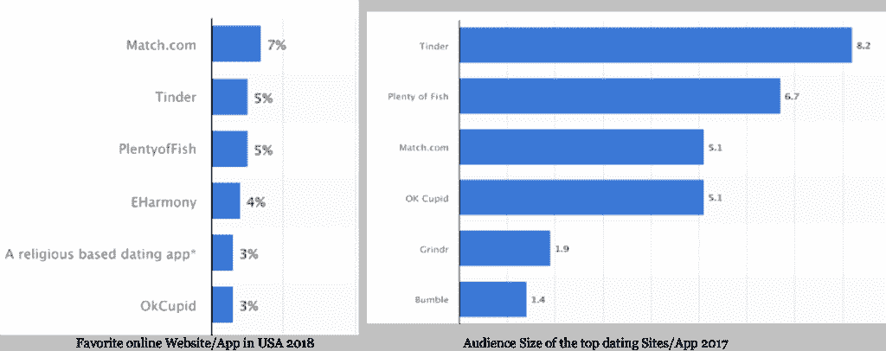
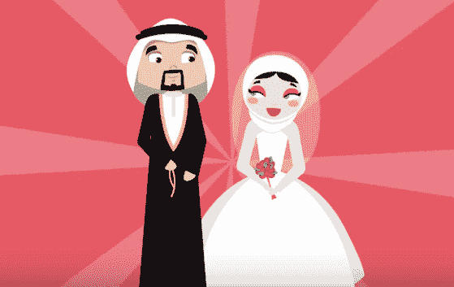

# 网上约会:打破保守文化中的禁忌

> 原文：<https://medium.datadriveninvestor.com/online-dating-history-future-and-breaking-the-taboo-in-conservative-countries-79a959105b33?source=collection_archive---------9----------------------->

Tinder，Badoo，Okcupid，Meetic，Happn…你听说过他们，你可能用过他们几次或更多次。

在这个人人互联的时代，轻点鼠标就能找到另一半的承诺太好了，不能错过。

网上约会在过去几年里呈指数增长。该行业每年创造约 40 亿美元的收入，并以每年 5%的速度稳步增长。然而，你知道“网上约会”的起源早于互联网时代吗？

# 网上约会比你想象的要古老得多

网上约会的起源始于 1959 年，当时两名斯坦福大学的学生用一份问卷和一台 IBM 终端为 49 名男女配对。

该实验依赖于根据夫妇的反应来匹配他们。新生计算能力的这种新用途导致了几个约会相关的活动被推出，包括“匹配操作”，这导致数百万人在 20 世纪 60 年代填写了一份 3 美元的问卷。

20 世纪 80 年代，现代约会又向前迈进了一步；创新，如在法国的 Minitel 建立了粉红色的聊天室(Messageries Rose)；与此同时，美国也设立了约会公告栏。媒人电子笔友网络，该系统是互联网的前身，用户通过终端交换数据，其机制类似于邮件或即时消息。

1995 年，随着万维网的出现，Match.com 凭借在线分类广告的承诺而成立；第一次迭代失败了，域名被媒体集团 IAC 分拆成 Match.com 集团收购，该集团拥有几个约会服务，如 Okcupid，Match.com，Meetic，Twoo 和 Tinder。

普通观众对网恋的主流介绍大概来自梅格·瑞恩/汤姆·汉克斯的电影《你有邮件》；这部电影有助于打破禁忌和通过新技术约会的负面内涵。

第一个真正的在线约会网站——e-harmony，于 2000 年推出，旨在成为一个以建立长期关系为重点的婚介服务，并使用一套 450 个问题来填写(自那时以来减少到 150 个)。

# 手机约会的兴起

网上约会随着科技的发展而发展。事实上，使用笨重的电子邮件是一个漫长的过程，使用现代技术逐渐改变。

视频会议、快速移动连接和向应用程序经济的融合导致了世界各地约会网站和应用程序的指数级增长。

出现了两种趋势:拥有通才和广泛人群的传统交友网站，以及面向非典型和特定受众的小众交友网站。以下是一些更有趣的选择:

尽管网上约会不乏选择，但市场主要由大玩家主导，但市场规模并不一定等同于最受欢迎，statista.com 的这些研究表明:

Match group 拥有在线约会的最大份额，但该集团的优势主要在于美国和其他盎格鲁-撒克逊国家。然而，包括中东在内的其他地区也有潜力。

# 中东的网上约会

这可能令人惊讶，但许多约会应用程序和网站在中东运作；然而，该地区的传统观众不信任西方约会应用程序，认为这些网站是为了肤浅的交往而不是为了认真的关系。

幸运的是，中东有一些公司正在解决这个问题:中东和北非地区最成功的保守约会网站之一是黎巴嫩初创公司 Et3arraf，由塞德里克·马拉夫(Cedric Maalouf)和拉坎·尼姆尔(Rakan Nimr)于 2012 年创立。

Et3arraf 在 2015 年由 Berytech Fund 2 资助，一直在通过提出符合该地区文化的产品来解决在线约会的耻辱。

*来自 et3arraf.com 的图片*

Et3arraf 的第一款产品“Al Khottaba”(阿拉伯语中的媒人)在应对沙特阿拉伯市场方面非常成功。

Al Khottaba 以很高的准确性进行数字化，并了解 KSA Khottaba 人在安排婚姻方面发挥的显著作用。这种体验允许基于具有人工智能特征的深度剖析来匹配夫妇。

一旦匹配完成，对话就转移到二人组，有可能进一步发展。Et3arraf 还在埃及推出了“Farah”(阿拉伯语的幸福或婚姻)。尽管两个应用程序有许多共同的功能，但 Farah 使用人工智能和游戏化的交叉来匹配潜在的情侣。

为了让观众在使用这些应用时感到舒适，Et3arraf 团队专注于获得用户的反馈和观点，即使是苛刻和负面的。

当该应用程序仍被称为“et3arraf”时，一个更保守的观众认为这个名字是 haram，这促使了“Al Khottaba”模式的改变。这一举措很受欢迎，因为通过媒人安排的婚姻在沙特文化中非常普遍。

出现了其他应用程序，如 Hayat、Lovehabibi 和 Hayati(由黎巴嫩企业家推出),但成功有限，主要是因为人们认为这些应用程序非常不规范或不安全，或者因为它们只关注一个非常小的社区(Hayati 专门针对中东和北非最小的国家之一黎巴嫩)。

# 性别失衡、适度以及技术如何解决问题

在线约会中最常见的问题之一是男女比例失衡(即 Et3arraf 上的用户比例为 5 比 1)，以及女性不占上风的看法。

然而，为了让网上约会成为女性更好的体验，已经做了很多工作。

Bumble 是全球主要的新玩家之一，它让女性发起对话，而 Et3arraf 使用了游戏化和人工智能的混合，其中一位女士开始了不止一场比赛，然后通过让男性对手回答一个快速测验来过滤这些比赛，以增加化学反应。

尽管滥用、虚假账户和骚扰等问题仍然存在，但机器学习和人工智能可以帮助过滤和调节对话。

任何成功和受人尊敬的约会网站的主要组成部分是客户支持和节制。版主必须快速行动，评估和解决问题，并停止任何升级，以避免糟糕的经历。

人类的大脑可以处理这么多事情，但人工智能的应用将有助于解决更多的问题并降低成本。人类的干预总是需要的，尤其是在判断深入情感和心理光谱的敏感问题时。

# 网上约会的未来

网恋是一个高度不完善的行业。根据预先确定的因素找到你的匹配是不够的，还有其他因素在起作用，如心理问题、第一印象和虚假信息。然而，随着技术越来越先进，企业家越来越注意多样性和创造有意义的关系，未来对寻找有意义的关系的人来说看起来很有希望。

网上约会是一个行业，将不断受到新技术趋势的干扰。人工智能已经变得越来越突出，特别是在制作和处理更强的匹配算法和数据处理方面。

随着技术变得更加可行，虚拟现实可能是下一个大趋势。你的下一次初次约会可能是在埃菲尔铁塔的顶端，而你却舒舒服服地坐在几英里外的家里。