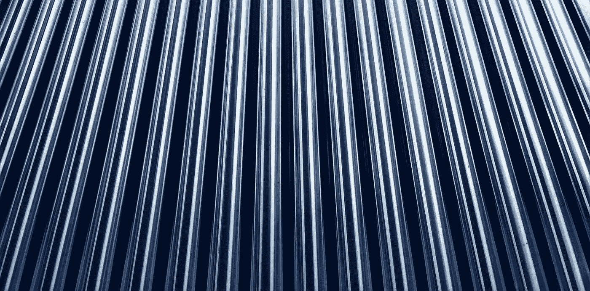

# 摄影的未来是计算机化的

> 原文：<https://medium.datadriveninvestor.com/photographys-future-is-computational-e32b78a20f1d?source=collection_archive---------1----------------------->

摄影世界在向数码技术的过渡中经历了重大变化，现在又要向计算摄影过渡了。振作起来！

对我来说，摄影不仅仅是保存记忆。它是关于创造比我们自己更伟大的东西，唤起强烈情感的东西，以及驱动兴奋的东西。我一直坚信，重要的不是你用什么来创造*，而是创造本身的艺术本质带来了魔力。有了胶片相机，摄影就其本质而言是缓慢的、有分寸的、有时是乏味的。数字革命给摄影界带来了创造性的爆发。单调乏味一去不复返，深思熟虑一去不复返，取而代之的是一个快速实验的美妙新世界。Instagram、Snap、脸书和 Twitter 都让我们能够以几乎无限的方式向世界展示我们的摄影艺术，而且都是近乎实时的。在这场数字变革中，摄影的基本要素始终保持不变。我们仍然向光圈之神低头，我们仍然觊觎你的快速玻璃，传感器尺寸仍然重要。但这一切都将改变，这要归功于一种名为机器学习的东西。*

> …未来 10 年，你将会看到从以相机硬件为中心到令人难以置信的软件创新的转变…

驱动未来相机的下一代成像技术将不再由硬件驱动，而是几乎完全由软件驱动。是的，软件。我预测，在接下来的 10 年里，你会看到从相机硬件成为焦点到令人难以置信的软件创新的转变，使用机器学习来创造前所未有的能力。我们已经看到了这一点，智能手机领域的快速创新正在我们的眼皮底下改变整个摄影世界，比如；智能 HDR(苹果 iPhone)，HDR+(谷歌像素)，以及许多其他产品。对于那些渴望过去的人来说，有大量的应用程序可以让你重新创造旧镜头和电影风格的外观，所有这些都完全在软件中完成。正如苹果刚刚宣布的那样，你甚至可以在照片拍摄后调整高质量的景深。但这仅仅是开始，我们现在才开始看到由机器学习驱动的摄影未来的迹象，这将赋予我们所有人创造超乎想象的图像的能力。

因此，让我们来谈谈这些未来的创新，其中一些可能就在眼前，而另一些则遥遥无期。

# 如果每个镜头都是完美的呢？

想象一个世界，你装在相机上的每个镜头都是光学完美的。没有失真，没有晕影，没有眩光(除非你想要它)。听起来不可能？信不信由你，我们已经走在使用技术的道路上，这些技术远远超出了大多数摄影师今天所熟悉的相机内镜头校正。甚至在你真正出手之前，主要玩家已经在[炫耀](https://www.theverge.com/2017/8/2/16082272/google-mit-retouch-photos-machine-learning)做出这些(和其他)修正的方法。但真正的创新将是当机器学习的使用允许硬件供应商创建模型，可以纠正甚至最便宜的镜头中的几乎任何缺陷。最棒的是你甚至不会注意到它的发生。所有这一切都将在幕后进行，就像今天苹果和谷歌的智能手机一样，你担心的是如何取景，而软件则负责处理细节。

# 如果每个摄像机都知道它在看什么会怎么样？

很长一段时间以来，我们在相机中已经有了几种形式的场景检测，但最近这项技术受到的关注越来越少。相机准确检测帧中内容的能力对于业余和专业摄影师来说都是一个强大的工具，但由于准确性差，其实用性迄今为止受到限制。我认为随着机器学习驱动的场景检测的一些最新进展，这种情况将会改变。在过去，使用的大多数技术都很简单，而且大多数时候容易出错。我曾经有一台声称具有自动场景检测功能的相机，它只不过是一个环境光检测器；更多的光线意味着你在室外，更少的光线意味着室内，等等。通过机器学习的力量，现在训练神经网络来执行场景分类变得更加容易。快速准确的场景分类为各种附加的场景优化和增强打开了大门。弱光人像？没问题，准确的检测使相机能够对照明条件进行正常的光学调整，而更具体的分类允许对直接来自相机传感器的原始数据进行更大的捕捉后调整。像这样的一个过程将能够为吹灭生日蜡烛的孩子使用单独的优化，而不是在昏暗的教堂里拿着蜡烛的人。

# 如果每张照片都没有传感器噪声会怎么样？

目前，大型专业相机系统的定义特征之一是传感器，即使在高 ISO 感光度下也具有极低的图像颗粒/噪声。这些相机的价格明显高于传感器更小的相机，原因很简单。因为较大的传感器可以捕捉更多的光，所以它们能够创建没有颗粒状噪声的图像，这种噪声在智能手机等小传感器相机中很常见。但是，任何一个拥有更新的谷歌或苹果智能手机的人都会告诉你，这些小型传感器相机正在迅速变得更好。今天的智能手机产生的传感器噪音水平与两代硬件之前的用户所见相差甚远。也就是说，事情即将发生重大变化。机器学习降噪技术的最新进展很可能被引入相机行业，首先是在后处理工具中，然后最终直接集成到各种相机系统中。这些新系统将有能力几乎消除所有传感器噪声。目前用于降低捕获图像中噪声的软件技术旨在应用于各种系统和传感器。一个很好的例子是 Adobe Photoshop Express 应用程序中的降噪功能，无论使用什么硬件来拍摄照片，它都可以工作。这种方法的缺点是，该过程并不总是产生完美的结果，事实上，使用它的代价往往是照片细节的重大损失。相比之下，机器学习技术可以应用于学习单一类型传感器产生的特定噪声模式。这种方法将使训练神经网络对照片进行内置降噪成为可能，从本质上消除所有噪声，而不会丢失任何细节。最终，这将使摄影师能够使用更高的 ISO 感光度，而不必处理由于传感器噪声造成的整体图像质量损失。10 年后，ISO 完全有可能不再适用于大多数摄影师，因此可能永远不会从“自动”设置中调整出来。

# 如果你的相机能帮你拍出完美的照片会怎么样？

所以考虑一下，在这个世界里，你的相机对摄影的了解比你希望了解的更多，在这个世界里，你的相机可以动态地调整以适应任何照明条件，并且这个相机可以在你知道它们存在之前修复几乎任何图像质量问题。这是未来的照相机吗？也许吧，但我认为十年后，世界将会看到一种相机，它甚至能告诉你你要拍的照片好不好。说真的。为什么不呢？已经有传言说苹果正在积极地研究这个过程。就个人而言，我认为“智能”相机的时代比我们想象的更近了！

> …计算摄影带来的变革将直接赋予业余爱好者和有抱负的摄影师力量…

# 计算相机的时代已经开始了！

摄影行业向数字化的转变给专业摄影师带来了惊人的改变。但我认为计算摄影带来的变革将直接赋予业余和有抱负的摄影师更多的权力。专注于摄影艺术方面而不是技术细节的能力将为许多人打开大门，而将这些技术纳入更便宜的相机系统将促进智能手机和其他小型相机系统的广泛采用。专业人士可以期待在不久的将来出现令人疯狂的后处理工具，而具有我所描述的功能的主要相机系统的吸引力可能会在几年内实现。不管怎样，我们都可以期待一个惊人的摄影未来！

**Connect with the Raven team on** [**Telegram**](https://t.me/ravenprotocol)