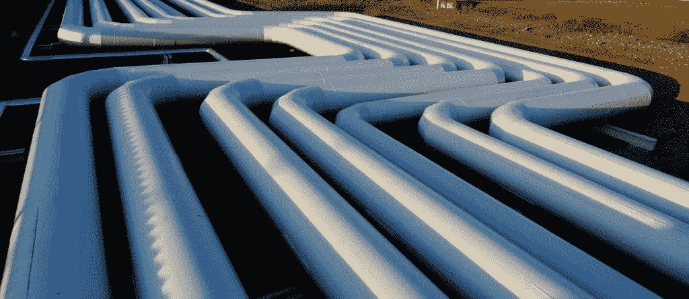

# 机器学习中的流水线

> 原文：<https://medium.datadriveninvestor.com/pipelines-in-machine-learning-7e25053db104?source=collection_archive---------1----------------------->

[](http://www.track.datadriveninvestor.com/1B9E)

## 为什么管道是 ML 的一个重要方面



[Bunch of Pipes](https://reynoldsplumbingrichmond.com/wp-content/uploads/industrial-pipes-1024x445.jpg)

机器学习最大的话题之一就是*自动化*。AWS 有一个令人惊叹的自动化机器学习系统，你只需点击一下，所有的数据都会为你计算出来。这是建立在创建管道的基础上的系统。

管道是有用的工具，可以自动化过程，并加快花在机器学习某些方面的时间。数据工程师、科学家和分析师每天都在使用管道来帮助自动化一些不需要太多输出的日常数据清理和处理。虽然 AWS 使用了一组相当复杂的管道网络，但我只想讨论建立管道的一些小优势以及实现管道所需的代码。

[](https://www.datadriveninvestor.com/2019/03/03/editors-pick-5-machine-learning-books/) [## DDI 编辑推荐:5 本让你从新手变成专家的机器学习书籍|数据驱动…

### 机器学习行业的蓬勃发展重新引起了人们对人工智能的兴趣

www.datadriveninvestor.com](https://www.datadriveninvestor.com/2019/03/03/editors-pick-5-machine-learning-books/) 

gridsearch 是与 pipeline 的一个很好的对比。Gridsearch 是另一个很好的工具，可以用来帮助优化机器学习的超参数。你给它一些范围或规格，你的算法将运行并显示给定规格的最佳值。然而，我们可以通过在 gridsearch 中包含一些简单管道来进一步自动化 grid search。有两种使用管道的方法。最简单也是最广为人知的是直接从 sci-kit learn 导入:

```
**from** sklearn.pipeline **import** Pipeline
```

接下来，您可以初始化管道并设置您想要寻找的所需规范:

```
pipe = Pipeline([('mms', MinMaxScaler()),
                 ('pca', PCA(n_components=10)),
                 ('tree',       tree.DecisionTreeClassifier(random_state=123))])
```

所以初始化就是*管道()*本身。然后在里面，我们设置我们想看的。首先，我们想自动化 Min_Max_Scaler。接下来，我们将通过主成分分析来运行我们的特征，以帮助减少特征。 *n_componenets* 仅仅意味着你想要多少个特性。如果您的功能比 n 个组件少，那么这些额外的功能将在单独的列中显示为 0。然后我们看到我们将使用决策树分类器在决策树上运行这两个。这些简单的行建立了一个管道，现在你可以对你自己的数据。然后，数据集将通过此管道运行，并相应地缩放您的数据，然后应用 PCA，最后通过树分类器运行它。要使其适合您的数据，请记住首先使用训练、测试、拆分来拆分您的数据。然后是下面的代码:

```
pipe.fit(X_train, y_train)
```

就是这样。您已经创建了一个管道。我在上面提到过，你也可以在你的 gridsearch 模型中实现 pipeline。为此，您必须执行以下操作:

```
*# Create the pipeline*
pipe = Pipeline([('scl', MinMaxScaler()),
                ('pca', PCA(n_components=10)),
                ('svm', svm.SVC(random_state=123))])
```

在这个示例代码中，机器学习算法将通过支持向量机而不是决策树。当您有未标记的数据，并且希望使用无监督学习来找到您正在寻找的底层数据时，SVM 非常有用。

```
*# Create the grid parameter*
grid = [{'svm__kernel': ['poly', 'sigmoid'],
         'svm__C': [0.01, 1, 100],
         'svm__degree0': [2,3,4,5],
         'svm__gamma': [0.001, 0.01]}]
```

现在我们创建一个基本的网格参数。这些只是 SVM 算法的不同组成部分/工具。

```
#Input pipeline and grid into gridsearch
gridsearch = GridSearchCV(estimator=pipe,
                  param_grid=grid,
                  scoring='accuracy',
                  cv=3)
```

最后，这次我们将数据放入 gridsearch，而不是像上面这样的管道:

```
*# Fit using grid search*
gridsearch.fit(X_train, y_train)
```

大多数人都是这么做的。但我也会在下面贴出官方的 sklearn 文档，这样你就可以自己看看了。

[](https://scikit-learn.org/stable/modules/generated/sklearn.pipeline.Pipeline.html) [## sk learn . pipeline . pipeline-sci kit-learn 0 . 21 . 3 文档

### 具有最终估计器的变换流水线。依次应用一系列转换和一个最终估计器…

scikit-learn.org](https://scikit-learn.org/stable/modules/generated/sklearn.pipeline.Pipeline.html) [](https://www.kdnuggets.com/2018/01/managing-machine-learning-workflows-scikit-learn-pipelines-part-2.html) [## 使用 Scikit-learn 管道管理机器学习工作流第 2 部分:集成网格搜索

### 在我们的上一篇文章中，我们将 Scikit-learn 管道视为简化机器学习工作流程的一种方法。

www.kdnuggets.com](https://www.kdnuggets.com/2018/01/managing-machine-learning-workflows-scikit-learn-pipelines-part-2.html)