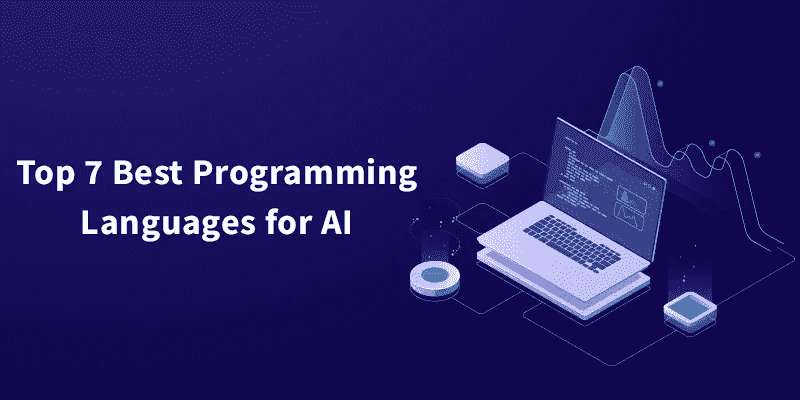

# 强大的编程语言来编写您的人工智能应用程序

> 原文：<https://medium.datadriveninvestor.com/powerful-programming-languages-to-code-your-ai-application-ef69429f7872?source=collection_archive---------0----------------------->

多年来，人工智能一直停滞不前。但是随着应用范围的不同，它在技术领域取得了急需的势头。随着人工智能提振生产率、质量和消费，最大的部门收益将是金融服务、医疗和零售。

对[**AI 软件开发**](https://www.excellentwebworld.com/artificial-intelligence-solutions/) 的需求为对数据科学和软件工程感兴趣的人创造了潜在的 AI 职业。AI 应用程序的开发过程取决于应用程序所需的功能。

 [## 2019 年最值得学习的编码语言——数据驱动的投资者

### 在我读大学的那几年，我跳过了很多次夜游去学习 Java，希望有一天它能帮助我在…

www.datadriveninvestor.com](https://www.datadriveninvestor.com/2019/02/21/best-coding-languages-to-learn-in-2019/) 

然而，要制作一个出色的人工智能应用程序，你需要利用最好的编程语言。

**1。Python**

当谈到人工智能编程语言时，Python 以其无与伦比的社区支持和库领先。这有助于加速人工智能的发展。

**优点**

*   因为语法简单，所以很容易学
*   与 Java、C++或 ruby 相比，python 的开发速度更快。
*   它是一种支持面向对象的多范例编程语言
*   它提供了大量的库和工具。
*   它是一种可移植的语言，可以用于多种操作系统，即 Windows、Mac OS、Linux 和 Unix。

**缺点**

*   人工智能系统与非 python 基础设施的结合

**2。C++**

在某些方面，C++取代了 python，尽管它并不是人工智能开发中最常用的语言。C++允许广泛使用算法，并且在使用统计人工智能技术方面是有效的。

**优点:**

*   C++是支持面向对象原则的多范例编程，这对于实现有组织的数据非常有用。
*   丰富的库函数和编程工具集合。
*   有利于找到复杂人工智能问题的解决方案。

**缺点:**

*   多任务处理能力差；它只适用于实现特定系统的核心或基础。
*   它遵循自下而上的方法。对于新开发人员来说，在人工智能程序中使用它是如此困难。

**3。序言**

Prolog 基本上是一种与人工智能开发和符号计算相关的古老语言。

**优势**

*   它是一种陈述性语言，每件事情都由事实和规则决定。它具有基于树的数据结构、自动回溯和模式匹配等有助于人工智能开发的机制。
*   它本质上是灵活的，通常用于定理证明、自然语言处理和人工智能。

**缺点**

*   与其他语言相比很难

**4。LISP**

LISP 是一种用于人工智能开发的不同语言。它是仅次于 FORTRAN 的第二古老的编程语言。它已经发展成为一种强大而有活力的编码语言。

一些开发者认为 LIPS 是最好的人工智能编程语言之一，因为它提供了自由。

LISP 在解决具体问题时效率更高，因为它适应了开发人员正在编写的解决方案的需求。

**优势**

*   因为它由编译器而不是解释器支持。
*   LIPS 对系统进行特定的控制，从而最大限度地利用系统。
*   它有垃圾收集

**缺点**

*   很少有开发人员知道 LIPS 编程
*   它需要新的软件和硬件来适应它的使用

**5。开始**

两年来，Go 一直在编程语言市场上加快速度。然而，在使用 Go 的 AI 开发中没有任何项目可用。例如，AlphaGo 是围棋中第一个能够击败世界冠军人类围棋选手的计算机程序。

**优点**

*   在 Go 中你不需要调用库，你可以利用 Go 现有的机器学习库。
*   它不包含类。它只由使代码更干净和清晰的包组成。
*   它不支持继承，这使得在 Go 中更改代码变得很容易。

**缺点**

*   核心 AI 开发任务的库并不多。

**6。R**

r 是人工智能开发中越来越流行的语言。R 主要用于学术研究，由统计学家编写，它提供基本的数据管理，使任务变得非常简单。

它不像 Matlab 或 SaS 这样的软件那样昂贵，这使它成为这种软件的伟大替代品和数据科学的黄金。

**优点**

*   r 在连续回归、模型验证和数据可视化等任务中非常有效。
*   它提供了用于数据分析的统计模型包，如 caret、ggplot、dplyr、lattice 等，可以帮助促进 AI 开发过程。
*   您还可以在一个交互式环境中用很少的代码完成主要的任务，这使得开发人员可以很容易地尝试新的想法，并用 r。

**缺点**

*   开发速度慢，因为每次使用新算法时都要做预测。
*   R 最大的缺点之一就是由于第三方算法导致的不一致性。

7。斯卡拉

Scala 也像 Java 一样属于 JVM 家族。这是人工智能领域的一种新语言，但最近它在许多公司和初创公司中获得了相当多的认可。

它提供了便利，这也是开发人员喜欢使用它的原因。ScalaNLP，DeepLearning4J 都是一些工具和库，它们让 Scala 的人工智能开发过程变得更加简单。

**优势**

*   它最适合需要可伸缩性的项目
*   它提供了良好的并发支持，有助于涉及实时并行分析的项目。
*   当谈到统计学习信息论和人工智能时，它有一个很好的开源社区。

**劣势**

*   学习曲线是昂贵的

**结论**

总之，如果你想选择一种简单的语言，那么 python 是最好的，但是如果你想要速度和性能是最重要的，那么选择 C++。这取决于你选择的项目和你想要的速度。

有什么建议吗？