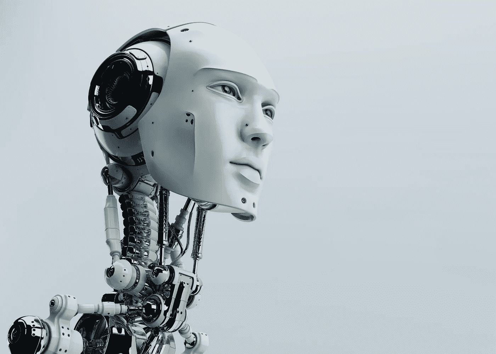

# 预测能力(决定未来)

> 原文：<https://medium.datadriveninvestor.com/predictive-power-dictate-the-future-669cedc8256?source=collection_archive---------16----------------------->

这是一个新时代，谁拥有最好的模型，谁就能够并且愿意尝试预测未来。

我们处在一个新的时代，一个“大数据”的时代，但是这个所谓的投标数据是什么呢？

**大数据**是指传统数据处理应用软件和/或算法无法处理的庞大或复杂的数据(数据集)集合。(即 2GB 的文本文件，2TB 的图片)。

数据呈指数级增长，我们可以肯定地说，在人类历史上，没有其他时间点的数据是以这种方式产生的。

> [全球 90%](http://bigdata-madesimple.com/exciting-facts-and-findings-about-big-data/) 的数据都是在过去两年内创建的。

只是为了让您了解当今大数据前所未有的增长速度。

因此，在这个时代，为了促进和推进科学发现或获得预测能力，我们探索了大量可用数据的各种统计模型。谷歌、IBM 等科技巨头正在利用我们创造的所有这些数据，改变和/或增强他们的产品。

> “在某种程度上，战略是预测将要发生什么的能力，但它也是关于理解制定战略的背景。”——[马丁·登普西](https://www.brainyquote.com/quotes/martin_dempsey_774607?src=t_predict)

但是还有一个更大的问题，那就是:

先进的算法和统计模型是否足以获得这种能力，以准确预测不可预见的近期或远期的未来？

为了更好地回答这个问题，我们应该分两步来回答。

# **第一步**

**有质量有意义的数据。**

现在你知道我们有大量的数据，正如圣经中提到的，就像亚当和夏娃一样，我们不能吃掉花园里的所有水果，因为禁果(在我们的例子中是错误的数据)会导致人类的堕落。

因此，我们应该寻找能够以有意义的方式代表我们想要解决的问题的高质量数据。换句话说，如果数据**适合**其在运营、决策和规划中的预期用途，则认为数据是高质量的。

# **第二步**

选择最佳型号。

在我们开始之前，我想澄清几个概念。

> [**数据分析**](https://en.wikipedia.org/wiki/Data_quality) —是对数据进行检查、清理、转换和建模的过程，目的是发现有用的信息。
> 
> [**推论**](https://en.wikipedia.org/wiki/Statistical_inference#Model-based_analysis_of_randomized_experiments)**——在证据和推理的基础上得出的结论。**
> 
> **[**参数模型**](https://machinelearningmastery.com/parametric-and-nonparametric-machine-learning-algorithms/)——将函数简化为已知形式的算法。**
> 
> **[**非参数模型**](https://machinelearningmastery.com/parametric-and-nonparametric-machine-learning-algorithms/) —对映射函数的形式不做强假设的算法。通过不做假设，他们可以自由地从训练数据中学习任何函数形式。**

**接下来，在高质量和有意义的数据采集过程之后，最关键的步骤是从一组候选模型或方法中选择最合适的模型或方法，以尽可能最好的方式执行预期任务，几乎不需要人工干预。**

**这个过程被称为**模型选择**，它是**数据分析**中可靠且可重复的统计**推断**和预测的关键成分。有许多进行模型选择的方式，并且已经提出了许多方法，遵循不同的原理并且表现出不同的性能(即选择神经网络中神经元和层的数量)。**

**基本的**模型选择**技术/方法及其关系以两个基本的统计目标为中心，即预测和推理——如上一段所述，还有其他方法，但这是试图获得**预测能力**的最基本方法。**

**你可以称之为典型的统计推断或机器学习(ML)程序，通过拟合**参数**和**非参数模型**对数据进行学习和预测。**

> ****备注**:不存在放之四海而皆准的**模型**(至少目前我相信)。**

# ****为什么选择型号？****

**模型选择是大数据和人工智能赖以存在的基础。**

****

**想象一下，一个不恰当的模型或方法选择可能会导致纯粹嘈杂的“发现”，严重误导的结论，或令人失望的预测性能。此外，数据采集也是如此。**

**正如卡罗莱娜·科库娃所说，**

> **“我们有责任做出正确的选择和决定。”**

**我要重复一遍，*正确的选择是我们的，只有我们自己才能做出*，我们作为人类，有能力主宰我们的未来。**

**现在，让我们从商业角度来看这个问题，例如，如果杰夫·贝索斯的公司亚马逊有一个物流软件，可以找到最短的路线或路径来将货物交付给他们的客户，这个软件由统计模型或机器学习(ML)支持，假设他们有高质量的数据(他们确实有)，但他们有一个糟糕的模型选择技术，他们选择的模型不是为了找到最短的路线，而是找到最长的路线。这种情况持续一周或一个月，会让公司损失数百万美元，而且显然会让伟大的**杰夫·贝索斯失去笑容。****

**当我们想到自动驾驶汽车中使用的错误模型时，一个更危险的场景浮现在脑海中，这不仅会耗费金钱，还会在我们已经不安全的道路上耗费许多宝贵的生命。**

> **“如果你担心 AI，你要知道 AI 只是一个工具。我们是拥有自由意志的人，我们为人工智能设定目标，我们将书写人工智能的结局。”—李开复**

# ****结束语……****

**在这个阶段，我们应该非常小心，这个行业正在呈指数增长，但这并不意味着事情不会失败。因此，如果我们花时间升级测试和验证我们的数据以及统计模型或算法的安全技术，我们就能更好地为成功做好准备。**

****你可能会问，型号选择有哪些方法？****

**这个问题将在以后的文章中讨论，我将指出技术细节。**

**感谢您的阅读。如果你有任何想法，评论或批评，请在下面评论。**

**如果你喜欢它并与之相关，请给我一点**掌声**👏👏 👏并**分享给你的朋友**。**

**如果你想和我一起探索数据丛林，请跟我来。:D**