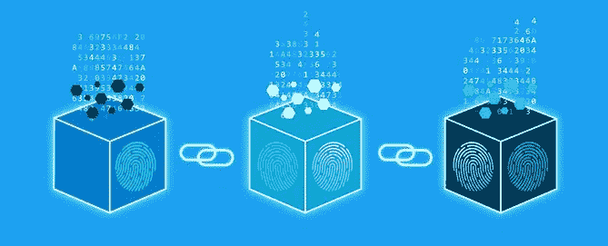

# 将区块链和聊天机器人放入搅拌机，并为其注入新的拟议用途

> 原文：<https://medium.datadriveninvestor.com/putting-blockchain-and-chatbots-in-a-blender-and-pouring-a-new-proposed-use-for-it-21ae7ed3bb7e?source=collection_archive---------9----------------------->

Image from theceoviews.com

首先，为了便于讨论，我们建议回顾一下区块链和聊天机器人的概念，不需要深究技术特性。

总的来说，区块链就像一些公共存储库，去中心化，随处可用，可以用来记录和跟踪数据。一旦交易创建了记录，它就被网络(或链)中的计算机进行全球验证，并且一旦被验证，它就变成永久的和不可修改的。创建记录的事务的所有者可以在没有中介的情况下更新记录，从而改变其属性。

各种例子都可以应用于区块链，如金融交易、医疗记录，甚至土地所有权。也许更为人所知的是加密硬币。似乎可以说，所有独特的、可以以可信的方式在各方之间转发或交换的内容都可以被记录到区块链技术中，并从中受益。

 [## 对话式营销是文字数据驱动的投资者

### 在购买之前，先谈一谈。这样做的营销人员将走在游戏的前面。这是保罗·因斯的前提…

www.datadriveninvestor.com](https://www.datadriveninvestor.com/2019/01/31/conversational-marketing-is-the-word/) 

聊天机器人则是计算机程序，在与客户、顾客或员工等其他人互动时，模拟人类对话。聊天机器人的重要之处在于，它们被用来提供服务，例如，通知或满足请求。聊天机器人的应用越来越多，现在越来越多。

这篇文章中的序列是我作为一个*的想法想到的。我一直在想，当用户第二次打电话给客服，需要再次讲述整个故事，回到我们第一次通话的同一点时，他们会有什么样的体验。这让我想起了与不同聊天机器人互动时的相同经历，我得出的结论是，也不必再向聊天机器人讲述同样的故事是非常可取的。*

*事实上，当用户返回时，一些聊天机器人会保留先前交互的历史，但这主要适用于同一个聊天机器人，当用户返回与他先前通信过的聊天机器人进行交互时。*

> *我的观点是:如果我们可以与不同的聊天机器人进行交互，并且之前的通信是已知的，会怎么样？在同一家公司，这已经很好了，但为什么不通过几家公司来想象呢？*

*让我们想象这样一个场景:你与一家公司的聊天机器人互动，询问某个特定产品的信息，比如智能手机。如果你可以与其他公司的聊天机器人互动，并且你喜欢的品牌和型号是已知的，而不需要重复你所有的偏好，你会怎么样？第二个聊天机器人可以开始互动，说“嗨，我看到你对智能手机感兴趣。你想知道我们对制造商 y 的型号 x 的价格吗？”。*

> *看起来像一场梦，不是吗？*

*第一个想法可能是第一家公司不想与竞争对手分享互动。也许吧。然而，这样做可能会导致一些相反的情况发生，当客户来自竞争对手，而公司可以从信息中受益。两家公司可以互相帮助，为买家提供更好的服务。*

*好吧，也许你仍然不相信公司会愿意与竞争对手分享他们的销售数据——我也不相信。让我举另一个例子，这次是互补业务。也许销售音乐会门票的聊天机器人可以与另一家销售服装的企业共享数据。根据一家公司买家的音乐偏好，另一家公司的聊天机器人可以根据推断的生活方式提供一些优惠。*

> *好吧，问题是:这个乌托邦式的场景如何成为现实？这似乎是一个简单的猜测:与区块链。*

*怎么会？*

*完成一些标准化后，特定的区块链可以记录所有聊天机器人的交互。作为网络一部分的所有聊天机器人，在与用户互动之前，将检查存储库以获得关于先前会话的信息，并以最佳方式处理它，在会话结束时，将新的互动写入区块链。*

> *然而，从一方和另一方发送一个对话来知道是关于什么的，这似乎不是一个简单的任务。确实不是。*

*也许这里的秘方是考虑意图和实体，这是一个在自然语言处理中广泛使用的概念。它大致的意思是从一个人的句子中提取一个意图——它的目的或愿望是什么。实体就像解释或补充意图的属性。所有与聊天机器人的互动都必须有明确的意图，并带有可选的实体。更清楚地说:前面第一个示例的目的是“了解智能手机的价格”，实体是“型号 X”和“制造商 y”。第二个示例的目的是“购买音乐会的门票”，实体是“X 乐队”*

*这一步棋还有一个未解决的问题有待解决。为了让所有这些工作，必须有用户的唯一标识，以便能够恢复以前的交互。嗯，非正式地，已经有一些传统的共享身份识别手段，如脸书或谷歌身份证。如今，选择使用这些身份验证方法注册服务并不罕见。*

*也许这个想法在这个时候太超前或者太不切实际了，但是就技术和概念来推测，它是可行的。更重要的部分是创建一个共享聊天机器人交互会话的标准和符号。*