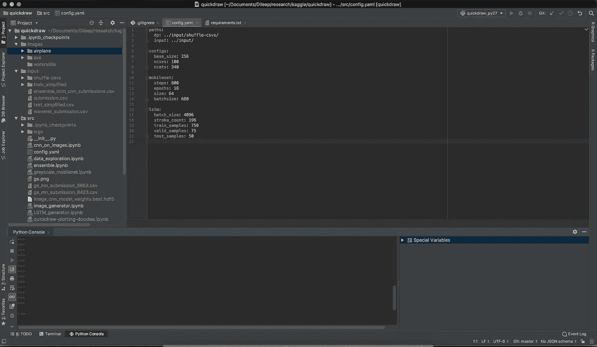

# 数据科学家的 PyCharm

> 原文：<https://medium.datadriveninvestor.com/pycharm-for-data-science-b3fb3daae373?source=collection_archive---------13----------------------->

我最近开始使用 PyCharm 作为 Spyder 的替代品，我很喜欢它。这篇文章讲的是 PyCharm 的一些特性，这些特性让我从 Spyder 完全过渡到 PyCharm。以下特性是与 Spyder 的比较，而不是与一般 ide 的比较。

PyCharm with its beautiful ‘Dracula’ theme

1.  终端:您可以在 IDE 中获得一个 shell 脚本，这有助于轻松访问一些功能，如从命令行测试您的脚本，从 gs/aws 下载数据文件，git 交互。
2.  Git:说到 git，PyCharm 提供了 git 集成。只需从 IDE 中，您就可以将所有需要添加的文件添加到 gitignore、add 和 commit。您可以随时查看您所在的分支，哪些文件处于修改、添加、提交状态(基于它们在项目视图中的颜色)等。我提到过我们可以直接从 IDE 中的终端进行 git 推送吗？
3.  版本控制:您可以在 IDE 中查看您的 git 变更日志。您还可以将您的文件与来自 git commit 的最新文件进行比较，以查看您的更改。
4.  插件:PyCharm 也为非 pythonic 文件提供了很多插件。因此，当您使用配置文件(如 yaml/json/ini)、shell 脚本或 sql/html/css 文件时，IDE 知道应该使用什么格式，并会自动缩进、突出显示关键字等。你甚至可以用 iPython 笔记本工作，尽管坦白说它看起来很乱，我会用 Jupyter 做笔记本。一些其他值得注意的插件是 git，flask，vim 等。
5.  项目维护:当您从事大型项目时，需要维护几个最佳实践，例如创建自述文件、使用虚拟环境、管理需求文件等。所有这些都可以用 PyCharm 轻松处理。你也可以很容易地进行代码重构，检查对象的依赖性，追踪对象的来源等等。
6.  调试器:这在 Spyder 中也有，但不知何故我从未在 Spyder 中使用过。您可以创建调试点，并在该点检查您的代码行为。
7.  分块运行代码:这在 Spyder 中非常自然。您选择想要运行的代码部分，然后执行 cmd+return。这在 PyCharm 中并不明显，但是可以实现(Mac 中的 Option + Shift + E)。这在编写独立脚本时非常方便。

尽管有这些好处，但也有一些缺点:

1.  内存猪:PyCharm 消耗了我的 Mac 大约 1.5GB 的内存。这对于一个 IDE 来说似乎太多了
2.  数据可视化:Spyder 对我来说最大的优点是它的变量浏览器。你*也可以*在 PyCharm 中可视化数据帧，但它远不及 Spyder。剧情也是如此。与 Spyder 相比，PyCharm 中的情节渲染需要更多的时间。
3.  学习曲线:我认为 Spyder 在数据科学家中的受欢迎程度来自于它非常简单。你安装它，打开它，你就知道它是如何工作的。但是 PyCharm 有一点学习曲线，比如设置它的解释器，弄清楚如何运行你选择的代码而不是整个代码等等。你需要花几个小时来真正理解和欣赏它的工作方式。

理想情况下，如果您正在处理一个项目，其中您将处理多个相互交互的脚本，那么您肯定应该尝试 PyCharm。如果您的所有脚本都是独立的分析，Spyder(甚至更好- *Jupyter* )应该足以满足您的需求。