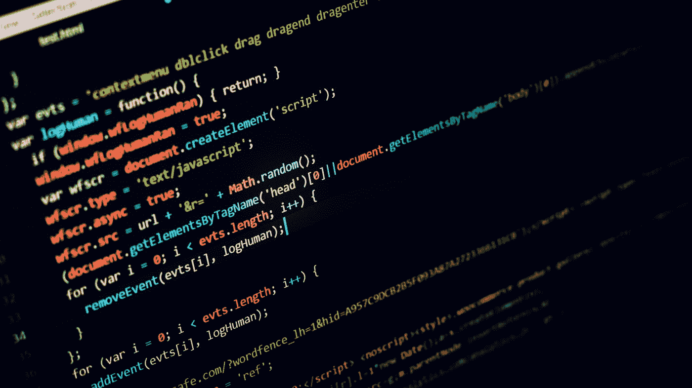

# Python 数据结构—元组

> 原文：<https://medium.datadriveninvestor.com/python-data-structures-tuple-c84a3f822ab2?source=collection_archive---------2----------------------->



Photo by [Dlanor S](https://unsplash.com/@dlanor_s?utm_source=medium&utm_medium=referral) on [Unsplash](https://unsplash.com?utm_source=medium&utm_medium=referral)

*先决条件:任何编程语言的基础知识*

*我们将在这里探讨数据结构元组及其所有操作。*

列表上的所有操作请阅读此贴—[https://medium . com/@ arshren/python-data-structures-List-9131 e 7386 c8d](https://medium.com/@arshren/python-data-structures-list-9131e7386c8d)

对于字典上的所有操作，请阅读本文—[https://medium . com/@ arshren/python-data-structures-Dictionary-9b 746 b94b 421](https://medium.com/@arshren/python-data-structures-dictionary-9b746b94b421)

要了解元组，请参考-[https://github . com/arshren/Data-Structures/blob/master/Python % 20 Data % 20 Structures % 20-% 20 tuple . ipynb](https://github.com/arshren/Data-Structures/blob/master/Python%20Data%20Structures%20-%20Tuple.ipynb)

***所有输出为粗体斜体***

**什么是序列？**

序列是任何有序集合的通称，如**元组、集合或字符串**

*那么，让我们从元组开始*

# 元组

> *元组是不可变的，这意味着一旦定义，项目的单个值就不能编辑或删除。这使得它们比列表更快。*
> 
> 我们可以重新分配一个元组或者删除整个元组。
> 
> *元组可以包含不同的数据类型，如字符串、数字等。*
> 
> *它们可以包含重复值*
> 
> *元组可以通过解包或索引来访问。(这将进一步解释)*

***元组什么时候有用？***

> *当您不想操作数据时，应使用元组*
> 
> *它们比列表*更快
> 
> *可用作字典中的键*

*现在我们将一步一步地定义一个元组，在元组中添加元素，访问元组中的元素，删除元组，然后遍历元组。我们还会看到元组的打包和解包，以及使用元组来构建字典*

# 定义元组

元组可以由括号( )内的逗号分隔值来定义

```
tool_List =('screwdriver', 'spanner', 'nuts', 'bolts', 'hammer')
tool_List***('screwdriver', 'spanner', 'nuts', 'bolts', 'hammer')***
```

元组允许重复值

```
tool_List =('screwdriver', 'spanner', 'nuts', 'bolts', 'hammer', 'spanner')
tool_List***('screwdriver', 'spanner', 'nuts', 'bolts', 'hammer', 'spanner')***
```

我们也可以不使用括号来创建元组

```
tool_List = 'screwdriver', 'spanner', 'nuts', 'bolts', 'hammer'
tool_List***('screwdriver', 'spanner', 'nuts', 'bolts', 'hammer')***
```

# 连接元组中的值

只有一个元组可以连接到一个元组。字符串不能连接到元组

下面，我将把一个“钉枪”连接到 tool_List。因为一个元组只能连接到一个元组，所以请注意末尾的“，”

```
tool_List  += ('nail gun',)
tool_List***('screwdriver', 'spanner', 'nuts', 'bolts', 'hammer', 'nail gun')***
```

我们也可以显式地创建两个元组并将它们连接起来

```
fortune_500 =('Apple','Google', 'Wal-mart', 'Amazon', 'Microsoft')
awesome_companies =('My Company',)
awesome_companies += fortune_500 
awesome_companies***('My Company', 'Apple', 'Google', 'Wal-mart', 'Amazon', 'Microsoft')***
```

# 访问元组中的值

我们可以使用[]从元组中访问单个值或一系列值。这也称为切片

我们可以通过提供元组中元素的索引来访问单个值(记住在 python 中索引从 0 开始)

```
print(awesome_companies[1]***Apple***
```

我们还可以访问从索引 2 到 4 的一系列值。最后一个索引 5 将被删除

```
print(awesome_companies[2:5])***('Google', 'Wal-mart', 'Amazon')***
```

我们还可以访问从开始到指定范围的所有元素。

在下面的例子中，我们打印从索引 1 到结尾的所有值

```
print(awesome_companies[1:])***('Apple', 'Google', 'Wal-mart', 'Amazon', 'Microsoft')***
```

在下面的例子中，我们打印从开始到第二个元素的所有值

```
print(awesome_companies[:3])***('My Company', 'Apple', 'Google')***
```

# 删除元组

元组是不可变的，所以我们不能删除单个条目，但是我们可以使用 **del** 删除整个元组

```
del tool_List
```

# 遍历一个元组

要遍历一个元组中的所有元素，我们可以使用一个简单的 for 循环，如下所示

```
for i  in awesome_companies:
    print(i)***My Company
Apple
Google
Wal-mart
Amazon
Microsoft***
```

我们可以将元组理解与条件一起使用。这里我们遍历 awesome_companies 并检查 awesome_companies 是否不是“Apple ”,然后将元素添加到名称元组中

```
name = tuple(  i for i in awesome_companies  if i != "Apple")
print(name)***('My Company', 'Google', 'Wal-mart', 'Amazon', 'Microsoft')***
```

# ***元组的打包和解包***

打包允许你动态地创建一个元组，而我们不使用创建元组的普通符号。在打包时，我们将值放在一个元组中，在解包时，我们将这些值提取回变量中

```
country =  'USA', 'Washington D.C.', '50', 'Bald Eagle', 'Rose'
country***('USA', 'Washington D.C.', '50', 'Bald Eagle', 'Rose')***
```

现在让我们把元组分解成不同的变量

```
country_name, capital, no_of_states, national_bird, national_flower, national_animal = country
print(country_name)
print(national_flower)***USA
Rose***
```

Tuple 中的打包和解包特性有什么用？

如果你看看上面的例子，用一条语句，我们能够在一个元组的一条语句中创建和分配 6 个不同的变量，这就是打包和解包元组的能力。

解包时变量的数量应该与元组的长度相同。

# 元组来创建字典

我们可以使用元组作为键/值对来创建字典。

在下面的例子中，我们有一个元组 t1，我们正在创建一个包含三个元组的字典参议员

```
t1 =('Constituency','Arizona')
senator=dict([('Name', 'John'), ('Age', 85), t1])
senator***{'Age': 85, 'Constituency': 'Arizona', 'Name': 'John'}***
```

我们也可以使用元组作为字典中的键。在下面的例子中，我们有一个值为 44 和奥巴马的元组，我们将它指定为字典 president 中的键。

```
president={(45, 'Donald'): 'Donald J Trump'}
president_44 =(44,'Obama')
president[president_44] = 'Barack Hussein Obama'
president[(44,'Obama')]
```

# 元组上的常见函数

**len** ():返回元组的长度

```
len(president_44)***2***
```

**max** ():返回元组中的最大值

**min** ():返回元组中的最小值

**sum** ():返回元组中值的总和

**排序后的**():返回元组的排序版本

```
numbers =(10,2,4,100,500)
print(max(numbers))
print(min(numbers))
print(sum(numbers))***500
2
616
[2, 4, 10, 100, 500]***
```

any()-如果元组中的任何值具有布尔值 True

all()-如果元组中的所有值都具有布尔值 True

```
test=(1,'name', 'trail',  False, True)
print(any(test))
print(all(test))***True
False***
```

# **元组上的常用方法**

index():返回作为参数传递的值的第一次出现的索引

count():返回一个值在元组中出现的次数

```
flowers =('Rose', 'Lily', 'Orchids', 'Lotus', ' Mari Gold', 'Sunflower','Rose')
print(flowers.count('Rose'))
print(flowers.index('Lotus'))***2 
3***
```