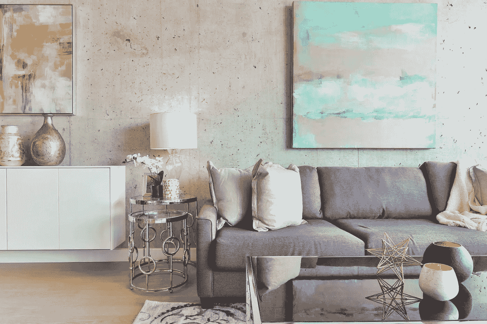

# Python:可爱双人沙发的购买信息和收据

> 原文：<https://medium.datadriveninvestor.com/python-purchasing-information-and-receipts-for-lovely-loveseats-b50c9fd7c99f?source=collection_archive---------1----------------------->

[](http://www.track.datadriveninvestor.com/1B9E)

## Python 内部



Sidekix Media @sidekix. Photo gallery available on Unsplash.com.

*这是从 Code Academy 检索到的真实项目，请向下滚动查看交互式可运行代码。为了这个项目，我们决定追求小企业所有权的梦想，并在舰队街开设一家名为可爱的 Loveseats 的家具商店，提供整洁的套房。通过 Python 编程，我们将构建一个系统来帮助加快为您的客户创建收据的过程。*

*在这个项目中，我们将在变量中存储家具店目录的名称和价格，然后处理客户的总价和项目列表，最后将它们打印到输出终端。*

[](https://www.datadriveninvestor.com/2019/02/21/best-coding-languages-to-learn-in-2019/) [## 2019 年最值得学习的编码语言——数据驱动的投资者

### 在我读大学的那几年，我跳过了很多次夜游去学习 Java，希望有一天它能帮助我在…

www.datadriveninvestor.com](https://www.datadriveninvestor.com/2019/02/21/best-coding-languages-to-learn-in-2019/) 

> ***1。*** *让我们加入我们的第一个项目，可爱的双人沙发，这是商店的同名产品。创建一个名为* ***的变量 Lovely _ love seat _ description****并为其赋值以下字符串:*
> love seat。木材上的簇绒聚酯混合物。32 英寸高 x 40 英寸宽 x 30 英寸深。红的还是白的。

```
lovely_loveseat_description = """ Lovely loveseat. Tufted polyester blend on wood. 32 inches high x 40 inches wide x 30 inches deep. Red or white."""
```

> **②*。*** *太好了，现在让我们为双人沙发创建一个价格。创建一个变量****love _ love seat _ price****并设置为等于****254.00****。*

```
lovely_loveseat_price = 254.00
```

> ***3。*** *让我们用另一件特色家具来扩展我们的库存吧！创建一个名为* ***的变量 steady _ Settee _ description****并给它分配以下字符串:*
> steady Settee。桦木人造革。29.50 英寸高 x 54.75 英寸宽 x 28 英寸深。黑色。

```
stylish_settee_description = """Stylish Settee. Faux leather on birch. 29.50 inches high x 54.75 inches x 28 inches deep. Black."""
```

> **4*。现在让我们为这款时尚的沙发定个价吧。创建一个变量****【student _ settee _ price】****，并给它赋值****180.50****。***

```
stylish_settee_price = 180.50
```

> ***5。太好了，在我们准备好做生意之前，我们只需要一件东西。创建一个名为****luxury _ Lamp _ description****的新变量，并将其赋值如下:*
> luxury Lamp。玻璃和铁。36 英寸高。奶油色棕色。**

```
luxurious_lamp_description = """Luxurious Lamp. Glass and Iron. 36 inches tall. Brown with cream shade."""
```

> ***6。*** *让我们为这件物品定价。创建一个名为****luxury _ lamp _ price****的变量并设置为等于****52.15****。*

```
luxurious_lamp_price = 52.15
```

> ***7。*** *为了成为企业，我们还应该计算销售税。让我们把它存储在一个变量中。
> 定义变量****sales _ tax****并设置为等于****. 088****。也就是 8.8%。*

```
sales_tax = 0.088
```

> ***8。我们的第一位顾客正在购物！让我们通过定义一个名为****customer _ one _ total****的变量来记录他们的开销。因为他们还没有购买任何东西，所以现在让我们将该变量设置为等于* ***0*** *。***

```
customer_one_total = 0
```

> **9*。我们还应该保留一份他们所购物品的描述清单。创建一个名为****customer _ one _ itemization****的变量，并设置该变量等于空字符串***。当他们购买时，我们会对其进行描述。****

```
*customer_one_itemization = ""*
```

> ***10*。我们的客户决定购买我们可爱的双人沙发！将价格添加到****customer _ one _ total****。****

```
*customer_one_total += lovely_loveseat_price*
```

> ***11*。让我们开始记录顾客购买的物品。在****customer _ one _ itematization****中添加可爱的 Loveseat 的描述。****

```
*customer_one_itemization += lovely_loveseat_description*
```

> ***12*。我们的客户也决定购买这款奢华的灯具！让我们把* ***的价格加到客户的总价*** *。****

```
*customer_one_total += luxurious_lamp_price*
```

> ***13*。*** *让我们保持明细最新，并将* ***豪华灯的描述添加到我们的明细*** *。**

```
*customer_one_itemization += luxurious_lamp_description*
```

> ****14。*** *他们准备退房了！让我们从计算销售税开始。创建一个变量* ***名为 customer_one_tax*** *并设置它等于****customer _ one _ total****times****sales _ tax****。**

```
*customer_one_tax = customer_one_total * sales_tax*
```

> ****15。*** *将* ***的销售税金加到客户的总成本*** *。**

```
*customer_one_total = customer_one_total + customer_one_tax*
```

> ***16*。让我们开始打印他们的收据吧！首先打印出项目的标题。打印短语*“客户一项:*。****

```
*print("Customer One Items: ")*
```

> ***17*。*** *打印* ***客户 _ 一对一 _ 明细*** *。**

```
*print("Customer One Items: " + str(customer_one_itemization))*
```

> ***18*。*** *现在为他们的总成本添加一个标题:打印出*“客户一个总计:*。**

```
*print("Customer One Total: ")*
```

> ****19。*** *现在打印出他们的总数！我们的第一位顾客现在有了他们所购物品的收据。**

```
*print("Customer One Total: " + str(customer_one_total))*
```

> ***20*。*** *恭喜恭喜！我们创建了我们的目录，并为我们的第一个客户服务。我们使用我们的字符串和数字知识来创建和更新变量。我们能够打印出客户的明细清单和总费用。可爱！**