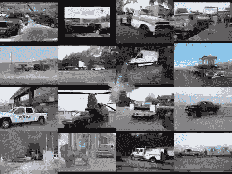

# 我在 ML 工作一年学到的快速提示

> 原文：<https://medium.datadriveninvestor.com/quick-tips-ive-learned-working-in-ml-for-a-year-62282c7fb1c8?source=collection_archive---------10----------------------->

在这篇文章中，我想列出我在过去一年多时间里作为数据科学家/机器学习研究助理所学到的一些东西。

我进入数据科学、经历数据科学以及在其中工作的旅程很长，很多时候我仍然觉得自己像个新手。我会尽量简短，因为我知道你们都想回去写代码。

 [## 2019 年最值得学习的编码语言|数据驱动的投资者

### 在我读大学的那几年，我跳过了很多次夜游去学习 Java，希望有一天它能帮助我在…

www.datadriveninvestor.com](https://www.datadriveninvestor.com/2019/02/21/best-coding-languages-to-learn-in-2019/) 

我们都在努力变得更好，所以这里有我的小清单来帮助你在你的手艺上变得更好。

让我们开始吃吧。

# 第一:复制和粘贴代码

我非常喜欢复制和粘贴代码。我甚至没有谈论来自随机 Githubs、Stackoverflow 或博客的代码。我指的是我在以前的项目中生成的代码或我当前正在创建的代码。

尤其是当您可视化数据或对数据框进行快速修复时，很容易养成尝试随机事物的习惯，直到某些东西起作用。

但是我的 PI 总是说(他说了一堆很棒的话):

> 如果您发现自己在复制和粘贴自己代码来完成一个简单的任务，那么可能是时候创建一个函数和/或一个全局变量了。

我超级懒，但尽管前期成本很高，这一招还是会让你走得很远。

# 第二:目录结构

这些既是祝福，也是痛苦。在学习编码之前，我认为自己是一个真正有条理的人。学习编码后，我意识到当你只是想让简单的事情工作时，这种组织的力量会受到严重的阻碍。

我这样说的意思是，我通常会尝试创建一个示例 CSV 文件或 numpy 数组，以查看某个函数是否以正确的格式返回和存储我想要的内容。

如果你这样做的次数足够多，你的主文件夹就会被文件塞满。如果你碰巧把它放在那里，几个星期后又回来了，祝你好运去理解你的外星人输出。

所以，请创建具有有意义的名字的文件夹，这样你就可以知道文件夹里有什么，而不必真的进入它们。

现在—拥有太多的文件夹会产生同样的问题，这导致我们…

# 第三:边走边打扫

如果你发现自己产生了大量的浪费(例如，大量的文件夹、重复代码、注释代码或文件)，你需要花一些时间把这些乱七八糟的东西放到一个垃圾文件夹或杂项文件夹或其他什么地方。

*眼不见，心不烦。*

当您开始删除不必要的代码时，您将不会有充满死代码的长脚本或笔记本。它会让你的代码*变得漂亮*，这是值得的。此外，你将能够移除现在或以后可能给你带来麻烦的变量或实例。

所以——当你勇敢前行时，保持清洁。

我希望这些建议能帮助那些需要帮助的人。我还学到了几个，但这应该是一个好的开始。

我们都在艰难/有趣的编码之旅中磕磕绊绊。

感谢阅读。