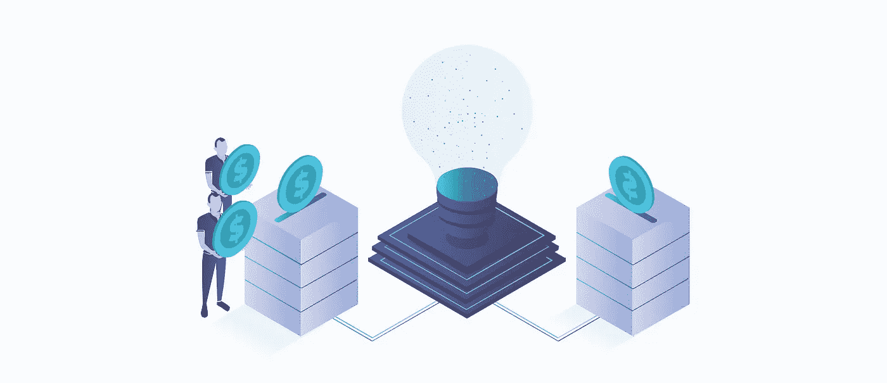

# 应收账款管理 A 到 Z

> 原文：<https://medium.datadriveninvestor.com/receivables-management-a-to-z-18f1c829b066?source=collection_archive---------17----------------------->

(Image Credits: eCollect)

你需要知道的关于你的首要任务的一切:应收账款管理。

## 一个为使用人工智能的自动化

人工智能实现了决策过程的自动化，无需人工干预。由于花费太多时间、成本和精力而被避免的流程现在是可行的。对于应收款管理来说，这意味着诸如对发行人身份的研究、通过各种渠道的人工联系、电子邮件通信等问题都是完全自动处理的。

## 商业智能

利用商业智能和预测分析改进应收账款管理流程，使企业能够根据统计数据做出更好的决策并优化绩效。关于客户沟通、风险水平和处理步骤的明智决策对于创建成功的工作流程至关重要。

## C 为客户沟通

过时的沟通方式被高效的以客户为中心的方法所取代。这包括数字多渠道沟通，这种沟通完全是根据客户偏好量身定制的，目的是维持长期关系，防止“好客户”流失。

## D 为催款

催款是应收账款管理链中至关重要的一环，是指在出现付款延迟的情况下，经常进行的付款提醒。如果处理得当，专业催款会大幅提高收款率，并确保留住客户。

## e 代表电子发票

电子发票，也称为电子发票，是一种机器可读的文件，它可以实现发行人、合作伙伴和买方之间的自动交换。与 pdf 或纸质发票不同，电子发票减少了手工操作并消除了人为错误，而人为错误会导致公司成本增加或处理时间延长。可靠的应收账款管理策略始于发票流程的完全数字化。

## f 代表保理业务

保理是自由职业者和公司的一种营运资金融资。特别是在应收账款管理中，保理业务经常被用来增加企业的流动资金。通过将未支付的应收款折价转让给保理机构，公司避免了寻找额外金融手段(如贷款)的必要性。现代金融科技公司在应收账款管理领域开展业务，通常以具有成本效益的价格提供保理服务。

## g 代表 GDPR

关于新的欧洲一般数据保护条例(GDPR)，应收账款管理公司作为金融服务提供商，在与客户的关系中充当数据控制者。可靠的金融服务提供商应确保数据使用方式的完全透明，这意味着提供有关数据处理、数据存储和数据保护的可见信息。

## H 为高端技术

在应收账款管理中使用高端技术为企业提供了比以往更多的前景，而不会耗尽他们的组织资源。技术和自动化的新发展为公司提供了脱颖而出和改善与客户关系的机会。

## 一、发票 2 现金

任何企业都可以轻松地将智能发票、数字催款、专业争议管理、客户沟通和债务催收作为一体化解决方案，并从有保证的合规性覆盖和基于人工智能的应收账款管理中获益。

## j 代表管辖权

管辖权，特别是在跨国界应收款管理中，提出了当当事人位于不同国家时哪个法院有权处理法律案件的问题。由于基于当地的合规性规则和零散的欧盟政策，在欧盟处理国际索赔时应考虑具体的处理步骤。

## k 代表 KYC

KYC 代表“了解你的客户”，指的是在与潜在合作伙伴(客户)开展业务之前，与收集和核实其信息相关的法定程序和入职工作流程。它旨在评估潜在的风险，避免来自关系的非法行为。

## l 表示延期付款

未按时付款通常被称为延迟付款或逾期付款。这种支付发生在 B2B 和 B2C 关系中，对借贷双方都至关重要。债权人有权要求利息，并在延迟后立即聘请催收机构。

## m 代表管理营运资本

及时将应收账款货币化对公司的流动性至关重要。这意味着公司(尤其是中小企业)需要有效的解决方案和现代收款策略，以减少延迟付款的风险和额外的行政和财务负担，这些都需要外部融资。这种战略往往涉及外债催收机构，这些机构接管催收过程，以换取固定费用或少量佣金。

## n 用于谈判和争端管理

成功的应收账款管理链的主要部分是正确处理争议管理案例。简而言之，这是发行人和客户之间以友好和理解的方式协商有争议文件的过程。客户沟通的改善加快了收款速度，加快了现金流。

## o 通过机器学习进行优化

机器学习模型和预测分析可用于优化业务流程、增加收入，并极大地影响债务催收的结果。系统可以评估例如输入通信事件和当前可接收状态之间的星座，并触发下一个可能的处理步骤。目标是确定在何种条件下哪种沟通方法最有效，以便创建适合债务人情况的最佳程序处理。

## p 为法律前债务收集

这是一个基于动态可扩展通信模式的自动化偏见收集过程。数据驱动的应收账款管理可以作为企业和客户之间的中介，帮助避免误解，从而提高这一阶段的收款率。它还提供了通过数字渠道进行快速便捷沟通的机会，并有助于改善客户关系。

## 对于合格的专业人员

应收账款管理中通常使用的先进技术和自动化并不排除对合格专业人员的需求。在每一项受监管的金融业务中，法律专家应监控对特定国家/地区法规的遵守情况，并制定公司在相应国家/地区正确管理应收账款的指导方针。

## r 代表 RESTful API

RESTful 或 REST(表述性状态转移)API 是一个应用程序编程接口，它使用 HTTP 请求来获取、上传、发布和删除数据。它是全球最常用的 API 之一。由于需要以标准化的方式在不同的合作伙伴之间传输数据，易于实现的 API 正在成为应收款管理(以及其他领域)的基石。

## s 代表自助服务平台

自助服务平台被视为应收款管理的最新创新之一。这些工具以特定的客户群为目标，并为那些喜欢更私密的实践方式的客户提供了一种替代的沟通渠道。在这样的平台上，客户可以监督其索赔的当前状态，并随时获得全部信息，只需在线即可。实施聊天机器人有助于建立分期付款计划，延期付款或澄清矛盾。

## 透明度和合规性测试

在管理应收账款时，确保完全透明和合规已经是必须的了。应收账款管理现在比以往任何时候都更受监管的影响。基于技术的流程保证符合法律和客户特定的参数，如流程、货币、催款费用金额、语言等。

## u 为了用户体验

用户体验设计有助于让客户在 web 和移动应用程序中更简单、更容易地管理应收账款。这不仅是一个更干净、更专注的用户界面，有助于简化关键旅程，而且还专注于一些更令人沮丧和耗时的元素，如创建客户档案和监控索赔进度。

## v 用于验证

数据为王！这就是为什么数据验证是成功的应收账款管理的核心要素。验证意味着数据被仔细检查和“清洗”,以确保其质量足以使用。它包含与客户相关的关键数据点的比较和调整，目标是增强和改善即将到来的互动。

## w 代表基于网络的软件解决方案

在应收账款管理中使用基于网络的软件解决方案，消除了在每个管辖区设立实体办公室的需要，并能够轻松实施一个完全集成的平台。Web 应用程序应该提供完整的功能，并涵盖流程的所有步骤。它们可用于提交客户和索赔、监控进度和更新数据。这些网络应用程序非常适合每月索赔或发票数量较少的债权人。

## X 代表 X 和 O

在选择合适的应收账款管理合作伙伴时，每个公司都应该了解这项业务的细节。或者换句话说，他们需要了解基本要素和趋势，以便做出最佳决策。公司应该意识到他们的 RM 合作伙伴将直接与他们的客户沟通。除了费用、收款率和容量等确凿的事实之外，公司还应该了解收款合作伙伴如何处理客户、如何保护自己的形象，以及他们的流程有多透明。

## Y 代表 Y 代

Y 一代(也称为千禧一代)是出生于 80 年代和 90 年代之间的一代，他们越来越多地使用数字技术和先进媒体。了解这一代人的特点以及他们构成了一个重要的客户群体，需要新的客户沟通方法。商品和服务提供商通常需要通过数字通信渠道和自助服务平台进行跨境运营，以保持竞争力。在这种环境下，充分的应收账款管理高度个性化，因此以客户为中心，对公司的流动性有着至关重要的影响。

## z 代表楚格

楚格不仅是瑞士的一个州，已经成为欧洲的金融科技中心之一，也是 eCollect 的所在地，eCollect 是管理所有应收账款的一次性解决方案。

*作者:Yuliana Lefedjieva，企业传播经理*