# Myers-Briggs 人格类型数据的网络分析结果

> 原文：<https://medium.datadriveninvestor.com/results-from-a-network-analysis-of-myers-briggs-personality-type-data-be7756d123c7?source=collection_archive---------17----------------------->

# 摘要

在先前对 Myers-Briggs 人格类型在社会中的流行进行分析的基础上，我们扩展了对适应情景和进化路径的分析，以探索这些类型之间出现的路径网络。这概述了变革力量的网络。

# 介绍

这是一系列报告中的第三份。

1.  第一份报告介绍了这种方法，并检查了整个美国人口的 Myers-Briggs 型频率数据。
2.  [的第二份报告](https://medium.com/@Anandavala/what-can-data-science-reveal-about-the-gender-based-structure-of-society-44ed4b606b58)扩展了这一分析，以比较男性和女性的类似数据。

而之前我们探索了与迈尔斯-布里格斯人格类型相关的系统压力、适应情景和进化路径。在这里，我们考察了由于系统压力而在不同类型之间形成的网络。

我们构建的网络中，每个节点代表一种特定的人格类型，每条边代表一种适应情景，在这种情景中，存在着从一种类型转变为另一种类型的系统性压力。注意:如果有保持不变的压力，这不会导致优势。

因此，这个网络提供了一个在类型空间内变革力量的概观。

然后，我们将页面排序算法应用于网络，以识别网络中的汇聚点(吸引子)，这些汇聚点使用不同的颜色和节点大小来突出显示。

每个网络都讲述了一个复杂的故事，然而这里不会试图解释结果，它们只是为了以后的解释而呈现。

所有的网络都是使用来自 statistical Brain 的[数据计算出来的，statistical Brain](https://www.statisticbrain.com/myers-briggs-statistics/)拥有美国人口中 Myers-Briggs 人格类型的单独总数、女性和男性患病率统计数据。

用于进行该分析的 R 代码可以在 github 上找到[，特别是用于创建下图的文件](https://github.com/anandavala/SCA)[Myers-Briggs-data-analysis . R](https://github.com/anandavala/SCA/blob/master/src/myers-briggs-data-analysis.r)。

有三种主要方法来创建和可视化这些网络；最大压力、全管网和微调管网。

# 最大压力网络

为了创建最大压力网络，对于每个节点，我们只考虑压力变化最大的边，而忽略所有其他边。

这给出了类型空间内**最可能的**进化路径图。

# 女性最大压力网络

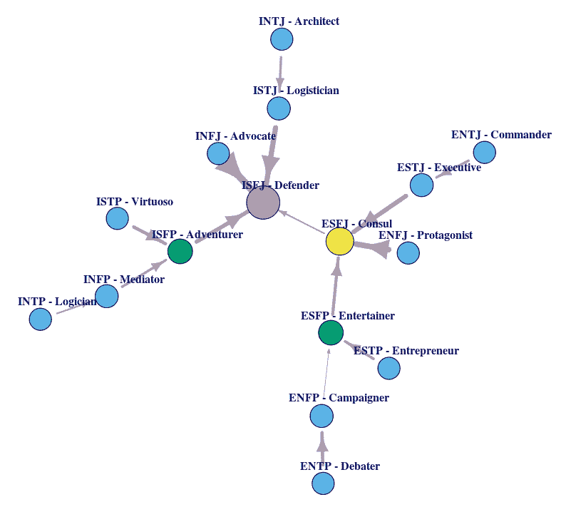

# 男性最大压力网络

# 总(两者)最大压力管网

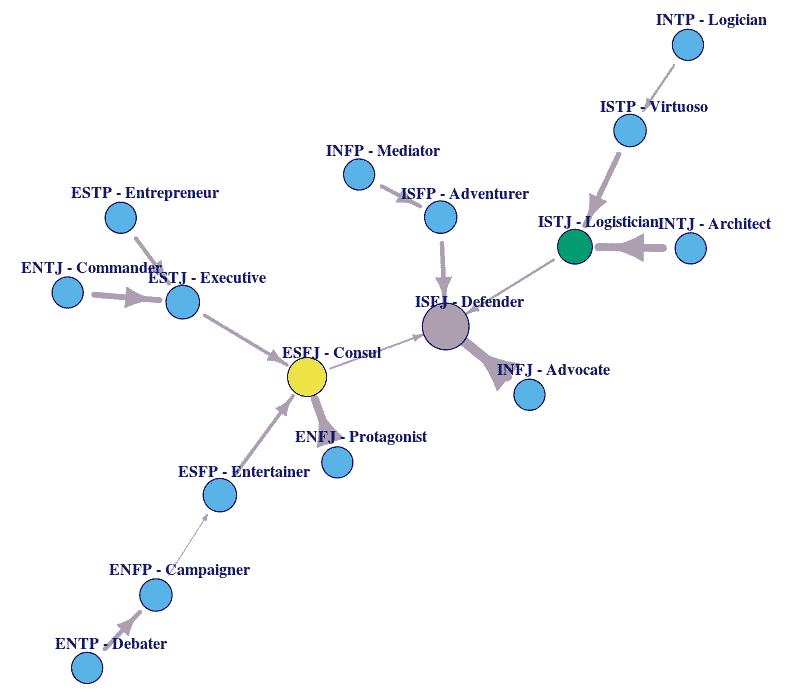

# 完全网络

完整的网络是通过考虑存在系统性变革压力的每一个边缘而创建的。

这给出了类型空间中所有进化路径的地图。

# 女性全网

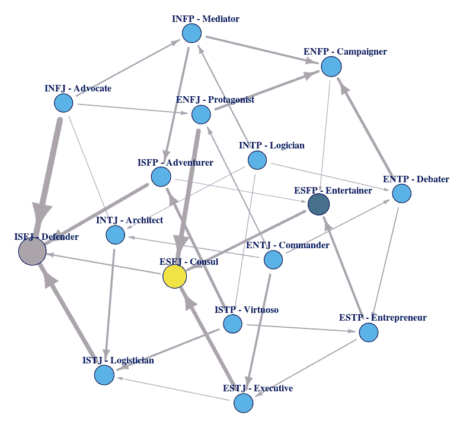

# 男性全网

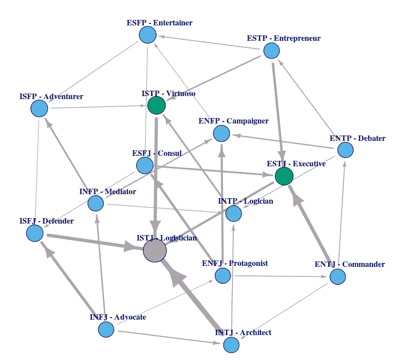

# 全网络总计

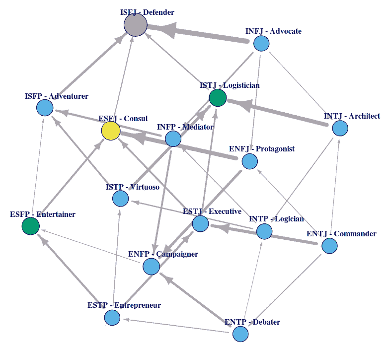

# 修剪网络

为了创建修剪的网络，我们采用完整的网络并移除边，仅保留那些在特定百分位数内的边，例如前 50%的边权重。

这给出了边权重大于特定阈值的所有进化路径的**图。**

# 最小连通网络

我们考虑的第一个微调网络是最小连通的。为此，我们逐渐修剪网络中的弱边，直到进一步修剪导致孤立(未连接)节点。

## 女性最小连通网络

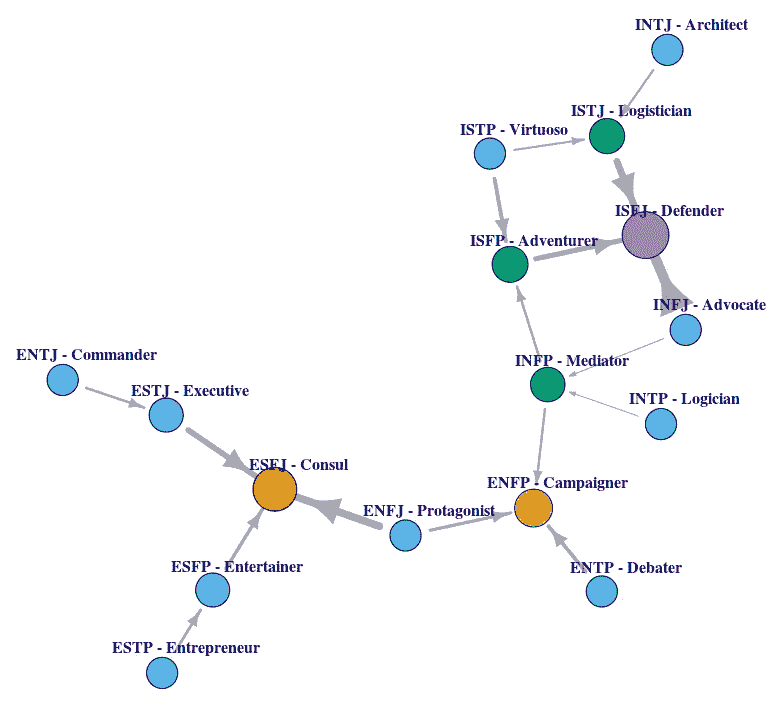

## 男性最小连通网络

## 全最小连通网络

# 子群网络

我们考虑的下一个微调网络是子群。为了创建这个，我们继续从网络中修剪弱边，直到有少量的子组和不太多的孤立(未连接)节点。

## 女性小组网络

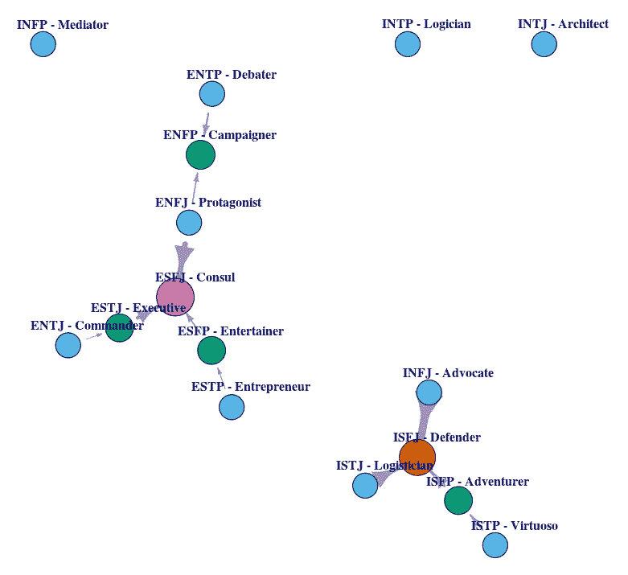

**女 1 子组**

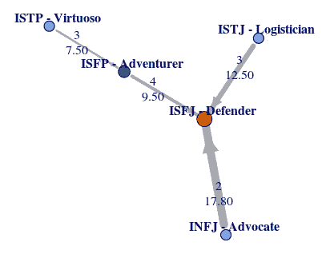

**女性子群 2**

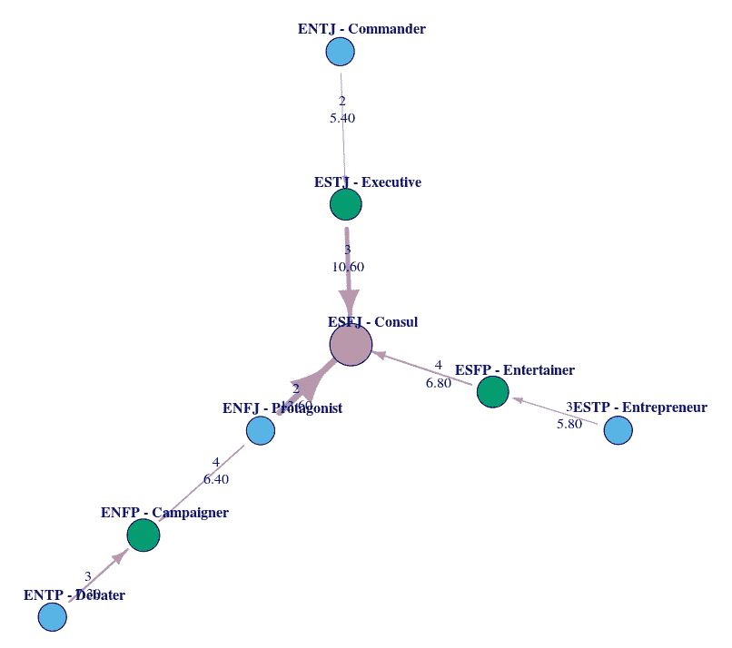

## 男性子群体网络

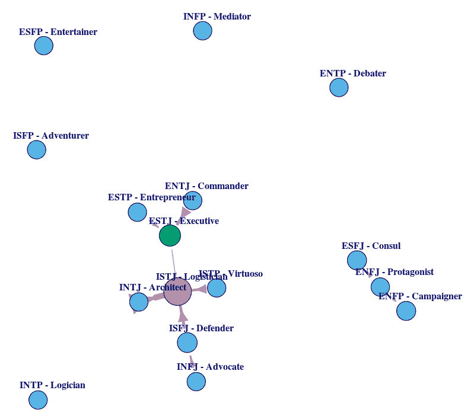

**男性亚组 1**

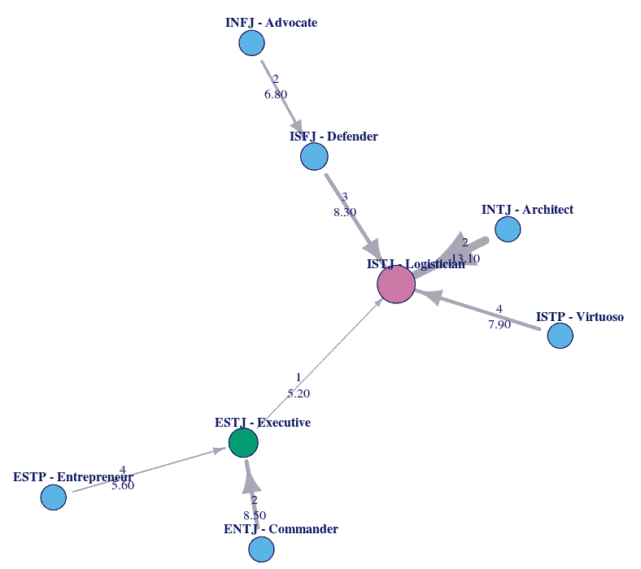

**男性亚组 2**

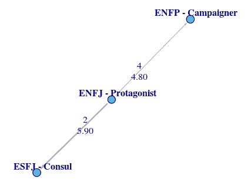

## 子群总数网络

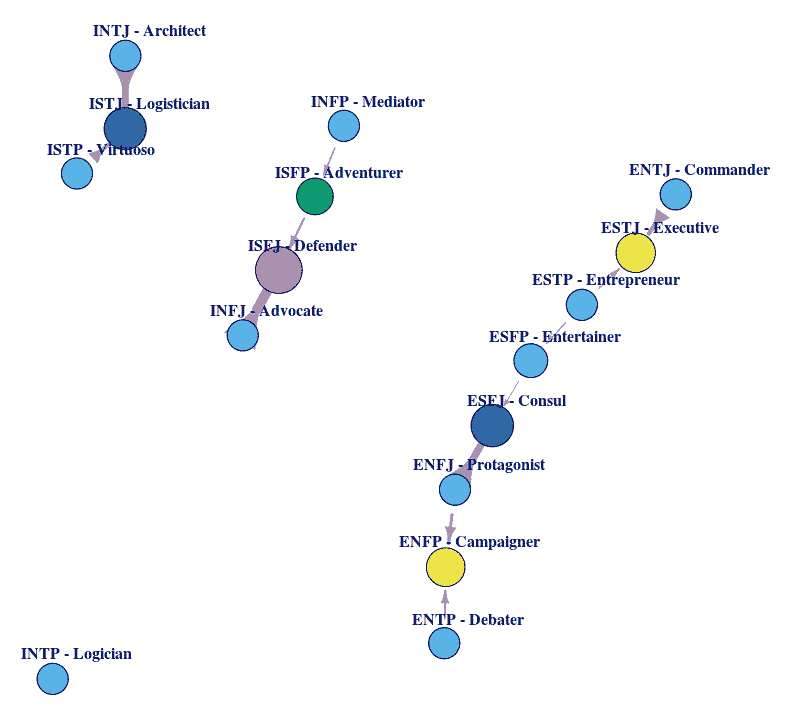

**总分组 1**

**总分组 2**

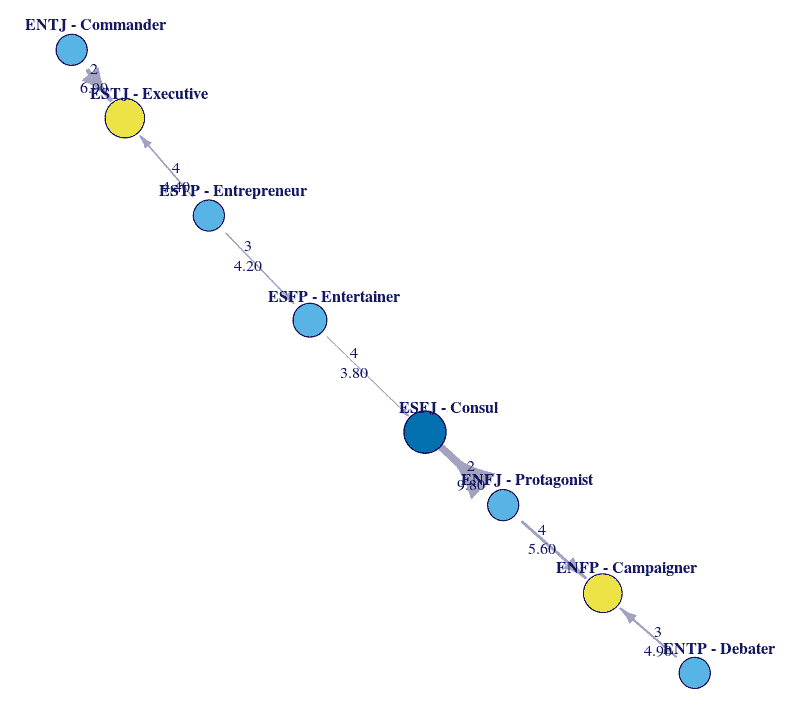

**总分组 3**

# 核心网络

我们考虑的下一个微调网络揭示了子群的核心。为了创建这个，我们继续从网络中修剪弱边，直到子组变小并且有许多孤立的(未连接的)节点。

## 女性核心网络

**母芯 1**

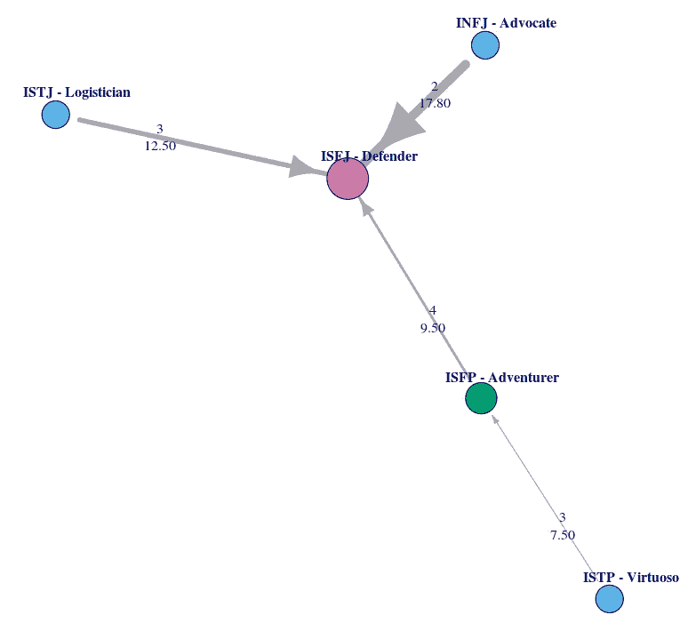

**女核心 2**

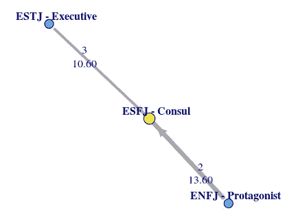

**母芯 3**

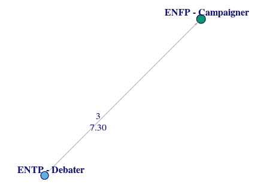

## 男性核心网络

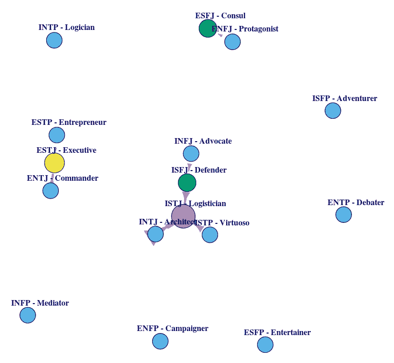

**公芯 1**

**公芯 2**

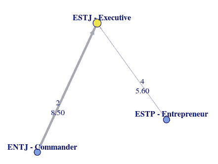

**公芯 3**

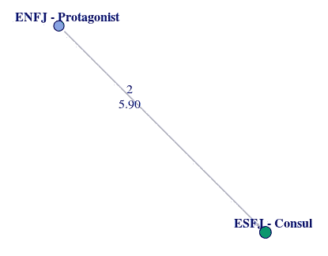

## 核心网络总数

**总核心 1**

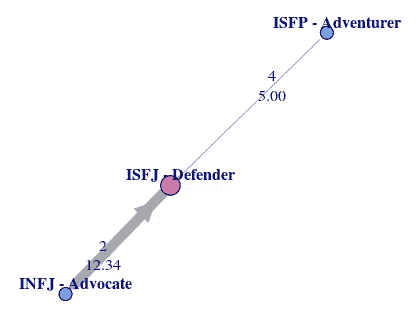

**总核心 2**

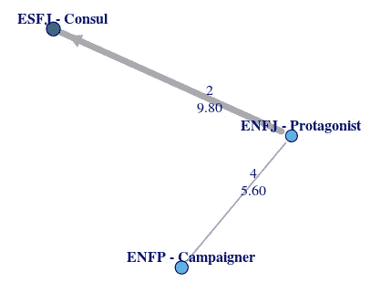

**总核心 3**

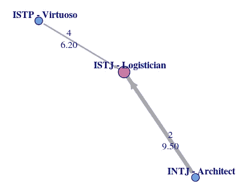

**总核心 4**

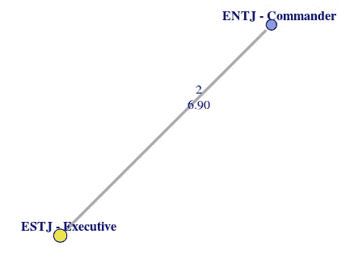