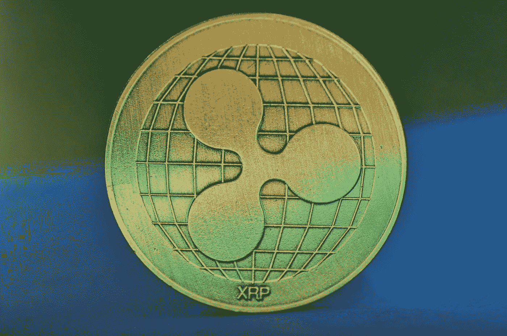
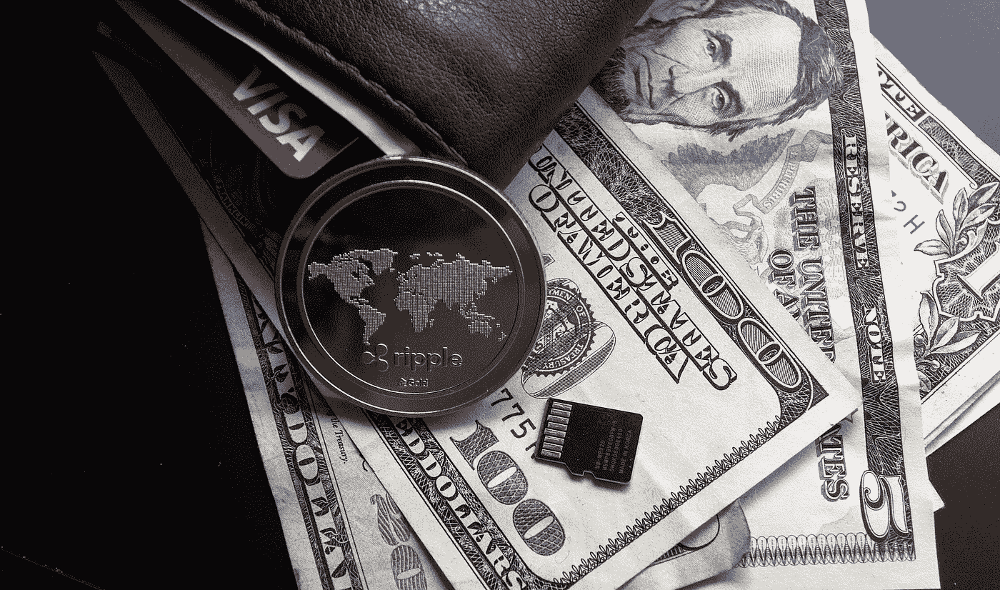

# 涟漪|解释道

> 原文：<https://medium.datadriveninvestor.com/ripple-explained-4df46678e0bd?source=collection_archive---------4----------------------->

# 波纹概述

ipple 是一个用于支付系统的加密货币平台，专注于无需退款的交易，以直接、安全和快速的方式进行支付。该协议支持加密货币、代币和许多其他对象(例如积分、飞行常客里程和移动通信分钟数)。

Ripple 网络的加密货币是[**【XRP】**](https://ripple.com/xrp/)而 Ripple 的一个主要特点就是 [**共识**](https://developers.ripple.com/xrp-ledger-overview.html) 账本，更多关于这个可以在 [**白皮书**](https://ripple.com/files/ripple_consensus_whitepaper.pdf) 中找到。

ripple Vs. Bitcoin & ethereum

# Ripple 的创始人

总部位于旧金山的美国公司 [Ripple Labs](https://ripple.com/) 创建了 Eexchange 网络和支付协议，首席执行官是 [Brad Garlinghouse](https://en.wikipedia.org/wiki/Brad_Garlinghouse) 。

# 解决方案

Ripple 和比特币的根本区别在于，虽然比特币是作为用户之间的替代支付系统而创建的，不需要第三方，但 Ripple 是作为银行系统的替代支付方式而创建的(尽管公平地说，用户仍然可以使用 XRP 货币进行支付)。

# 优势

与 BTC 和 ETH 相比，Ripple 的一个优势是——包括 Ripple 的交易时间只有 4 秒。ETH 和 BTC 的时间通常是 2 分钟和 1 小时。

ripple | Advantages

另一个优势，或者更好地说是另一个区别，是 Ripple 没有使用标准的区块链，而是通过网络参与者的共识来确认交易，这对于许多银行和支付网络来说是一个很大的信心。

下一件好事是，使用 Ripple 的支付可以在任意资产(法定货币、加密货币、代币、商品、美国运通积分等)中进行。).

Ripple 可能会创建一个银行和金融机构网络(= " ***价值互联网*** ")，这可能会大幅降低支付成本，并将支付结算时间从目前的 3-5 天(银行)减少到几秒钟。

另一大优势是，与比特币相比，Ripple 愿意与传统金融合作，因此通常更容易被全球金融机构接受。

最后，Ripple 已经有了一个工作平台，这体现在它的估值上。

就速度而言，BTC 处理约 7 tps，瑞士联邦理工学院 15 tps，XRP 高达 1500 tps(每秒事务数)。

# 不足之处

与 Monero 和 Zcash 相比，Ripple 的优势在于它不是匿名的。

相比以太坊和类似平台，Ripple 不支持智能合约。

XRP 已经有 1000 亿英镑(没有采矿)，目前，我们有大约 400 亿英镑在流通。XRP 的供应在很大程度上由 Ripple(一家公司)控制，该公司每月可以释放多达 10 亿 XRP，这在我看来根本不是一个非常“分散”的解决方案。

另一个微妙之处是 XRP 的佣金模式和通货紧缩模式(这本身并不是一个缺点；看你的观点了)。

> “为了保护 XRP 账本不受垃圾邮件和拒绝服务攻击的干扰，每笔交易都必须销毁少量 XRP。这种交易成本会随着网络负载的增加而增加，使得有意或无意地使网络过载的成本非常高。…网络要求的标准交易的当前最低[交易成本](https://developers.ripple.com/transaction-cost.html)为 0.00001 XRP (10 点)。它有时会因高于平时的负载而增加。”

因此，对于每笔[交易](https://developers.ripple.com/transaction-cost.html#beneficiaries-of-the-transaction-cost)，用户通常会向 XRP 支付 0.00001 英镑，在我看来，这并不是真正的佣金，而是一种反垃圾邮件的措施，因为系统支付后会被烧毁，导致硬币总数减少。通过这种方式，该模型是通货紧缩的(硬币的总量将随着时间的推移而减少，这意味着硬币的价格将增加)。此外，这也是一种反攻击措施，因为攻击期间的大量交易会耗费大量成本。

最后，我看到了各方利益之间的轻微脱节:作为一家公司，Ripple 可能希望更高的 XRP 价格，但用户和软件开发商会喜欢更低的价格！

ripple | coin

# 筹集的资金

Ripple 可以通过解锁其持有的 XPR(目前 XRP 600 亿)来获得资金。最重要的事件发生在 2016 年，当时 Ripple 从包括谷歌在内的非常可靠的[机构](https://www.cnbc.com/2016/09/15/google-backed-blockchain-start-up-ripple-raises-55-million-from-big-banks.html)筹集了 5500 万美元。

# 价格影响

T 去年，XRP 的价格在 BTC 和美元之间波动，目前(18/11/18 世界协调时 13:30)价值[0.510072 美元](https://xrpcharts.ripple.com/#/markets/BTC:rvYAfWj5gh67oV6fW32ZzP3Aw4Eubs59B/USD:rvYAfWj5gh67oV6fW32ZzP3Aw4Eubs59B?interval=15m&range=1d&type=line)或 BTC 0.00009126 (=1/10958)，市值刚刚超过 200 亿美元，流通供应量约为 XRP 400 亿美元，截至今天，即 2011 年 11 月 18 日，XRP 成为[第二大密码商](https://coinmarketcap.com/currencies/ripple/)三天前，2018 年 11 月 15 日，XRP 的市值已经超过了 ETH，现在是第三大加密公司。

无论是作为一家公司还是作为 XRP 货币本身，对 Ripple 进行估值都有许多潜在的方法。

公司估值的一个替代方案类似于，例如，脸书的估值，使用 Ripple revenue build(大部分是银行的软件付款)按地理/类型预测未来年收入，然后使用历史和预测财务报表中的输入(成本、利润)，对其进行估值、贴现并增加剩余价值。

另一种方法是获得一定量的 XRP，根据市场价值进行评估。在这种情况下，截至世界协调时 2018 年 11 月 19 日 11:30，我们将达到约 280 亿美元。

有许多方法介于两者之间，但在我看来，在与区块链公司合作时，我们需要使用几种估值技术，传统的估值方法应该进行调整。加密评估的确切方法超出了本文的范围。

最后，加密市场与行为金融密切相关，我们需要考虑行为(和行为偏差)，无论是主动交易还是被动投资加密货币和一般数字资产。

ripple | Digital Money

# 竞争

ipple 在加密领域没有直接的竞争对手，因为它与大多数加密货币有着根本的不同:它更加集中，完全不知道货币，并使用概率投票来确认交易。

有趣的是，SWIFT 可以被视为竞争对手。

# 波纹替代品

这里没有直接的选择，但考虑投资 XRP 的投资者可能会关注 BTC。

在我看来，XRP 是一个可靠的 HODL 长期投资。与大多数加密货币相比，XRP 的风险通常更低，因为它有真实项目和传统世界银行系统的强大联系作为支持。

另一方面，XRP 不是一种“经典”的加密货币，它没有完全去中心化的性质，它的创建理念与大多数加密货币不同。

最后，经过最近的运行，它可能是技术超买。

在我(HODL)看来，XRP 是添加到其他加密资产的一个很好的投资，因为 XRP 涵盖了一个完全不同的角度，有不同的回报驱动因素，因此从多样化的角度来看，将 XRP 添加到传统、另类和加密投资组合中也是一个好主意。