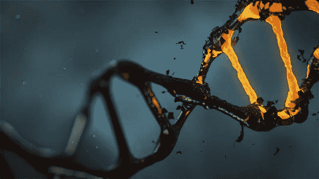

# 流氓基因组编辑扭曲了 DNA 伦理

> 原文：<https://medium.datadriveninvestor.com/rogue-genome-editing-twists-dna-ethics-6ed0c5378465?source=collection_archive---------25----------------------->

## 救生技术一头扎进医疗困境

基因组编辑是科学的前沿。这在道德上也有问题，在许多司法管辖区可能是非法的。

尽管如此，一位[的中国科学家宣布](https://www.sciencenews.org/article/chinese-scientists-raise-ethical-questions-first-crispr-gene-edited-babies)他编辑了两个人类胚胎的基因组，使它们能够抵抗艾滋病病毒。他将这些胚胎植入他们的母亲体内，后者生下了健康的双胞胎女孩。

[Iris Thiele Isip Tan](https://twitter.com/endocrine_witch)博士战战兢兢地注意到这一[进展](http://healthxph.net/master-class/genome-editing-have-we-opened-pandoras-box.html)。她是菲律宾大学医学院的内分泌学家和临床副教授。

 [## 抑郁症发作时，谁来医治治疗者？

### 医生容易受到压力和心理健康下降的影响

medium.datadriveninvestor.com](/who-heals-the-healer-when-depression-strikes-d72f4c10a4b9) 

谭指出，科学家使用的是 CRISPR/Cas9，根据的说法，这是“用于基因组编辑的最常见、最便宜和最有效的系统。”

“我们现在至少有——还有更多的我们不知道的吗？——地球上两个基因组发生改变的人类，”谭说。“我们打开了潘多拉的盒子吗？我们是在去 Gattaca 的路上吗？”

她提到了"[一部科幻电影](https://en.wikipedia.org/wiki/Gattaca)描绘了一个由[优生学](https://en.wikipedia.org/wiki/Eugenics%22%20%5Co%20%22Eugenics)驱动的未来社会，在那里，潜在的孩子通过基因选择被孕育出来，以确保他们拥有父母最好的遗传特征。"

“我们生活在一个种族主义和社会经济差距急剧扩大的时代，”谭说。“我们最不需要的就是某种生物学程序来助长某些群体在生物学上优于其他群体的错误观点。”

与其他医疗服务提供者一起，谭想知道编辑人类基因组是否正确，如果是，在什么情况下？

基因编辑可以被认为是最后的手段。例如，如果你携带一种使你易患乳腺癌的基因，那么为了预防而冒险进行基因编辑是否不值得呢？

“我觉得这个问题很难，”谭说。“我们应该修补我们的基因吗？这是进化的发展方向吗？

“就像其他事情一样，有利也有弊，”她说。“它可以帮助那些患有遗传疾病的人，但这些婴儿的遭遇是一个令人不安的例子。那些婴儿已经出生了。他们将传递他们基因组中编辑过的内容。有什么含义？”

生物化学家、内科医生和肺病学家 Earl Louis Sempio 博士指出，人类已经“编辑”基因几千年了，但是是通过植物嫁接以缓慢的试错方式进行的。

他还引用了美国国家科学院和美国国家医学科学院关于人类基因组编辑的[七大管理原则](https://www.weforum.org/agenda/2017/05/how-should-we-regulate-genome-editing/)。

“我喜欢[Leon Kass](https://en.wikipedia.org/wiki/Leon_Kass)博士——前[总统生物伦理委员会主席](https://en.wikipedia.org/wiki/The_President%27s_Council_on_Bioethics)——将健康称为‘有机体作为一个整体的良好运转’，”Amiel Villanueva 博士说，他是一位有抱负的医学专家、教育家和生物伦理学家。

“我们应该问问自己，像 CRISPR 这样的技术是否真的能实现这个目标，”Villanueva 说。“就基因编辑可以改善人类福祉而言，它可能是好的。但是我们也必须检查手段和后果。这就是伦理困境。”

# 意外的后果

他回顾了 CRISPR 背后的伦理考虑，包括胚胎破坏性研究和编辑可遗传基因组的影响。

Villanueva 说:“看起来，虽然一个特定的基因是有意的，但其他突变可能会导致不同的疾病，如不可预测的副作用。

潜在的伦理问题可能更深远。

“关于胚胎破坏，中国科学家植入了五个专门用于研究的胚胎中的四个，”Villanueva 说。“在俄勒冈州，CRISPR 研究所可能已经做了 58 个植入物。

"如果‘设计婴儿’是可能的，那么是什么阻止了那些具有不良特征的婴儿被淘汰呢？"他说。

 [## 寻求生命的礼物会遇到社会禁忌

### 一个人可以捐赠一份遗产，拯救许多需要帮助的人

medium.datadriveninvestor.com](/gift-of-life-confronts-social-taboos-321e0b91024b) 

生物伦理和医疗保健专家桑德拉·伍兹(Sandra Woods)对疼痛治疗的患者有了新的看法。她注入了“巨大的差异”来考虑:

*   可遗传的基因组编辑:通过改变 DNA 来改变后代的特征。
*   非遗传性基因组编辑:仅影响个体的变化。
*   治疗性遗传基因组编辑。
*   仅用于增强的可继承编辑。
*   治疗性非遗传或个体基因组编辑。
*   用于增强的非继承性编辑。

她在美国医学协会的[杂志上推荐了一个“很好的总结”。在那里，](https://twitter.com/JAMA_current)[纳菲尔德生物伦理委员会](https://twitter.com/Nuffbioethics)关注[治疗性和非治疗性](https://jamanetwork.com/journals/jama/article-abstract/2717816)可遗传基因组编辑。

另一个要考虑的因素是:如果 CRISPR 编辑过的婴儿在其他方面是健康的，这是否证明了研究人员的所作所为？

一个或两个数据点不是决定性的。这可能是一个好迹象，表明婴儿看起来很好，或者只是运气问题。无论如何，最终的影响可能在未来几年都不明显——在许多其他基因组编辑发生之后。

“尽管我对技术的使用感到兴奋，但有更安全的方式，”森皮奥说。“目的并不能证明手段是正当的。

“当知情同意和伦理审查被忽视时，记住科学在塔斯基吉研究中对男性的影响是有益的，”他说。

# 生物伦理旁路

伍兹不同情这位中国科学家。

“我的理解是，他绕过了纽伦堡审判后制定的所有生物伦理和研究伦理标准，以防止在没有真正知情同意的情况下进行研究，”她说。“没有伦理委员会审查或批准，或考虑这些婴儿或任何后代的风险。

伍兹说:“即使是最前沿的——著名的——研究人员也不明白编辑基因组的某些部分对其余部分的影响。”"如果社会选择可遗传的治疗性基因组编辑，非遗传的风险研究必须先于它."

如果一个病人后来被发现没有生病，这个问题就变得特别麻烦。

“如果他们没有那个病，但最后和别人在一起了呢？”伍兹说。"由于这种可遗传的编辑，他们的后代有遗传新疾病的风险."

 [## 社会是艾滋病患者最大的敌人

### 那些受影响的人被污名化、歧视和边缘化

medium.datadriveninvestor.com](/society-poses-as-hiv-sufferers-greatest-foe-942a3c9f6a9) 

Villanueva 建议跟着钱走。

他说:“我读过一些观点，认为选择编辑‘艾滋病毒基因’更多是出于个人利益，而不是婴儿的利益。”“后果永远不会使一个错误的行动变好。

“将婴儿暴露在巨大的伤害可能性中——最坏的情况是死亡——必须与未知的受益可能性进行权衡，”Villanueva 说。

基因组编辑的知情同意似乎是不可能的。当连掷骰子的人都对结果没有把握的时候，你怎么能被告知一次掷骰子的失败呢？好的或坏的结果的可能性到处都是。

“这里的病人是胚胎和后代，”森皮奥说。“真正的知情同意即使不是不可能，也不一定完全可行。

“这实际上是反方论点，”他说。"父母一直在为未出生的孩子的未来做决定。"

伍兹指出了生物伦理学家[亚瑟·卡普兰](https://twitter.com/ArthurCaplan)的一篇[奇异的文章](https://medium.com/s/story/the-monstrous-immorality-of-creating-genetically-engineered-babies-6c7e409c9490)，他说“生殖基因工程在伦理上是合理的，必须进行”，但不能“转入地下，对你的工作撒谎，让孩子处于危险之中”这位科学家的行为是“道德实验的怪物”

“这让我回到了医学和基础科学的基本概念，”伍兹说。“仅仅因为我们‘能’做某事并不意味着我们‘应该’这在社会层面尤其如此，对于可遗传的基因组编辑也是如此。"

另一个问题:科学界愿意在基因编辑中探索的“未知”的门槛是什么？

# 社区合作

“这不仅仅是得到父母的同意，因为基因库的结果会世代相传，”Villanueva 说。“因此，我们可能需要科学界和非科学界达成共识。

“在这种情况下，如果我们谈论遗传基因编辑，我们可能需要一个‘社区’的同意，”他说。"事实上，这个案例是明显的欺骗，就像塔斯基吉研究一样."

在 Villanueva 看来，有影响力的人需要站出来。

“它始于生物伦理委员会的严格研究，涉及各种利益相关者，包括不同的文化背景，”他说。“然后，像任何其他研究一样，它必须通过严格的伦理审查。但是风险更高，因为可能涉及的范围更广。

“不可否认的是，‘社区同意’的想法仍然只是一个抽象的概念，”Villanueva 说。“我听到一位生物伦理学家说，我们可能正在从一个个体伦理时代走向社群伦理时代。”

 [## 缩写不是字母完美的

### 被误解的 A、B 或 C 可能会危及患者的健康和安全

medium.datadriveninvestor.com](/abbreviations-are-not-letter-perfect-efa3b58a60a0) 

考虑到这一点，他回忆起希波克拉底誓言中的一个承诺:“首先，不要伤害他人。”

“生物医学技术只有在不故意造成伤害的情况下让人类过上更好、更有尊严的生活时才是好的，”Villanueva 说。“我不确定对艾滋病毒受体的 CRISPR 编辑是否已经打开了潘多拉的盒子，但它为我们作为人类是谁的讨论打开了大门。”

伍兹补充了基因编辑的另一个潜在副作用:后代“可能会因为这种不受控制的实验而失去繁殖能力。”

引用纳菲尔德的文章，伍兹说 T2 有三个层次的人受到基因组编辑的影响:

*   直接涉及的人:准父母和他们未来的孩子。
*   社会中可能间接受到影响的其他人和整个社会。
*   后代和整个人类。

“这打开了潘多拉的盒子，”森皮奥说。“我担心不知情和错误信息的社区，以及立法，会阻碍有效的和未来的道德进步。”

这提醒了谭，知情同意不仅包括所需的信息，还包括谁应该给予同意。这凸显了监管者在今天和未来几代人的角色。

“FDA 没有明确禁止基因组编辑，”谭说。然而，据说植入基因组编辑婴儿需要像新药一样的申请。这些申请目前不被接受。”

**关于作者**

吉姆·卡扎曼是拉戈金融服务公司的经理，曾在空军和联邦政府的公共事务部门工作。你可以在[推特](https://twitter.com/JKatzaman)、[脸书](https://www.facebook.com/jim.katzaman)和 [LinkedIn](https://www.linkedin.com/in/jim-katzaman-33641b21/) 上和他联系。

*原载于 2019 年 2 月 18 日*[*www.datadriveninvestor.com*](http://bit.ly/2Sa5Aip)*。*