# 使用 Docker 扩展 AWS 上的 GPU 处理

> 原文：<https://medium.datadriveninvestor.com/scaling-gpu-processing-on-aws-using-docker-226dee4bddc0?source=collection_archive---------14----------------------->

运行机器学习任务所需的 GPU 实例时间是一种昂贵的资源，当负载发生变化时，需要扩展它。 [Docker](https://www.docker.com/products/docker-engine) 方便了应用代码的部署。 [nvidia-docker](https://github.com/NVIDIA/nvidia-docker) 使 docker 能够在容器中使用 GPU。

本指南描述了一种解决方案，它可以在有负载时扩大机器学习预测能力，并在没有负载时将其减少到零，以及设置所需基础架构的所需步骤。

# 解决办法

它由以下几部分组成:

*   S3 桶—用于上传待处理图像的桶
*   SQS 队列——从 S3 向 gpu 发送消息的队列
*   ECS 集群—对容器实例进行分组的集群
*   Docker 映像—包含图像处理工作代码的 docker 映像(能够使用 GPU ),可从 ECR 获得
*   ECS 任务定义——运行 worker docker 映像的任务定义
*   EC2 实例—运行 ECS 任务的 GPU 实例
*   自动缩放组—使用自动缩放策略管理 EC2 实例号的 EC2 自动缩放组
*   Cloudwatch 警报—配置为根据 SQS 队列中的消息数调用自动缩放策略的警报
*   自定义 AMI —运行 nvidia-docker 的自定义 AMI

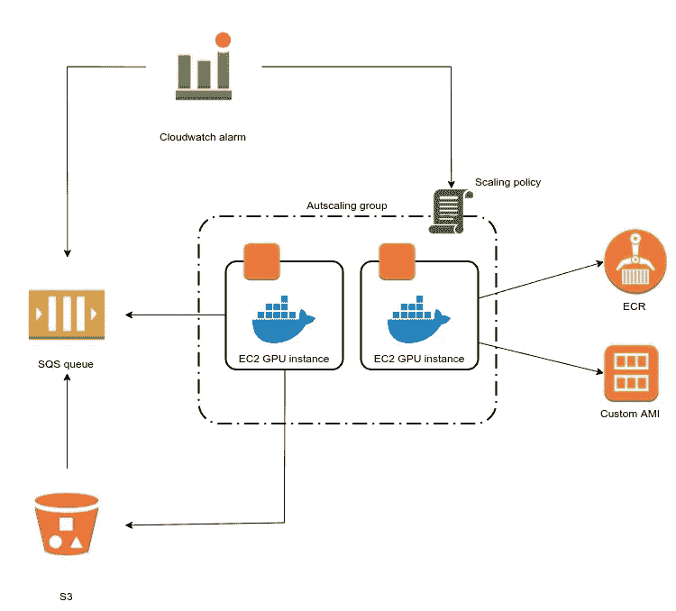

要处理的图像被上传到 S3 桶。S3 存储桶被配置为在上传新图像时通知 SQS 队列。Cloudwatch 警报读取 SQS 队列中的消息编号，并在消息编号发生变化时启动自动缩放策略的自动缩放操作。自动缩放组根据步进缩放策略启动或终止 EC2 实例。每个 EC2 实例使用一个定制的 AMI，它具有 Nvidia CUDA 驱动程序和 nvidia-docker，并注册到 AWS ECS 集群中。启动来自集群中定义的 ECS 任务——从 ECR registry 加载并启动带有应用程序代码的 docker 容器。应用程序从队列中读取消息，并处理来自 S3 的图像，直到队列为空，自动缩放组停止所有 EC2 实例。

# 配置

## 创建 SQS 队列

输入队列名称并保留默认设置

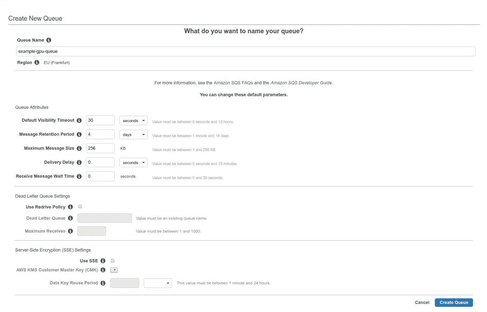

添加从 S3 推送消息的权限:

1.  编辑创建的队列
2.  将主体设置为每个人
3.  选择操作发送消息
4.  添加条件(限定符— `None`，条件—`ArnLike`，键—`aws:SourceArn`，值—`arn:aws:s3:*:*:your-bucket`)


## 创建 S3 时段并设置 SQS 通知

设置 S3 事件以将消息发送到 put 对象上创建的 SQS 队列:


## 创建自定义 nvidia-docker2 AMI

1.  从 EC2 控制台选择并启动深度学习基础 AMI(版本 12):

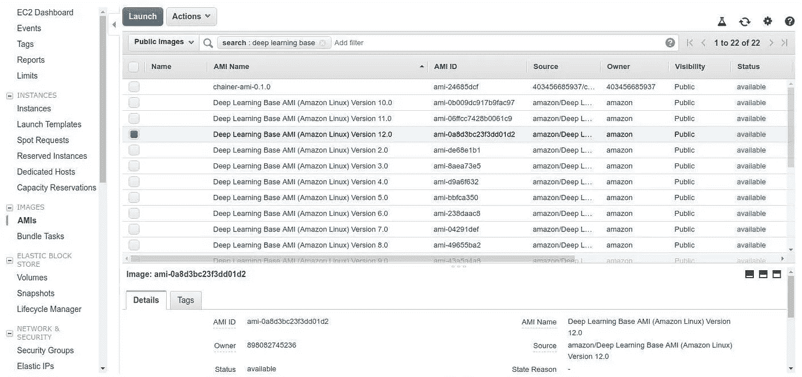

2.选择 GPU 计算实例类型(p2.xlarge):

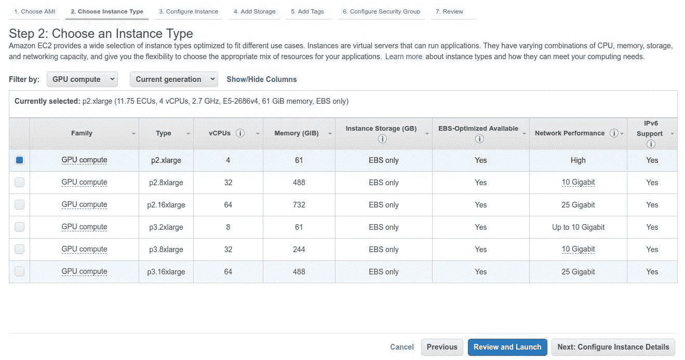

3.配置附加设置并启动。当询问时，选择 ssh 密钥或创建一个新密钥。

4.使用 SSH 连接到作为 ec2 用户启动的实例。

5.基础深度学习安装了 Cuda 驱动程序和 nvidia-docker2，总线没有 ECS 代理，因此必须通过执行`sudo yum install -y ecs-init`来安装

6.要验证 nvidia-docker 是否正常工作，请运行:

`CUDA_VERSION=$(cat /usr/local/cuda/version.txt | awk '{ print $3 }' | cut -f1-2 -d".")`

和

`sudo docker run --privileged --runtime=nvidia --rm nvidia/cuda:$CUDA_VERSION-base nvidia-smi`

结果应该是这样的:

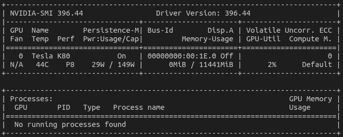

7.移除码头集装箱:

`sudo docker rm $(sudo docker ps -aq)`

8.删除 docker 图像:

`sudo docker rmi $(sudo docker images -q)`

9.从正在运行的实例创建一个新的 AMI。

## 设置 docker 存储库

如果您已经有一个 docker 存储库或使用公共存储库中的 docker 映像，您可以跳过这一部分。

从 AWS 控制台选择 ECS，并为 docker 映像创建存储库。

## 创建 docker 图像

为 Tensorflow 构建一个使用 GPU 的 docker 映像。

```
FROM tensorflow/tensorflow:1.11.0-gpu-py3RUN pip install boto3WORKDIR /app
COPY src/worker.py ./
CMD ["python","worker.py"]
```

添加代码以从 SQS 队列中读取消息并处理图像:

```
from keras.applications.resnet50 import ResNet50
from keras.preprocessing import image
from keras.applications.resnet50 import preprocess_input, decode_predictions
import numpy as npimport boto3
import json
import osmodel = ResNet50(weights='imagenet')
bucket = boto3.resource('s3').Bucket('ml-gpu-example')
queue = boto3.resource('sqs').get_queue_by_name(QueueName='example-gpu-queue')def processImage(file):
  bucket.download_file(file, file)

  img = image.load_img(file, target_size=(224,224))
  x = image.img_to_array(img)
  x = np.expand_dims(x, axis=0)
  x = preprocess_input(x)
  preds = model.predict(x)
  print('Predicted:', decode_predictions(preds, top=3)[0])

  os.remove(file)def startWorker():
  while True:
    for message in queue.receive_messages(VisibilityTimeout=8000, MaxNumberOfMessages=10):
      key = json.loads(message.body)['Records'][0]['s3']['object']['key']
      processImage(key)
      message.delete()startWorker()
```

构建 docker 映像并将其推送到 docker 存储库:

```
#!/bin/bashIMAGE_NAME=ml-gpu-example
REGISTRY_URL=XXXXXXXXXXXX.dkr.ecr.eu-central-1.amazonaws.comdocker build -t $IMAGE_NAME . 
docker tag $IMAGE_NAME $REGISTRY_URL/$IMAGE_NAME
docker push $REGISTRY_URL/$IMAGE_NAME
```

## 设置 ECS 任务

**1。为 ECS 任务创建角色**

第一步选择可信实体类型弹性容器服务任务


添加策略:

*   amazone C2 containerregistry readonly
*   亚马逊 3ReadOnlyAccess
*   云观察日志访问
*   AWSSQSFullAccess

结果应该如下所示:


**2。创建新的任务定义**

命名您的任务定义，选择您之前创建的角色，设置 cpu 和内存限制。因为我们将为每个 EC2 实例使用一个 docker 容器，所以我们可以将 p2.xlarge 实例的容量限制为:48000 MB 和 4096 个 CPU。


选择编辑容器并设置以下字段:

*   容器名称— gpu-worker-container(您选择的任何名称)
*   image-xxxxxxxxxxxxxxxxx . dkr . ECR . eu-central-1 . Amazon AWS . com/ml-GPU-example
*   内存限制(MiB) —硬限制/48000(p2 . xlarge 中的可用内存)
*   CPU 单位— 4096
*   基本—正确
*   入口点— python3，worker.py

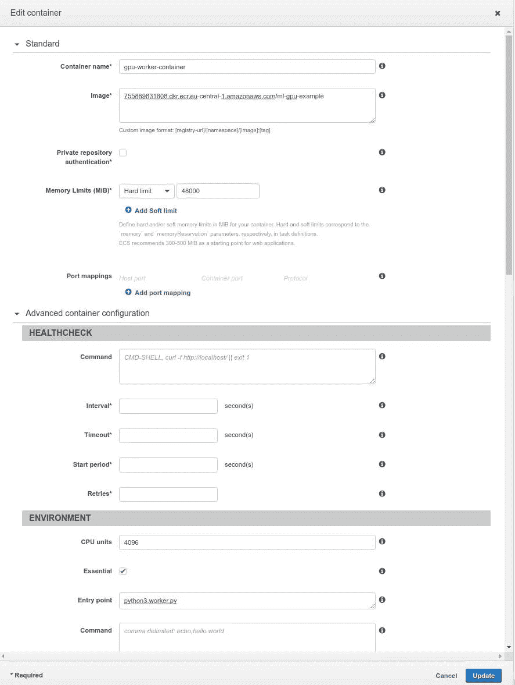

**3。创建新的 ECS 集群**

为简单起见，我们将创建一个新的空集群，它将使用默认的 VPC

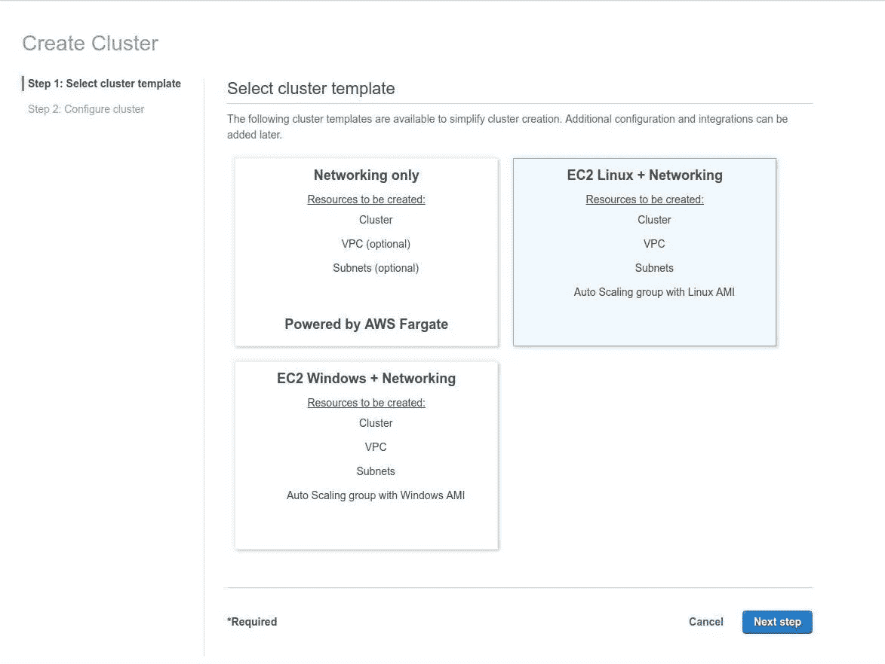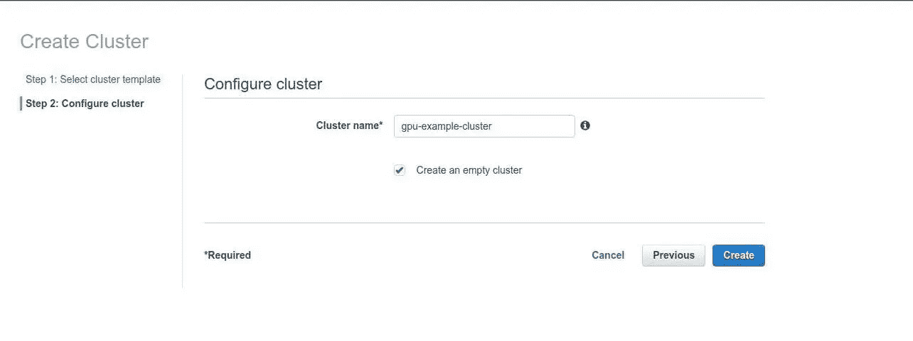

**4。在集群中创建服务**

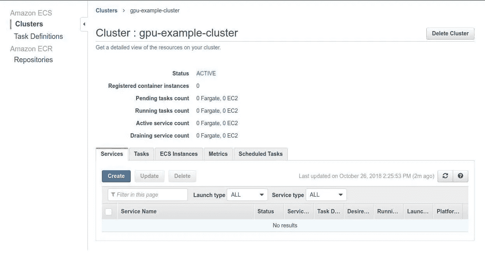

**配置服务:**

设置以下属性:

*   发布类型— EC2
*   任务定义—您之前创建的任务定义
*   集群—您的集群
*   服务名称—您的服务名称
*   服务类型—守护程序


**配置网络:**

保持负载平衡器类型无

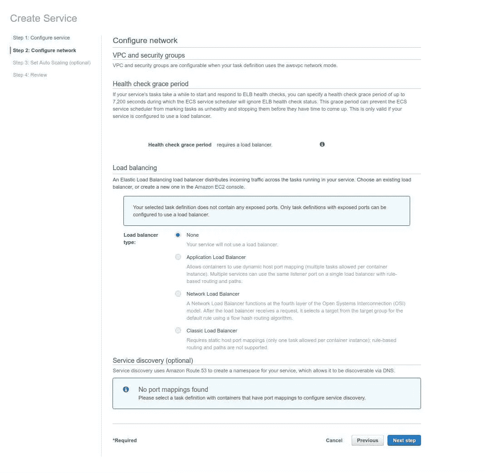

**设置自动缩放(可选)**

保持自动缩放不变:


## 为 EC2 创建角色

为 EC2 实例创建一个角色，以访问 ECS 所需的各种服务。

选择选择容器服务作为服务和用例:

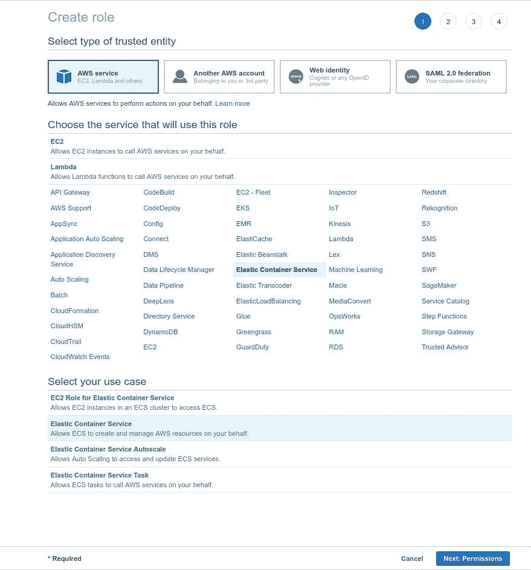

使用默认提供的策略 AmazonEC2ContainerServiceRole:


为角色添加名称并保存。

## 创建启动模板

设置属性:

*   启动模板名称:ml-GPU-示例
*   AMI ID:选择您创建的 AMI
*   实例类型:p2.xlarge
*   用户数据:

```
#!/bin/bash
echo ECS_CLUSTER=gpu-example-cluster >> /etc/ecs/ecs.config;echo ECS_BACKEND_HOST= >> /etc/ecs/ecs.config;
```

## 创建云监控警报

从云监控控制台单击创建警报按钮。为您之前创建的 SQS 队列选择 metric*approximatenumberofmessages visible*(示例-gpu-queue)，当队列中有消息时，该队列将处于活动状态。设置名称，删除默认操作并创建警报。

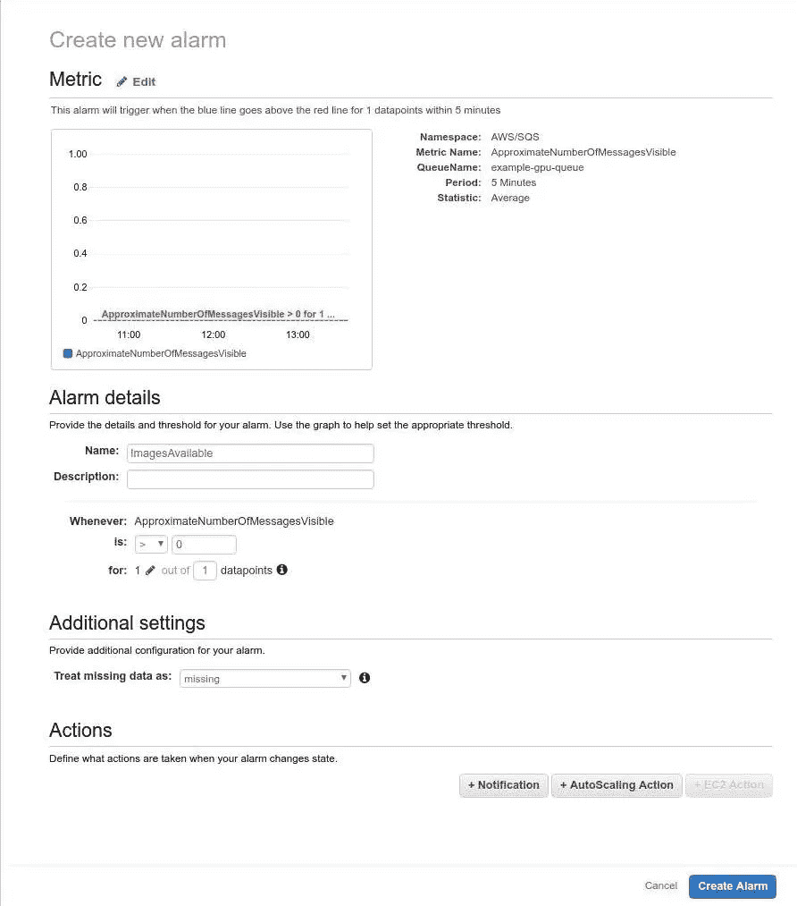

## 创建 EC2 自动缩放组

从 EC2 控制台选择自动缩放组，然后单击创建自动缩放组。选择从启动模板创建自动缩放组的选项，并选择之前创建的模板(gpu-example-template)。

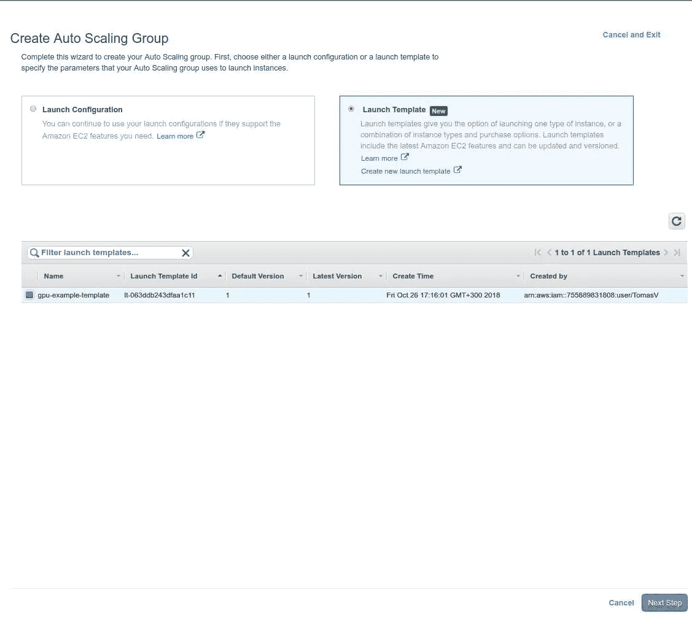

为 EC2 实例设置名称并选择子网，然后转到下一步:配置扩展策略。

使用步长缩放策略来设置自动缩放组的大小。如果设置了实例数量，而不是增加，则一个策略就足够了。选择之前创建的 Cloudwatch 警报，并根据队列中的消息数量定义设置实例数量的步骤。

当消息队列中至少有 1 条消息时，示例策略将缩放组大小设置为 1 个实例，当队列中的消息数量超过 100 条时，将缩放组大小设置为 2 个实例。当队列中没有消息时，将删除所有实例。

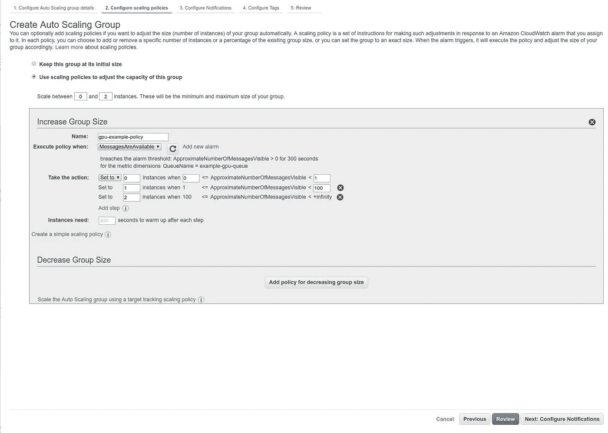

## 更新 Cloudwatch 警报以触发降尺度

只有当 Cloudwatch 警报的值处于 OK 状态(> 0)时，cloud watch 警报才会调用之前创建的自动缩放策略。当警报处于警报状态(为 0)时，我们需要调用策略。当警报处于警报状态时，我们需要添加另一个自动缩放动作:

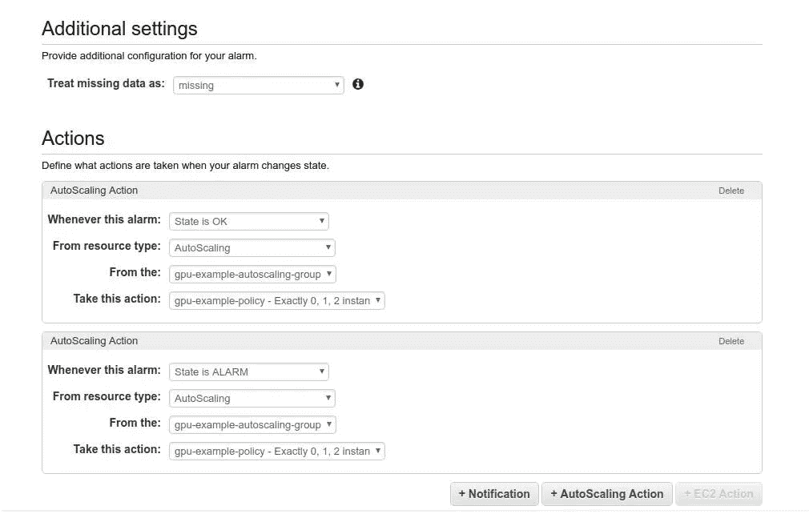

*最初发表于*[T5【github.com/tomas55/aws-gpu-docker-guide】](https://github.com/tomas55/aws-gpu-docker-guide/blob/master/README.md)*。*