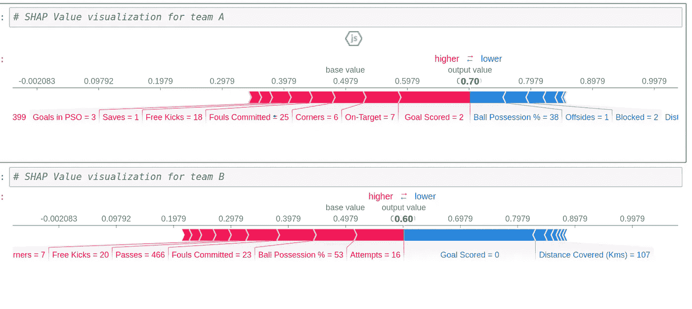

# SHAP 价值观:解读你的模型的有效方式

> 原文：<https://medium.datadriveninvestor.com/shap-values-the-efficient-way-of-interpreting-your-model-7de632ed7d2d?source=collection_archive---------2----------------------->

许多人说机器学习模型是“黑匣子”，从某种意义上说，它们可以做出很好的预测，但你无法理解这些预测背后的逻辑。这种说法是正确的，因为大多数数据科学家还不知道如何从模型中提取洞察力。

为了理解这一点的重要性，我们需要更仔细地了解模型准确性和可解释性的概念。直到最近，我们总是不得不在难以解释的准确模型(深度学习模型)和易于解释但牺牲了一些准确性的简单模型(逻辑回归模型)之间做出选择

在准确性和可解释性之间取得平衡可能是一件困难的事情。有了 SHAP 价值观，我们终于可以两者兼得了！

SHAP 值(SHapley 附加解释)对预测进行分解，以显示每个特征的影响。博弈论中使用的一种技术，用于确定合作游戏中每个玩家对游戏成功的贡献。换句话说，每个 SHAP 值衡量模型中的每个特征对每个预测的贡献大小，无论是正面的还是负面的。

## 实践中的 SHAP 价值观

为了更好地理解我们正在谈论的内容，我们将按照上面的图表，将 SHAP 值应用于 [FIFA 2018 统计数据](https://www.kaggle.com/mathan/fifa-2018-match-statistics#FIFA%202018%20Statistics.csv)，并尝试使用“控球”和“覆盖距离”等功能来查看哪支球队的球员更有机会赢得最佳球员。

首先，我们将导入库，加载数据并安装一个森林随机回归器。

然后我们将计算 SHAP 值和两个队的预测概率:A 队和 b 队

A 队和 B 队都有可能有一名球员获奖。因为他们都有 70%和 60%的概率赢得本场最佳。

现在让我们看看它们是否具有导致上述结果的相同特征和重要性。shap 包有一个很好的可视化结果的方法。

上图显示了每个要素对将模型输出从基础值(我们传递的训练数据集的平均模型输出)推至模型输出的贡献。将预测值推高的要素显示为红色，将预测值推低的要素显示为蓝色。

让我们比较两张图表:

对于 **Team_A** (第一张图)，将赢得本场最佳球员**的机会推低**的主要驱动因素是“控球”和“越位”。因此，将赢得最佳球员**的机会提高**的车手是“进球”和“命中目标”。

对于 **Team_B** (第二张图)，将赢得最佳球员**的机会推低**的主要驱动因素是“进球”和“覆盖距离”。因此，推动赢得本场最佳球员**机会上升**的驱动因素是“控球”和“尝试”。

我们现在可以看到，“控球”这一特征发挥了不同的作用，在 A 队中增加了机会，而在 B 队中减少了赢得最佳球员的机会。

这意味着每个团队都有自己的一套 SHAP 价值观。传统的特性重要性算法会告诉我们哪些特性在整个群体中是最重要的，但是这种一刀切的方法并不总是适用于每个团队。对一个团队来说是增加或减少机会的重要驱动因素的一个因素对另一个团队来说可能不是一个因素。