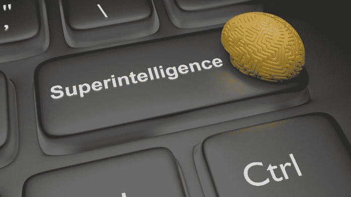

# 我们应该害怕人工超级智能吗？回应

> 原文：<https://medium.datadriveninvestor.com/should-we-fear-artificial-superintelligence-a-response-bfce50067a85?source=collection_archive---------14----------------------->

2019 年 2 月 23 日，约翰·雷夫勒在 interestingengineering.com 上发布了一篇有趣的[文章](https://interestingengineering.com/should-we-fear-artificial-superintelligence)。帖子名为“我们应该害怕人工超级智能吗？”在这篇文章中，雷夫勒认为，虽然人工超级智能(ASI)可能是危险的，但人们应该对此保持乐观。作为一名未来学家，我担心(近期)人类灭绝的可能性，我认为 ASI 是我们面临的最大危险之一。

因此，当人们想到这一点时，我很感激，因为人类的大部分关注似乎都集中在相对不重要的事情上。但是，虽然雷夫勒和我都很乐观，但我们这样做的原因不同，他提出乐观主义的方式让我深感担忧。

 [## 艾预测:“颠覆，然后是生产力”|数据驱动的投资者

### 人们越来越担心，随着机器学习和互联网的普及，所有白领工作都将消失

www.datadriveninvestor.com](https://www.datadriveninvestor.com/2018/08/06/ai-forecast-disruption-then-productivity/) 

# 什么是人工超智能？

如果你熟悉人工超级智能(ASI)这个术语，可以跳过这一部分。人工智能被定义为比阿尔伯特·爱因斯坦(或任何你最喜欢的天才)更聪明的非生物智能。那么，智能可以被[定义为](https://arxiv.org/pdf/0712.3329.pdf)一个代理人在广泛的环境中实现目标的能力。在这里，代理可以是人、另一种动物或机器。那么，人工智能就是一台机器，它至少可以达到人类在其环境中可以达到的任何目标，每一个目标都至少和人类一样好，其中一些目标(远远)更好。

# 为什么要关心人工超智能？

这很简单:根据定义，一个 ASI 将非常擅长达到它的目标(或者多个目标，但是为了简单起见，我假设它是一个目标)。这个目标本身对人类来说可能是非常好的，也可能是非常坏的，但是 ASI 实现其目标的方式可能会有类似的效果。尼克·博斯特罗姆用一个名为[回形针最大化器](https://nickbostrom.com/ethics/ai.html)的思维实验解释了 ASI 的阴暗面。在里面，我们有一个[人工智能](https://www.datadriveninvestor.com/glossary/artificial-intelligence/)，它的目标是最大化宇宙中回形针的数量。为了达到这个目标，它很可能会寻求提高自己的智能，以便更好地最大限度地增加回形针的数量。其结果将是一个非常擅长制造大量回形针的 ASI。请注意，它是如此的熟练，以至于它把地球变成了一个回形针工厂，为了创造更多的回形针。通过越来越多地实现制造越来越多回形针的看似无辜的目标，ASI 导致了人类的灭绝。因为它没有被编入我们的任何道德，它不知道人类灭绝是一件坏事。

正如任何技术一样，也有积极的一面，就 ASI 而言，这是巨大的。想象一个和我们有共同道德观的 ASI。它明白死亡一般是坏事，健康是好事等等。通过正确的目标编程，这种智能可能很容易找到治疗癌症的方法，解决贫困和战争，并发明人类永生。它将找到解决全球变暖问题的方法，并发明探索太空的新技术。人类将空前繁荣。

# 雷夫勒乐观的理由

到目前为止，约翰·雷夫勒和我似乎都同意:ASI 是一把双刃剑。雷夫勒和我都害怕阿西，我们都知道一旦它来了，就再也回不去了。关闭开关可能不可用。试想:互联网的开关在哪里？一个人工智能很可能要么连接到互联网上，要么想办法说服别人给它一个连接，让它有能力把自己上传到其他计算机上。如果你认为它不能说服人们给它一个连接，再想想。反复进行的[人工智能盒子实验](http://yudkowsky.net/singularity/aibox/)表明人工智能将能够说服某人。

我和雷夫勒不同意的是他对 ASI 的出现持乐观态度的观点:

我们有充分的理由相信，一个 ASI 最终会对我们有利。每一次技术进步都是有代价的，但人类文明因此而进步。最终，人类在技术方面有着坚实的记录。”

这是我和雷夫勒根本不同意的地方。是的，在技术方面，我们有着相对良好的记录。但这是一个反复试验的过程。已经犯了很多错误，人类已经从这些错误中吸取了教训。安全措施通常是在事故发生后才采取的。例如，第一批汽车没有安全气囊，甚至没有防撞缓冲区。此外，没有发生全面核战争的事实至少部分是由于运气。到目前为止，人类作为一个整体已经摆脱了这种懒惰的方法(虽然很遗憾，许多人已经死了)，但我们不能依赖这种方法。我们需要确保一个 ASI 在建造之前是安全的*。一旦 ASI 建立起来，很可能就没有回头路了。如果后来证明它是危险的，人类就完了。我们将没有机会保护自己免受智力超群者的攻击，就像如果我们决定杀死所有的黑猩猩，黑猩猩也无法赢得与我们的战斗。*

# 结论

人工超级智能可以做得正确，并且当做得正确时，将帮助人类前所未有地繁荣。但是在我们建造它之前，我们必须仔细考虑如何去做 T4。既然我们不知道 ASI 什么时候会到，那我们现在就要考虑这个*。*

**原载于 2019 年 8 月 21 日*[*https://www.datadriveninvestor.com*](https://www.datadriveninvestor.com/2019/08/21/should-we-fear-artificial-superintelligence-a-response/)*。**