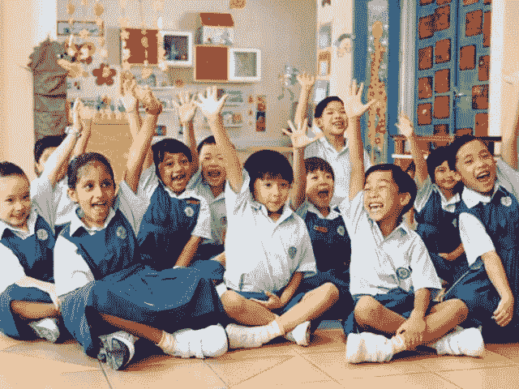

# 新加坡——适合 21 世纪的教育模式？

> 原文：<https://medium.datadriveninvestor.com/singapore-an-education-model-fit-for-the-21st-century-60e567345c10?source=collection_archive---------13----------------------->

昨晚，就在我关掉电脑准备睡觉之前，我收到了世界经济论坛的一个视频链接。这个视频

我希望你们所有人都退后一步，想想这对将从中受益的后代会有什么影响。

我当了 16 年的小学老师，有时是一名出色的老师，我大部分时间都在 6 年级(10 & 11 岁)度过。对小学的孩子们来说，这是最艰难的一年，因为要求他们做好的压力施加了。父母希望他们取得好成绩，因为教育系统告诉父母，他们的孩子应该达到这个水平，否则他们就是笨蛋。老师们希望他们做得好，因为不幸的是，他们大多数人的绩效目标都是基于他们所教学生的成绩。学校希望他们做得好，因为这影响他们在排行榜上的排名，如果某些目标没有达到，标准局就会出现并检查他们。

随着时间的推移，我会观察孩子们的变化。有些会茁壮成长，有些会崩溃挣扎。试图消除他们肩上的压力是一场持续的战斗，因为无论你说什么，他们都知道自己正在被评判、比较、衡量和贴标签。

在新加坡，学生们将不再互相比较他们的表现。不再有标签，不再有“有天赋”的孩子，不再有“愚蠢”的孩子——只是正在学习的孩子。孩子们能够专注于自己的进步，专注于尽可能做到最好。

六年级不是英国学校唯一的考试年。二年级(6 到 7 岁)也有考试。虽然压力不应该这么高——事实如此。学校是根据学生在整个学校的表现来评判的，我看到老师和学生都对他们可能得到的结果感到恐慌。

在新加坡，6 到 8 岁的孩子将不再有考试，没有压力，没有用考试技巧和考试实践来填鸭式地学习课程，以确保他们能够通过让学校和班主任看起来有能力的铁环，但对他们的学习没有任何帮助。

在英国，中学生在选择他们想学的科目时，选项是有限的，并不是每种组合都是可能的，他们必须学习某些科目。在这些科目中，他们会被定期评估和测试(这本身并不是一件坏事——这取决于测试是如何进行的，结果是如何使用的)。几乎没有真正的选择。

在新加坡，年龄较大的学生将把年中考试时间提前，以腾出时间鼓励自学。是的，你读了——鼓励他们学习新事物的欲望——他们想学的东西，他们感兴趣的东西。

在英国，孩子们经常根据他们得到的分数来衡量，在提供和跟踪每个孩子的数据上花费了大量的金钱，他们已经规划好了一条预测的道路。如果他们在教育的某些方面没有达到一定的分数，问题就会被提出来。人们期望学校为每个孩子的教育提供一定的“附加值”。学校里的孩子们不断地意识到他们处于某一水平，但他们也知道他们“应该处于”的水平和他们周围所有孩子的水平。

在新加坡，他们希望减少对分数的过度关注，他们认识到这个世界越来越复杂，教育也应该专注于帮助学生迎接他们在这个复杂的世界中将面临的挑战。他们想要一群终身学习者，他们能够适应，能够学习在不断变化的就业市场中工作所需的技能。

他们认识到，创造力和领导力将变得越来越重要。这些软技能很难衡量，但通过认识到它们的重要性，它们正在培养成功的一代人，他们将对自己的世界产生更大的影响。

新加坡，我向你致敬。你正朝着正确的方向前进。

