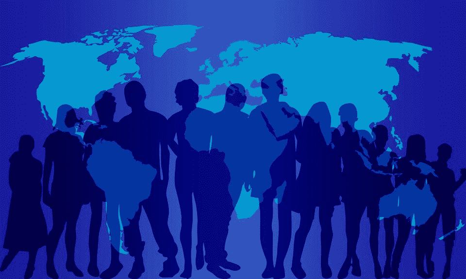

# 对一个企业来说，影响是必不可少的+实施影响的 7 个具体步骤

> 原文：<https://medium.datadriveninvestor.com/social-impact-is-a-must-for-business-7-concrete-steps-c53650eb691c?source=collection_archive---------15----------------------->

企业是现代世界的领导者。创造的文化和采取的行动会对周围的世界产生影响。重要的是，在创业过程中，要时刻牢记社会影响。采取行动对社区产生积极影响。

在讨论商业的未来时，我们应该理解 X 一代、千禧一代和 Z 一代在全球经济中的角色。

> 在接下来的 30 年里，估计有 30 万亿美元的财富将从婴儿潮一代转移到 x 一代和千禧一代。— [福布斯【2018 年 8 月](http://forbes.com/)

作为工作者和消费者的 X 一代、千禧一代和 Z 一代

X 一代、千禧一代和 Z 一代在工作、建设和消费。X 世代是收入和消费力最大的时代。千禧一代和 Z 世代紧随其后，他们已经占到总人口的一半以上，所以他们在数量上占了上风。

> “根据彭博对联合国数据的分析，Z 世代将占 2019 年全球 77 亿人口的 32%，略高于千禧一代，后者将占 31.5%，并以 2000/2001 年为代际划分。”— [彭博](https://www.bloomberg.com/news/articles/2018-08-20/gen-z-to-outnumber-millennials-within-a-year-demographic-trends)2018 年 8 月 20 日。

X 一代、千禧一代和 Z 一代的行动与你的企业成功紧密相连。X 世代和千禧一代开始考虑消费和工作的影响。他们开始考虑对我们所有人都有利的方法。他们发起了一场运动。Z 世代现在高度意识到周围的世界和我们的影响。

> “除了年龄，区分这两个群体的关键因素是自我意识和自我中心，”安永 LLP 公司执行董事玛茜·梅里曼的报告《Z 世代的崛起:零售商的新挑战》称。千禧一代“更关注对他们有什么好处。他们也会向其他人寻求解决方案，比如与他们有业务往来的公司，而年轻人自然会寻找自己的解决方案。”— [彭博](https://www.bloomberg.com/news/articles/2018-08-20/gen-z-to-outnumber-millennials-within-a-year-demographic-trends)2018 年 8 月 20 日。

在对研究的评论中，人们被分成不同的群体。这是简化学习和研究的典型方式。然而，重要的是要记住我们每个人都是独立的个体。这些数据只是倾向于显示不同时期出现的某些趋势。

> “对于这一代人来说，企业应该适应三种含义:消费是获取而非占有，消费是个人身份的表达，消费是道德问题。”— [麦肯锡 2018 年 11 月](https://www.mckinsey.com/industries/consumer-packaged-goods/our-insights/true-gen-generation-z-and-its-implications-for-companies.)

很容易从技术、政治和商业的变化中看出。需要向透明和诚实转变，光说是不够的。你可能熟悉这样的新闻:“为什么标签透明度对千禧一代的品牌忠诚度很重要”——[福布斯](https://www.forbes.com/sites/jefffromm/2017/12/13/why-label-transparency-matters-when-it-comes-to-millennial-brand-loyalty/) 2017 年和“他们知道这些 YouTubers 是付费的，但品牌/名人互动的个人联系和透明度可以抵消营销人员对使用这一工具的任何担忧。— [福布斯](https://www.forbes.com/sites/forbesagencycouncil/2018/07/23/time-to-wake-up-to-the-next-consumer-powerhouse-gen-z/#40e097e653f4)2018 年 7 月 23 日。

当连接到网络世界时，信息流是持续的。海量的信息和数据正在流逝。年轻一代就像代理人一样，能够接触到早先作为商业秘密保存的信息。以身作则，言出必行。信息是，要诚实。

这里有几篇关于千禧一代和 Z 世代的好文章，可以让你更好地了解他们的行为:

这里有几篇关于千禧一代和 Z 世代的好文章:

千禧一代想要透明度和社会影响力。——[企业家](https://www.entrepreneur.com/article/314156)

**千禧一代与 Z 世代:他们与众不同的 5 个方面:** — [销售队伍](https://www.salesforce.com/blog/2017/10/how-millennials-and-gen-z-are-different)

> “他们可能看起来都很年轻。但是千禧一代和后来的 Z 世代成员在购物、与品牌互动和看待金钱的方式上有明显的不同”

## 你可以看到千禧一代青睐的品牌的社会影响之间的关系。

**千禧一代公布他们最喜爱的 100 个品牌** — [Businessinsider](https://www.businessinsider.com/top-100-millennial-brands-2018-9/?IR=T/#100-rei-3)

> 他们的消费能力预计今年将超过 3.39 万亿美元……—[商业内幕](https://www.businessinsider.com/top-100-millennial-brands-2018-9/?IR=T/#100-rei-3)

## 没有社会影响力的公司会落后

消费者可以投票。他们干脆离开自己不喜欢的企业。互联网的最大好处是，你的声音在几分钟内就能被听到。因某个特定企业的影响而陷入困境的个人通过社交媒体大声疾呼。这可能导致企业的大规模检查，直到他们改变或失去他们的客户。

## 让你知道社交媒体有多难。以下是 2017 年至 2019 年的几个失败案例:

**2017 年 7 大社交媒体败笔**——[企业家](https://www.entrepreneur.com/article/294925)2017 年 5 月 30 日

**2018 年最大的社交媒体失败** [—福布斯](https://www.forbes.com/sites/lilachbullock/2018/11/27/biggest-social-media-fails-2018/#44743be5518f)2018 年 11 月 27 日

**2019 年商业错误最糟糕的社交媒体(以及你可以从中吸取的教训)**——[重振社交](https://revive.social/social-media-for-business-fails/)2019 年 3 月 18 日

**25 大社交媒体失败:互联网上最严重的罪行** — [社交能力](https://howsociable.com/blog/social-media-fails/)2019 年 10 月 29 日

我们要求人们善良并互相帮助。企业也不例外。企业的角色甚至更加重要。企业是我们全球社会的领导者。除此之外，随着当局提高企业的领导地位，政府和政治参与者似乎正在失去兴趣。

# 你可以采取哪些具体步骤来建立一个可持续发展的企业，同时产生社会影响:

## **1。支付员工的志愿者之旅**

付钱给员工，让他们去做亲善项目的志愿者。这不仅提高了你的品牌形象，也提高了生产力。志愿者经历可以激发员工的表现。创造力、活力和目标感使员工能够表现并产生更好的结果。这个想法来自《福布斯》。

## 2.尽量减少浪费

这是一个伟大的趋势，也是企业最容易采取的步骤之一。让你的企业走向可持续发展和社会影响。为团队和你的组织建立一种减少浪费的文化和心态。提醒人们注意浪费，并找到减少浪费的方法。要做到这一点，举一个组织的例子。利用技术减少浪费。技术可以减少水、电、纸的消耗，提高机器的生命周期等等。解决方案正快速进入市场。少用纸，用科技代替纸。你可以利用科技来取代办公室里的大部分废纸。停止使用塑料，如塑料餐具。

## 3.建立亲善项目

您可以创建项目。利用社交媒体推广你的项目，并利用可用的资源。例如，清洁海滩是一个好的开始。海洋充满了塑料。大量的海滩等待清理。被塑料垃圾毁坏的海滩。建立一个项目，让你的员工去清理海滩，可以给你带来大量的免费广告。你可以激励你当地甚至全球的社区、公司或组织采取类似的行动。你的员工可以通过组织活动来帮助人们，传递善意。衣服、工具或任何可以在这种情况下提供的看起来最有帮助的东西。想象一下小小的行动会对我们的环境产生怎样的影响。想象一下这些行动可以如何帮助世界各地的人们。

## 4.建立一个具有社会影响力的社区

社区建设更难，需要更多的努力。社区在建立一个更有意义的行动的巨大运动中是伟大的。它为您的业务带来价值，并帮助整个世界。保持社区的理念正确，为社区建立善意的文化。

## 5.更大的画面

保持我们作为一个全球社区采取行动的大局。不仅影响你自己或你的团队成员，也影响世界各地的其他人。你需要在你的头脑中有一个更大的图景。一直给团队看。更大的图景可以通过与周围世界相联系的文字和行动来展现。

## 6.为什么？—意义

做生意的目的。仅仅有一份工作来谋生是不够的。你能用你的钱做什么？企业为世界做了什么？对世界有贡献吗？

展示日常活动的意义。

1.  你会得到更多忠诚的员工。
2.  你的业务积极影响世界。

要求员工对自己负责。永远要有经营的意义和目的。如果“为什么”不见了，你最好立即找到“为什么”。你一定是在为社会做些什么。我建议做具体的工作。

## 7.使用透明工具——保持真实

透明度很重要。我们可以从新闻和文章中看到。透明度可以通过实施技术工具来实现。其中一个方法是分享现场视频，拍摄照片和关于你正在完成的项目的新闻，并在社交媒体上播放。对于透明性，分布式账本技术( [DLT](https://en.wikipedia.org/wiki/Distributed_ledger) )的解决方案将是一个巨大的进步。使用 DLT，我们可以从头到尾跟踪项目的行动，甚至资金使用情况。在等待 DLT 解决方案成熟的同时，我们可以依靠现有的社交媒体渠道。企业所展示的价值也应该透明。员工和客户应该能够看到企业是如何将价值观付诸行动的。

## 要激发更多关于社会影响的思考，请阅读下面的文章:

**为了打造一个千禧一代友好的品牌，你在做什么？**——[创业者](https://www.entrepreneur.com/article/314156)2018 年 5 月 31 日

**千禧一代和 Z 世代有何不同**—[sales force](https://www.salesforce.com/blog/2017/10/how-millennials-and-gen-z-are-different)2019 年 4 月 8 日

不同年龄组之间有很大的差距。虽然我们不应该区分年龄组和人群，但数据似乎证明了不同年龄组出现的某些趋势。无论数据和工具将我们推向何方，我们都是个体，对世界有着不同的看法。读者要获得的主要信息是社会影响问题。

商业世界的社会影响为我们所有人提供了一个美好的生活环境。惊人的发展正在进行，更多的将会到来。这是前进的方向。