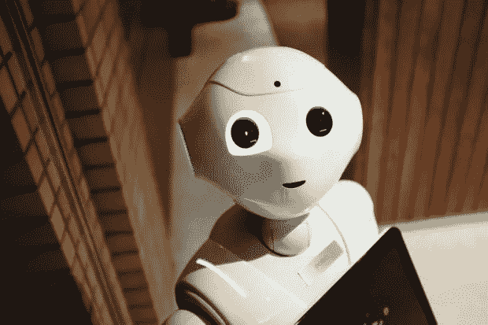

# 社交机器人——机器人当老师？

> 原文：<https://medium.datadriveninvestor.com/social-robots-robots-as-teachers-513eb77908a5?source=collection_archive---------9----------------------->

Source — Pixabay

科学家已经制造出能够教大约 75 名学生**的机器人。**目前，机器人仍然需要在人类的帮助下接受训练，但这种情况在未来可能会改变。

# 机器人可以在社会职业中提供帮助

目前的趋势表明，机器人**迟早会**成为我们生活的一部分**。**我们最近一直在报道机器人的各种用途，比如使用 [**机器人送货**](https://www.zdnet.com/article/amazon-delivery-robots-are-officially-on-the-streets-of-california/) **。**然而，机器人也可以用于**社交活动。**毕竟目前很多社会职业都缺乏技术工人。**社交机器人**目前正在努力测试中。

 [## 模式和机器人:复杂的现实|数据驱动的投资者

### 哈耶克的名著《复杂现象理论》(哈耶克，1964)深入探讨了复杂性的话题，并断言…

www.datadriveninvestor.com](https://www.datadriveninvestor.com/2019/03/04/patterns-and-robotics-a-complex-reality/) 

# 科学家为教室训练机器人

一组科学家已经在教室里测试了机器人。所谓“监督式渐进自主机器人能力”，简称 SPARC。在这个过程中，机器人由真人监督，应该能够自主学习。机器学习技术还没有准备好让机器人教授课堂行为。在发表于《科学机器人学》的研究中，科学家们控制了机器人及其动作。机器人存储早期的动作，然后向人类提出这些动作，人类然后确认或拒绝它们。动作执行得越频繁，机器人学习得越多。最终目标是机器人能够在没有人类帮助的情况下，自主地在教室里执行正确的动作。

# 这个机器人能够教 75 个孩子，对他们的表现产生了积极的影响

在这项研究中，使用了一个仿人 Nao 机器人。在 25 个单元和不到 3 个小时的互动后，他能够挽救社会行为，因此他能够教 75 个孩子。使用机器人的学生的表现提高了 10%到 30%。当然，当学生被机器人教授时，从种族和教育学的角度来看，这仍然需要考虑它有多有用。然而，可以假设这些测试不是为了好玩而进行的，在它背后有一个对未来的意图。