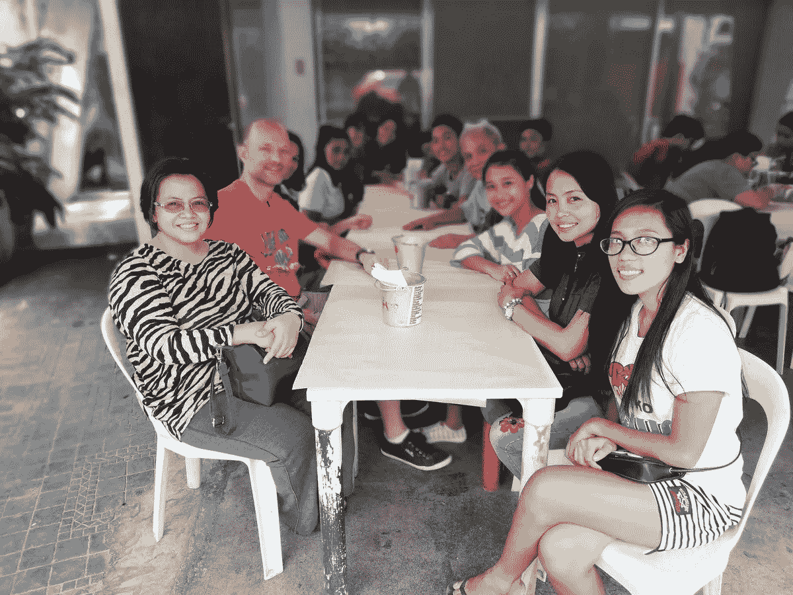

# 社会是艾滋病患者最大的敌人

> 原文：<https://medium.datadriveninvestor.com/society-poses-as-hiv-sufferers-greatest-foe-942a3c9f6a9?source=collection_archive---------3----------------------->

## 那些受影响的人被污名化、歧视和边缘化

Philippine youth advocates are active in talking about HIV among their peers.

在与艾滋病毒感染者和注射毒品者一起工作并为他们提供治疗时，tigma 是最普遍、最难克服的因素之一。

菲律宾宿务市 Vicente Sotto 纪念医疗中心的妇产科传染病专家和艾滋病治疗倡导者[Helen mad AMBA](https://twitter.com/helenvmadamba)博士说:“他们被污名化、歧视和边缘化。

“一个学生团体的研究表明，提高自尊有助于延长戒毒期，”马丹巴说。"愤怒、沮丧和厌倦会引发吸毒者复吸。"

 [## 健康三位一体:精神、社交媒体和医疗保健

### 医生与人们的信仰和网上的错误信息作斗争

medium.datadriveninvestor.com](/wellness-trinity-spirituality-social-media-and-healthcare-785ce1147f52) 

她认为，如果首先解决注射毒品者的问题，艾滋病毒感染的传播是可以预防的。

“我们需要减少耻辱和歧视，推动增加自尊的项目，给人们第二次、第三次和许多许多次改变的机会，”马丹巴说。

特别是在菲律宾，注射毒品者或艾滋病毒携带者不仅面临来自社会的耻辱，还可能遭到逮捕，或者更糟的是，当局决心根除任何潜在的非法使用毒品的痕迹。

医疗战略专家 [Shereese Maynard](https://twitter.com/ShereeseMayMba) 说:“我们在美国有许多倡议，但我发现围绕艾滋病毒社区的许多耻辱和歧视是系统性的。

她说:“我们有一个全国性的项目，瑞恩·怀特艾滋病项目。“然而，我发现地方和州项目把艾滋病毒携带者视为社会的一个注脚。他们不能有效地实施计划，因为这些社区被视为社会的一部分。”

# 沉默对待

耻辱和资金紧张是扼杀主动性的组合。

“即使在试图创建#NoStigma 倡议时，国家领导人仍然有一种‘我们不谈论那个人口’的心态，”梅纳德说。“这助长了耻辱感。

“存在巨大的资金挑战，”她说。“美国的外联项目已经削减了预算。卫生项目的支持部分也出现了资金削减。

Maynard 引用了一篇文章，“ [*在散居社区减少艾滋病毒污名干预的效果:来自 CHAMP 研究*](https://www.tandfonline.com/doi/full/10.1080/09540121.2017.1391982) 的见解。”也有统计数据显示，纽约的艾滋病毒感染率有所下降。

梅纳德说:“对于像纽约这样大的地区来说，要减少母婴艾滋病毒传播，其他州应该注意并采取行动。”“这些数字已经稳定了至少 18 个月。对大多数州来说，鼓励产前筛查是关键，但也具有挑战性。

与大多数主要问题一样，社交媒体在艾滋病教育中发挥着重要作用。

“人们在社交媒体上不那么拘谨，更乐于讨论，”马丹巴说。“如果你避免危险行为，艾滋病毒没什么可怕的。我们害怕我们不知道的东西。

“艾滋病不再是死刑判决，”她说。“应该让人们意识到这一点。随着意识而来的是理解。理解带来了同情。同情带来了耻辱的减少。”

Madamba 也对纽约的结果印象深刻。

“我去过纽约，那里的艾滋病项目非常成功，”她说。“到目前为止，已经有好几年没有婴儿出生时携带艾滋病毒了。我们希望通过所有利益相关者的共同努力，在菲律宾实现这一目标。”

# 远视

她的梦想似乎远未实现。

“我们有一个艾滋病毒携带者患者，她被赶出了她的城镇，因为人们害怕艾滋病毒，”马丹巴说。“注射毒品的人被贴上罪犯的标签。许多人不再意识到他们在这种影响下在做什么。帮助他们康复的中心很少。

“当一个人接受艾滋病毒测试时，会有测试前和测试后的咨询，”她说。"这包括可能接受阳性诊断的心理方面."

不仅仅是普通大众，供应商也需要克服偏见。

“医护人员中存在耻辱感，”马丹巴说。“我们需要从那里开始。否则，我们如何鼓励那些有危险因素的人寻求护理？”

这对那些需要帮助的人来说是双重打击。

“人们经常认为，由于滥交和亵渎，艾滋病毒阳性诊断是他们的错……”马丹巴说。

“这就是为什么我们作为医疗工作者需要言行一致，”她说。“我们应该自己进行艾滋病毒检测，以消除艾滋病毒检测的污名。艾滋病毒咨询和检测是预防、治疗、护理和支持的途径。”

# 多重挑战

文化趋势也是艾滋病毒治疗的主要障碍。

“在今天的社会中，我们有越来越多的基于性别的暴力，越来越多的男男性行为者，越来越多的青少年怀孕，因为过早的初次性行为和越来越多的静脉注射毒品使用，”马丹巴说。"这——伴随着耻辱和歧视——助长了菲律宾艾滋病的流行."

医疗技术专家詹姆斯·所罗门同意马丹巴的观点。

“人们的意识还有很长的路要走，”他说。“仍然有许多人瞧不起艾滋病毒携带者。我记得我们镇上的一个脸书朋友在她的账户上发布了一个贬损的状态，关于我们镇上的艾滋病毒恐慌。我给她发信息教育她。

“但如果我们是在教育别人，我们也必须小心，”他说。“它必须以证据为基础，并得到可靠来源的支持。否则，我们可能会助长耻辱感，而不是教育。”

萨洛蒙对马丹巴讲述的病人被从她的镇上赶走的故事感到难过。

“这样的故事让其他艾滋病毒携带者害怕接受检测、接受药物治疗和表明自己支持团体，”他说。

“我在精神病学领域轮换，”所罗门说。“我们看到许多物质诱发性精神病患者。的确，毒品问题已经成为一种流行病。经济因素在解释他们为什么与他人共用针头时起了很大作用——这样他们就可以存钱了。”

# 成功案例

对抗污名的一个有效策略可能是提升那些感染了艾滋病毒但存活下来并茁壮成长的人。

“我喜欢那些艾滋病毒携带者，他们有足够的权力向世界宣布他们的艾滋病毒诊断，”马达巴说。“不幸的是，我可以用手指数它们。

"你会相信一个有注射毒品史的人吗？"她说。“你会给这样的人一份工作吗？我们应该给人们无限的机会。”

Madamba 希望从其他成功的疾病根除项目中吸取经验。

“结核病项目是我们的比较，”她说。“我们希望有一天，艾滋病毒携带者和注射毒品者不再像结核病患者一样受到污名化。”

如果可能的话，Madamba 会制作艾滋病广告。

“珍闻大小的矮胖信息，”她说。"我们希望有更多这样的网站向大众传播正确的基本艾滋病知识."

所罗门提倡从最早的年龄开始教育。

“我真的在我们的小学英语课本上学到了献血，”他说。“我至今还记得那本书。这是一个很好的年轻教育策略。"

# 社会利弊

在减少对那些对抗艾滋病毒和毒品的人的羞辱和歧视方面，社交媒体的影响有好有坏——坏的占主导地位。人们愿意相信最坏的情况，传播污名化的话语。启蒙面临着一场艰苦的战斗。

 [## 你在哪里透明地划清界限？

### 社交媒体使医生和病人之间的隐私变得复杂

medium.datadriveninvestor.com](/where-do-you-transparently-draw-the-line-3945faa07141) 

所罗门说:“在使用社交媒体时，要简洁但信息丰富，以吸引注意力。”“海报是关键。如果海报很无聊，我们有立即向下滚动的习惯。”

马丹巴强调说，艾滋病病毒通过三种途径在 T2 传播:

*   与艾滋病毒感染者进行插入式性交。
*   注射感染艾滋病病毒的血液。
*   从受感染的母亲传染给未出生的孩子。

“如果这些都不存在，你就不能传播艾滋病毒感染，”她说。“艾滋病毒不会通过拥抱、接吻、共用餐具、共用厕所、共用衣服或物品、蚊虫叮咬或游泳传播。

“医护人员因职业原因被感染的几率也很低，只要你采取标准的预防措施，”Madamba 说。“饮用含有艾滋病毒感染血液的软饮料不会感染艾滋病毒。首先，软饮料的酸性会杀死病毒。”

她补充说，艾滋病毒教育应该从未来的提供者开始。

“我们鼓励所有医学院为医学生组织一个艾滋病论坛，并提供免费的艾滋病咨询和检测，”Madamba 说。"教导老师，关心照顾者."

**关于作者**

吉姆·卡扎曼是[拉戈金融服务公司](http://largofinancialservices.com)的经理，曾在空军和联邦政府的公共事务部门工作。你可以在[推特](https://twitter.com/JKatzaman)、[脸书](https://www.facebook.com/jim.katzaman)和 [LinkedIn](https://www.linkedin.com/in/jim-katzaman-33641b21/) 上和他联系。