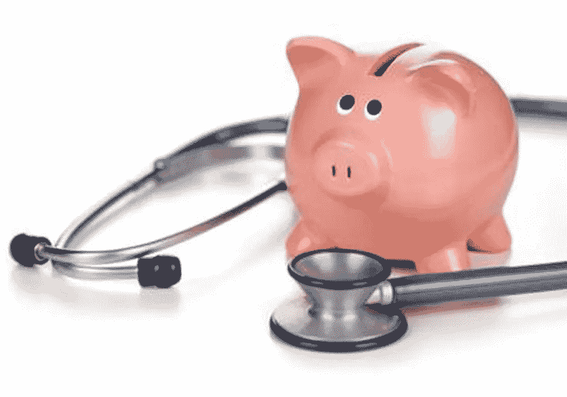

# 解决护理难题

> 原文：<https://medium.datadriveninvestor.com/solving-the-care-conundrum-d03e7f1532b?source=collection_archive---------2----------------------->

您知道全球每年花费 8.3 万亿美元用于提供医疗保健服务吗？

到 2023 年，预计这一数字将进一步增加 2 万亿美元。这在短短 5 年内增长了 25%。对美国来说，这意味着每 5 美元的国民生产总值中就有 1 美元用于医疗保健。

那么，你的选择是什么:多缴税还是接受大幅削减服务？很明显，不是吗，但这是许多发达国家目前面临的现实。我们究竟是如何走到这一步的？

技术创新带来了很多好处，推动了更好的预防保健和治疗，改善了结果，甚至根除了一些疾病。唉，这伴随着成本的大幅增加。先进的医疗设备可能极其昂贵，药品价格似乎也在无情地上涨。

令人难以置信的是，为支持我们的现代医疗保健系统而构建的管理基础设施现在占总支出的 17%。是的，1.4 万亿美元只是为了运行野兽。在美国，这意味着每个女人、男人和孩子每年大约有 2000 美元用于行政管理。这是从提供医疗服务中转移出来的钱。有些人可能认为这是可耻的。

为管理医疗保健而建立的机构数量之多，意味着效率低下的现象普遍存在，导致服务的延迟、浪费和重复，而且不幸的是，欺诈活动很难被发现。“破碎”是一个我想到的描述游戏现状的词。

进入区块链和 Solve.Care。这是一个旨在打破医疗支付和管理的项目，采用区块链技术来提高效率，降低成本，并帮助为医疗保健本身创造更多资金。求解。Care 希望能够降低高达 70%的成本。亲爱的读者，请花点时间来理解这一点。对美国来说，这意味着每年节省 5000 亿美元。我们在这里谈论的不仅仅是琐事！

显然，在这种灵丹妙药能够开花结果之前，还有一些挑战需要克服。众所周知，机构，尤其是政府，在采用新技术或新系统方面行动迟缓。一些人将对区块链持怀疑态度，可能更愿意等到其他更具冒险精神的人冒险尝试并验证该技术和声称的节省。求解。Care 已经在克服这一障碍的道路上走得很好，最近签署了其第一个重要客户——亚利桑那州护理网络。

无论面临何种挑战或异议，Solve 提供的潜在节约幅度。关心是如此重要，以至于任何管理者都不能不考虑这个问题。毕竟，我们讨论的是你的钱和你的健康！