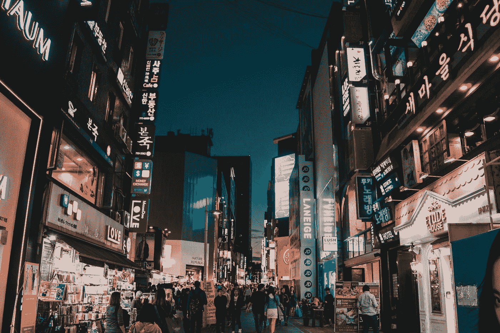

# 韩国可能维持 ICO 禁令

> 原文：<https://medium.datadriveninvestor.com/south-korea-likely-to-maintain-ico-ban-dd28c987a87a?source=collection_archive---------14----------------------->

“people walking between tall buildings” by [Shawn Ang](https://unsplash.com/@shawnanggg?utm_source=medium&utm_medium=referral) on [Unsplash](https://unsplash.com?utm_source=medium&utm_medium=referral)

***最高监管机构表示不确定性保持不变***

尽管政界和区块链业界要求允许首次公开募股的呼声越来越高，但最高金融监管机构澄清了其对首次公开募股的持续禁令。

在金融服务委员会(Financial Services Commission)周四的年度议会审计期间，该监管机构的主席 Choi Jong-ku 表示，“尽管与 ico 相关的不确定性保持不变，但我们(因允许 ico 而)将遭受的后果太严重和明显了。”崔顺实是在回答韩国执政党民主党众议员全在洙(Chun Jae-soo)的提问时发表上述言论的。全在洙呼吁解除对 ico 的全面禁令。他仍然坚定地禁止 ico，他说，“没有人能否认区块链行业是有前途的，但区块链和加密货币不一定要携手共进。”Coinplug 首席执行官 Ryan Uhr 作为参考证人参加了审计，并强调了取消禁令的必要性。但韩国最高金融监管机构的负责人对此反应消极。

> “区块链技术和加密货币交易所在同一个生态系统中工作。比特币基地是美国允许 ico 的交易所，估值 8 万亿韩元，一直受到华尔街投资者的关注，”Ur 声称。然而，Choi 反驳了这一论点，他说:“许多国家对 ico 仍然相当保守，或者完全禁止它们。我们对 ico 的禁令与国际趋势并不矛盾。”

周三，政府政策协调办公室(Office for Government Policy Coordination)主任洪南基(Hong Nam-ki)对议员们说，韩国政府将在 11 月就是否恢复 ICOs 做出最终决定。由于加密货币市场过热，韩国于去年 9 月发布了对所有 ico 的全面禁令。

但是崔在星期四做出了矛盾的声明，他说，“FSC 还没有决定最后期限。”他只是说，“如果可能的话，我们将遵守洪的时间表，因为加密货币措施是由总理办公室监督的。”

在一个相关的发展中，执政党众议员 Jeon Hae-cheol 指责政府“在去年未能微调其对加密货币的立场后，也造成了混乱。”他说:“令人难以理解的是，负责区块链政策的一个机构的负责人崔发表了自相矛盾的声明。”。