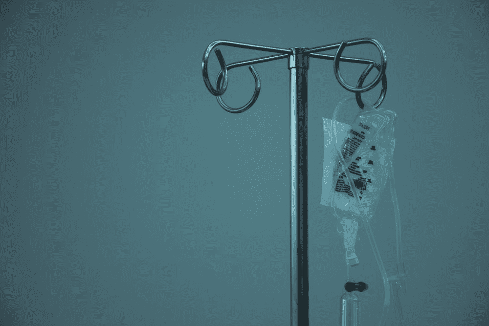
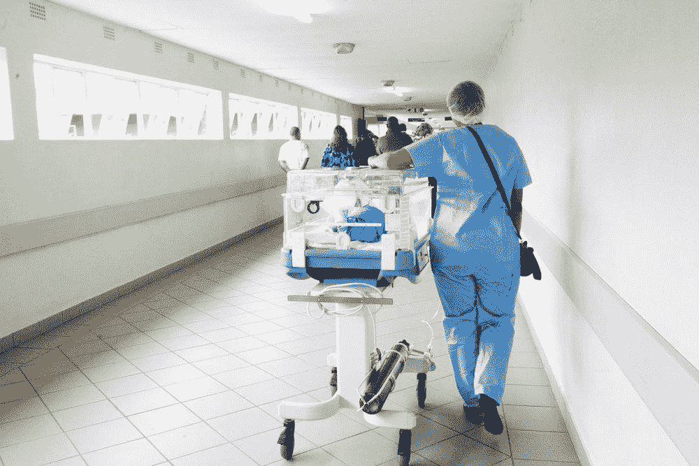

# 斯塔克法则，与医生法令的公正性相矛盾的企业避风港

> 原文：<https://medium.datadriveninvestor.com/starks-law-corporate-safe-harbor-in-contradiction-of-impartiality-to-physician-decree-f572890707eb?source=collection_archive---------7----------------------->

surgery

贿赂及其形式化版本；根据目前的定义，回扣行为无疑是人类有史以来最不道德的行为之一。这种情况可能会持续几代人。此外，其合法性将成为那些以这种或那种方式谴责其理由的人之间的争论的主题。在公正和有组织的生态圈里，为了某种形式的影响或剥削而给予或接受任何有价值的东西的行为毫无保留地是不道德的。在大多数情况下也被认为是非法的。然而，犯罪在某种程度上受制于不同社会之间的巨大差异。贿赂连同其正式传达箔-回扣或保证一直适用于给予，提供或征求任何服务或项目，以换取一些有价值的东西，如金钱报酬。Black's Law Dictionary 将贿赂定义为“公众影响负责公共或法律职责的官员或其他人的行为”。像现代词汇中的其他定义点一样，回扣和贿赂也有其特殊的合法化解释。

IV Fluid

尽管公众意见不一，但一些安排被定义为在感知上合法，而其他安排则受到极端的惩罚。另一方面，一些行为可能是无可争议的合法行为，但却非常不道德，足以被描述为非法行为。这种故意犯罪可能属于多种定义，包括但不限于 Annates、反竞争行为、Baksheesh、操纵投标、Charbonneau 委员会、利益冲突、欺诈、回扣、贿赂。几乎在每一种情况下，敲诈者都能够以这样或那样的方式证明他或她的行为是正确的，最重要的变化是，一些人有权力通过授权来影响那些决定性的事实；而其他手较低的人可能会忽略目标，尽管他们有一个善意的目标。

 [## 医疗保健的未来正在被一场大型技术入侵所塑造|数据驱动型投资者

### 过去十年，全球经济的所有部门都经历了大规模的数字颠覆，而卫生部门现在…

www.datadriveninvestor.com](https://www.datadriveninvestor.com/2018/11/02/the-future-of-healthcare-is-being-shaped-by-a-big-tech-invasion/) 

把不道德的合法化，把不道德的合法化，把权利非法化的过程是虚伪地把真实和不道德区分开来的方法。我们必须认识到，在历史上，并不是每一项为获得领导地位而进行的金融徇私的成就都被永久地视为非法活动，并且达到了同样的程度，也绝不是正义在任何时候都没有被贴上与贿赂行为相关联的不公正标签。根据唆使行为，一项行为要被认为是欺诈性的，必须有两个或两个以上的人(两个以上的中间人或回扣经纪人)参与。作为其行为的直接结果，诱惑的接受者或受益人必须接受所提供的全面检查的有价值的东西。几乎每一个行业都有自己的害群之马，这些害群之马带有某种欺诈性的甜味。同样，医疗保健行业也不能幸免于这种做法。

# 反回扣和斯塔克法则的概念

联邦反回扣法(AKS)是美国著名的联邦欺诈和滥用法案之一。这归因于腐败对病人护理、制药和医疗设备部门的业务关系造成的广泛的利益冲突。AKS 是一项刑事法令，禁止旨在鼓励或奖励推荐联邦医疗保健计划下报销的项目或服务的联系人。斯塔克法律(Stark Law，简称“斯塔克”)是联邦政府制定的另一项类似的立法措施，该法律禁止主治医生自行推荐患者接受医疗保险或医疗补助可报销的某些服务。医生或其直系亲属与之有财务关系的实体也将此类便利设施称为指定医疗服务(“DHS”)。简而言之，斯塔克禁止医师自行转诊的三个主要概念包括——医师转诊；DHS；和经济利益。从理论上讲，为了使斯塔克适用于特定的环境，这三个概念都必须包含在内。因此，斯塔克也被称为严格责任法。这意味着，在政府确定违法行为是否发生之前，意图违法的一方不被视为负有法律责任。因此，了解 Stark 是否卷入了一个涉及医生的安排是一个重要因素。斯塔克法则是一个技术法令，因为它不同地应用于不同的事实阵列。

# 医疗保健与其他行业

[医药行业的贿赂](https://entrepreneurthearts.com/are-kickbacks-and-referral-fees-ethical/)与其他行业相比，具有指数级的重要性。仅仅是因为它与人的生命、病人和医生之间的信任以及保护一个人最重要的资产健康的神圣纽带有关。幸福是有价值的，维护这种价值的品质深深地维系于双方的个人价值观。因此，唆使他人的行为是对规范和关怀价值的一种破坏。即便如此，这是否意味着所有直接或间接禁止医疗实践的商业部分的规则都是必要的，以阻止少数害群之马给整个股票贴上坏标签？！从无辜转诊到医生有经济利益的系统来描述故意欺诈勒索是两种不同的情况。即便如此，全面适用斯塔克定律的后果是巨大的，人们可能不同意我后来的假设，即“在政府确定是否发生违法行为时，意图违法的各方不被视为非法”。然而，尽管有合法的理由，系统中的这种灰色地带将使无罪的特权免于被打入冷宫。在政府看来，严厉执法的结果是谁应该受到惩罚，这是禁止医生一起转诊的主要原因。

# 斯塔克法则和基于价值的补偿。

反回扣和斯塔克斯法可以方便地应用于任何服务费用报销系统。后期保持固定值，可变性较小。相比之下，[基于价值的报销](https://medium.com/@Adamtabriz/the-concept-of-quality-measures-in-healthcare-the-good-the-bad-and-the-ugly-2bf76941dc8d)更为复杂，因为它主要依赖于患者个人对其护理的坚定不移的参与，并纳入了健康和疾病的个人和社会决定因素。因此，从现有法律的角度来看，基于绩效的薪酬禁止转诊到对转诊医生来说可能更透明的机构或自我转诊，这将为利益冲突打开新的大门，给独立的医生保健专业人员带来额外的负担。

# 价值在斯塔克斯定律中是如何发挥的？

我们都需要同意，价值是对所提供的任何服务质量的衡量，而服务质量反过来又转化为有形的项目或物品，并以截然不同的比例与另一种物品或服务进行交易。我们也都同意——对于被认为是回扣或贿赂的行为，一个人或一个实体必须是贵重物品的出资人和另一个报销人。如果有价值的东西是一种货币补偿的形式，那么就必须将赢得与典型的营销和推荐区分开来。我们大多数人都同意这个事实；营销和推广的不同之处在于医生转诊的法律法规、DHS 以及围绕医疗保险和医疗补助计划的财务利益。这意味着——即使在推荐过程中没有直接的第三方奖励，从法律的角度来看，犯罪仍然会被认为是犯罪。因此，当我们考虑一个有价值的奖励时；这种价值仅仅被称为对所提供服务的回报。也就是说，如果将患者转介到医生有经济利益的机构仅仅是为了提供高质量的护理；根据法律仍然会被视为罪犯。这种设置和场景显然与基于价值的补偿的概念相冲突，除非所建立的价格是对某些理论公式的模仿剽窃。医疗质量评估的概念包含了好的、坏的和丑陋的方面，这些方面将通过透明和问责来解决。它最终源于病人和医生之间的独特相遇。

# 自我转诊与医师的临床判断

医疗领域中的自我转诊通常定义为由医生将患者转诊到医疗机构，该医生在该机构中具有经济驱动力。美国医学协会(AMA)是帮助立法者通过利益冲突法的组织之一，该法阻止医生从将患者转诊到此类机构的途径中获利，即使除了所提供的服务的实际价值之外没有任何人预期更多的回报。乍看之下，这一意图似乎是公正的。但是，这种基础广泛的方法彻底动摇了那些除了合法目标之外别无其他目标的医生的诚信。对未经证实的适应症进行自我转诊是错误的；然而，如果没有有争议的理由让某人对一个有共同经济利益的医疗团体提供的公正的专业质量服务负责。毕竟，意图的合法性和透明度比实际行动更重要，如果患者知道会发生什么就更重要了。

# 设计医疗服务和斯塔克法则

指定医疗服务(DHS)包括临床实验室服务。物理治疗、职业治疗和门诊言语-语言病理学服务、放射和某些其他成像服务、放射治疗服务、用品、耐用医疗设备、医疗用品、肠外和肠内营养物、设备、修复术、矫正术和假体装置、家庭保健服务、门诊处方药、住院和门诊医院服务被视为反回扣和斯塔克法律的承保范围。配给是为了避免“欺诈”。当我们注意到那些根据 Medicare 部分和平价医疗法案条款获得补贴的医院和管理式医疗系统时，该政策的双重标准和模糊性变得更加明显，这些医院和管理式医疗系统可以自由执行自我转诊，允许其下属的医生进行自我转诊，同时根据反回扣立法禁止独立医生进行自我转诊。

 [## 医学协会及其百年探索的失败

### 我们生活在一个矛盾的概念中，这个概念的本意是创建社团、授权机构和协会。的形式

medium.com](https://medium.com/datadriveninvestor/medical-societies-and-their-flop-of-a-century-old-quest-2734c9c90f72) 

# 医生的经济利益

除了联邦管辖范围内的少数例外情况，将病人转诊到治疗医生有经济利益的机构是非法的。我个人很难接受这是不道德的，禁止医生将病人转诊到与他们有财政关系的机构，即使特定的转诊可能会根据基于价值的报销模式确保护理质量和最佳服务。我毫不犹豫地认为，在自我转诊的情况下，DHS 和经济利益医生问责制可以无缝地实施，而不会预先判断令人不快的替代方案，为患者提供一流的舒适服务。

# 伦理和医疗实践

回扣和奖励约会主要是产品或服务的隐性加价。如果不公开，它们有可能破坏转诊医生和患者之间的信任。隐蔽并不总是不被注意；一旦泄露出去，病人对医生的印象将会是什么样的？他们以前认为医生是在为他们的最大利益而工作的，这种印象将会土崩瓦解。所以；透明有什么错？！毕竟，在基于价值的护理系统下，后果和护理质量才是最重要的！

# 医生拥有的医院——医疗保险和医疗补助服务中心

由欧巴马总统于 2010 年签署成为法律的患者保护与平价医疗法案第 6001 条，修正了社会保障法案的第 1877 条，旨在对医生拥有的医院施加额外的要求，以使其有资格成为整个医院，但农村提供者除外。此后；该法律禁止医生经营的医院扩大设施容量。即使如此，符合适用医院、高医疗补助设施或服务不足服务条件的医师所有医院仍可向部长申请禁令豁免。当务之急是承认该法律的虚伪性，因为根据联邦法规，自我推荐在一种情况下是非法的，但在另一种情况下是合法的；即使它打算作为一种人道主义努力。这意味着一件事，最多一件事——独立医生的主权对得不到充分服务的社区至关重要；农村医疗保健更是如此。然而，在原则上留下漏洞是否是正确的做法呢？！[美国医学协会(AMA)](https://www.datadriveninvestor.com/2019/10/19/medical-societies-and-their-flop-of-a-century-old-quest/) 成立的目的是保护医生的利益以及社区健康和安全。与此同时，它也是医疗领域中第一个反对游说医生历史上最有辱人格的政策之一的机构，明确提出了[反转诊](https://journalofethics.ama-assn.org/taxonomy/health-policyaffordable-care-act)法。这本来可以通过适当的透明度和问责制条款简单解决。

# 药店销售代表(PSR)和礼物的概念

人们已经多次假设，接受公司 PSR 的礼物影响了医生的处方行为，从而导致了无根据的药物处方。这种态度导致对这些互动的监管更加严格。即使我不一定不同意一些医生可能受到特定医药营销活动的礼物、免费午餐或晚餐赞助的影响，但情况仍然是指向结果的；而不是这种壮举的实际透明和公开的意图。如果以任何方式，对赞助的广泛判断转化为某种形式的贿赂，那么后续的询问应该是详细说明管理式医疗系统和社会如何选择在其承保清单药物表中精选特定药物的情况或程序。如果进一步探究，人们会发现，一个类似的决定是如何让医生变得不那么可靠和可信的，同时却让非临床公司带着压倒性的偏见获得相反的声望。赞助一种药物的药房代表与来自不同公司的另一个品牌竞争，该品牌具有相似的临床适应症来治疗医学问题。[医师-医药行业；其销售代表的互动](https://www.ncbi.nlm.nih.gov/pmc/articles/PMC5623540/)

pharmacy

如果开一个品牌的处方而不开另一个品牌的处方不会对病人造成伤害，那么就因为医生开一个品牌的药物来替代另一个具有相同疗效和副作用的药物而对其进行惩罚是不成熟的，也是没有根据的；尤其是当制药公司被允许通过强调“询问你的医生特定的药物是否适合你”来宣传同一品牌的药物时。从不同的角度来看，经济利益正是保险公司选择药物处方集的方式，这使得药物处方集与医生为病人决定的药物处方集相比，不多也不少。“送礼的医生”是将反对独立医生统治的战争合法化的粗俗方式，因为在医疗行业，礼物是无关紧要的。礼物是个人喜好，在医学界被认为是不道德的；然而，这绝不意味着医疗行业透明诚实的商业方面，旨在以病人为中心。这是法律或者是正确的做法。这是个问题。错误总是偏离光束；如果没有遵循在特定的时代和地方道德上真实的或有价值的东西。这符合某种隐藏的动机。不正确的行为并不总是非法的，好的行为也不总是被认为是合法的。什么使自我推荐成为非法的或不道德的是根据它的努力的价值；不管是透明的还是隐蔽的。

# 反对回扣的历史性斗争

勒索、贿赂和回扣被认为是严重的违法行为，应依法惩处。从地方政府到国际网络，他们致力于任何组织中的等级。没有人能免受其欺骗的恶意后果。贿赂和敲诈勒索之间有无数不同的性质和严重程度，但似乎都没有以允许持续分析的方式进行定义。一些信念被普通大众和学者广泛持有，但是当它们被应用到特定的情况时就崩溃了。当一些人试图不公平地将某些商业实体中的医生利益归类为敲诈勒索时，事情变得更加[复杂。](https://scholarship.law.upenn.edu/cgi/viewcontent.cgi?article=3659&context=penn_law_review)

# 一些著名的回扣

众所周知的历史事件之一是水门事件；事件开始于 1972 年 6 月 17 日星期六，五名男子因闯入民主党全国委员会总部水门大厦而被捕。联邦调查局对水门事件的调查发现，在窃贼身上发现的现金与尼克松竞选活动的官方组织总统连任委员会使用的贿赂基金之间存在联系。

再比如；现在被视为非法的是，曾经支持电影公司通过在[司法部(DOJ)出租电影的放映权来控制观众所看到的内容，在 2018 年收集了超过 25 亿美元的判决](https://healthpayerintelligence.com/news/doj-recovers-2.5b-in-healthcare-fraud-false-claims-in-2018)和与医疗欺诈和虚假索赔有关的和解。在另一个案件中，萨特，DOJ 在法庭上就医疗保险优势受益人的风险分数的适当性进行了争论，因为他违反了[虚假索赔法案，为其医疗保险优势受益人分配了不准确的风险分数](https://healthpayerintelligence.com/news/risk-scores-at-center-of-sutter-doj-medicare-advantage-dispute) [即将上映的大片](https://www.history.com/news/the-hollywood-extortion-racket-that-gave-us-todays-summer-blockbusters) [阻止了](https://www.datadriveninvestor.com/glossary/block/)。意思是——如果一家影院想放映安，他们也必须为前景不太好的“B 级电影”和短片付费。

2019 年 1 月 31 日，卫生与公众服务部(HHS)和 HHS 监察长办公室(OIG)发布了一项拟议的法规，该法规将根据联邦反回扣法规(AKS)对支付给药房福利经理(pbm)的某些制药商回扣进行刑事和民事处罚。根据《安全港法案》的定义，独创性享有安全港条例的保护。 [付款](https://www.datadriveninvestor.com/glossary/payment/)和商业行为虽然可能牵涉到联邦反回扣法，但根据上述条款不被视为犯罪。然而，在 2019 年 7 月的[，川普政府](https://www.healthindustrywashingtonwatch.com/2019/07/articles/other-health-policy-developments/other-oig-developments/hhs-scraps-pending-rule-to-remove-anti-kickback-safe-harbor-protection-for-drug-rebates-to-health-plans-pbms/)决定反对敲定一项拟议中的法规。

# 如果呢？

如果选择性安全港不存在，或者我们如何定义正确和错误将在其应用的最基本的雕像中进行权衡，而不将某人的行为归类为“仅仅因为”。

例如，蔑视医生对病人或政府的不公平、不透明和不公开的信息，认为这会造成伤害；从而避免将促销视为犯罪，并展示其意味着拯救生命并使人们保持健康的优质技能。

如果规则得到简化，没有富人和权贵可以钻的巨大成本漏洞，那会怎样？-过度监管不是单方面的，而是旨在使医生面临陷入困惑、错误和绝望的边缘地带的风险。通过有偏见的法律类似于给法律顾问提供安全港，以从寻求推销其业务的医生的努力中获利；一项类似于隐藏的自我推荐议程的立法。

时至今日，管理式医疗机构提供了包罗万象的医疗服务、设施、实验室、药房和其他服务。其中包括平价医疗法案(如承保的加州)的参与者和联邦政府资助的医疗保险 C 部分计划成员。如果-在“如果在年度访问期间订购，可能没有额外费用”下，可以跳过推荐人的请求。因此，对于推荐人拥有财务利益的机构所提供的服务，在已经由纳税人支付的计划中，成为高额共付额和免赔额的主体。是的。这种情况正在发生，并倾向于遵循每年体检时不安排后续检查的模式。受保加州计划  患者是否无需为初次及后续年度体检支付共付额或自付额？—尽管如此，他或她必须为随访期间安排的检查以及管理式医疗系统内患者转诊的健康计划安排的检查支付共付额。这种转诊方案将激励系统不要在年度体检期间安排某些检查，而是为了额外的钱而在辅助就诊时安排。这样一个组织显然违反了反垄断法，通过一个明确的，但良好的自我转诊安排的路径，对一些人来说，它可能会出现无辜的合作照顾。例如，如果订购一个[脂质面板](https://en.wikipedia.org/wiki/Lipid_profile)

在这篇文章的前面，我提到了医疗服务中质量和价值的重要性。我还阐述了与反回扣法的冲突。这就引出了我的下一个观点——不久前引起我注意的一件事。《现代医疗保健》最近的一篇博客文章称，HHS 计划公布一项期待已久的提案，以改变反回扣法的执行情况。它的重点主要是建议基于价值的支付，协调护理不应该属于斯塔克法律的范围。根据医疗保险服务中心(CMS)和 HHS 监察长办公室的说法，回扣保护措施(T1)“不必要地限制了”协调医疗，必要的改变是强制性的，以隔离欺诈，而不是抑制医生之间的数据共享，这反过来会促进“更好的患者护理”有趣的是，回顾起来，这句格言让我们回到了我最初的主题——未经证实的过度放纵的监管不会始终确保高质量的医疗服务，但会给已经无情的医生倦怠增添更多的火焰，并将那些医生判断的无辜意图定为犯罪。然而，尽管 HHS 为重建医疗服务的真正价值做出了建设性的努力，但如果机构不能理解医疗领域价值的坦率定义，他们的决定将会落空。与今天被定义为“基于绩效的补偿”相比，这种补偿在很大程度上考虑了患者群体的社会决定因素，同时考虑了某些概况和算法决定因素，而这些因素只不过是基于技术或科学的逻辑的产物；真正的基于价值的支付需要医生和病人之间单独的、独立的相互接触。后者的实施必须考虑到每个患者的个人决定因素以及他们的社会环境中的关键因素。

因此，通过“一刀切”的政策设置毫无意义的限制，以防止欺诈，任何旨在最大限度地提高医疗质量和价值的努力最终都将被扔进废纸篓。因此，服务的个性化总是依赖于质量和价值的真正定义。由于体制内过多的政治漏洞和双重标准，政府干预是彻底的失败。像部门内的其他两党倡议一样，所有这些倡议都有一个共同的现象，即未能定义和区分欺诈、偏袒、自我推荐、错误意图、勒索和贿赂，从而使太多的灰色区域大开方便之门，被有钱有势的游说者利用。

高度控制的环境容易腐败。“法律就是用来被打破的”这一概念并不一定准确。在今天的政治中，更有意义的是:“法律是由那些知道漏洞在哪里以及何时需要被突破的人制定的。”我称之为受控(有组织的)回扣计划。看起来最聪明的人知道什么时候让敲诈看起来像是一种善意的行为，因为它可以通过计划和执行的合法回扣来实现。在这种情况下，整合和日益垂直整合的行业。他们在过去被政府授权作为世界上医疗保健行业最大的参与者之一发挥重要作用；药品分销。尽管政策制定者正试图通过增加透明度来改革药品回扣制度，但基于这种透明度暴露了整个过程的片段这一事实，它仍然具有不足的[药房利益经理(PBM)](https://www.commonwealthfund.org/publications/issue-briefs/2019/mar/pharmacy-benefit-managers-practices-controversies-what-lies-ahead) [权重](https://www.datadriveninvestor.com/glossary/weight/)。从逻辑上来说，要想成功执行，需要的是运营链的完全透明以及明确的责任。任何简短的内容都会指向轻松进入[大数据](https://www.datadriveninvestor.com/glossary/big-data/)的替代目标。

# 最重要的是意图。

如果有正当理由将病人转介到转诊医生有专业兴趣的医疗企业，并且这种转介符合病人的福祉，似乎就没有冲突。在基于价值的报销模式中，没有合理的理由来解释委托支付以换取推荐流程。这是不相关的，因为财政指令不是一个基于价值的模型。HHS 对保护协调医疗的严酷法律规则的翻新清楚地表明了该机构的起源；然而，是否足够本身就存在争议。

*原载于 2019 年 11 月 4 日*[*https://www.datadriveninvestor.com*](https://www.datadriveninvestor.com/2019/11/04/starks-law-corporate-safe-harbor-in-contradiction-of-impartiality-to-physician-decree/)*。*

 [## 人工智能和深度学习的医学法律风险|数据驱动的投资者

### 技术正以惊人的速度前进，因为它的足迹在医疗保健领域内可以令人愉快地被注意到…

www.datadriveninvestor.com](https://www.datadriveninvestor.com/2019/10/24/medico-legal-perils-of-artificial-intelligence-and-deep-learning/)