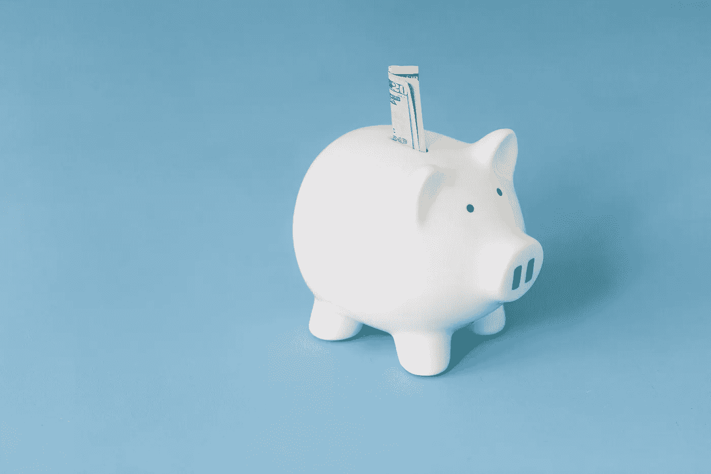

# 创业公司承受着经济不确定性的冲击

> 原文：<https://medium.datadriveninvestor.com/startups-bear-the-brunt-of-economic-uncertainty-6b5aa50a00a5?source=collection_archive---------9----------------------->

下一次经济衰退即将到来。这不是是否的问题，只是时间的问题。

我这个年龄(18-25 岁)的人很幸运，他们的童年经历了历史上最长的牛市。但后金融危机时代的庆祝活动即将结束，而且可能很快就会结束。

预测衰退是很难的。经济学家和市场分析师将他们的整个职业生涯都奉献给了这项壮举。由于经济衰退的不可预测性，对其进行对冲变得更加困难。企业拥有大量的工具和资源来帮助他们度过经济衰退。初创公司和小公司——没那么多。

据 TechCrunch 报道，在 2008 年经济衰退之后，风险投资基金下降了 50%。此后，风险投资基金开始复苏，现金充裕。融资轮越来越大，破纪录的 10 亿美元资金正在筹集。

创业公司现金为王，尤其是在市场条件不利的时候。

内容管理基础设施初创公司 Contentful 今天宣布获得 3350 万美元的 D 轮融资。据 TechCrunch 报道，首席执行官 Sascha Konietzke 表示，该公司几乎不需要筹集资金，银行中仍有 C 轮融资的资金。Konietzke 解释说，他和他的团队认识到即将到来的经济不确定性，并认为这将是一个机会主义的时间来填补现金。据 Crunchbase 称，该公司不到一年前进行了 C 轮融资。

我们可以继续看到成长中的初创公司比他们需要的更快地获得资本。

这也在 IPO 市场上演。据《纽约时报》报道，包括 Lyft、优步和 AirBnb 在内的知名独角兽公司正在加紧努力，争取在经济再次下滑之前上市。Lyft 宣布，它在上周四秘密提交了 IPO 文件。

股票市场现在很热，上市公司和私营公司都达到了极高的估值(尽管公开市场最近出现了一些回调)。私营企业可能希望在公开市场的慷慨估值持续期间获利。

据《华尔街日报》报道，优步也在本周早些时候秘密提交了 IPO 文件。创始人特拉维斯·卡兰尼克离职后，这家打车巨头在 2017 年引入了达拉·科斯罗萨西(Dara Khosrowshahi)来修复这家陷入困境的公司，并准备上市。

如果不是预期中的经济低迷，优步和 Lyft 会申请上市吗？这很难说，但有可能。优步的估值一度达到 1200 亿美元，Lyft 的估值一度达到 150 亿美元，因此它们可能会试图在尽可能接近这些数字的情况下上市。他们在 2019 年比 2021 年更有机会做到这一点。