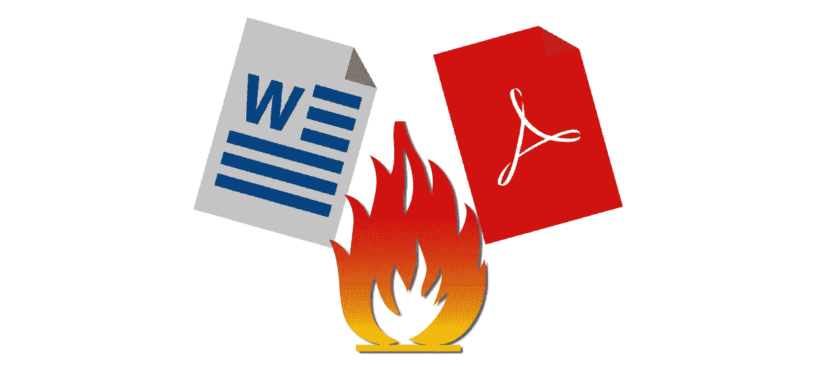

# 惊喜！文档是可编辑的！

> 原文：<https://medium.datadriveninvestor.com/surprise-documents-are-editable-5af84da435de?source=collection_archive---------45----------------------->

最近，我给*【公司】*发了一封电子邮件，通知他们我的数据发生了变化，需要他们进行处理。

这封邮件的附件是我从第三方收到的一份文件，证实了这一变更是准确的。
字面意思是“一封信”。以 *docx* 格式。

该请求的预期结果是*【公司】*应联系第三方以验证该信函的真实性，从而确认该信函确实准确。该联系人必须通过其公共记录上公布的官方联系信息，或*【公司】*为此目的持有的已知可信联系信息进行联系。

> 切勿使用文件上的联系信息联系第三方。如果文件是伪造的，那么伪造者可能也修改了联系信息——你可能只是要求伪造者确认文件是真实的。

我没想到的是*【公司】*的回复，通知我他们不接受 *docx* 文档，因为它们是可编辑的，我必须通过电子邮件重新提交 PDF 或 JPEG 格式的文档。我只提交了 *docx* 格式的文档，因为它就是这样发送给我的；把它转换成 PDF 或 JPEG 就意味着我修改了文档…

我很欣赏这里失去的讽刺。

*   首先，所有电子文档都是可编辑的。没有监管链。没有用于证明文件未被更改的验证方法。没有哈希，没有签名，没有第三方托管。
*   第二，我是否可以认为*【公司】*没有核实文件的来源？他们会看 PDF 格式的文档，并假设它的格式以某种方式管理和验证其真实性吗？
*   *【公司】* 由英国金融行为监管局授权和监管——他们是一家金融机构。我发现这一建议可能会成为整个行业的标准…

*有人认为，这封信的作者应该使用某种受保护的 PDF 格式，让我更难修改它，但当你考虑到我可以自己从头开始写这封信时，这在很大程度上是无关紧要的。*

不要仅仅因为文件的格式就相信它。

