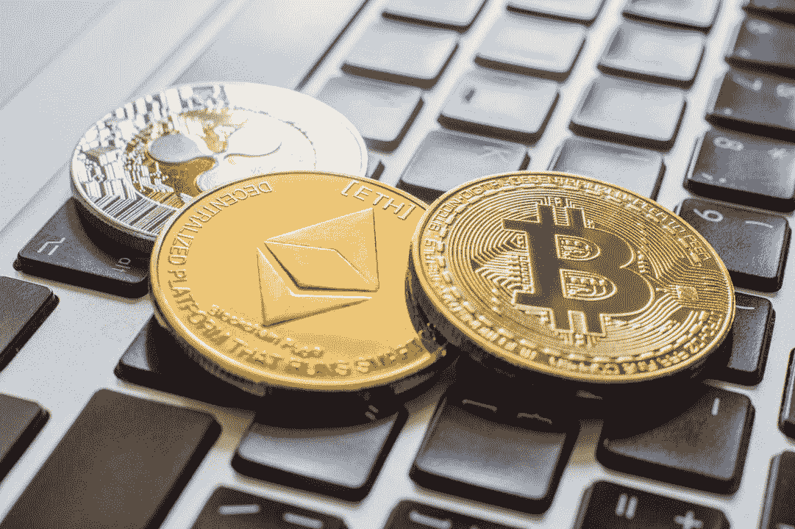

# 加密货币的税收影响

> 原文：<https://medium.datadriveninvestor.com/tax-implications-for-cryptocurrencies-5002c58ed008?source=collection_archive---------10----------------------->

加密货币。我们已经经历了大肆宣传——无论是作为一个投注者，一个真正的信徒(“[霍德勒](https://www.finder.com.au/cryptocurrency-glossary)”)，一个害怕错过的被动旁观者(“ [FOMO](https://www.finder.com.au/cryptocurrency-glossary) ”)，还是一个无辜的旁观者，他的朋友告诉你“密码”和“区块链”将如何创造一个新的世界秩序，并导致世界和平。

谁又能责怪炒作呢？加密货币在 2017 年 12 月之前风靡一时，当时比特币的价格从当年 1 月的 1000 美元攀升至近 2 万美元的[创纪录高价](https://coinmarketcap.com/currencies/bitcoin/historical-data/?start=20130428&end=20181024)。让我们不要纠结于这样一个事实:在 2010 年正式交易价格为 0.07 美元之前，比特币在 2009 年存在的第一年，技术上是 0 美元(当时更容易“[开采](https://www.finder.com.au/bitcoin-mining)”)

到 2018 年 6 月 30 日，比特币泡沫已经缩小到 6400 美元，并继续下降到 3500 美元。

**加密货币的税收影响**

**来自 ATO 的当前视图**

澳大利亚税务局(ATO)显然也感受到了 FOMO [带来的巨大潜在税收利益。这位专员直言不讳地表达了他对加密货币的看法:](https://www.afr.com/news/policy/tax/own-bitcoin-or-other-cryptocurrency-the-ato-is-after-you-20180703-h1265z)

*   在 TD [2014/26](http://law.ato.gov.au/atolaw/view.htm?DocID=TXD/TD201426/NAT/ATO/00001) 中，专员确认，根据 1997 年所得税评估法案(ITAA 1997)第 108–5(1)小节，比特币是一种资本利得税(CGT)资产。换句话说，除非这是你开展的业务的一部分，否则你在处置加密货币上的利润或损失将计入资本账户，而不是收入账户，就像个人持有的股票和房地产投资通常被视为所得税一样。因此，你的任何资本损失都不能用普通收入来抵消，只能用资本收益来抵消。这也意味着你可能有权享受 CGT 折扣(个人 50%，如果你持有比特币超过 12 个月)。然而，在这一决定中，专员没有就比特币何时可能被视为个人使用资产提供任何指导。个人使用资产的资本损失不予考虑，而资本收益仅在超过 10，000 美元的个人使用资产上产生。
*   在 [TD 2014/25](http://law.ato.gov.au/atolaw/view.htm?DocID=TXD/TD201425/NAT/ATO/00001) 中，专员的观点是，就第 775 条而言，比特币不是“外币”，但在 [TD 2014/27](http://law.ato.gov.au/atolaw/view.htm?DocID=TXD/TD201427/NAT/ATO/00001) 中，专员认为，当在正常业务过程中出于销售或交换目的而持有比特币时，就第 70–10(1)小节而言，比特币可以交易股票。这意味着，如果交易股票规则适用，可以使用三种[交易股票方法](https://www.ato.gov.au/business/income-and-deductions-for-business/reconciliation-activities/accounting-for-trading-stock/valuing-trading-stock/)中的一种对其进行估价。
*   2018 年 6 月 29 日 ATO 网站的最后一次更新“澳大利亚加密货币的[税务处理——特别是比特币](https://www.ato.gov.au/General/Gen/Tax-treatment-of-crypto-currencies-in-Australia---specifically-bitcoin/)”将比特币的指导扩展到了其他加密货币。重要的是，它指出“当您处置您的加密货币时，会发生 CGT 事件。在以下情况下，可以进行处置:
*   出售或赠送加密货币
*   交易或交换加密货币(包括用一种加密货币交换另一种加密货币)
*   将加密货币转换为澳元等法定货币，或者
*   使用加密货币获取商品或服务。"

经验证据表明，许多纳税人可能会发现，用一种加密货币交易另一种加密货币(如用比特币兑换以太坊)会导致 CGT 事件，这意味着纳税人在 CGT 事件发生时要对 CGT 损益负责。在美国，一名学生[据称](https://bitcoinist.com/student-400k-cryptocurrency-taxes/)去年获得了 5000 美元的以太坊。在一系列将以太坊兑换成替代加密货币的交易后，他在 2017 年 12 月持有价值 88 万美元的投资组合。然而，2018 年初加密货币价格的大幅下跌和“一些糟糕的初始硬币发行(ico)”导致目前的投资组合价值为 12.5 万美元。然而，由于加密对加密交易产生了应税事件和损失，这些事件和损失未在他的投资组合中实现，该学生面临着 2017 年约 400，000 美元的纳税义务。

**CGT 损益计算方法**

然而，到目前为止，ATO 还没有提供计算加密货币的 CGT 收益或损失的方法指南。对于股份或单位，如果您无法识别购买或出售的包裹(对于许多纳税人来说，加密货币通常就是这种情况)，在 [TD 33](http://law.ato.gov.au/atolaw/view.htm?locid=%27CGD/TD33/NAT/ATO) ，专员接受了先进先出的方法。换句话说，你把你购买的第一批股票或单位视为你卖出的第一批。在 [TD 33](http://law.ato.gov.au/atolaw/view.htm?locid=%27CGD/TD33/NAT/ATO) 中，专员在股份包裹方面的观点是:

「过去，在处理不可识别的股份时，专员接受以『先进先出』作为合理的识别基础。就资本增值税而言，局长也将接受纳税人对被处置股份身份的选择。

除非股份满足以下所有要求，否则平均成本不是计算股份收购成本的可接受方法:

(a)他们在同一家公司；和

(b)它们是在同一天获得的；和

(c)它们赋予相同的权利并规定相同的义务。"

因此，使用平均成本法计算加密货币的 CGT 损益可能不合理，除非纳税人在同一天购买了相同类型的加密货币。

**链条分裂**

有趣的是， [ATO 网站指南关于“链分裂”](https://www.ato.gov.au/General/Gen/Tax-treatment-of-crypto-currencies-in-Australia---specifically-bitcoin/?page=2#Chain_splits)的最新更新，如下所示:

“如果你持有加密货币作为投资，并由于链分裂而收到新的加密货币(如比特币持有者收到比特币现金)，你并没有因为收到新的加密货币而获得普通收入或获得资本利得。

如果你持有新的加密货币作为投资，当你处置它时，你将获得资本收益。为了计算你的资本收益，由于链分裂而收到的新加密货币的成本基数为零。如果您持有新加密货币作为投资 12 个月或以上，您可能有权享受 CGT 折扣。"

2017 年 8 月 1 日，比特币经历了一次链分裂，当时数字货币正式“[分叉](https://www.finder.com.au/cryptocurrency-glossary)，创造了一种新的加密货币，称为比特币现金。链分裂是一种场景，其中存在两个或更多支持加密货币的“区块链”的竞争版本(在下一篇文章中有更多介绍)，因此这些版本共享相同的历史，直到它们的规则集发生分歧(见下文):

对于比特币现金，比特币持有者收到的比特币现金中的硬币数量与他们在链分裂时持有的比特币数量相同。

没有讨论或分析为什么 ATO 得出结论认为由分叉产生的新加密货币的成本基础为零。在将原始 CGT 资产分割为两项或更多项资产的情况下，有特定的成本基础分配规则。

自 2017 年 8 月 1 日比特币分叉以来，比特币现金又分叉为两种替代加密货币，比特币现金 ABC 和比特币现金 SV，引发了一些人所谓的“[哈希战争](https://www.finder.com.au/hash-wars-bitcoin-cash-abc-takes-early-lead-but-its-not-over-yet)”。

加密货币的其他税务影响

加密货币还有其他税务影响，对此，ATO 提供了一些指导:

*   对于商品及服务税，直到 2017 年 7 月 1 日，专员在 [GSTR 2014/3W](https://www.ato.gov.au/law/view/document?docid=%22GST%2FGSTR20143%2FNAT%2FATO%2F00001%22) 中的观点是比特币要缴纳商品及服务税。这随后被撤回，2017 年财政法修正案(2017 年措施№6)法案中的立法修正案确保从 2017 年 7 月 1 日起，购买比特币等数字货币不再受商品及服务税约束。在 [DCC 2018/D1](https://www.ato.gov.au/law/view/document?DocID=GLD/DCC2018D1/00001) 中列出的最新委员会观点正在等待最终确定。
*   对于 FBT，专员在 [TD 2014/28](http://law.ato.gov.au/atolaw/view.htm?DocID=TXD/TD201428/NAT/ATO/00001) 中的观点是，根据《1986 年附加福利税评估法案》( FBTAA)第 136(1)小节的规定，雇主向雇员提供比特币是一种财产附加福利。

仍有许多税务问题尚未发布 ATO 指南，例如首次发行硬币的所得税影响(目前只有与 [GST](https://www.ato.gov.au/Business/GST/In-detail/Your-industry/Financial-services-and-insurance/GST-and-digital-currency/) 相关的指南)。由于分布式账本技术当前和未来的复杂性，加密货币将产生更多的税务问题，如“[智能合约](https://www.finder.com.au/cryptocurrency-glossary)”和“[股权证明](https://www.finder.com.au/cryptocurrency-glossary)”。这些将在下一篇关于分布式分类帐技术和代币经济的所得税影响的文章中讨论。