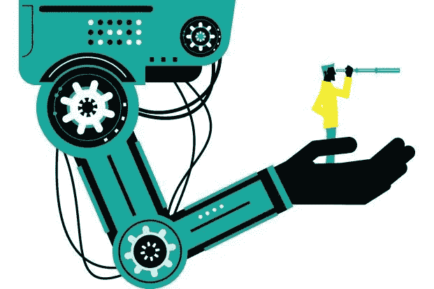

# 技术只是一个使能因素，而不是万灵药

> 原文：<https://medium.datadriveninvestor.com/technology-is-only-an-enabler-not-a-panacea-72a713bc658e?source=collection_archive---------7----------------------->

当技术官僚谈论技术时，他们听起来过于乐观，甚至到了傲慢的程度。他们给人的印象是，技术是人类遭受的所有疾病的灵丹妙药，人类的救赎在于推动更多的技术创新。他们触及了人工智能(AI)、物联网(IoT)、大数据、虚拟和增强现实(VR 和 AR)以及精密和再生医学等前沿技术，以支持他们的主张。但是他们的说法是真的吗？科技真的能找到解决我们所有问题的方法吗？它能让我们战胜贫困、营养不良、大规模杀伤性武器、偏见和不平等吗？它能让全人类过上更好的生活吗？这些是不受兴奋情绪影响的思维正常的人正在问的问题。

Image credit: Livemint

前段时间，《纽约时报》刊登了对谷歌首席执行官桑德尔·皮查伊(Sunder Pichai)的采访。在采访中，他正确地指出，“技术不能解决人类的问题。这样想总是太天真了。技术是一个使能因素，但人类必须处理人类的问题。”桑德尔的回答带着谦逊和实用主义。其他技术官僚应该以他的书为榜样，在谈论技术时保持同样的谦逊和实用主义，避免围绕技术产生过度兴奋的做法。

毫无疑问，科技界应该为自己的发明感到自豪，这些发明无疑让社会的很大一部分人过上了更好的生活。问题是，任何由技术创新产生的产品或服务最初都只提供给超级富豪，而它需要很长时间才能渗透到大众中。此外，被超级富豪垄断的技术正对民主构成威胁，并将国家推向寡头政治。

以教育和医疗保健为例。正如许多领域一样，技术也改变了教育和医疗领域。有许多配备了智能教室和互联网接入的私立学校，富人和精英的孩子在那里学习。这些学校甚至准备引入虚拟和增强现实等前沿教育技术。所有这些技术都降低了教师的角色，从唯一的知识来源降低到仅仅是这些学校的促进者。然而，穷人和下层中产阶级的孩子就读于同样破旧的政府学校，在那里，一群很大程度上没有积极性的教师用同样陈旧的粉笔和谈话方法半心半意地进行教学。

谈到医疗保健，精确和再生医学只有在一些公司医院才能得到，这些医院对普通人来说过于昂贵。穷人和中下阶层甚至无法获得初级卫生保健，因为政府经营的初级卫生保健中心几乎已经瘫痪。

正如 Sunder 所说，毫无疑问，技术是一个使能因素。问题是，它只能使少数人受益，而绝大多数人无法获得它带来的好处。

随着认知技术的出现，人类有史以来第一次面临具有人工智能能力的机器人的竞争对手。现在，大亨们正在努力说服人们，自动化不会让人们失业，人们只需要重新掌握自己的技能，就能抓住认知技术在未来创造的新机遇。但是技能和再技能需要培训，而穷人和中产阶级下层越来越难以获得这种培训。根据我们政客和财阀的宠儿世界银行的数据，“全世界有 20 多亿工作年龄的成年人不具备雇主所要求的最基本的读写技能。”无需赘述，所有这些人都必须来自穷人和中产阶级下层。当技能本身没有发生时，再技能的问题在哪里？

随着颠覆性技术的出现，甚至政府也以加快经济增长的名义，将重点从以人为本的政策转向以大亨为中心的政策。因此，以“方便做生意”为名的减税、宽松信贷和救助正变得越来越猖獗。

富豪们已经提出了普遍基本收入(UBI)的概念来补偿失业。然而，这种想法会进一步破坏民主，导致寡头政治。当 UBI 成为现实时，这个项目将主要由财阀资助，这将使他们成为这个国家事实上的统治者。

人类还面临着各种互联设备和社交媒体平台产生的大数据，这些数据可用于大规模监控。尽管世界各地的政府都在发出遏制大数据滥用的正确声音，但他们在这方面只会采取象征性的措施。已经有足够的迹象表明，富人和精英正在准备利用这些大规模监控技术，通过破坏民主进程来进一步加强他们对社会的控制，而民主进程是穷人和普通人的唯一希望。

通过投资加强了对大众媒体控制的超级富豪们已经开始出售他们自己的故事，通过不让人们看到客观现实来转移人们对面包和黄油问题的注意力。在几乎没有独立媒体的情况下，要么没有人，要么很少有人愿意揭露即将到来的危险的真相。

只要技术仍然是少数人的推动力量，它就会导致财富和权力的集中，而民主仍然只是一个名字。它最终成为富人手中的工具，变成弗兰肯斯坦的怪物，不仅对人类造成巨大破坏，而且最终会吞噬自己的热心推动者。

## 来自 DDI 的相关故事:

 [## 用 7 个步骤解释深度学习——数据驱动投资者

### 在深度学习的帮助下，自动驾驶汽车、Alexa、医学成像-小工具正在我们周围变得超级智能…

www.datadriveninvestor.com](https://www.datadriveninvestor.com/2019/01/23/deep-learning-explained-in-7-steps/)  [## 数据科学和软件工程哪个更有前途？-数据驱动型投资者

### 大约一个月前，当我坐在咖啡馆里为一个客户开发网站时，我发现了这个女人…

www.datadriveninvestor.com](https://www.datadriveninvestor.com/2019/01/23/which-is-more-promising-data-science-or-software-engineering/)