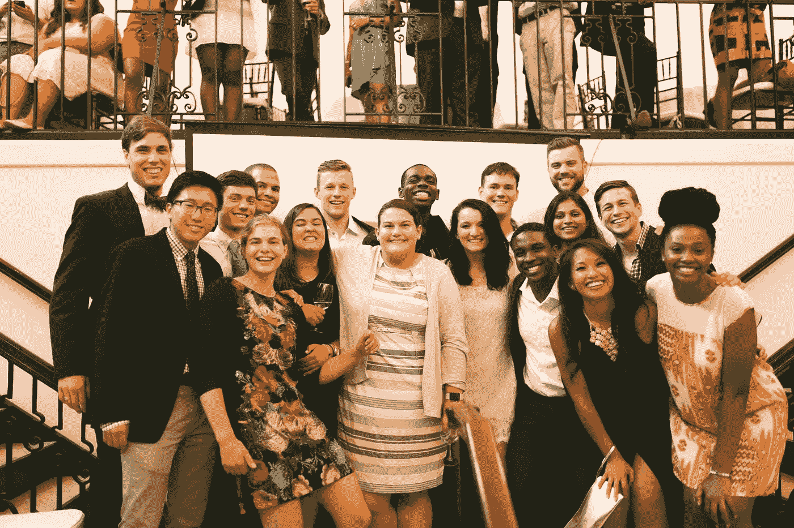

# 关于多样性的三大误解

> 原文：<https://medium.datadriveninvestor.com/the-3-biggest-misconceptions-about-diversity-c3ecf0710729?source=collection_archive---------6----------------------->

Photo credit: [Dylan Kim](https://www.facebook.com/dylan.kim1)

多样性。招聘是目前最大的话题，全球各地的公司都在争先恐后地成为这个话题的思想领袖，尝试新的方法使传统的招聘过程更加多样化。首先想到的策略是更精英化的方法，使用匿名工作样本提交，并与招募和培训多样化个人的第三方合作。以下是关于多样性的三个最大的误解。

# 1.多样性的定义

> “多样性被邀请参加聚会；包容就是被要求跳舞。”

企业术语和标题中的多样性通常是由性别和/或种族来定义的。但是多样性远不止于此。它还可以表现为年龄、残疾、思想多样性等等。多样性是指观察人群，不能描述出人群中的主导“类型”。同样被误解的是，包容应该是人群看起来的融合程度。人分组了吗？这几组是同一类型的吗？当然，这是一个简化的例子，因为并不是多样性的所有定义都是显而易见的。我将在另一篇文章中更详细地介绍这一点。

# 2.人工智能

配额也是人工智能的典型代表，可能是一个敏感的话题。它们就像罪恶的快乐——每个人都有，但是没有人喜欢谈论它们。它们是改变普通招聘流程中默认行为的一个很好的*起点*。它基本上迫使相关人员有意识地承认多样性。但同时，它也会扼杀包容性。因为多样性给人的感觉更加强迫和肤浅，所以出现了许多社会动态，导致了一些困难的局面。

## 配额会破坏可信度

“配额”可以帮助来自代表性不足的社区的人获得他们的一只脚，他们也可以导致其他人对他们的看法。以我自己的经历为例，我能想到好几次我因为我的种族而被怀疑自己的成功。有人告诉我，只是因为我的种族，我才获得了奖学金，或者得到了晋升，或者得到了这笔交易。也许你已经听到了使[成为最近头条](https://www.cnn.com/2018/10/14/politics/harvard-affirmative-action-asian-americans/index.html)的平权行动的正反两面的声音。有人告诉我，做少数民族更容易。这样想实际上没有任何意义，但我会把这种抱怨留到以后再说。

这里的要点是，来自更多样化背景的人的成功经常被其他人破坏，仅仅因为他们是多样化的。这是一个两败俱伤的局面，无助于解决最初的多样性问题，或者说缺乏多样性。它更大胆地在双方之间划了一条线。

# 3.“我们只雇佣最优秀的人才，不考虑背景”

让我第一个打断你，因为如果你试图促进多元化和包容的文化，你已经走上了错误的道路。你也可以调暗灯光，打开音乐，为所有即将走进前门的偏见举办一场盛大的派对。

“最好”的定义取决于利益相关者，这也是许多偏见产生的地方，不管它可能是多么无意的。让我们以一个软件工程师为例。当一名软件工程师申请工作时，他们通常不得不完成某种编码挑战。一个常见的编码挑战，如“用你选择的语言编写一个简单的类，用洗牌和发牌的操作来表示一副牌”会引入很多偏见。

有些人可能会说，你不需要计算机科学学位或更传统的背景来回答这个问题，所以偏见基本上被消除了，因为任何人都可以回答这个问题。如果是这样的话，为什么那么多似乎在这方面做得“最好”的人是白人男性？这是因为这个问题和许多类似的问题是由来自更传统背景的人提出的，而那些来自传统背景的人更有能力回答这样的问题。

是真的考验技巧吗？也许…如果你正在为更多的青少年开发一个边缘欺诈性的纸牌游戏应用程序，让他们盲目地沉迷其中，而你却通过它投放广告，好像你的收入依赖于它一样——因为它确实如此。

一个没有任何学位或者从来没有编写过代码的人很容易成为一个更好的学习者和更聪明的人，但是这个问题并不是为了测试这一点而设置的。这个问题对于那些走过许多幸运的人所铺设的道路的人来说是一个问题。*如果没有强制性的体育参考，这就不是一个帖子，对吗？*

## 机器学习和人工智能:量化偏差

*我真的很喜欢流行词。如果有人创造了流行语 bingo，单单这个帖子就会导致有人站出来欢呼胜利。*

现在谈实际的 AI(人工智能)，我们来看另一个偏差的案例。你可能听说过亚马逊，它以无情的自动化和用 HQ2 彩票洗劫全国城市的 T2 而闻名。嗯，最近有[报道](https://www.reuters.com/article/us-amazon-com-jobs-automation-insight/amazon-scraps-secret-ai-recruiting-tool-that-showed-bias-against-women-idUSKCN1MK08G)亚马逊将机器学习应用于其招聘过程，以观察申请人简历中的模式，并输出最佳候选人供审查。

到目前为止听起来不错，对吧？让我们花一点时间来承认招聘和招募是困难的，*难*，**难**的工作。试图用今天的技术来帮助这个过程听起来像是一个真正的增值和商机。

而至于结果呢？

> [“实际上，亚马逊的系统告诉自己，男性候选人更受青睐。”](https://www.reuters.com/article/us-amazon-com-jobs-automation-insight/amazon-scraps-secret-ai-recruiting-tool-that-showed-bias-against-women-idUSKCN1MK08G)

与过去几乎不包含多样性的招聘模式类似，该系统教会自己使用人类一直在制造的相同偏见。这确实显示了这些偏见是多么突出。令人大开眼界。

## “我们不仅仅雇佣白人男性，他们只是申请最多”

对——我明白了。如果 93%的申请人是白人男性，那么简单的概率表明团队中的大多数人自然会是这样。供应问题。

这里的问题是招募策略。当你通过传统渠道招聘时，你会得到传统的申请人。不同的渠道会产生不同的候选人。人们很少通过传统渠道进行多元化招聘。常春藤联盟学位是一个简单的例子。啊，但是等等，[哈佛去年有了第一个“非白人占多数”的招生。所以一些传统频道在种族上已经多样化了，但是记住多样性不仅仅是种族和性别。还有更多多样性的例子，包括社会经济地位和残疾。](https://www.bbc.com/news/world-us-canada-40812196)

最后一次提到过于常见的白人男性的例子，当你从以白人男性为主的大学或渠道招聘时，你不会得到那么多不同的申请者。素质多样的候选人通常不会走相同的路。

# 解决方案

一些真正的努力加上一点自我意识会有很大帮助。我知道，我知道——仅仅以“做得更好”结束是没有多大帮助的。但是即使已经做到了这一步，我还是希望多样性离你的想法更近一步。

另一个解决方案是与专门从事多元化招聘的组织合作。仅举几个我在网络中非常熟悉的例子:

*   [抓住每一个机会](https://www.seo-usa.org/)
*   [为美国冒险](https://ventureforamerica.org/)
*   [代码 2040](http://www.code2040.org/)

让我知道你的想法。我也很想听听你的想法！

## 你为什么要听我的？

你不应该。教育自己，做出自己的*决定💯。我只是喜欢通过不时地写下我的想法来提高我的写作水平。*