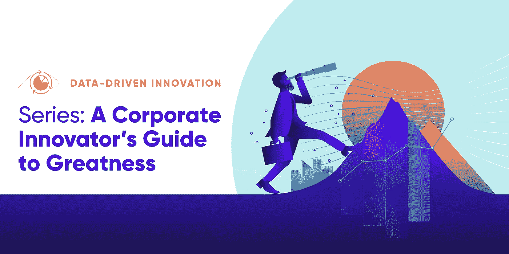

# 经营一家企业精益创业公司将面临的 8 个最大挑战，以及如何应对它们

> 原文：<https://medium.datadriveninvestor.com/the-8-biggest-challenges-youll-face-running-a-corporate-lean-startup-and-how-to-tackle-them-5c87a26c63a6?source=collection_archive---------2----------------------->

# 所以你在一家大公司经营一家精益创业公司…

恭喜你！这是一个令人兴奋又充满挑战的时代。

虽然 2008 年只有 9 家独角兽(价值超过 10 亿美元的私人创业公司)颠覆了传统行业，但这一数字到 2018 年已经上升到 138 家( [QZ](https://qz.com/1510648/why-do-we-still-call-billion-dollar-startups-unicorns/) )。现有的组织正在通过创造大量的快速实验空间来应对这种威胁。它们可能被称为风险企业、创新实验室、企业加速器、[、快艇](https://www.mckinsey.com/business-functions/marketing-and-sales/our-insights/from-lab-to-leader)或孵化器。在本文中，我们将简单地称他们为精益创业公司。在一个公司结构中运行一个精益创业对创业本身和更广泛的组织都有好处。成为大公司的一部分意味着拥有(几乎)无穷无尽的资源供你支配——这在创业初期非常有用。需要一些法律建议吗？打电话给法律部门。需要接触大约 10.000 名目标受众来 A/B 测试一些文案吗？请咨询 CRM 经理并发送电子邮件！

 [## 波动迫使数据驱动的投资者冷静

### 自然界中很少有东西是直线行进的，尤其是经济。当投资者和消费者希望平静时…

www.datadriveninvestor.com](https://www.datadriveninvestor.com/2019/03/25/volatility-compels-calm-amid-the-storm/) 

当你的精益创业没有偏离核心业务太远时，你在研究客户需求和测试假设时收集的见解可以使更广泛的组织受益。您还将向其他团队展示敏捷和基于事实的方法如何产生有价值的见解并提高执行速度。更广泛的组织的第三个好处与文化和对待失败的态度有关:大公司的项目通常“太大而不能倒”，团队不乐意分享失败。然而，在一个精益创业中，你在小范围内测试假设，以找出什么可行，什么不可行！—学习和优化。你将逐步影响企业文化，改变对失败、测试、学习和“正确”的态度。

抛开所有的兴奋不谈，作为一名内部创业者，你可能也会感到沮丧或失落，就像一名孤独的战士对抗官僚主义。本尼迪克特·埃文斯在一张 GIF 图片中出色地捕捉到了这种感觉。

当然，经营一家公司要比经营一家自举或风投支持的公司舒服得多。然而，这份工作本身也有一些挑战。在本文中，我们将概述其中的一些挑战，以及应对这些挑战的最佳实践。

# 在大型组织中运行精益创业的挑战

# 1.客户所有权分散

为了一个小小的改变而不得不涉及六个不同部门的经历。

随着公司的成长，越来越多的部门离客户越来越远。在小公司产品中，销售、客户服务、IT、物流和营销沟通通常由一个团队负责。但是在一个大公司里，这些不同的职能将由一系列大部门管理，这些部门可能遍布全球。每个人都有自己的兴趣和目标。

如果你利用母公司的客户和生态系统来经营一家初创公司，你很快就会意识到，实施小的改变可能会非常复杂。例如，想象一下，为您的产品寻找不同的执行合作伙伴。这将需要对现有履约合作伙伴的 API 调用、如何处理客户问题和投诉的客户服务说明、电子商务门户的更改以及电子邮件副本的更改。与母公司完全分离的创业公司意味着更大的灵活性。但是，这也意味着无法从企业基础架构中获益，并且在扩展时需要更复杂的集成。

**建议:**作为一名内部创业者，在每个创业阶段和客户旅程的每个环节，仔细评估是留在公司内部好，还是离开现有的公司结构好。考虑将精益创业完全从现有的客户生态系统中分离出来。

# 2.缺乏明确的业务所有权和奉献精神

*为什么没有人参加今天早上的每日脱口秀？*

在大型组织中获得团队奉献精神和明确的业务所有权可能是一个挑战。随着短期问题不断要求关注，很难运行一个成功的精益创业。如何防止你的创新努力被视为“在一边”做的事情？

首先，重要的是要有明确的、可衡量的目标和实现这些目标的时间表。你的目标应该符合你所处的成熟阶段。因此，如果你仍然需要证明客户喜欢你提供的解决方案，最好避免雄心勃勃的增长目标。第二，合适的人需要感受到对这些目标的所有权。如果你的目标符合一个更高层次的目标，高级利益相关者就有理由帮助你扫除障碍。同样，将你的目标分解成更小的块将允许团队成员和利益相关者在挑战中取得所有权。如果使用得当，KPI 可以成为目标和团队合作的重要来源！

**要点:**作为一名内部创业者，你不会在真空中运作。确保您的项目获得应有的优先级取决于您。在你的团队和利益相关者中分享这种主人翁感的一个好方法是通过深思熟虑选择的目标。

# 3.矩阵组织的内在冲突

相互竞争的利益之间的持续斗争。

在矩阵式组织中工作需要固有的矛盾，这对于内部创业者来说尤其重要。正如贝恩公司的詹姆斯·艾伦(T2)所描述的，矩阵组织会产生一系列矛盾或冲突，这些矛盾或冲突可能是健康的，也可能是不健康的，这取决于如何处理它们。它们是:

*   **规模与亲密度**:我们如何满足小客户群的特定需求(例如，关注当地偏好)，同时让他们享受到我们大规模的好处(例如，更低的价格)？
*   例行程序与干扰:一个大型组织会希望他们 85%-95%的工作按照一套清晰的步骤高效执行，就像飞行员驾驶飞机一样。另外的 5%到 15%是关于冒险进入新的空间和尝试新事物，就像一个工程师探索新的航空技术。
*   **短期与长期:**如果一位客户经理未能达到第四季度的销售目标，她可能会联系她的主要客户，试图就公司的旗舰产品达成交易。她不太可能试图销售一种新兴的 MVP 产品，即使这种产品被认为能够确保公司在未来几十年的持续存在。

**要点:**作为一名内部创业者，要意识到在矩阵式组织中工作的冲突。认识到这些冲突服务于一个目的，那就是在两个极端之间找到正确的平衡。

# 4.指南、限制和批准

我需要填写多少张表格？！

根据你的企业与已建立的组织的分离程度，你可能会面临许多审批循环。与独立企业相比，当你测试现有业务的附加业务(例如增值服务或新渠道)时，这尤其具有挑战性。淹没在文书工作中无助于你快速的实验努力。

**要点:**作为一名内部创业者，要认识到法律、隐私、IT、风险、品牌合规和采购部门发挥着重要作用，如果你以正确的方式管理关系，它们可以成为宝贵的教练或顾问。要做到这一点，你可以让每个团队中的某个人担任“创业顾问”，帮助你浏览他们的专业领域。你可以每两周与他们每个人会面 15-30 分钟。

# 5.风险规避

那一刻，你意识到不是每个人都像你一样对以不同的方式做事感到兴奋

大公司往往比初创公司更厌恶风险，这是有充分理由的:失去的更多，得到的相对更少。为了减少变革的阻力，将你同事的风险最小化是很重要的(这对我的工作意味着什么？！)和公司本身(如果我们让客户失望了怎么办？！).在企业层面需要特别注意的三种风险是:

*   **自相残杀的风险**:有些人可能担心你引入的创新会损害现有业务，可能导致暂时的收入下降。这是否是一个合理的担忧是有争议的。专家指出，为了在竞争中保持领先，公司需要[接受自我吞噬](https://www.imd.org/research-knowledge/articles/the-best-companies-afraid-to-replace-their-most-profitable-products/)。这就是苹果、谷歌、脸书、亚马逊或腾讯等创新巨头保持竞争优势的方式。他们的座右铭是:如果我们不拆自己的台，别人会拆的。
*   **声誉受损风险**:一个大品牌的关键资产是它的声誉。消费者信任该品牌，因为其长期的交付质量记录。损害公司声誉的风险迫在眉睫。减轻这种风险的一个选择是用一个假品牌来测试消费者的需求，或者以一个不同的品牌名称全面推出创新。根据您正在开发的解决方案以及它对公司现有产品和基础设施的依赖程度，这可能是也可能不是一个好的选择。另一个解决方案是限制你的 MVP 的曝光率，并随着你基于客户反馈的迭代和改进而逐渐增加曝光率。
*   失败的风险:你正在进行的冒险可能不会成功。这可能是公司要么不投资该企业，要么在明显失败后继续经营下去的原因。有很多方法可以应对这种风险，并阐明继续投资的理由。首先，通过强调无所事事的成本，阐明投资的理由，尽管有失败的可能性。虽然该公司的产品组合保持不变，但竞争对手继续进入新兴的高增长领域。第二，量化风险，并制定一个最小化风险的计划:通过遵循精益启动方法，你在不断地测试和学习。通过对原型进行少量投资并在市场上进行测试，你可以了解它是否有机会在不花费数百万进行产品开发的情况下获得成功。本质上，你是在最小化下行风险，最大化上行潜力。

要点:经营任何企业的一个重要部分就是将风险降至最低。作为一个大公司的创新者，量化风险、收益和成本，并有效地与利益相关者沟通。要意识到最小化风险的要求并不是不合理的，创业公司的风险投资者会要求创始人承担同样的风险责任！

# 6.绩效衡量不考虑创新

*当所有正常的业务指标实际上为零时，我如何显示进度？*

很可能你的精益创业公司(还)没有获得任何可观的收入，尤其是与你的成本相比。如果组织还没有管理创新项目的结构，如[创新组合管理](http://www.bobcooper.ca/articles/portfolio-management-and-making-the-right-npd-and-r-and-d-investments)或[企业风险实验室](https://www.forbes.com/sites/quora/2014/01/24/how-do-investors-value-pre-revenue-companies/#616550c86027)，跟踪绩效并与利益相关者有效沟通可能会特别具有挑战性。

即使没有管理创新项目的结构，仍然有方法来评估和跟踪你的精益创业的表现。我们将在下一篇文章中进一步探讨这些主题，但这里是摘要:

*   **估算你的项目的** [**实物期权价值**](https://hbr.org/2008/03/a-new-approach-to-innovation-i) **。**为什么脸书一度被估值为年收入的 100 倍？为什么制药公司愿意在可能永远无法通过 FDA 审批的药物上投资数百万？因为这些项目中有期权价值。实物期权类似于金融期权(以固定价格购买股票)，因为它是一种进入不确定事物的权利，而不是义务(例如，进一步投资于新兴技术)。它有同样的上行潜力，但限制了下行风险。
*   **根据** [**风险/回报**](https://hbr.org/2007/12/is-it-real-can-we-win-is-it-worth-doing-managing-risk-and-reward-in-an-innovation-portfolio) **矩阵**对你的项目和其他项目进行评分。其他项目的递增影响可能是稳定的、可预测的和递增的。与你的突破性创新项目形成鲜明对比的是，它是可变的、不可预测的，并且有可能改变游戏规则。因此，在评估项目时，应考虑潜在的收益和风险。
*   **应用** [**创新**](https://www.ideou.com/blogs/inspiration/innovation-accounting-what-it-is-and-how-to-get-started) **会计。**尽管首席财务官可能对你报告的“非常有希望的转换率”不满意，但创新会计(和类似方法)在内部绩效报告方面有很大潜力。这也是更传统的阶段选通的一个很好的选择，传统阶段选通倾向于依赖非常不确定的商业案例假设。创新会计使用指标来帮助你在创业的每个阶段证明有风险的假设。它们将带您从一个经过验证的已确定的客户需求，到一个客户愿意付费的经过验证的解决方案，再到一个自我销售的解决方案，最后到一个可盈利和可扩展的商业模式。

**要点:**传统的绩效指标和项目选择方法可能会抑制您组织中的创新，或者鼓励您构建不切实际的业务案例。有替代方案，值得与财务团队讨论应该根据哪些指标来评估您的项目。

# 7.薪酬最高的人的看法(河马)

*你掌握了事实，但这些似乎都不重要……*

你雇佣一个服务设计师来创造最好的客户体验，一个分析师来创建和运行干净的实验，一个开发人员来编写清晰、简单、有效的代码行。您所做的一切都是基于数据和客户洞察并得到验证的。然后，当你与高级利益相关者分享进展时，他们会主动提出建议，你应该用不同的方式做事:更正式的语气，不同的颜色，更低的价格点，等等。尽管基于事实的决策被[创新领导者](https://hbr.org/2016/08/the-barriers-big-companies-face-when-they-try-to-act-like-lean-startups)称为采用精益创业方法的最大优势，但这并不意味着实施起来很容易。

**要点:**作为一名内部创业者，确保你的投资者(为你的项目融资的高级利益相关者)知道他们的角色:给出方向和目标，在结果上挑战你，并帮助消除障碍。自主性是成功的敏捷团队的关键要素。领导者可以对你的产品应该是蓝色还是绿色有自己的看法，并欢迎分享这种看法，但他们需要相信专家会做出正确的决定。

# 8.你是你自己最大的敌人

*是的，我们现在正在谈论你*

作为企业中的一名创新者，你处于一个有趣的位置:你被要求表现得像一个初创公司的创始人，舒适地拥有一个固定的职位，每个月都有薪水。这是一个很好的位置，并且被大多数公司企业家出色地执行。然而，在这种情况下确实会带来一系列你应该意识到的特殊挑战。需要注意三件事:

*   **在白板上设计**:当你和你的团队试图在不出去和真实的人交谈的情况下做决定时，就会发生这种情况！你可能正在组织研讨会，写下想法，画草图，但是忘记了和真正的客户验证任何东西。对于大公司的创新者来说，这尤其是一个风险，因为他们往往不会每天与客户直接接触。确定您的客户在哪里，以及与他们联系以验证您的假设的最简单方式是什么。
*   **创新剧场**:便利贴、乒乓球桌、硅谷行话和激励人心的史蒂夫·乔布斯名言都不是一家精益创业公司。虽然创建一个看起来和感觉上都不同于组织其他部分的安全和创造性的环境是一个好主意，但这不是一项要求，也不是一项成就。创造空间只是工作开始的地方:公司希望你拿出成果，你应该为此负责。
*   不愿意杀死你心爱的人:你可能会执着于自己的想法，或者害怕向利益相关者承认失败。使用清晰的指标和常规的假设验证来避免欺骗自己。

外卖:诱惑是真实的。小心他们。

# 总结:关键成功因素

需要处理的事情多吗？别担心，我们会掩护你的。保持冷静，并遵循以下建议来应对你的公司创业挑战:

*   仔细选择你脱离母公司的程度，并从很早的阶段就开始思考如果成功，你将如何扩大创业规模。
*   请注意，每个大型组织都有相互冲突的优先事项和目标。这是有意的，根据您与上级组织的联系程度，您偶尔会遇到这些冲突。
*   从早期阶段就让支持职能部门(如法律、IT、采购)参与进来，并尝试在这些团队中找到可以帮助你摆脱繁文缛节并担任创业教练或顾问的人。
*   列出你启动这个创新项目可能给你的雇主带来的风险。与组织中的其他人分享此列表，并邀请他们做出贡献。尝试量化这些风险，并确定如何减轻它们。
*   与财务和领导层就如何衡量你的创业的成功和进展达成一致，并确定这种方法是鼓励还是抑制创新。相应调整。
*   与领导团队就如何将他们的专家意见作为精益启动方法的一部分进行验证达成一致。每当他们基于某个观点要求你做一些不同的事情，你就说:“这是一个有趣的假设，我们可以把它放在测试路线图上！”
*   虽然创新可能很有趣，但作为一名创新者，你正在运行一个有风险的项目，需要交付巨大的成果来证明这种风险是合理的。你需要愿意走出大楼，瞄准可衡量的结果，就好像你的生活依赖于此一样，如果你的想法不起作用，你也要愿意离开。

我们希望这些建议能帮助你以更好的方向感驾驭作为企业创新者的生活。寻找更多关于如何在企业环境中运营精益创业的技巧和实用建议？敬请关注更多文章！

寻找更多关于数据驱动创新的内容？在此注册我们的季度时事通讯，将更多见解发送到您的收件箱！

**本文撰稿人:**

*   ***Roos Reitsma，*** *数据驱动创新引领 Riverflex。曾在 Hedera(Cognizant 的一部分)担任增长战略和创新经理，并在微软担任数字分析经理。过去的客户包括飞利浦，PVH 欧洲，赛诺马和庞控股公司。*
*   ***Cameron Mckelvie****独立转型顾问，Riverflex 成员，之前在贝恩&公司工作。卡梅隆以前的客户包括 HMRC、阿霍尔德·德尔海兹和玛氏糖果。*
*   **马丁·维尔比克，** *曾领导 Eneco 和 Ahold Delhaize 的创新团队，曾任 Quby 的数据/增值服务业务总监，是 Riverflex 社区的成员。*

关于 Riverflex Riverflex 是一家新型的咨询公司。我们通过将顶级顾问与独立专家的力量相结合，提供数字咨询、人员扩充和临时管理服务，从而提供数字专业知识和价值。欲了解更多信息，请访问我们在[http://www.riverflex.com/](http://www.riverflex.com/)

*原载于 2019 年 4 月 30 日*[*https://riverflex.com*](https://riverflex.com/the-8-biggest-challenges-youll-face-running-a-corporate-lean-startup-and-how-to-tackle-them/)*。*