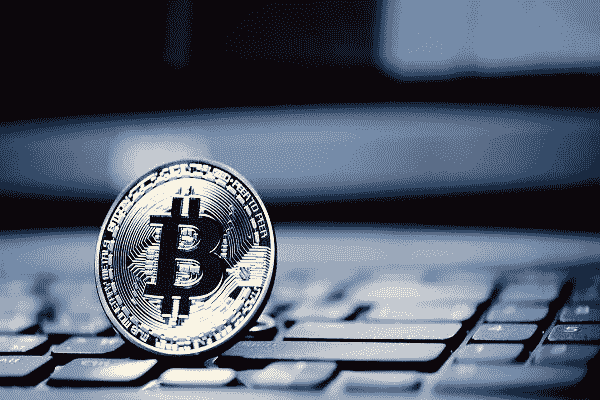

# 《银行保密法》和加密货币

> 原文：<https://medium.datadriveninvestor.com/the-bank-secrecy-act-and-cryptocurrency-7565c84d8bcf?source=collection_archive---------0----------------------->

Via Google Images

[银行保密法](https://www.ffiec.gov/bsa_aml_infobase/documents/FDIC_DOCs/BSA_Manual.pdf) (" **银行保密法**")规定，金融机构应收集和保留客户信息，并与财政部下属的[金融犯罪执法网络](https://www.fincen.gov/) (" **FinCEN** ")分享这些信息。

2013 年，金融犯罪执法网发布了关于"金融犯罪执法网条例对管理、兑换或使用虚拟货币的人的适用"的指导意见。该指导意见发明了一个新术语，称为虚拟货币，广义上定义为作为交换媒介使用。就银行保密法而言，必须确定一个人或实体是否通过从事包括汇款、外汇、银行等活动而属于金融机构类别。

BSA 将货币定义为:

> *“美国或任何其他国家的硬币和纸币。”(31 CFR 1010.100(m))。*

比特币和类似加密货币的代币(以太、XRP 等)一般属于*可兑换虚拟货币*，在指引中定义为:

> *“任何与真实货币具有等价价值，或者充当真实货币替代品的虚拟货币。”(指导说明 6 第 1 页)。*

该指南描述了三类人:

1.  管理员，
2.  交换器，以及
3.  用户。

只有管理员和兑换商有资格成为汇款人，并受 BSA 的约束。

**管理员**

指南将管理员定义为:

> *“从事虚拟货币发行(投入流通)业务，并有权赎回(退出流通)该虚拟货币的人。”(指导说明 6 第 2 页)。*

这里，您必须同时发行和*兑换*货币，才能符合上述定义。这主要适用于**集中式**网络，其中各方保留网络上的交易记录，可以赎回货币以及发行货币。

**交换器**

该指南内容如下:

> “交易商是从事虚拟货币与真实货币、资金或其他虚拟货币的交易的人。”

而且，

> *“根据 FinCEN 的规定，1)接受和传输可兑换虚拟货币或 2)出于任何原因购买或出售可兑换虚拟货币的交易所是货币传输者。”(第 3 页的指导说明 6)。*

以上各节的要点如下:

*   如果你经营一家企业，你就是一个交易所，这样一来，它就不包括那些出于个人投资或其他个人目的买卖比特币的人。
*   如果你是一个买卖比特币或其他虚拟货币的交易所，你就是一个货币传输者。你必须*接受*和*传送*才能在这里获得资格。
*   如果你是汇款人，那么你必须遵守 BSA 和 FinCEN 的义务(即:向 FinCEN 登记，制定 KYC/反洗钱合规计划，并提交可疑活动报告)。

**涟漪 XRP 的例子**

FinCEN 于 2015 年[与作为数字货币提供商的 Ripple Labs 达成](https://www.fincen.gov/sites/default/files/enforcement_action/2016-08-02/20150505.pdf)和解协议，对 Ripple 违反 BSA 的几项要求进行罚款，包括:

> *“充当货币服务企业(MSB)并销售其虚拟货币 XRP，而未向 FinCEN 注册，并且未能实施和维护旨在保护其产品不被洗钱者或恐怖主义融资者使用的充分的反洗钱(AML)计划。”*

金融犯罪执法网进一步指出:

> *“虚拟货币兑换商必须向市场推出符合我们反洗钱法律的产品，”FinCEN 主任 Jennifer Shasky Calvery 说。“创新是值得称赞的，但前提是它不会不合理地将我们的金融体系暴露给热衷于滥用最新、最复杂产品的高科技犯罪分子。”*

总结 2013 年关于管理员和交换者的指南:

*   分散网络中没有管理员；
*   兑换商是经营接受和传递代币或买卖代币的交易业务的人。这些人必须注册并遵守 BSA 的要求。

有关这方面的更多信息，请参见硬币中心报告[此处](https://coincenter.org/files/2017-05/report-bsa-crypto-token1.pdf)。